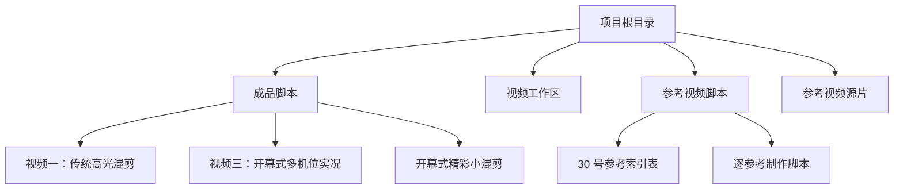
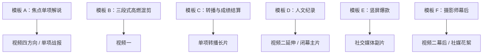

# 典型参考方案与风格分类

<cite>
**本文引用的文件**   
- [README.md](file://README.md)
- [参考视频脚本/README.md](file://参考视频脚本/README.md)
- [成品脚本/README.md](file://成品脚本/README.md)
- [成品脚本/01_传统高光混剪_最终脚本.md](file://成品脚本/01_传统高光混剪_最终脚本.md)
- [成品脚本/03_开幕式多机位实况_最终脚本.md](file://成品脚本/03_开幕式多机位实况_最终脚本.md)
- [成品脚本/03_开幕式精彩小混剪_剪辑思路指南.md](file://成品脚本/03_开幕式精彩小混剪_剪辑思路指南.md)
</cite>

## 目录
1. [引言](#引言)
2. [项目结构与分类基础](#项目结构与分类基础)
3. [六大风格分类总览](#六大风格分类总览)
4. [专业赛事直播解说类](#专业赛事直播解说类)
5. [高燃卡点混剪类](#高燃卡点混剪类)
6. [电视转播与成绩结算类](#电视转播与成绩结算类)
7. [人文纪录与毕业季风格类](#人文纪录与毕业季风格类)
8. [短视频平台爆款类](#短视频平台爆款类)
9. [摄影师幕后与纪实类](#摄影师幕后与纪实类)
10. [与本项目视频一、二、三的直接关联](#与本项目视频一二三的直接关联)
11. [分镜结构复用模板](#分镜结构复用模板)
12. [后期包装技巧清单](#后期包装技巧清单)
13. [现实约束与风险提醒](#现实约束与风险提醒)
14. [结论](#结论)

## 引言
本文件基于仓库中“参考视频脚本”的 30 部标杆参考视频，以及本项目已交付的视频一（传统高光混剪）、视频二（学生会幕后宣传片）和视频三（开幕式多机位实况），将编号方案按风格与用途归类为六类：专业赛事直播解说类、高燃卡点混剪类、电视转播与成绩结算类、人文纪录与毕业季风格类、短视频平台爆款类、摄影师幕后与纪实类。目标不是复述全部 30 个方案，而是帮助读者快速判断哪些参考值得在本项目中复用，并给出适用场景、典型手法、可复用分镜结构和落地建议。

## 项目结构与分类基础
仓库以“成品脚本”“参考视频脚本”“各视频工作区”分层组织：
- 根级 README 明确本项目是浙江省春晖中学 2026 年校运会官方视听工程，包含赛程研判、现场多机位调度、分镜脚本、后期包装与成品归档。
- “参考视频脚本/README.md”对 30 部参考视频做了统一索引，给出编号、对应视频、风格定位、核心特点与适用场景，并直接映射到春晖 2026 校运会“五维宣发矩阵”。
- “成品脚本/README.md”集中归档已定稿的成品脚本，明确视频一、视频二、视频三与已取消视频四的状态。
- 视频一脚本详细给出三段式情绪弧线、BGM 节拍依据、真实赛程映射与安全红线；视频三脚本定义电视台转播级多机位拓扑、录音对齐规范与导播切片原则；开幕式精彩小混剪指南提供 60–90 秒新媒体快剪骨架。

**图表来源**
- [README.md:1-85](file://README.md#L1-L85)
- [参考视频脚本/README.md:1-62](file://参考视频脚本/README.md#L1-L62)
- [成品脚本/README.md:1-23](file://成品脚本/README.md#L1-L23)

**章节来源**
- [README.md:1-85](file://README.md#L1-L85)
- [参考视频脚本/README.md:1-62](file://参考视频脚本/README.md#L1-L62)
- [成品脚本/README.md:1-23](file://成品脚本/README.md#L1-L23)

## 六大风格分类总览
以下表格把 30 个编号方案归入六个类别，并标注代表性编号、核心特征、推荐复用场景及与本项目视频的关联强度。

| 类别 | 代表编号 | 风格关键词 | 适用场景 | 典型手法 | 与本项目关联 |
|---|---:|---|---|---|---|
| 专业赛事直播解说类 | 01、13、22 | 奥运包装、专业解说、VAR、Photo Finish | 百米/接力决赛焦点战报、官方回放短片 | 奥运转播 UI、终点鹰眼判定、播音腔解说、动态花字跟踪 | 与视频四（已取消）同源；视频一可吸收其节奏爆发 |
| 高燃卡点混剪类 | 02、03、06、09、18、25 | Beat Drop、升格慢动作、极短卡点、社团质感 | 官方高光回顾、社团宣传、短视频引流 | 强鼓点卡点、贴地机位、航拍大景、抽帧闪切 | 直接对应视频一“124 BPM 三段式” |
| 电视转播与成绩结算类 | 10、12、16、19 | OBS 转播、道次榜、成绩总榜、NEW CR | 单项完整转播、赛后成绩结算长片 | 标准世界田联包装、实时毫秒计时、犯规 DQ 标识 | 可直接复用为成绩结算包装模板 |
| 人文纪录与毕业季风格类 | 15、17、21 | 设问排比、不唯金牌、慢门光影、治愈群像 | 闭幕主片、校史典藏、毕业季氛围 | 散文诗旁白、高位观察长镜头、温暖女中音 | 适合视频二或闭幕彩蛋 |
| 短视频平台爆款类 | 20、23、27、30 | 竖屏破圈、一镜到底、F1 跨界、极限挑战 | 抖音/小红书/视频号传播 | 黄金 3 秒抓人贴纸、内场第一视角、测速表、重低音爆发 | 可作为社交媒体分发副片 |
| 摄影师幕后与纪实类 | 26、29 | HUD 监视器、战地摄影师、双视角 | 社媒花絮、年度致敬、拍摄教学 | 监视器参数叠加、绿色对焦框、风雨防水布、战术走位 | 适合视频二幕后延伸 |

**章节来源**
- [参考视频脚本/README.md:1-62](file://参考视频脚本/README.md#L1-L62)

## 专业赛事直播解说类
### 适用场景
- 百米、接力等焦点单项决赛的战况短视频。
- 官方回放 + 成绩播报混合内容。
- 需要体现专业体育媒体质感的校方对外展示。

### 典型手法
- 奥运转播解说风格：台标、“直播”呼吸红点、道次条、实时成绩浮窗。
- 终点 Photo Finish 鹰眼判定与 VAR 毫米级裁决。
- 专业播音腔实时解说，配合动态花字跟踪抢道、超车、突破。
- 赛道分色高亮、Time Board 动态滑出、官方成绩总榜。

### 可复用分镜结构
1. 赛前：道次名牌面板、选手热身特写、裁判就位。
2. 发令前：环境音压低、心跳/呼吸声放大、口令蓄势。
3. 起跑与直道：低角度跟拍、侧向平摇、长焦迎头冲刺。
4. 终点：Photo Finish 慢动作、名次胶囊条、成绩总榜弹出。
5. 赛后：破纪录 NEW CR 特效、获奖者庆祝、解说收尾。

### 代表性参考
- **编号 01：男子 100 米决赛奥运解说风格**  
  拍摄思路：聚焦单项决战，使用电视转播 UI 与终点判定包装。  
  旁白思路：专业播音腔战况实时解说。  
  实施建议：优先用于视频一的高潮段落替换或作为独立焦点战报；注意解说版权与配音演员录制条件。

- **编号 13：国家级体育赛事直播解说与 VAR 裁决**  
  拍摄思路：高空天眼 + 低空跟飞 + 地面超低升格。  
  旁白思路：严谨专业体育解说，联动成绩榜。  
  实施建议：适合复杂赛段回放；若设备不足，可用固定长焦 + 后期缩放模拟“天眼”。

- **编号 22：北京体育大学 4×400 米最强决战解说**  
  拍摄思路：沉浸式第一人称战局解说，关注战术博弈。  
  旁白思路：激情实况，最后冲刺声嘶力竭。  
  实施建议：适合接力压轴场次；需提前熟悉交接区规则与超车道次。

**章节来源**
- [参考视频脚本/README.md:1-62](file://参考视频脚本/README.md#L1-L62)

## 高燃卡点混剪类
### 适用场景
- 校运会官方高光回顾。
- 社团招新、学校大屏循环展播。
- 面向 B 站、微信视频号的快节奏引流短片。

### 典型手法
- 强节奏鼓点卡点与电影级升格（60–120fps）。
- 贴地机位、FPV 穿梭机俯冲掠顶、跑道巨幅航拍。
- 4 帧抽帧闪切、变速曲线、Drop 爆点。
- 纯音乐燃向与抒情热血旁白双版本。

### 可复用分镜结构
1. 预热空镜：晨雾、场地、器材微距。
2. 蓄势黑场：枪响前静音或 0.4s 黑场留白。
3. Drop 起爆：短跑离弦、团体齐冲、跳高背越定格。
4. 接力决胜：盲交、反超、撞线撕裂。
5. 温情收尾：同学打闹、志愿者、颁奖、全景拉升。

### 代表性参考
- **编号 02：校运会高燃快剪混剪 MV 风格**  
  拍摄思路：全景回顾与官方宣发，覆盖短跑、拔河、跳远、汉服展演。  
  旁白思路：纯音乐燃向与抒情热血旁白双版本。  
  实施建议：直接对应视频一，是本项目的核心参考母版。

- **编号 03：肇庆学院校运会高燃卡点快剪**  
  拍摄思路：短视频平台爆款卡点与力量美学。  
  旁白思路：偏无旁白或轻旁白，强调视觉冲击。  
  实施建议：适合社交媒体短版；注意 FPV 飞行安全与禁飞政策。

- **编号 06：湖南第一师范学院三维地标与高燃卡点**  
  拍摄思路：三维地标跟踪与极速卡点预告片。  
  旁白思路：以动势卡点和视觉包装为主。  
  实施建议：适合开场引流；三维跟踪需要一定后期能力。

**章节来源**
- [参考视频脚本/README.md:1-62](file://参考视频脚本/README.md#L1-L62)
- [成品脚本/01_传统高光混剪_最终脚本.md:1-92](file://成品脚本/01_传统高光混剪_最终脚本.md#L1-L92)

## 电视转播与成绩结算类
### 适用场景
- 单项完整转播录像。
- 赛后成绩结算长片。
- 高校电视台、融媒体中心对外发布。

### 典型手法
- 赛前纪录板、道次四人名单、实时毫秒秒表。
- 航拍椭圆跑道全程伴飞追踪交接。
- 官方计分榜、违规 DQ 标示、演职人员大滚屏。
- 标准世界田联 OBS 转播包装卡片、ATHLETICS RESULT-FINAL 成绩总榜。

### 可复用分镜结构
1. 赛前信息板：项目名称、组别、纪录、参赛名单。
2. 选手入场：道次站位、热身、检录核对。
3. 比赛过程：侧向平摇跟拍、长焦冲刺、交接区特写。
4. 成绩结算：浮动名次条、成绩总榜、破纪录标识。
5. 颁奖与退场：领奖、合影、演职员名单滚动。

### 代表性参考
- **编号 10：惠东综合实验学校接力赛转播与全流程包装**  
  拍摄思路：4×100m 完整赛事，航拍伴飞 + 官方计分榜。  
  旁白思路：偏向客观转播记录。  
  实施建议：适合作为本项目接力项目的标准转播模板。

- **编号 12：OBS 转播风格 4×100m 接力决赛实录**  
  拍摄思路：标准世界田联包装、终点超长焦迎头冲刺、NEW CR 特效。  
  旁白思路：轻量解说或纯包装。  
  实施建议：重点复用其成绩卡片与 Time Board 动画。

- **编号 16：疏附三中高三女子百米电视转播与成绩结算**  
  拍摄思路：标准化单项转播与成绩结算。  
  旁白思路：标准播报风格。  
  实施建议：可直接套用其道次名牌面板与 1st–7th 名次胶囊条。

**章节来源**
- [参考视频脚本/README.md:1-62](file://参考视频脚本/README.md#L1-L62)

## 人文纪录与毕业季风格类
### 适用场景
- 闭幕主片、校史典藏。
- 毕业季氛围短片、校园散文诗 Vlog。
- 非唯金牌叙事，强调坚持、失败、尝试与认可。

### 典型手法
- 设问排比式文案：“校运会是什么？”
- 4K 120fps 慢门治愈画面。
- 看台高位俯瞰观察视角。
- 纯净现场微风、广播回声与木吉他散文解说融合。
- 温暖女中音配音与极简左下角字幕美学。

### 可复用分镜结构
1. 环境空镜：晨曦、操场、看台、风中的旗帜。
2. 人物微记录：训练、失误、拥抱、递水、微笑。
3. 设问旁白：仪式、坚持、竞争、超越、成功。
4. 群像收束：大合影、落日、器材合影、演职员名单。

### 代表性参考
- **编号 15：天河中学设问排比式深情纪录片**  
  拍摄思路：人文厚度与不唯金牌叙事。  
  旁白思路：设问排比句，温暖女中音。  
  实施建议：非常适合作为本项目闭幕主片或视频二的深度延展。

- **编号 17：五分钟电影级校运会官方全景终极大片**  
  拍摄思路：晨曦空镜至落日大合影全流程收录。  
  旁白思路：电影级官方纪录叙事。  
  实施建议：适合长期存档与校庆回放。

- **编号 21：雾漫时青春治愈风校运慢门光影**  
  拍摄思路：看台高位长镜头观察群像。  
  旁白思路：散文诗风格。  
  实施建议：适合做社交媒体氛围转场素材。

**章节来源**
- [参考视频脚本/README.md:1-62](file://参考视频脚本/README.md#L1-L62)

## 短视频平台爆款类
### 适用场景
- 抖音、小红书、视频号等平台传播。
- 单条热点事件：破纪录、神仙打架、极限挑战。
- 创意跨界包装，如 F1 赛车风格。

### 典型手法
- 黄金前 3 秒抓人贴纸：“神仙打架 / 破校纪录”。
- 内场草坪第一视角跟跑冲刺，制造速度相对感。
- 竖屏画幅、大号字体、动态贴纸、测速表、方格旗冲线。
- 全场观众惊呼、重低音爆发、极限挑战递进高光。

### 可复用分镜结构
1. 钩子：标题贴纸 + 悬念结果。
2. 过程：近身第一视角或低机位跟拍。
3. 高潮：撞线/过杆瞬间 + 声音爆发。
4. 收尾：成绩或表情定格 + 账号引导。

### 代表性参考
- **编号 20：男子百米破纪录神仙打架竖屏爆款**  
  拍摄思路：竖屏破圈短视频，内场第一视角。  
  旁白思路：少旁白，靠现场原声与贴纸信息推进。  
  实施建议：适合社交媒体单独分发；注意竖屏构图与关键信息居中。

- **编号 23：体育特长生 4x100 米绝对碾压接力一镜到底**  
  拍摄思路：56 秒全片不切镜头，第二棒拉开无人区。  
  旁白思路：以真实竞技反差为主。  
  实施建议：适合展示团队统治力；对稳定器与跟拍技术要求较高。

- **编号 27：广州医科大学 F1 赛车跨界硬核包装**  
  拍摄思路：F1 起跑红灯、轮胎选型、DRS 超车指示、测速表。  
  旁白思路：轻解说 + 强包装音效。  
  实施建议：创意极强但包装成本较高，适合有后期能力的团队尝试。

**章节来源**
- [参考视频脚本/README.md:1-62](file://参考视频脚本/README.md#L1-L62)

## 摄影师幕后与纪实类
### 适用场景
- 社团年度致敬、拍摄花絮。
- 新媒体账号幕后系列。
- 教学向或品牌化“摄影师”人设内容。

### 典型手法
- 专业电影监视器 HUD 视窗实拍：ISO、快门、色温、对焦框。
- “战地摄影师”实战纪实：匍匐机位、战术冲刺、雨天防水布。
- 成片与幕后双视角对位。

### 可复用分镜结构
1. 开机准备：监视器参数、设备检查。
2. 赛场潜伏：低机位、长焦瞄准、走位抢占。
3. 突发状况：风雨、电量、设备保护。
4. 成果对照：同一事件前后对比呈现。

### 代表性参考
- **编号 26：摄影师监视器 HUD 第一视角沉浸式拍摄**  
  拍摄思路：完整复刻监视器参数与眼部动态对焦框。  
  旁白思路：轻旁白或无旁白，强调临场感。  
  实施建议：适合做视频二幕后或新媒体账号系列内容。

- **编号 29：赛场战地摄影师极限机位与花絮纪实**  
  拍摄思路：卧姿狙击、背着大炮抢沙坑、雨中大衣挡水。  
  旁白思路：纪实口吻，带自嘲与敬意。  
  实施建议：适合闭幕彩蛋或社团年度致敬。

**章节来源**
- [参考视频脚本/README.md:1-62](file://参考视频脚本/README.md#L1-L62)

## 与本项目视频一、二、三的直接关联
### 视频一：传统高光混剪
- 已定稿交付，采用 124 BPM 三段式情绪弧线，严格契合“蓄势破晓 → 全域狂飙 → 青春温情”。
- 直接对应高燃卡点混剪类；可复用参考 02、03、06、09、18、25 的节奏结构。
- 安全红线明确禁止无人机，高角度画面改用延长杆 Pocket 或看台顶层长焦替代。
- 真实赛程映射涵盖 100m、200m、50m 团体赛、引体向上、4×100m、4×400m、跳高、跳远、铅球。

**章节来源**
- [成品脚本/01_传统高光混剪_最终脚本.md:1-92](file://成品脚本/01_传统高光混剪_最终脚本.md#L1-L92)
- [成品脚本/README.md:1-23](file://成品脚本/README.md#L1-L23)
- [README.md:1-85](file://README.md#L1-L85)

### 视频二：学生会幕后宣传片
- 定位为纪实叙事/Vlog 风格，记录检录、终点记分、器材搬运、广播站念稿、医疗急救等幕后。
- 最适合复用“人文纪录与毕业季风格类”和“摄影师幕后与纪实类”，尤其是编号 15、21、26、29。
- 可作为“看不见的赛场与奉献”的主线，与视频一的高光形成互补。

**章节来源**
- [README.md:1-85](file://README.md#L1-L85)
- [参考视频脚本/README.md:1-62](file://参考视频脚本/README.md#L1-L62)

### 视频三：开幕式多机位实况
- 已定稿交付，采用电视台转播级工业化协同录制，5 路定点 + 1 路机动特写 + 延长杆高空 Pocket。
- 统一 30fps、手动 5000K 白平衡、调音台 Line In + 机载麦克风场录，依赖 Final Cut Pro 音频波形自动对齐。
- 开幕式精彩小混剪指南提供 60–90 秒四段式结构：序章仪式感、百花齐放密集快剪、台前绝活视觉爆发、全校合流奔赴赛场。
- 与电视转播类参考 10、12、16、19 共享多机位、导播切换与包装逻辑。

**章节来源**
- [成品脚本/03_开幕式多机位实况_最终脚本.md:1-157](file://成品脚本/03_开幕式多机位实况_最终脚本.md#L1-L157)
- [成品脚本/03_开幕式精彩小混剪_剪辑思路指南.md:1-92](file://成品脚本/03_开幕式精彩小混剪_剪辑思路指南.md#L1-L92)
- [成品脚本/README.md:1-23](file://成品脚本/README.md#L1-L23)

## 分镜结构复用模板
### 模板 A：焦点单项奥运解说式结构
适用于编号 01、13、22 与本项目的视频四方向。
1. 赛前信息板与选手热身。
2. 发令前静默蓄势。
3. 起跑与直道跟拍。
4. 终点判定与成绩浮窗。
5. 赛后庆祝与解说收尾。

### 模板 B：三段式高燃混剪结构
适用于编号 02、03、06、09、18、25 与视频一。
1. 蓄势破晓：环境与赛前细节。
2. 全域狂飙：短跑、团体、田赛、接力。
3. 青春温情：同学、志愿者、颁奖、全景拉升。

### 模板 C：电视转播与成绩结算结构
适用于编号 10、12、16、19。
1. 赛前纪录板与名单。
2. 比赛过程多机位记录。
3. 成绩结算与破纪录标识。
4. 颁奖与演职员名单滚动。

### 模板 D：人文纪录与毕业季结构
适用于编号 15、17、21。
1. 环境空镜与观察长镜头。
2. 群像微记录与失败/尝试片段。
3. 设问旁白与温暖收尾。
4. 大合影与校史典藏落幅。

### 模板 E：竖屏爆款结构
适用于编号 20、23、27、30。
1. 黄金 3 秒钩子。
2. 第一视角或低机位过程。
3. 高潮瞬间与声音爆发。
4. 结果定格与社交引导。

### 模板 F：摄影师幕后结构
适用于编号 26、29。
1. 设备与监视器参数。
2. 赛场潜伏与走位。
3. 突发状况与设备保护。
4. 成片与幕后对照。

**图表来源**
- [成品脚本/01_传统高光混剪_最终脚本.md:1-92](file://成品脚本/01_传统高光混剪_最终脚本.md#L1-L92)
- [成品脚本/03_开幕式精彩小混剪_剪辑思路指南.md:1-92](file://成品脚本/03_开幕式精彩小混剪_剪辑思路指南.md#L1-L92)
- [参考视频脚本/README.md:1-62](file://参考视频脚本/README.md#L1-L62)

## 后期包装技巧清单
- 电视转播 UI：台标、道次条、实时秒表、成绩总榜、NEW CR 特效。
- 终点判定：Photo Finish 垂直慢动作、分色跑道高亮、VAR 裁决提示。
- 动态花字：抢道、超车、战术位置跟踪。
- 卡点剪辑：BPM 分析、鼓点对齐、4 帧抽帧闪切、Speed Ramp。
- 升格处理：120fps 过杆、沙坑飞沙、镁粉搓揉、鞋带收紧。
- 航拍与高空：受禁飞限制时，用延长杆 Pocket 模拟摇臂与微型无人机。
- 多机位同步：统一 30fps、手动 5000K 白平衡、调音台 Line In + 机载麦克风，使用音频波形对齐。
- 社交媒体包装：竖屏构图、大字贴纸、测速表、方格旗、账号引导。

**章节来源**
- [成品脚本/01_传统高光混剪_最终脚本.md:1-92](file://成品脚本/01_传统高光混剪_最终脚本.md#L1-L92)
- [成品脚本/03_开幕式多机位实况_最终脚本.md:1-157](file://成品脚本/03_开幕式多机位实况_最终脚本.md#L1-L157)
- [成品脚本/03_开幕式精彩小混剪_剪辑思路指南.md:1-92](file://成品脚本/03_开幕式精彩小混剪_剪辑思路指南.md#L1-L92)

## 现实约束与风险提醒
- 版权风险：专业体育解说文案、电视转播 UI、BGM、第三方包装模板可能涉及版权；校内使用也需注意公开传播时的合规性。
- 平台画幅：横屏 16:9 适合大屏与官网；竖屏适合抖音/小红书/视频号；建议一次拍摄同时预留横竖构图空间，或在后期安全区内保留关键信息。
- 设备门槛：FPV、OBS 包装、三维跟踪、HUD 监视器叠加、120fps 升格、长焦微距都需要相应设备与后期能力，不应盲目复制。
- 安全红线：项目明确全面禁飞无人机；高角度画面应使用延长杆 Pocket 或看台顶层长焦替代。
- 现场纪律：多机位录制尽量长录不断流，避免频繁分段，便于后期波形对齐。
- 内容边界：学生肖像、班级名称、成绩数据、领导讲话等敏感信息需经校方审核后再对外发布。

**章节来源**
- [成品脚本/01_传统高光混剪_最终脚本.md:1-92](file://成品脚本/01_传统高光混剪_最终脚本.md#L1-L92)
- [成品脚本/03_开幕式多机位实况_最终脚本.md:1-157](file://成品脚本/03_开幕式多机位实况_最终脚本.md#L1-L157)
- [成品脚本/README.md:1-23](file://成品脚本/README.md#L1-L23)

## 结论
30 个参考方案并非都要照搬，而应按本项目现有产出进行选择性复用：
- 如果目标是强化视频一的节奏与质感，优先复用高燃卡点混剪类，尤其是编号 02、03、06。
- 如果需要单项转播或成绩结算模板，优先复用电视转播与成绩结算类，尤其是编号 10、12、16。
- 如果希望视频二更有情感厚度，优先复用人文纪录与毕业季风格类，尤其是编号 15、21，并结合摄影师幕后类编号 26、29。
- 如果要做社交媒体副片，优先复用短视频平台爆款类，尤其是编号 20、23、27、30。
最终决策应以实际赛程、设备条件、禁飞政策、平台画幅与版权归为前提，选择最贴近春晖中学 2026 年校运会传播目标的 2–3 个参考编号落地实施。