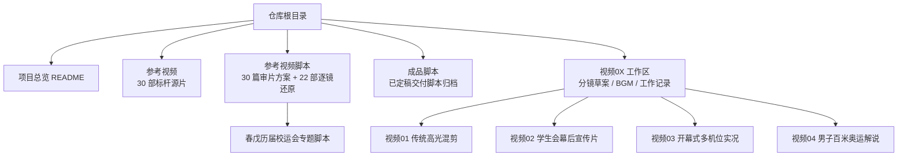
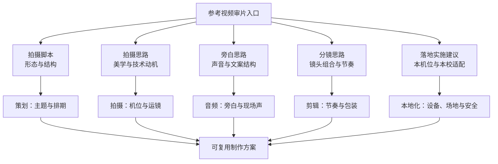
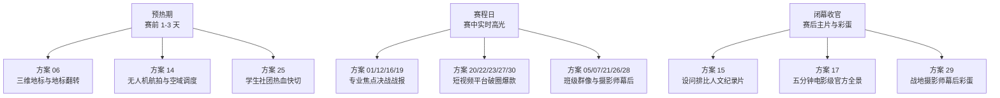
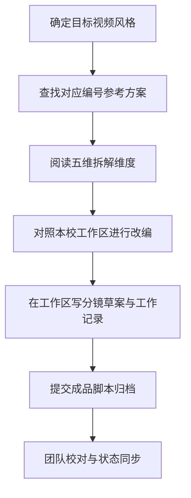
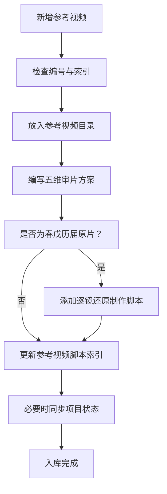
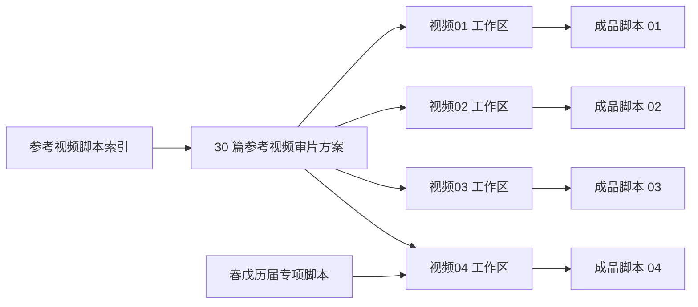

# 参考视频与风格知识库

<cite>
**本文引用的文件**   
- [README.md](file://README.md)
- [参考视频脚本/README.md](file://参考视频脚本/README.md)
- [成品脚本/README.md](file://成品脚本/README.md)
- [参考视频脚本/春戊_历届校运会/04_历届个人视角与特色探索_多模态拆解脚本.md](file://参考视频脚本/春戊_历届校运会/04_历届个人视角与特色探索_多模态拆解脚本.md)
</cite>

## 目录
1. [引言](#引言)
2. [项目结构](#项目结构)
3. [核心知识资产](#核心知识资产)
4. [五维拆解维度](#五维拆解维度)
5. [五维宣发矩阵](#五维宣发矩阵)
6. [春戊历届资产分类](#春戊历届资产分类)
7. [如何使用该知识库](#如何使用该知识库)
8. [新增参考视频入库流程与命名约定](#新增参考视频入库流程与命名约定)
9. [依赖关系分析](#依赖关系分析)
10. [性能与复用建议](#性能与复用建议)
11. [故障排查与常见问题](#故障排查与常见问题)
12. [结论](#结论)

## 引言
本知识库是浙江省春晖中学 2026 年校运会视听制作工程的“经验放大器”。它把 30 部标杆参考视频和 22 部历届原片逐镜还原脚本，从“好看”升级为“可学习、可复制、可改编”的制作方法论。其目标是让策划、拍摄与剪辑人员在面对新赛事时，不再从零摸索，而是先找到成熟技法，再结合本校实际进行本地化改造。

从工程总览看，本项目覆盖赛前研判、现场多机位调度、分镜头脚本撰写、后期剪辑包装到成品归档的全链路；参考视频库则承担“输入端”的审美标准、技术范式与叙事模板职责，成品脚本库承担“输出端”的定稿交付职责，两者通过工作区隔离机制形成稳定闭环。

**章节来源**
- [README.md:1-85](file://README.md#L1-L85)

## 项目结构
仓库采用“目标视频工作区 + 参考视频库 + 参考视频脚本库 + 成品脚本归档”的分层组织方式：

- `参考视频/`：存放 30 部标杆参考视频源片，包括春戊 2019–2024 历届原片库。
- `参考视频脚本/`：存放 30 篇参考视频的多模态深度审片方案，以及 22 部春戊历届原片的逐镜还原制作脚本。
- `成品脚本/`：集中归档经团队确认定稿的完整交付版脚本。
- `视频0X_.../`：每个视频的过程工作区，存放分镜草案、BGM 选型、工作记录等临时过程资产。

**图表来源**
- [README.md:28-85](file://README.md#L28-L85)
- [参考视频脚本/README.md:1-82](file://参考视频脚本/README.md#L1-L82)
- [成品脚本/README.md:1-23](file://成品脚本/README.md#L1-L23)

**章节来源**
- [README.md:28-85](file://README.md#L28-L85)
- [成品脚本/README.md:1-23](file://成品脚本/README.md#L1-L23)

## 核心知识资产
本知识库的核心价值由两部分构成：

| 资产类型 | 数量 | 主要用途 | 典型读者 |
|---|---:|---|---|
| 30 部标杆参考视频及对应审片方案 | 30 | 提供行业级或优秀校园级的视觉风格、节奏范式、转播包装、短视频爆款结构与落地实施建议 | 策划、导演、摄像、航拍、剪辑、包装 |
| 22 部春戊历届原片逐镜还原制作脚本 | 22 | 把学校自身历史作品解构为可复用的镜头语言、叙事结构和实操执行模板 | 新媒体社成员、历届社团梯队、指导老师 |

30 部参考视频不是简单素材清单，而是按编号组织的“风格—场景—技术要点”索引。例如：
- 专业赛事直播解说风格对应电视转播 UI、道次条、成绩榜与播音腔解说；
- 高燃卡点快剪 MV 风格对应鼓点卡点、升格镜头与电影级运动感；
- 三维地标跟踪与航拍调度对应地标翻转、立体文字与空域协同；
- 战地摄影师幕后纪实对应极限机位、第一视角与成片—幕后双视角对照。

22 部春戊历届原片脚本则进一步把这些外部范式拉回到本校语境，帮助团队识别“历届优势”和“短跑直道短板”，从而指导 2026 届具体项目的技术突破。

**章节来源**
- [参考视频脚本/README.md:1-82](file://参考视频脚本/README.md#L1-L82)
- [参考视频脚本/春戊_历届校运会/04_历届个人视角与特色探索_多模态拆解脚本.md:1-52](file://参考视频脚本/春戊_历届校运会/04_历届个人视角与特色探索_多模态拆解脚本.md#L1-L52)

## 五维拆解维度
每篇参考视频审片方案都围绕五个维度展开：**拍摄脚本、拍摄思路、旁白思路、分镜思路、落地实施建议**。这五个维度分别回答不同岗位的核心问题：

| 维度 | 解决的问题 | 策划关注点 | 拍摄关注点 | 剪辑关注点 |
|---|---|---|---|---|
| **拍摄脚本** | 这支视频最终要拍成什么形态？ | 主题、情绪曲线、受众平台、时长结构 | 机位布局、设备选择、关键画面清单 | 叙事主线、段落划分、素材调用优先级 |
| **拍摄思路** | 为什么这样拍？美学与技术依据是什么？ | 风格定位是否匹配品牌与传播目标 | 运镜动机、视角选择、空间关系 | 转场逻辑、节奏依据、对比与呼应 |
| **旁白思路** | 声音如何服务画面？文案结构怎样推进情绪？ | 文案基调、信息密度、口播与音乐比例 | 录音环境、现场声采集、静音蓄势设计 | 配音节奏、音效层次、静默与爆发点 |
| **分镜思路** | 镜头如何组合出张力与美感？ | 关键帧、标志性画面、高潮点安排 | 景别切换、角度变化、焦点与速度控制 | 切点、变速、蒙太奇、卡点与视觉重音 |
| **落地实施建议** | 在本校条件限制下怎么实现？ | 风险预案、排期、人员分工、预算与设备 | 机位部署、安全边界、天气与光线应对 | 工程设置、调色风格、包装模板、导出规范 |

这五个维度共同构成一条从“创意”到“执行”再到“交付”的链条。策划用前三个维度判断“值不值得做”，拍摄用前四个维度判断“怎么拍到”，剪辑用后三个维度判断“怎么剪出来”。

**图表来源**
- [参考视频脚本/README.md:1-82](file://参考视频脚本/README.md#L1-L82)

**章节来源**
- [参考视频脚本/README.md:1-82](file://参考视频脚本/README.md#L1-L82)

## 五维宣发矩阵
五维宣发矩阵将 30 部参考视频的使用场景按时间轴划分为三个阶段：**预热期、赛程日、闭幕收官**。每个阶段都有明确的参考编号集合与传播目标。

### 预热期（赛前 1–3 天）
目标：制造期待、展示氛围、完成引流。
- 推荐参考：方案 06、方案 14、方案 25。
- 使用方式：
  - 用方案 06 的三维地标与地标翻转思维，结合白马湖、一枝春、象山等校园地标做开场预告；
  - 用方案 14 的无人机航拍实战与空域调度思路，准备大景空镜与航拍动线；
  - 用方案 25 的低成本学生社团热血快切，快速产出短视频引流内容。

### 赛程日（赛中实时高光）
目标：聚焦焦点对决、提供即时战报、打造社交平台爆款。
- 推荐参考：
  - 专业转播类：方案 01、方案 12、方案 16、方案 19；
  - 短视频爆款类：方案 20、方案 22、方案 23、方案 27、方案 30；
  - 班级群像与幕后类：方案 05、方案 07、方案 21、方案 26、方案 28。
- 使用方式：
  - 对百米、接力、跳高等焦点项目套用电视转播 UI、道次条、成绩榜与实时解说；
  - 对竖屏平台采用抓人贴纸、第一视角跟跑、测速表、跨界 F1 包装等强钩子结构；
  - 对看台、大本营、摄影师幕后采用治愈长镜头、监视器 HUD 第一视角与班服背字连切。

### 闭幕收官（赛后主片与彩蛋）
目标：沉淀校史典藏、完成情感收束、致敬幕后团队。
- 推荐参考：方案 15、方案 17、方案 11、方案 29。
- 使用方式：
  - 用方案 15 的设问排比式人文纪录片结构，写出“校运会是什么？”这类情感叩问；
  - 用方案 17 的五分钟电影级全景纪录结构，串联开幕至闭幕全流程；
  - 用方案 29 的战地摄影师幕后彩蛋，形成成片与幕后双视角致敬。

**图表来源**
- [参考视频脚本/README.md:22-62](file://参考视频脚本/README.md#L22-L62)

**章节来源**
- [参考视频脚本/README.md:22-62](file://参考视频脚本/README.md#L22-L62)

## 春戊历届资产分类
春戊历届校运会资产按内容主题分为四类，对应 2026 届四项核心产出视频的参考方向：

| 分类 | 内容特征 | 对标 2026 项目 | 复用价值 |
|---|---|---|---|
| 历届高光混剪与快剪大片 | 官方高光、多项目集锦、快节奏回顾 | 视频一：传统高光混剪 | 学习项目分类、节奏分段、高燃收尾与官方宣发结构 |
| 我们在幕后与学生会纪实 | 检录、记分、器材搬运、广播站、医疗等幕后 | 视频二：学生会幕后宣传片（Vlog） | 学习纪实叙事、人物群像与奉献主题表达 |
| 历届开幕式方阵进场与大型展演 | 方阵入场、舞龙舞狮、大型展演、航拍大景 | 视频三：开幕式多机位实况片 | 学习多机位协同、方阵调度与全程收录结构 |
| 历届个人视角与特色探索 | 社员个人剪辑署名版本、教工趣味运动会、单项探索 | 视频四：男子百米奥运解说短片 | 反思直道竞速短板，推动三维复合机位与电视转播包装升级 |

其中，“历届个人视角与特色探索”不仅是对旧作品的总结，更是明确的技术改进起点。文档指出历届短跑镜头存在视角单一、缺乏转播包装、终点判定缺少张力、声音设计平淡等问题，并据此提出 2026 届在三维复合机位、奥运级转播 UI、Photo Finish 鹰眼判定与专业解说方面的突破路径。

**章节来源**
- [参考视频脚本/README.md:63-82](file://参考视频脚本/README.md#L63-L82)
- [参考视频脚本/春戊_历届校运会/04_历届个人视角与特色探索_多模态拆解脚本.md:1-52](file://参考视频脚本/春戊_历届校运会/04_历届个人视角与特色探索_多模态拆解脚本.md#L1-L52)

## 如何使用该知识库
建议遵循以下流程：

1. **明确目标视频风格**  
   根据你要制作的视频类型，先在参考视频脚本索引中查找对应编号方案。例如：
   - 要做高燃混剪，先看方案 02、方案 09、方案 11；
   - 要做专业转播，先看方案 01、方案 12、方案 16、方案 19；
   - 要做幕后纪实，先看方案 05、方案 29；
   - 要做闭幕式主片，先看方案 15、方案 17。

2. **对照实际项目工作区进行改编**  
   不要照搬参考视频的镜头、文案或包装。应把参考方案的“思路”迁移到本校工作区：
   - 在工作区中更新分镜草案；
   - 在工作区中记录 BGM 选型与工作记录；
   - 在成品脚本中只保留最终定稿版本。

3. **区分“借鉴风格”和“复制内容”**  
   - 可以借鉴：节奏结构、机位动机、转场逻辑、声音设计原则、包装规范；
   - 不应复制：他人文案原文、特定账号的个人签名式剪辑、非本校场地布置、不可复现的极端设备条件。

4. **以五维维度逐项检查**  
   在改编时，至少回答五个问题：
   - 拍摄脚本是否清晰？
   - 拍摄思路是否合理？
   - 旁白思路是否服务于主题？
   - 分镜思路是否有节奏与张力？
   - 落地实施建议是否能在本校实现？

**图表来源**
- [README.md:28-85](file://README.md#L28-L85)
- [成品脚本/README.md:12-23](file://成品脚本/README.md#L12-L23)
- [参考视频脚本/README.md:1-82](file://参考视频脚本/README.md#L1-L82)

**章节来源**
- [README.md:28-85](file://README.md#L28-L85)
- [成品脚本/README.md:12-23](file://成品脚本/README.md#L12-L23)
- [参考视频脚本/README.md:1-82](file://参考视频脚本/README.md#L1-L82)

## 新增参考视频入库流程与命名约定
虽然仓库未给出独立的新增入库规范文件，但可从现有结构推导出稳定约定。新增参考视频时，应按“源视频 + 审片方案 + 可选逐镜还原脚本”三部分同时入库。

### 文件名命名约定
| 资产类型 | 建议命名格式 | 示例 |
|---|---|---|
| 标杆参考视频 | `编号_主题_媒体类型.扩展名` | `31_接力赛电视转播_参考视频.mp4` |
| 参考视频审片方案 | `编号_主题_分析与制作脚本.md` | `31_接力赛电视转播_分析与制作脚本.md` |
| 春戊历届原片逐镜还原脚本 | `春戊_年份_主题_逐镜还原制作脚本.md` | `春戊_2023_接力赛集锦_逐镜还原制作脚本.md` |

### 入库步骤
1. **确认编号唯一性**  
   当前参考视频编号为 01–30，新增视频应从 31 开始，避免与已有编号冲突。
2. **放入参考视频目录**  
   将源视频放入 `参考视频/`，若属于春戊历届原片，则放入 `参考视频/春戊_历届校运会/`。
3. **创建审片方案文档**  
   在 `参考视频脚本/` 下创建对应审片方案，必须包含五维拆解维度，并在索引中补充编号、风格定位与适用场景。
4. **如需逐镜还原，单独归档**  
   对于春戊历届原片，应在 `参考视频脚本/春戊_历届校运会/` 下创建“逐镜还原制作脚本”，并归入四大专题之一。
5. **更新索引与导航**  
   在 `参考视频脚本/README.md` 中补充新编号条目；如影响总览，也应在根 `README.md` 的导航部分保持引用一致。
6. **同步项目状态**  
   若新增参考视频直接影响某个视频项目的工作区或成品脚本，应同步更新项目需求或归档说明。

**图表来源**
- [参考视频脚本/README.md:1-82](file://参考视频脚本/README.md#L1-L82)
- [成品脚本/README.md:12-23](file://成品脚本/README.md#L12-L23)

**章节来源**
- [参考视频脚本/README.md:1-82](file://参考视频脚本/README.md#L1-L82)
- [成品脚本/README.md:12-23](file://成品脚本/README.md#L12-L23)

## 依赖关系分析
参考视频与风格知识库与项目其他模块之间存在清晰依赖：

- `参考视频脚本/README.md` 依赖 30 篇审片方案，并作为“标杆参考库索引”被根 `README.md` 引用。
- 根 `README.md` 定义工程目录架构，将 `参考视频/` 与 `参考视频脚本/` 并列列为知识输入层。
- 各视频工作区 `视频0X_.../` 依赖参考方案进行分镜草案与拍摄执行。
- `成品脚本/` 依赖工作区推进结果，只接收最终定稿。
- 春戊历届专项脚本依赖 22 部原片，用于反思历史局限并指导 2026 届技术突破。

**图表来源**
- [README.md:28-85](file://README.md#L28-L85)
- [参考视频脚本/README.md:1-82](file://参考视频脚本/README.md#L1-L82)
- [成品脚本/README.md:1-23](file://成品脚本/README.md#L1-L23)

**章节来源**
- [README.md:28-85](file://README.md#L28-L85)
- [参考视频脚本/README.md:1-82](file://参考视频脚本/README.md#L1-L82)
- [成品脚本/README.md:1-23](file://成品脚本/README.md#L1-L23)

## 性能与复用建议
这里的“性能”不指代码运行效率，而指知识资产的复用效率与团队协作效率：

- **编号即索引**：用统一编号连接视频源文件、审片方案与宣发阶段，减少检索成本。
- **五维即检查表**：每次新增方案必须覆盖五个维度，避免只写“好看”却不写“怎么做”。
- **工作区隔离**：过程草稿留在工作区，成品脚本只放定稿，降低误改风险。
- **本地化优先**：参考视频提供范式，但不替代本校场地、设备、人员与时间的真实约束。
- **历史反哺未来**：春戊历届脚本的价值不仅是存档，更是“短跑直道短板”的诊断书，直接驱动 2026 届技术升级。

[本节为通用指导，不直接分析具体源码文件]

## 故障排查与常见问题
| 问题 | 可能原因 | 处理建议 |
|---|---|---|
| 找不到某编号参考方案 | 编号重复或索引未更新 | 检查编号是否超过 30，并更新 `参考视频脚本/README.md` |
| 参考视频与脚本不对应 | 源视频与审片方案未同步入库 | 核对文件名中的编号与主题 |
| 工作区文件堆积 | 过程草稿未清理或未归档 | 将定稿移入 `成品脚本/`，工作区仅保留必要过程文件 |
| 成品脚本状态不一致 | 未同步项目需求或归档说明 | 按照成品脚本归档规范更新状态 |
| 往届资产无法复用 | 未按四大专题分类 | 将春戊原片脚本归入高光混剪、幕后纪实、开幕式展演或个人视角四类之一 |
| 短跑镜头仍无转播质感 | 直接复制老版单机位做法 | 参照“历届个人视角与特色探索”中的短板反思，启用三维复合机位与转播 UI |

**章节来源**
- [成品脚本/README.md:12-23](file://成品脚本/README.md#L12-L23)
- [参考视频脚本/春戊_历届校运会/04_历届个人视角与特色探索_多模态拆解脚本.md:18-52](file://参考视频脚本/春戊_历届校运会/04_历届个人视角与特色探索_多模态拆解脚本.md#L18-L52)

## 结论
这份参考视频与风格知识库的本质，是把“看过很多好视频”转化为“知道如何拍出属于自己的好视频”。30 部标杆参考视频提供风格与技术上限，22 部春戊历届原片逐镜还原脚本提供本校语境下的执行基准；五维拆解维度提供方法论框架，五维宣发矩阵提供时间轴使用策略，春戊资产分类提供主题化复用路径。

对策划而言，它是选题与结构的灵感库；对拍摄而言，它是机位与运镜的决策库；对剪辑而言，它是节奏、声音与包装的参考库。最关键的原则始终是：先找编号方案，再对照实际项目工作区改编，而不是照搬。

[本节为总结性内容，不直接分析具体源码文件]