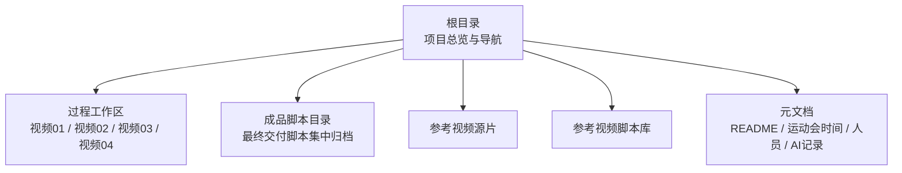
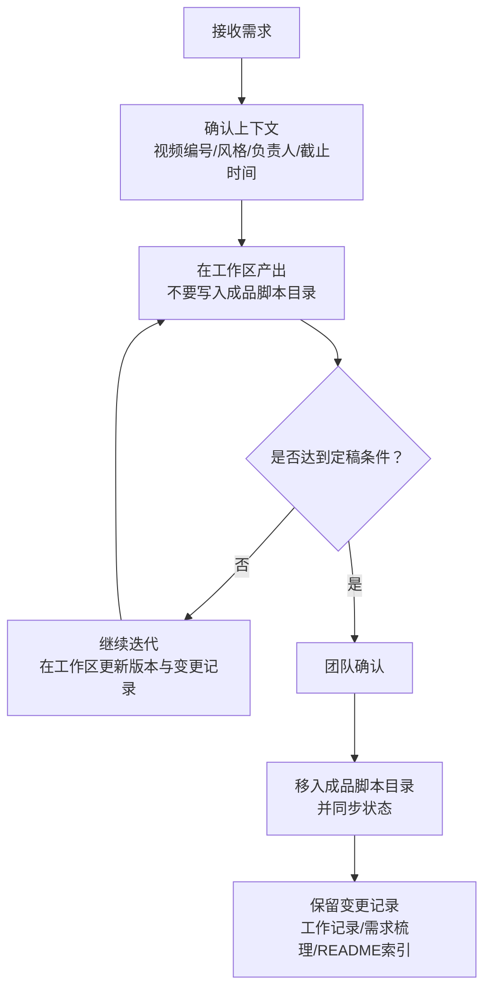
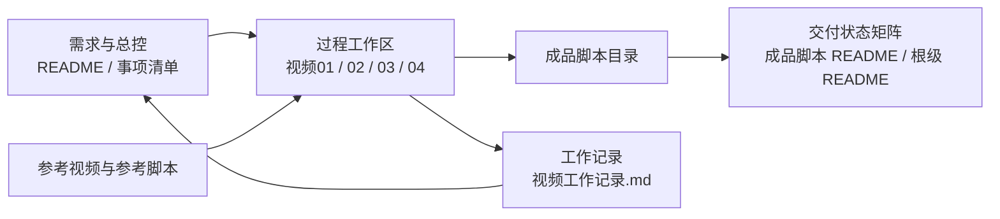
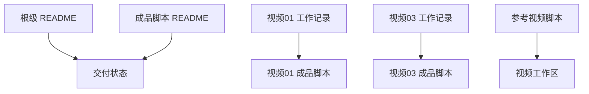

# 工作流与协作规范

<cite>
**本文引用的文件**
- [README.md](file://README.md)
- [成品脚本/README.md](file://成品脚本/README.md)
- [参考视频脚本/README.md](file://参考视频脚本/README.md)
- [视频01_传统高光混剪/工作记录.md](file://视频01_传统高光混剪/工作记录.md)
- [视频03_开幕式多机位实况/工作记录.md](file://视频03_开幕式多机位实况/工作记录.md)
</cite>

## 目录
1. [引言](#引言)
2. [项目结构](#项目结构)
3. [核心协作规则](#核心协作规则)
4. [架构总览](#架构总览)
5. [详细流程说明](#详细流程说明)
6. [依赖与边界分析](#依赖与边界分析)
7. [性能与效率建议](#性能与效率建议)
8. [故障排查与常见问题](#故障排查与常见问题)
9. [结论](#结论)
10. [附录：标准操作流程清单](#附录标准操作流程清单)

## 引言
本规范将浙江省春晖中学 2026 年校运会视频制作项目的既有工程结构与执行经验，沉淀为可执行的团队协作标准。目标包括：
- 明确过程工作区隔离规则，避免跨视频随意修改他人工作区。
- 建立成品脚本定稿机制，只有经团队确认的脚本才能进入成品脚本目录。
- 强制成品脚本目录与交付状态矩阵保持一致，形成双向同步约束。
- 规范 AI Agent 任务推进流程，使其在需求、上下文、工作区产出和变更记录之间保持可追溯。
- 给出日常协作建议、新增视频与新增参考视频的标准操作流程，以及分歧升级路径。

该规范既适用于当前四部核心视频的推进，也适用于后续新增视频、参考视频及 AI 协作任务。

## 项目结构
仓库以“根级总览 + 各视频独立工作区 + 成品脚本集中归档 + 参考视频与参考脚本”的方式组织。根级 README 定义了项目目标、职责分工、四大视频规划、工程目录架构、核心文档导航与工作流归档原则；成品脚本目录维护最终交付脚本与交付状态；每个 `视频0X_...` 目录是独立过程工作区；参考视频与参考脚本提供风格、拍摄思路与逐镜还原能力。

**图表来源**
- [README.md:33-85](file://README.md#L33-L85)

**章节来源**
- [README.md:1-85](file://README.md#L1-L85)

## 核心协作规则
本节把仓库中已有的流程约定抽象成可执行规则。

### 规则一：过程工作区隔离
- 每个视频对应一个独立工作区，例如 `视频01_传统高光混剪`、`视频03_开幕式多机位实况`。
- 分镜草案、BGM 选型、素材清单、现场执行手册、工作记录等过程资产应放在对应视频工作区内。
- 禁止在其他视频工作区中随意修改非自己负责的文件；如需引用其他视频成果，应在需求或决策记录中说明，而不是直接覆盖他人草稿。
- 根目录不应堆积临时文件，临时讨论与草稿应下沉到具体工作区。

**依据**
- 根级 README 明确指出过程工作区隔离与根目录清理原则。
- 视频 01 工作区集中保存 BGM、视听结构说明、分镜草案与工作记录。
- 视频 03 工作区集中保存机位部署手册、拓扑图、小混剪思路指南与工作记录。

**章节来源**
- [README.md:64-85](file://README.md#L64-L85)
- [视频01_传统高光混剪/工作记录.md:1-94](file://视频01_传统高光混剪/工作记录.md#L1-L94)
- [视频03_开幕式多机位实况/工作记录.md:1-113](file://视频03_开幕式多机位实况/工作记录.md#L1-L113)

### 规则二：成品脚本定稿机制
- `成品脚本/` 是最终交付脚本集中归档区，不是草稿箱。
- 只有经过团队逐轮校对、推演并确认定稿的完整交付版脚本，才能移入该目录。
- 未定稿的分镜草案、备选方案、测试片段不得放入成品脚本目录。
- 成品脚本文件名应体现最终属性，例如“最终脚本”“剪辑思路指南”，并与成品脚本目录的 README 索引保持一致。

**依据**
- 成品脚本目录 README 明确成品集中归档原则与禁止存放过程草稿。
- 根级 README 也将成品脚本目录标注为强制规范。

**章节来源**
- [成品脚本/README.md:1-23](file://成品脚本/README.md#L1-L23)
- [README.md:49-85](file://README.md#L49-L85)

### 规则三：状态双向同步机制
- 成品脚本目录中的交付清单必须与项目总控状态保持一致。
- 当有新视频脚本定稿归档时，必须同步更新项目总控文件（根级 README 与成品脚本 README）。
- 当某个视频取消、延期或状态变更时，必须在两处同步标记，避免读者误以为某视频仍待交付。

**依据**
- 成品脚本 README 要求新视频脚本定稿归档后同步更新项目总控文件。
- 成品脚本 README 的交付总览表已体现视频 04 被取消的状态。
- 根级 README 的核心产出表格中也体现视频 1、视频 3 为已定稿交付，视频 2、视频 4 处于方案就绪或策划就绪状态。

**章节来源**
- [成品脚本/README.md:1-23](file://成品脚本/README.md#L1-L23)
- [README.md:18-47](file://README.md#L18-L47)

### 规则四：AI Agent 任务推进标准流程
AI Agent 在本项目中应遵循“接收需求 → 确认上下文 → 在工作区产出 → 不得绕过成品目录 → 保留变更记录”的闭环。

**图表来源**
- [成品脚本/README.md:15-23](file://成品脚本/README.md#L15-L23)
- [README.md:64-85](file://README.md#L64-L85)

**章节来源**
- [成品脚本/README.md:15-23](file://成品脚本/README.md#L15-L23)
- [README.md:64-85](file://README.md#L64-L85)

## 架构总览
从协作视角看，仓库由四类主要区域构成：过程工作区、成品脚本区、参考资源区、元文档区。它们之间的依赖关系如下：

**图表来源**
- [README.md:18-85](file://README.md#L18-L85)
- [成品脚本/README.md:1-23](file://成品脚本/README.md#L1-L23)
- [参考视频脚本/README.md:1-62](file://参考视频脚本/README.md#L1-L62)

**章节来源**
- [README.md:18-85](file://README.md#L18-L85)
- [成品脚本/README.md:1-23](file://成品脚本/README.md#L1-L23)
- [参考视频脚本/README.md:1-62](file://参考视频脚本/README.md#L1-L62)

## 详细流程说明

### 一、过程工作区隔离与日常协作
#### 1.1 工作区命名与内容边界
- 工作区命名采用 `视频0X_名称/` 形式，便于按序号识别视频优先级与阶段。
- 每个工作区应包含：
  - 分镜草案或策划草案。
  - 素材选型与参数说明。
  - 现场执行手册或实操指南。
  - 工作记录，用于记录决策、调整、待办与下一步计划。

#### 1.2 禁止跨视频随意修改
- 若 A 视频需要参考 B 视频的工作区内容，应先在工作记录或总控需求中说明用途，再复制必要文件到自己的过程工作区，而不是直接编辑 B 视频文件。
- 若发现其他工作区存在明显错误，应通过沟通渠道提醒负责人，而不是静默覆盖。

#### 1.3 工作记录的作用
- 工作记录应记录：
  - 当前核心成果与交付资产。
  - 关键决策与原因。
  - 已完成的待办事项。
  - 下一步待办事项。
- 视频 01 工作记录体现了主 BGM 定型、黑场蓄势设计、分镜草案重构与成品导出；视频 03 工作记录体现了机位架构、技术参数校准、执行手册教学化与成品归档。

**章节来源**
- [视频01_传统高光混剪/工作记录.md:1-94](file://视频01_传统高光混剪/工作记录.md#L1-L94)
- [视频03_开幕式多机位实况/工作记录.md:1-113](file://视频03_开幕式多机位实况/工作记录.md#L1-L113)

### 二、成品脚本定稿流程
#### 2.1 定稿前检查清单
在移入成品脚本目录前，应逐项确认：
- 脚本是否已在对应过程工作区完成至少一轮以上迭代。
- 脚本是否已由团队确认，而非仅个人完成。
- 脚本是否不再包含过程草稿、测试音频、临时截图或内部备注。
- 文件名是否符合“最终脚本”“剪辑思路指南”等终稿语义。
- 成品脚本目录 README 是否需要新增条目。
- 根级 README 中的交付状态是否需要更新。

#### 2.2 定稿动作顺序
1. 在工作区完成最终校对。
2. 将定稿文件复制到 `成品脚本/`。
3. 更新 `成品脚本/README.md` 的交付总览表。
4. 更新根级 README 中的交付状态或核心产出表格。
5. 在工作记录中记录“已归档至成品脚本目录”。

**章节来源**
- [成品脚本/README.md:15-23](file://成品脚本/README.md#L15-L23)
- [README.md:49-85](file://README.md#L49-L85)

### 三、状态双向同步机制
#### 3.1 需要同步的两类信息
- 成品脚本目录中的文件清单。
- 根级 README 与成品脚本 README 中的交付状态。

#### 3.2 同步触发条件
- 新增视频脚本定稿。
- 已有视频状态由“待定稿交付”变为“已定稿交付”。
- 已有视频状态由“已定稿交付”变为“已取消”“延期”或其他变更。
- 成品脚本目录发生删除、重命名或拆分。

#### 3.3 当前状态示例
- 视频 01：传统高光混剪，已定稿交付。
- 视频 02：学生会幕后宣传片，待定稿交付。
- 视频 03：开幕式多机位实况，已定稿交付。
- 视频 03 附：开幕式精彩小混剪剪辑思路指南，已定稿交付。
- 视频 04：男子百米奥运解说短片，已取消。

**章节来源**
- [成品脚本/README.md:6-23](file://成品脚本/README.md#L6-L23)
- [README.md:18-47](file://README.md#L18-L47)

### 四、AI Agent 任务推进标准
#### 4.1 接收需求
AI Agent 收到需求后，应先明确：
- 对应视频编号。
- 当前阶段：需求梳理、工作区草稿、定稿归档、状态同步。
- 负责人与相关角色。
- 是否有老师指示或微信沟通结论需要纳入。

#### 4.2 确认上下文
- 优先阅读根级 README 中的项目总览与工程目录架构。
- 查看成品脚本 README 的交付总览，判断目标视频是否已定稿。
- 查看对应视频工作区的最新工作记录，了解最近一次迭代。
- 如涉及参考视频风格，先阅读参考视频脚本 README 的分类索引。

#### 4.3 在工作区产出
- 所有过程产物应落在对应视频工作区。
- 不得绕过成品脚本目录直接写入最终交付文件。
- 如需要模板或结构，可在工作区新增文档，并在工作记录中标注版本。

#### 4.4 不得绕过成品目录
- 成品脚本目录具有唯一性，任何“最终版”只能出现在该目录。
- 如果 AI 建议用户移动文件，应提示用户先完成团队确认与状态同步。

#### 4.5 保留变更记录
- 工作记录应记录 AI 协助的关键步骤。
- 重大决策应同时体现在工作记录与总控需求中。
- 若 AI 输出影响成品脚本，应在工作记录中说明“依据 AI 建议进行版本迭代”，再由人工复核后归档。

**章节来源**
- [成品脚本/README.md:15-23](file://成品脚本/README.md#L15-L23)
- [README.md:64-85](file://README.md#L64-L85)
- [视频01_传统高光混剪/工作记录.md:57-94](file://视频01_传统高光混剪/工作记录.md#L57-L94)
- [视频03_开幕式多机位实况/工作记录.md:96-113](file://视频03_开幕式多机位实况/工作记录.md#L96-L113)

### 五、日常协作建议
#### 5.1 用需求梳理维护事项清单
- 将总控需求拆分为可执行事项，例如：
  - 视频 02 策划案完善。
  - 视频 03 机位与器材排班落实。
  - 视频 04 方案调整或取消说明。
  - 参考视频脚本新增与索引更新。
- 每个事项应关联：
  - 所属视频工作区。
  - 责任人。
  - 截止时间。
  - 当前状态。
- 事项状态变化时，同步更新根级 README 或专用需求文档。

#### 5.2 微信沟通、老师指示与团队共识的记录方式
- 微信沟通结论不应只停留在聊天界面，应转化为可检索文档。
- 建议记录格式：
  - 时间。
  - 来源：微信消息 / 老师指示 / 团队会议。
  - 结论。
  - 影响范围：哪个视频、哪个工作区、是否影响成品脚本。
  - 执行人与截止时间。
- 重要结论应同步到：
  - 对应视频工作记录。
  - 根级 README 或需求梳理文档。
  - 如涉及成品脚本，则同步更新成品脚本 README 状态。

#### 5.3 为新成员做入职导读
新成员入职应按以下顺序理解仓库：
1. 阅读根级 README，了解项目目标、职责分工、四大视频规划与工程目录架构。
2. 阅读成品脚本 README，了解哪些视频已定稿交付。
3. 根据自己负责的编号进入对应视频工作区，阅读工作记录与最新草案。
4. 如需参考风格，打开参考视频脚本 README，定位相关编号与方案。
5. 首次修改前先检查工作记录，避免重复劳动或覆盖他人进度。
6. 每次修改后在工作记录中补充说明。

**章节来源**
- [README.md:1-47](file://README.md#L1-L47)
- [成品脚本/README.md:1-23](file://成品脚本/README.md#L1-L23)
- [参考视频脚本/README.md:1-62](file://参考视频脚本/README.md#L1-L62)

### 六、新增视频标准操作流程
#### 6.1 新增前确认
- 确认视频是否属于校运会官方产出。
- 确认是否与现有视频 01-04 内容冲突。
- 确认负责人、风格定位、大致时间与交付节点。

#### 6.2 创建工作区
- 在根目录新增 `视频XX_名称/`。
- 初始文件建议包括：
  - `工作记录.md`。
  - 分镜草案或策划草案。
  - 素材选型或技术方案说明。
- 在根级 README 的四大核心产出表格或工程目录架构中补充该视频。
- 在成品脚本 README 中预留状态条目，初始状态可为“策划就绪”或“待定稿交付”。

#### 6.3 推进与归档
- 在工作区完成多轮迭代。
- 团队确认后，将最终脚本移入 `成品脚本/`。
- 更新成品脚本 README 与根级 README 状态。
- 在工作记录中记录归档时间、负责人与后续待办。

**章节来源**
- [README.md:18-85](file://README.md#L18-L85)
- [成品脚本/README.md:15-23](file://成品脚本/README.md#L15-L23)

### 七、新增参考视频标准操作流程
#### 7.1 选择参考视频
- 从 `参考视频/` 中选择符合风格的标杆视频。
- 参考视频脚本 README 已提供 30 部参考视频的全览表，可按编号快速定位。

#### 7.2 编写参考脚本
- 在 `参考视频脚本/` 下新增对应脚本文件。
- 脚本应覆盖：
  - 视频拍摄脚本。
  - 拍摄思路。
  - 旁白思路。
  - 分镜思路。
  - 浙江省春晖中学实操拍摄建议。
- 保持编号连续，并在 `参考视频脚本/README.md` 的全景总览表中补充一行。

#### 7.3 使用参考脚本
- 视频工作区可引用参考脚本作为风格与技法依据。
- 引用时应注明参考编号与适用场景，避免生搬硬套。
- 若参考脚本发生重大修正，应在工作记录中说明对实际制作的调整。

**章节来源**
- [参考视频脚本/README.md:1-62](file://参考视频脚本/README.md#L1-L62)

### 八、分歧处理与升级路径
#### 8.1 第一层：工作区内部对齐
- 由视频负责人与直接协作同学在工作记录中记录分歧点、各自理由与暂不确定的风险。
- 尝试通过小范围验证或参考视频案例缩小分歧。

#### 8.2 第二层：团队共识
- 若无法自行达成一致，应拉通新媒体社策划组、现场摄制统筹组等相关角色。
- 在根级 README 或需求梳理文档中记录最终共识，并注明“经团队讨论决定”。

#### 8.3 第三层：指导老师决策
- 若仍无法解决，应提交指导老师决策。
- 决策结果应明确：
  - 采用哪一方方案。
  - 是否需要调整成品脚本。
  - 是否需要调整交付状态。
  - 是否影响其他视频。

#### 8.4 升级记录模板
- 问题描述。
- 涉及视频与工作区。
- 已尝试的解决方案。
- 相关微信沟通或老师指示链接。
- 升级对象与期望决策时间。
- 最终决策与执行动作。

**章节来源**
- [README.md:1-17](file://README.md#L1-L17)
- [成品脚本/README.md:15-23](file://成品脚本/README.md#L15-L23)

## 依赖与边界分析
### 组件耦合关系
- 根级 README 与成品脚本 README 共同维护交付状态，耦合度较高，任一变更都应双向同步。
- 各视频工作区相互解耦，但可能通过参考视频脚本与总控需求间接耦合。
- 工作记录是过程产出的“审计线索”，与成品脚本形成“过程 → 结果”的单向依赖。

**图表来源**
- [README.md:18-85](file://README.md#L18-L85)
- [成品脚本/README.md:1-23](file://成品脚本/README.md#L1-L23)
- [视频01_传统高光混剪/工作记录.md:1-94](file://视频01_传统高光混剪/工作记录.md#L1-L94)
- [视频03_开幕式多机位实况/工作记录.md:1-113](file://视频03_开幕式多机位实况/工作记录.md#L1-L113)

### 潜在风险
- 状态不同步：成品脚本目录新增文件但未更新 README 或根级 README。
- 越权修改：在非自己负责的视频工作区直接改文件。
- 成品目录污染：把草稿、测试音频或临时截图放进成品脚本目录。
- 决策不可追溯：微信沟通或老师指示未落盘，导致后续复现困难。

**章节来源**
- [成品脚本/README.md:15-23](file://成品脚本/README.md#L15-L23)
- [README.md:64-85](file://README.md#L64-L85)

## 性能与效率建议
- 减少跨目录频繁切换：修改前先确定目标工作区，避免误改他人文件。
- 使用版本化命名：分镜草案可用 v1、v2、v3，工作记录按日期记录，便于回溯。
- 控制成品目录规模：只放最终交付脚本，不放中间版本。
- 复用参考视频脚本：遇到相似风格时，优先复用参考脚本分类索引，减少从零开始拆解的时间。
- 自动化检查：每次提交前自检成品脚本 README 与根级 README 状态是否一致。

[本节为通用效率建议，不直接分析具体代码文件]

## 故障排查与常见问题
### 常见问题一：成品脚本目录找不到某视频
- 先检查成品脚本 README 的交付总览表。
- 若总览表中没有，则该视频可能尚未定稿。
- 检查对应视频工作区是否有最终脚本草稿。
- 如确实已定稿，应补齐成品脚本 README 与根级 README 状态。

**章节来源**
- [成品脚本/README.md:6-23](file://成品脚本/README.md#L6-L23)
- [README.md:49-85](file://README.md#L49-L85)

### 常见问题二：两个视频工作区出现冲突
- 确认冲突文件是否属于同一视频。
- 若非同一视频，立即停止覆盖，恢复原文件。
- 在工作记录中记录冲突来源、影响范围与修复动作。
- 如涉及总控需求，同步更新根级 README 或需求梳理文档。

**章节来源**
- [README.md:64-85](file://README.md#L64-L85)

### 常见问题三：AI 建议直接修改成品脚本
- 拒绝绕过成品目录的流程。
- 让 AI 先在工作区生成新版本。
- 人工确认后，再按定稿流程移入成品脚本目录。
- 在工作记录中记录 AI 建议与最终决策。

**章节来源**
- [成品脚本/README.md:15-23](file://成品脚本/README.md#L15-L23)

### 常见问题四：状态不一致
- 对比成品脚本 README 与根级 README。
- 以最新团队确认为准，统一更新两处。
- 在工作记录中记录“已完成状态同步”。

**章节来源**
- [成品脚本/README.md:15-23](file://成品脚本/README.md#L15-L23)
- [README.md:64-85](file://README.md#L64-L85)

## 结论
本规范将仓库中的既有流程抽象为五项核心协作规则：过程工作区隔离、成品脚本定稿机制、状态双向同步、AI Agent 标准流程、日常协作建议。配合新增视频与新增参考视频的标准操作流程，以及分歧升级路径，团队可以在复杂的多机位、多视频、多角色协作中保持清晰边界、可追溯决策与稳定交付。

未来建议持续完善根级需求梳理文档，使每条微信沟通、老师指示与团队共识都能沉淀为可检索、可追踪、可复用的协作资产。

[本节为总结性内容，不直接分析具体文件]

## 附录：标准操作流程清单
### 新增视频流程
1. 确认视频归属与负责人。
2. 创建 `视频XX_名称/` 工作区。
3. 初始化工作记录、分镜草案或策划草案。
4. 更新根级 README 与成品脚本 README 状态。
5. 推进迭代，团队确认后移入成品脚本目录。
6. 同步状态，记录归档信息。

### 新增参考视频流程
1. 从参考视频脚本 README 全览表定位编号。
2. 在 `参考视频脚本/` 新增脚本文件。
3. 覆盖拍摄脚本、拍摄思路、旁白思路、分镜思路与实操建议。
4. 更新参考视频脚本 README 全景总览表。
5. 在工作区引用参考编号，并在工作记录中说明适用场景。

### 分歧升级路径
1. 工作区内部对齐。
2. 团队共识。
3. 指导老师决策。
4. 记录最终决策并同步状态。

[本节为操作清单，不直接分析具体文件]