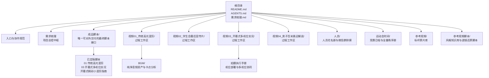
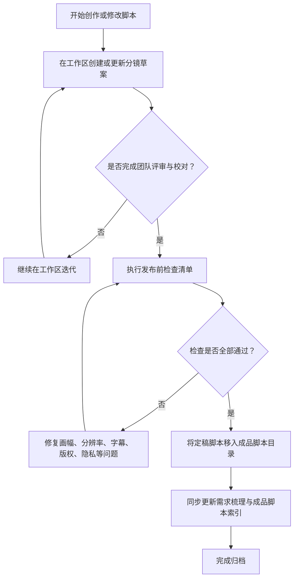
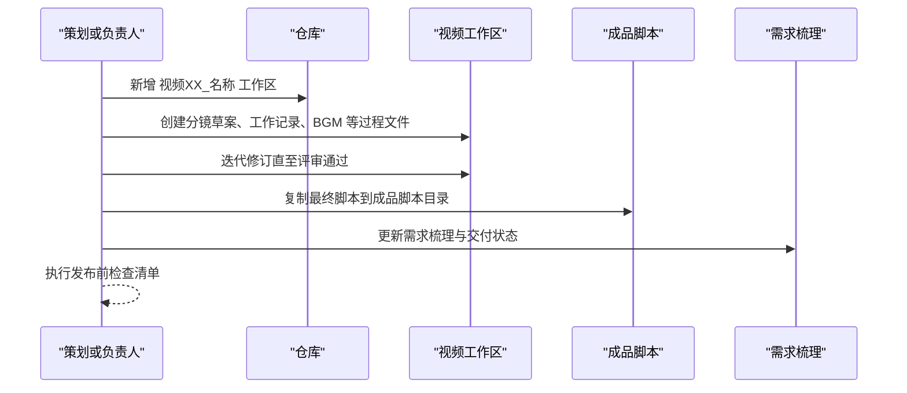
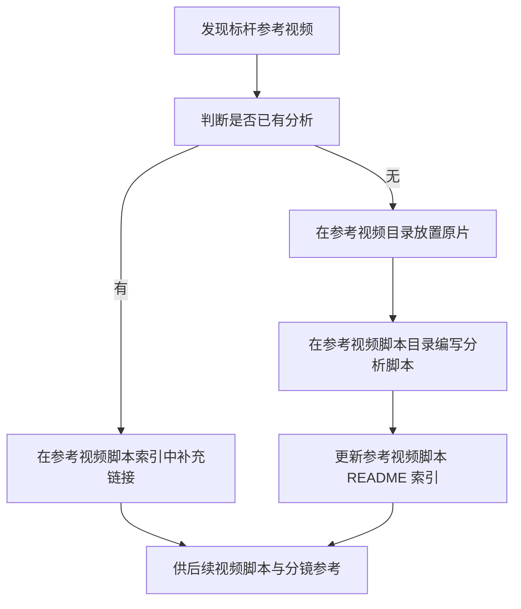
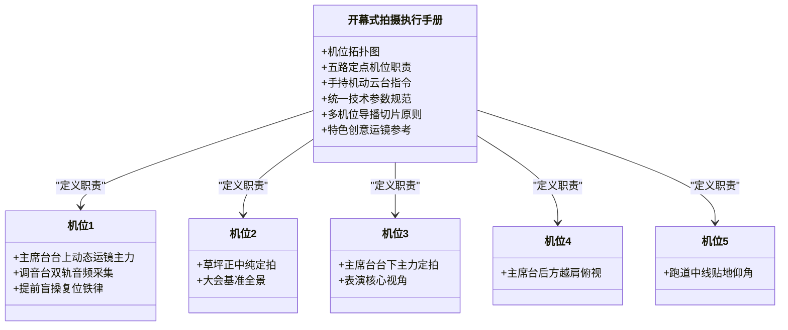

# 工程目录与归档规范

<cite>
**本文引用的文件**   
- [README.md](file://README.md)
- [成品脚本/README.md](file://成品脚本/README.md)
- [参考视频脚本/README.md](file://参考视频脚本/README.md)
- [视频01_传统高光混剪/BGM视听结构与黑场转折设计说明.md](file://视频01_传统高光混剪/BGM视听结构与黑场转折设计说明.md)
- [视频03_开幕式多机位实况/开幕式现场机位部署与拍摄执行手册.md](file://视频03_开幕式多机位实况/开幕式现场机位部署与拍摄执行手册.md)
</cite>

## 目录
1. [引言](#引言)
2. [项目结构总览](#项目结构总览)
3. [四层组织结构](#四层组织结构)
4. [核心归档原则](#核心归档原则)
5. [AI Agent 协作规范要点](#ai-agent-协作规范要点)
6. [新增视频标准化流程](#新增视频标准化流程)
7. [新增参考视频标准化流程](#新增参考视频标准化流程)
8. [发布前检查清单](#发布前检查清单)
9. [关键资产处理建议](#关键资产处理建议)
10. [常见问题排查](#常见问题排查)
11. [结语](#结语)

## 引言
本规范面向 2026SportsMeet 工程中的 Markdown 文档、分镜脚本、拍摄执行手册、BGM 音频与截图类资产，目标是让策划、拍摄、剪辑、后期与 AI Agent 在同一个仓库中协同工作时，不产生混乱目录、不污染成品区、不丢失定稿版本。

该工程覆盖从官方赛程研判、现场多机位调度、分镜头脚本撰写，到后期剪辑包装与成品归档的全流程；最终对外交付接口集中在“成品脚本”目录，过程草稿、音乐选型、机位讨论等一律留在对应视频的工作区内。

**章节来源**
- [README.md:1-85](file://README.md#L1-L85)

## 项目结构总览
当前仓库采用“根级入口 + 需求中枢 + 成品集中 + 视频工作区分治 + 团队档案与赛程 + 参考知识库”的六段式布局。其中：
- 根级 README 提供项目总览、团队分工、四部视频规划、工程目录导航与基础归档规则。
- 成品脚本是最终脚本的强制归档区。
- 视频01~视频04 是各片的过程工作区。
- 人员目录存放全员花名册与微信群排摸截图。
- 运动会时间存放官方竞赛日程与 64 页全量秩序册（PDF 与 Markdown）。
- 参考视频与参考视频脚本构成风格与拆解知识库。

**图表来源**
- [README.md:1-85](file://README.md#L1-L85)
- [成品脚本/README.md:1-23](file://成品脚本/README.md#L1-L23)
- [人员/人员花名册.md:1-49](file://人员/人员花名册.md#L1-L49)
- [运动会时间/秩序册.md:1-100](file://运动会时间/秩序册.md#L1-L100)

**章节来源**
- [README.md:1-85](file://README.md#L1-L85)
- [成品脚本/README.md:1-23](file://成品脚本/README.md#1-L23)

## 四层组织结构
2026SportsMeet 工程可按“用途深度”划分为四层：

| 层级 | 目录或文件 | 主要职责 | 是否允许放草稿 | 是否允许对外直接引用 |
|---|---|---|---:|---:|
| 第一层：入口与协作规范 | 根级 README.md、AGENTS.md | 项目总览、团队分工、工程导航、AI 协作约定 | 否 | 是，作为仓库入口 |
| 第二层：项目总控与组织赛程 | 需求梳理.md、人员/、运动会时间/ | 需求追踪、决策记录、人员花名册、官方秩序册（含64页全量Markdown） | 是，但应标注阶段 | 否，内部治理与排班依据 |
| 第三层：成品脚本接口 | 成品脚本/ | 经团队确认定稿的最终脚本与交付说明 | 严禁 | 是，对外交付唯一脚本入口 |
| 第四层：过程工作区与知识库 | 视频01~视频04、参考视频、参考视频脚本 | 分镜草案、BGM、机位方案、拍摄执行手册、风格拆解 | 是 | 通常不直接对外交付 |

### 第一层：入口与协作规范
根级 README 承担三大角色：
1. 项目背景与团队职责说明。
2. 四部核心产出视频的规划、风格定位与交付状态。
3. 工程目录架构与核心文档导航。

AGENTS.md 负责统一 AI Agent 的语言、目录、任务推进方式与输出落盘位置。

### 第二层：项目总控中枢
需求梳理.md 是项目总控中枢，用于记录：
- 重大决策变更。
- 阶段性成果完成标记。
- 跨视频依赖关系。
- 待办事项与阻塞问题。

当成品脚本新增或修改时，必须同步更新需求梳理，以保证“总控状态”和“成品索引”一致。

### 第三层：成品脚本接口
成品脚本目录是“唯一可对外交付的最终脚本接口”。它不是素材仓库，也不是创作草稿箱，而是经过校对、推演并最终确认的交付版脚本集合。

当前已定稿交付包括：
- 01_传统高光混剪_最终脚本.md
- 03_开幕式多机位实况_最终脚本.md
- 03_开幕式精彩小混剪_剪辑思路指南.md

视频02 的状态为待定稿交付，视频04 因禁飞与高空透视畸变风险取消独立单片，相关百米竞速素材全量汇入视频01 高光混剪。

### 第四层：过程工作区与风格知识库
- 视频01~视频04：每个视频一个工作区，存放分镜草案、BGM、机位方案、拍摄执行手册与工作记录。
- 参考视频：标杆原片与风格源素材。
- 参考视频脚本：对标杆视频的多模态审片、画面逐帧拆解、拍摄思路、旁白思路、分镜思路以及落地实施建议。

**章节来源**
- [README.md:1-85](file://README.md#L1-L85)
- [成品脚本/README.md:1-23](file://成品脚本/README.md#L1-L23)
- [参考视频脚本/README.md:1-62](file://参考视频脚本/README.md#L1-L62)

## 核心归档原则

### 原则一：过程工作区隔离
所有与具体视频制作相关的过程内容，都必须放在各自 `视频0X_.../` 工作区内。典型内容包括：
- 分镜草案与迭代版本。
- BGM 选型、分段素材、节拍与时码分析。
- 机位部署图、拍摄执行手册。
- 剪辑思路、工作记录、临时截图。

这样做可以避免根目录堆积过程临时文件，降低多人协作时的误删、误改与检索成本。

### 原则二：成品集中归档
只有经过团队逐轮校对、推演并确认定稿的完整交付版脚本，才能进入 `成品脚本/`。  
禁止把以下材料直接放入成品脚本目录：
- 未评审的分镜草案。
- 仍在调整的 BGM 片段。
- 仅内部使用的机位草图。
- 尚未对齐分辨率、字幕、版权与隐私的半成品。

### 为什么草稿只能放在视频工作区？
1. **降低外部干扰**：成品脚本会被外部查阅、转发或归档，不应包含创作过程中的反复尝试。
2. **便于回滚与对比**：工作区内可以保留 v1、v2、v3 等草稿版本，成品区只保留最终稳定版。
3. **避免传播错误信息**：过程内容可能包含被推翻的方案，若进入成品区，容易被误认为最终要求。
4. **保证交付一致性**：对外交付物只有一份权威脚本，减少“哪个才是真稿”的沟通成本。

**图表来源**
- [成品脚本/README.md:1-23](file://成品脚本/README.md#L1-L23)
- [README.md:1-85](file://README.md#L1-L85)

**章节来源**
- [README.md:1-85](file://README.md#L1-L85)
- [成品脚本/README.md:1-23](file://成品脚本/README.md#L1-L23)

## AI Agent 协作规范要点
虽然 AGENTS.md 的具体内容不在本次分析范围内，但从工程目录与成品集中归档要求出发，AI Agent 协作应遵循以下约束：

| 维度 | 规范要求 |
|---|---|
| 统一语言 | 使用中文进行需求说明、任务描述、脚本标题、备注与变更记录。 |
| 统一目录 | 不随意新建根级目录；新增视频使用 `视频XX_名称/`，新增参考分析使用 `参考视频脚本/`。 |
| 任务推进流程 | 先写工作区草案 → 再提交评审 → 评审通过后生成最终脚本 → 最后归档至成品脚本。 |
| 禁止跨工作区污染 | AI 不得把某个视频的草稿、临时音频或机位草图写入其他视频工作区或成品脚本目录。 |
| AI 输出落盘位置 | 过程性输出落盘到对应视频工作区；最终脚本落盘到成品脚本目录；参考分析落盘到参考视频脚本目录。 |
| 命名一致性 | 文件名应体现序号、主题与阶段，例如“分镜草案_v1.md”“最终脚本.md”。 |
| 可追溯性 | 重要结论、版本变更、删除原因应在工作记录或需求梳理中留下痕迹。 |

## 新增视频标准化流程
新增一部视频时，请按以下步骤操作：

1. **创建工作区**  
   在根目录新增 `视频XX_视频名称/`，序号按已有视频顺延。  
   建议初始结构：
   - `工作记录.md`
   - `分镜草案_v1.md`
   - `BGM/`（如需）
   - 其他过程文件（机位方案、截图、临时笔记）。

2. **明确视频定位**  
   在根级 README 或需求梳理中补充：
   - 视频类型。
   - 风格定位。
   - 目标时长。
   - 核心内容与技术要点。
   - 当前交付状态。

3. **在工作区推进创作**  
   所有分镜、BGM、机位、截图、临时剪辑说明都放在工作区内，不要提前复制到成品脚本。

4. **准备定稿**  
   完成内容校对后，复制一份到 `成品脚本/`，命名为“序号_主题_最终脚本.md”，并在成品脚本索引中登记。

5. **同步总控状态**  
   更新需求梳理，标明该视频已从“工作区草案”进入“成品脚本归档”。

6. **发布前检查**  
   按“发布前检查清单”逐项核对，确认无误后再对外交付。

**图表来源**
- [README.md:1-85](file://README.md#L1-L85)
- [成品脚本/README.md:1-23](file://成品脚本/README.md#L1-L23)

**章节来源**
- [README.md:1-85](file://README.md#L1-L85)
- [成品脚本/README.md:1-23](file://成品脚本/README.md#L1-L23)

## 新增参考视频标准化流程
参考视频与参考视频脚本属于“风格知识库”，不应与成品脚本混用。

1. **新增参考视频原片**  
   将标杆原片放入 `参考视频/`，并按现有子目录风格组织，例如春戊历届校运会等。

2. **新增参考视频脚本**  
   在 `参考视频脚本/` 新增对应 Markdown 脚本，至少覆盖：
   - 视频编号与来源。
   - 风格定位。
   - 核心特点与适用场景。
   - 拍摄思路、旁白思路、分镜思路。
   - 针对 2026SportsMeet 的落地实施建议。

3. **更新参考视频脚本索引**  
   在 `参考视频脚本/README.md` 中追加一行表格条目，保持编号、文件名、风格与说明一致。

4. **引用而非复制**  
   如果某部参考视频已被多次分析，应避免重复粘贴相同内容；可通过索引链接复用已有分析。

**图表来源**
- [参考视频脚本/README.md:1-62](file://参考视频脚本/README.md#L1-L62)

**章节来源**
- [参考视频脚本/README.md:1-62](file://参考视频脚本/README.md#L1-L62)

## 发布前检查清单
在将任何脚本或音视频资产对外交付前，至少完成以下检查：

| 类别 | 检查项 | 说明 |
|---|---|---|
| 画幅 | 横屏 16:9 或竖屏 9:16 是否符合发布渠道 | 广播、官网、短视频平台可能有不同画幅要求。 |
| 分辨率 | 主交付是否为 1080p 或更高 | 确保清晰度满足长期归档与二次剪辑。 |
| 帧率 | 是否与后期工程一致 | 避免播放卡顿、音画不同步。 |
| 字幕 | 是否存在错别字、时间轴错位、超长行 | 字幕属于最终交付的一部分，不能只检查脚本。 |
| 声音 | BGM、环境音、解说、拟音是否平衡 | 特别注意黑场转折、枪声、人声频段是否被音乐淹没。 |
| 版权音乐 | 所用 BGM 是否具备授权或合规使用依据 | 如工程中使用《Vicetone - Nevada》等曲目，需确认版权与使用范围。 |
| 隐私信息 | 是否泄露学生姓名、联系方式、个人账号、私人照片 | 尤其注意截图、二维码、聊天记录、订单信息等。 |
| 水印与台标 | 是否按学校或社团规范添加 | 避免遗漏或误加非官方标识。 |
| 版本一致性 | 成品脚本、需求梳理、工作记录是否同步 | 防止出现“多个最终版”的情况。 |
| 附件完整性 | BGM、分镜、机位图、截图是否齐全 | 特别是视频01 的 BGM 分段素材与节拍时码分析。 |

**章节来源**
- [视频01_传统高光混剪/BGM视听结构与黑场转折设计说明.md:1-69](file://视频01_传统高光混剪/BGM视听结构与黑场转折设计说明.md#L1-L69)

## 关键资产处理建议

### 分镜脚本
- 过程分镜放在对应视频工作区，命名为“分镜草案_vX.md”。
- 最终分镜进入成品脚本目录，命名为“序号_主题_最终脚本.md”。
- 不要在成品脚本中保留大量废弃段落；历史版本可在工作区保留。

### 拍摄执行手册
拍摄执行手册应聚焦现场可操作性，例如视频03 的开幕式现场机位部署与拍摄执行手册，应明确：
- 机位拓扑与站位。
- 各机位职责与运镜限制。
- 统一录制参数：分辨率、帧率、白平衡、音频采集策略。
- 多机位导播切片原则。
- 关键铁律，例如机位1 的“提前盲操复位”。

**图表来源**
- [视频03_开幕式多机位实况/开幕式现场机位部署与拍摄执行手册.md:1-156](file://视频03_开幕式多机位实况/开幕式现场机位部署与拍摄执行手册.md#L1-L156)

**章节来源**
- [视频03_开幕式多机位实况/开幕式现场机位部署与拍摄执行手册.md:1-156](file://视频03_开幕式多机位实况/开幕式现场机位部署与拍摄执行手册.md#L1-L156)

### BGM 音频
视频01 的 BGM 资产体现了过程工作区中音频管理的标准做法：
- 音频文件放在工作区的 `BGM/` 目录。
- 配套说明文档解释段落功能、时间码切点、黑场转折机制。
- 同时保留原始母带、分段素材与节拍时码分析，方便后期工程排布。

需要注意：
- BGM 只是过程音频资产之一，不应替代版权合规审查。
- 成品脚本目录只放脚本，不放原始音频。
- 若最终视频需要替换音乐，应在工作区维护新方案，而不是直接改动成品脚本。

**章节来源**
- [视频01_传统高光混剪/BGM视听结构与黑场转折设计说明.md:1-69](file://视频01_传统高光混剪/BGM视听结构与黑场转折设计说明.md#L1-L69)

### 截图类资产
截图类资产常见于：
- 运动会时间目录中的秩序册原件截图。
- 机位部署图预览。
- 分镜参考截图。
- 工作记录中的进度截图。

建议：
- 截图与说明文档放在一起，便于理解上下文。
- 截图命名体现日期与来源，避免“微信图片_随机数字.png”这类难以检索的名称。
- 涉及个人隐私的截图必须在发布前打码。

**章节来源**
- [README.md:1-85](file://README.md#L1-L85)

## 常见问题排查

| 问题 | 可能原因 | 处理方式 |
|---|---|---|
| 成品脚本中出现草稿 | 直接把工作区内容复制到成品区 | 清理成品脚本，保留最终版；草稿放回对应视频工作区。 |
| 找不到最新分镜 | 工作区和成品脚本存在多个同名或近似名文件 | 以需求梳理和成品脚本索引为准，工作区保留版本号。 |
| 多机位无法自动对齐 | 各机位帧率、白平衡、录音策略不一致 | 参照开幕式拍摄执行手册的统一参数规范重新采集或后期修正。 |
| BGM 版权争议 | 使用了未确认授权的流行音乐 | 在工作区替换为合规音乐，并记录替换原因。 |
| 发布后字幕错位 | 字幕时间轴与最终剪辑版本不一致 | 以成品视频为准重新校对字幕，不要只修改脚本。 |
| 隐私泄露 | 截图或录屏包含姓名、二维码、聊天记录 | 立即撤回发布版本，打码后重新归档并发布补丁版本。 |
| AI 输出散落在根目录 | 未遵守统一目录与落盘约定 | 将输出移动到对应工作区或参考视频脚本目录，并清理根级临时文件。 |

**章节来源**
- [成品脚本/README.md:1-23](file://成品脚本/README.md#L1-L23)
- [视频03_开幕式多机位实况/开幕式现场机位部署与拍摄执行手册.md:1-156](file://视频03_开幕式多机位实况/开幕式现场机位部署与拍摄执行手册.md#L1-L156)

## 结语
2026SportsMeet 的工程目录与归档规范，本质上是用“空间隔离”解决“创作不确定性”：过程工作区允许试错、迭代、讨论；成品脚本目录锁定最终答案；参考视频脚本库沉淀风格与方法；需求梳理贯穿全过程，确保所有人看到的是同一份事实。

只要坚持“过程工作区隔离”和“成品集中归档”两条原则，并配合统一语言、统一目录、任务推进流程和发布前检查清单，团队就能在复杂的多机位、多视频、多资产的协作中保持稳定输出。