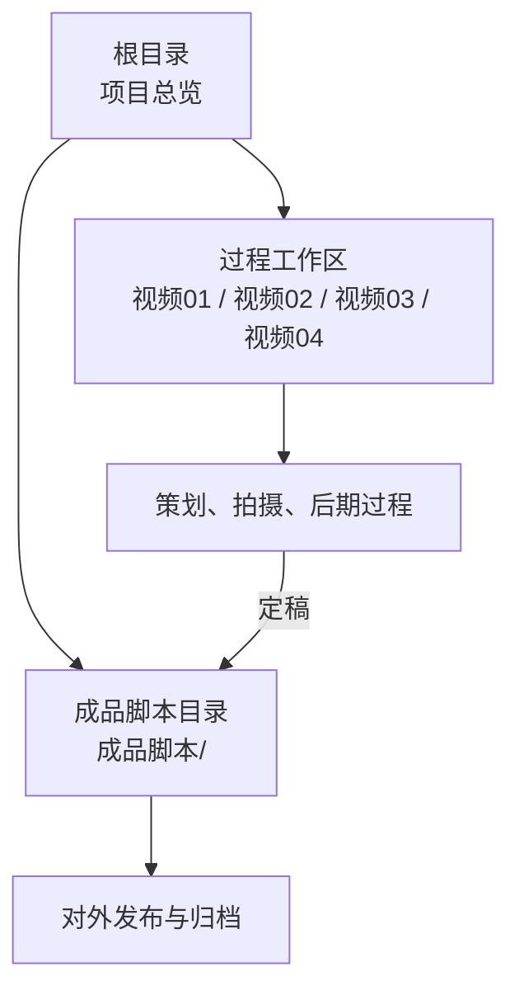
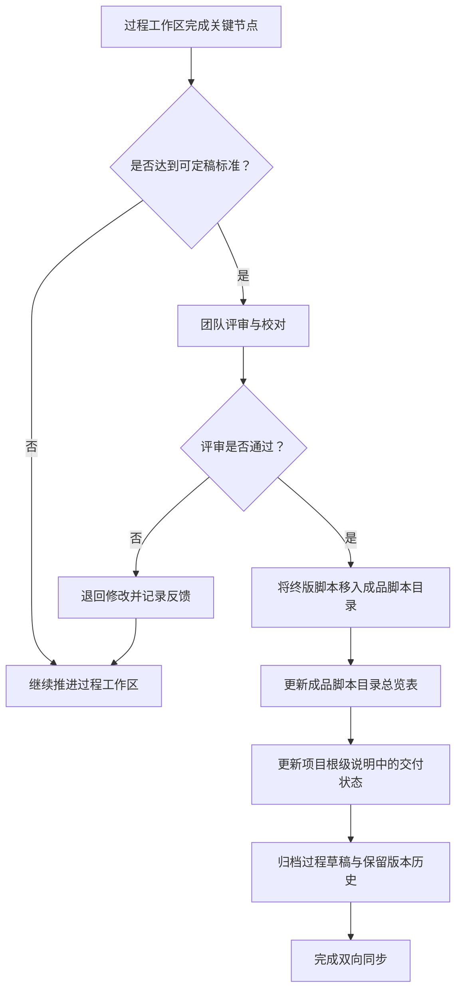

# 成品交付状态总览

<cite>
**本文引用的文件**   
- [README.md](file://README.md)
- [成品脚本/README.md](file://成品脚本/README.md)
</cite>

## 目录
1. [引言](#引言)
2. [项目结构与交付边界](#项目结构与交付边界)
3. [四部视频成品交付状态矩阵](#四部视频成品交付状态矩阵)
4. [状态双向同步机制](#状态双向同步机制)
5. [成品目录归档规范](#成品目录归档规范)
6. [发布前检查清单](#发布前检查清单)
7. [常见问题与处理建议](#常见问题与处理建议)
8. [结论](#结论)

## 引言
本文件基于项目根级说明文档与成品脚本目录说明，汇总浙江省春晖中学 2026 年校运会四部核心产出视频的成品交付状态。目标读者包括策划、摄制、后期剪辑、审核与发布人员，帮助团队统一理解：哪些视频已可对外发布，哪些仍需推进，以及“过程工作区”升级后如何同步更新“成品脚本目录”和“状态矩阵”。

## 项目结构与交付边界
项目采用“过程工作区 + 成品集中归档”的双层结构：

- **过程工作区**：`视频0X_.../` 目录，存放分镜草案、BGM 选型、机位部署、工作记录等临时或阶段性材料。
- **成品脚本目录**：`成品脚本/` 目录，仅存放经团队确认的终版脚本与最终交付说明。
- **根级说明文档**：用于宏观项目导航、四大视频规划、工程目录架构与工作流归档规范。

**图示来源**
- [README.md:29-66](file://README.md#L29-L66)
- [成品脚本/README.md:1-23](file://成品脚本/README.md#L1-L23)

**章节来源**
- [README.md:29-66](file://README.md#L29-L66)
- [成品脚本/README.md:1-23](file://成品脚本/README.md#L1-L23)

## 四部视频成品交付状态矩阵
下表以“序号 + 视频类型 + 最终脚本路径 + 策划状态 + 成品脚本状态 + 负责人员与说明 + 发布渠道”为维度，对四部视频进行完整呈现。其中：

- “已定稿交付”表示该视频的最终脚本已进入 `成品脚本/` 目录，并明确标注为定稿。
- “待定稿”表示策划或制作仍在推进，尚未进入成品脚本目录作为终版。
- “已取消归档”表示该独立视频不再单独发布，但相关素材可能并入其他视频。

| 序号 | 视频类型 | 最终脚本路径 | 策划状态 | 成品脚本状态 | 负责人员与说明 | 发布渠道 |
|---:|---|---|---|---|---|---|
| 01 | 传统校运会高光混剪 | [01_传统高光混剪_最终脚本.md](file:///Users/fuzihao/Desktop/2026SportsMeet/成品脚本/01_传统高光混剪_最终脚本.md) | 已定稿 | **已定稿交付** | 高燃混剪 MV；三段式节奏；按运动项目分类实操拍摄指南 | 官方回放、短视频平台、社团展示（以实际发布为准） |
| 02 | 学生会幕后工作宣传片 | `02_学生会幕后宣传片_最终脚本.md` | 策划案就绪 | **待定稿交付** | 记录检录、记分、器材搬运、广播站、医疗等幕后工作；交由高一同学剪辑支持 | 校内宣传、新媒体社账号（以实际发布为准） |
| 03 | 开幕式全流程多机位实况 | [03_开幕式多机位实况_最终脚本.md](file:///Users/fuzihao/Desktop/2026SportsMeet/成品脚本/03_开幕式多机位实况_最终脚本.md) | 已定稿 | **已定稿交付** | 电视台转播级多机位协同；全班级完整收录；配套 FCP 多机位波形对齐 | 官方直播回放、学校主页、活动存档 |
| 03-附 | 开幕式精彩小混剪 | [03_开幕式精彩小混剪_剪辑思路指南.md](file:///Users/fuzihao/Desktop/2026SportsMeet/成品脚本/03_开幕式精彩小混剪_剪辑思路指南.md) | 已定稿 | **已定稿交付** | 面向社团剪辑同学的快节奏宣发短片；四段式叙事与原声混音思路 | 短视频平台、社团传播、活动预热与回顾 |
| 04 | 男子百米奥运解说短片 | - | 方案就绪 | **已取消归档** | 原计划对标专业电视转播规格；因禁飞与高空透视畸变风险取消独立单片；相关百米竞速素材汇入视频 01 | 不单独发布；相关片段融入视频 01 高光混剪 |

补充说明：

- 根级说明文档将视频 01、03 列为“已定稿交付”，视频 02 为“策划案就绪”，视频 04 为“方案就绪”。
- 成品脚本目录说明则进一步给出更明确的成品归档语义：视频 01、03 及 03-附为“已定稿交付”，视频 02 为“待定稿交付”，视频 04 为“已取消”。

**章节来源**
- [README.md:11-36](file://README.md#L11-L36)
- [成品脚本/README.md:5-18](file://成品脚本/README.md#L5-L18)

## 状态双向同步机制
“过程工作区”与“成品脚本目录”不是两个互不相干的仓库，而是同一套工作流的两个阶段。状态同步规则如下：

### 同步触发条件
当某个视频的过程工作区发生以下变化时，必须触发状态同步：

1. 分镜草案升级为可执行终版脚本。
2. 拍摄方案、机位部署、BGM 选型完成评审并锁定。
3. 后期剪辑完成初剪、精剪与包装验收。
4. 团队内部评审通过，确认定稿版本。
5. 视频从“待定稿”调整为“已定稿交付”或“已取消归档”。

### 同步操作顺序

**图示来源**
- [README.md:67-85](file://README.md#L67-L85)
- [成品脚本/README.md:19-23](file://成品脚本/README.md#L19-L23)

### 责任分工
- **过程工作区负责人**：确保过程文件命名清晰、版本有序、关键决策有记录。
- **策划统筹**：判断是否具备定稿条件，发起评审。
- **后期与审核**：核对脚本与成片一致性，确认版权、隐私、字幕、画幅等要素。
- **文档维护人**：同步更新成品脚本目录总览和项目根级说明。

### 禁止行为
- 不得在成品脚本目录中放置未评审的草稿。
- 不得只移动脚本而不更新状态矩阵。
- 不得在未通知团队的情况下变更视频状态。

**章节来源**
- [README.md:67-85](file://README.md#L67-L85)
- [成品脚本/README.md:19-23](file://成品脚本/README.md#L19-L23)

## 成品目录归档规范
### 基本原则
1. **成品集中归档原则**：`成品脚本/` 目录仅存放经过逐轮校对、推演并由团队最终确认定稿的交付版脚本。
2. **严禁放入的内容**：
   - 草稿、半成品、临时脚本；
   - 未评审的分镜草案；
   - 仅个人备份、无团队确认的版本；
   - 纯音频、原始素材、工程文件；
   - 与最终交付无关的讨论记录。
3. **过程与成品分离**：所有过程性工作留在 `视频0X_.../` 工作区。
4. **命名一致性**：成品脚本文件名应与视频序号、视频类型、版本号保持一致，例如“序号 + 主题 + 最终脚本”。

### 推荐命名格式
- `01_传统高光混剪_最终脚本.md`
- `03_开幕式多机位实况_最终脚本.md`
- `03_开幕式精彩小混剪_剪辑思路指南.md`

### 归档前自检
- 是否已有对应过程工作区？
- 是否已完成团队评审？
- 是否已清理个人隐私信息？
- 是否已确认版权音乐与引用素材授权？
- 是否已在状态矩阵中标注“已定稿交付”？
- 是否已更新项目根级说明中的交付状态？

**章节来源**
- [成品脚本/README.md:1-23](file://成品脚本/README.md#L1-L23)
- [README.md:43-66](file://README.md#L43-L66)

## 发布前检查清单
以下为成品视频发布前的强制检查项。每项均应在视频正式发布前逐项打勾确认。

| 检查类别 | 检查项 | 说明 | 默认要求 |
|---|---|---|---|
| 画幅 | 横屏或竖屏是否与发布渠道一致 | 横屏适合官网、直播回放、长视频平台；竖屏适合抖音、小红书、视频号等移动端短视频 | 按发布渠道确定，并在脚本与导出设置中统一 |
| 分辨率 | 分辨率与帧率是否符合目标平台 | 如 1080p、4K、25fps、30fps、60fps 等 | 至少满足目标平台最低要求；优先保持与拍摄源一致 |
| 字幕校对 | 字幕内容、错别字、人名、职务、成绩是否正确 | 尤其涉及学生姓名、班级、成绩、奖项、解说词 | 至少双人校对，重点字段单独复核 |
| 版权音乐 | BGM 是否取得可用授权 | 商业平台发布需特别注意音乐版权 | 使用已授权音乐或原创音乐，保留授权证明 |
| 隐私信息 | 是否清理身份证号、手机号、家庭住址、非公开名单等 | 校园活动常涉及学生信息与成绩 | 发布前人工排查敏感信息 |
| 画面安全 | 是否存在危险动作、未成年人肖像争议、未经许可场地拍摄 | 航拍、跟拍、特写需谨慎 | 符合学校与安全规定 |
| 文件名 | 成品文件名是否与脚本名、版本号一致 | 便于归档与检索 | 文件名包含序号、主题、版本号 |
| 版本号 | 是否标注 v1.0、v2.0、最终版等 | 避免混淆旧版本与新版本 | 最终发布版本明确标注“最终版” |
| 封面与标题 | 封面图、标题、简介是否与脚本定位一致 | 影响传播效果与检索 | 与视频风格、受众渠道匹配 |
| 元数据与水印 | 是否需要添加台标、水印、演职人员名单 | 官方发布通常需要 | 按学校与媒体规范要求 |
| 导出设置 | 编码、码率、容器、色彩空间是否合理 | 影响画质与兼容性 | 根据发布平台技术栈选择 |
| 回看测试 | 是否在目标设备与平台上播放测试 | 手机、电脑、投影仪表现可能不同 | 至少覆盖手机端与网页端 |

### 横竖屏与分辨率建议
- 横屏主片：适合开幕式实况、官方全景、长视频平台。
- 竖屏爆款：适合单项高光、破纪录瞬间、短视频平台。
- 多端适配：若需同时发布横竖屏，应分别导出对应画幅版本，而不是简单拉伸裁剪。

### 版权与隐私注意事项
- 背景音乐、字体、特效素材需确认授权范围。
- 涉及学生出镜时，应避免泄露隐私信息。
- 航拍、场地拍摄需遵守学校与空域管理要求。

**章节来源**
- [成品脚本/README.md:19-23](file://成品脚本/README.md#L19-L23)
- [README.md:67-85](file://README.md#L67-L85)

## 常见问题与处理建议
### 问题一：过程工作区已更新，但成品目录未同步
**现象**：分镜或脚本在工作区已调整，但 `成品脚本/` 中仍是旧版本。  
**处理**：
1. 停止直接复制粘贴覆盖。
2. 先完成团队评审。
3. 将新版本正式移入 `成品脚本/`。
4. 更新成品脚本目录总览表。
5. 更新项目根级说明中的交付状态。

### 问题二：视频 04 已取消，为什么还存在相关素材
**现象**：视频 04 独立单片已取消，但百米竞速素材仍存在。  
**解释**：根据成品脚本目录说明，视频 04 因禁飞与高空透视畸变风险取消独立单片，相关百米竞速素材全量汇入视频 01 高光混剪。因此，不应再以“视频 04 未完成”为由阻塞视频 01 的发布。

### 问题三：视频 02 长期处于“待定稿”
**现象**：学生会幕后宣传片迟迟未定稿。  
**处理**：
1. 明确策划草案是否已评审。
2. 确认高一协助摄制组是否已接手剪辑任务。
3. 设定下一步截止时间。
4. 在状态矩阵中更新具体卡点原因与责任人。

### 问题四：成品目录出现草稿
**现象**：`成品脚本/` 中出现带“草案”“草稿”“临时”字样的文件。  
**处理**：立即移出至对应过程工作区，并清理成品目录；仅在团队确认后重新归档终版。

**章节来源**
- [成品脚本/README.md:5-23](file://成品脚本/README.md#L5-L23)
- [README.md:11-36](file://README.md#L11-L36)

## 结论
本项目已形成清晰的“过程工作区 + 成品脚本目录”双轨结构。截至当前信息：

- **已定稿交付**：视频 01 传统高光混剪、视频 03 开幕式多机位实况及其精彩小混剪。
- **待定稿交付**：视频 02 学生会幕后宣传片。
- **已取消归档**：视频 04 男子百米奥运解说短片，相关素材已并入视频 01。

后续任何过程工作区的重大进展，都应触发“状态双向同步”：既更新成品脚本目录总览，也更新项目根级说明中的交付状态。发布前必须严格执行横竖屏、分辨率、字幕、版权、隐私、文件名与版本号等检查，确保对外发布的成品安全、合规、可追溯。