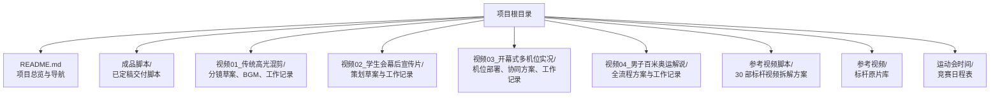
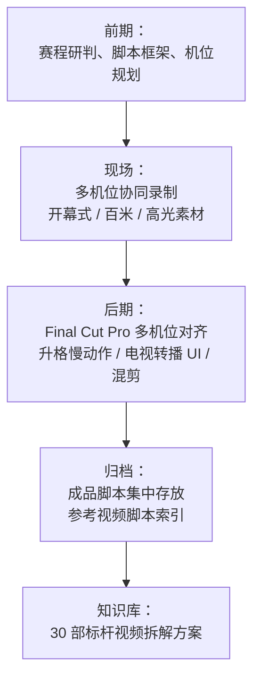
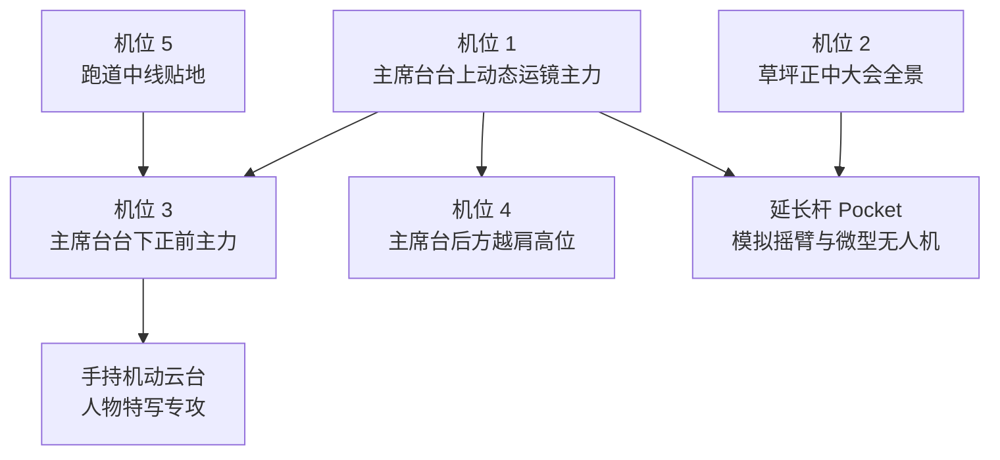
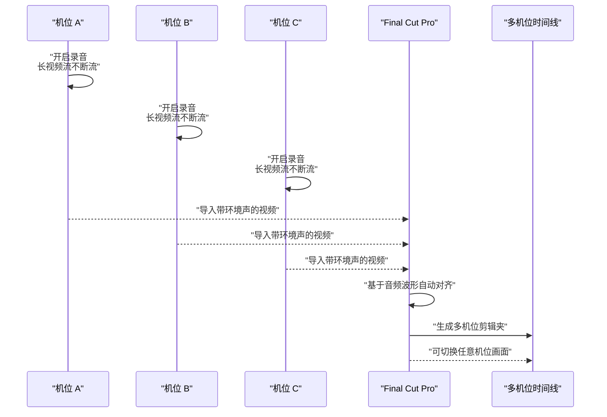
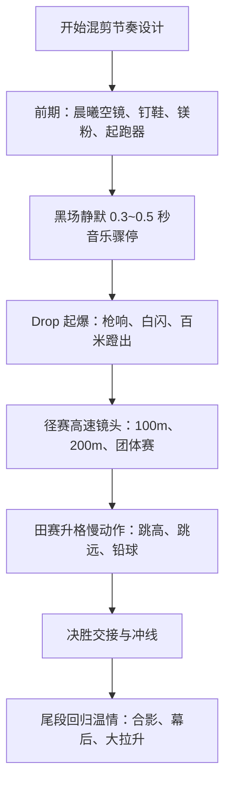
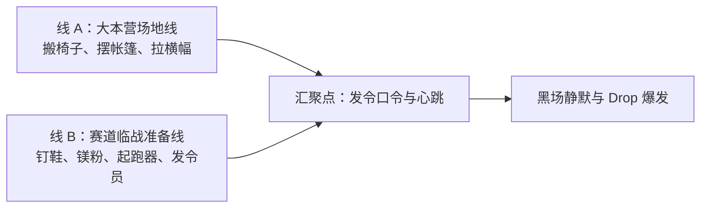
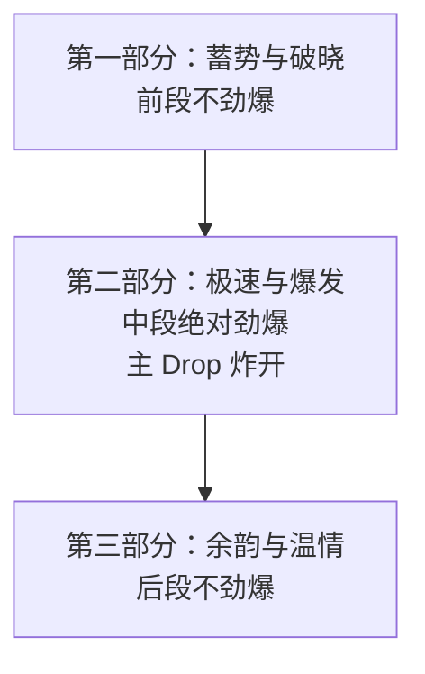
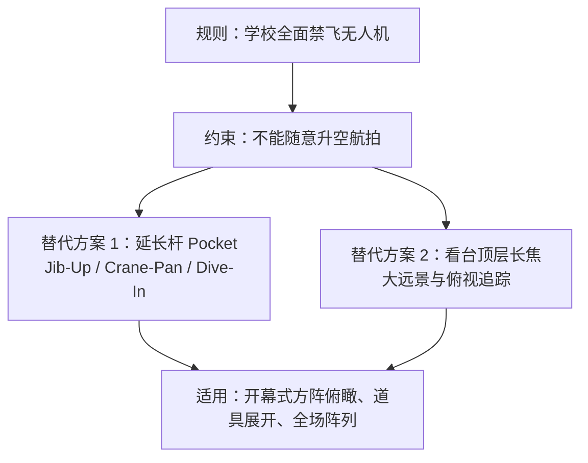
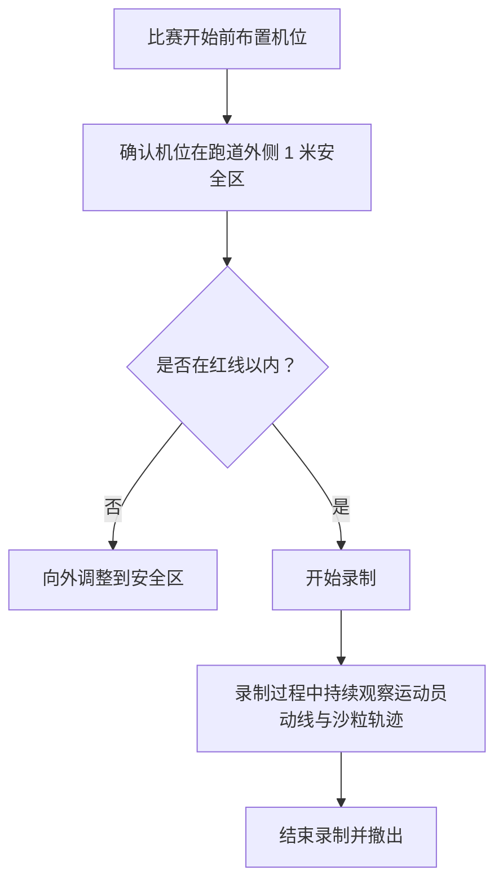
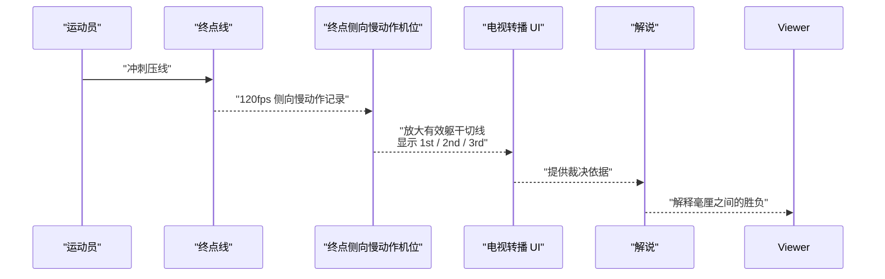

# 术语与基础知识

<cite>
**本文引用的文件**
- [README.md](file://README.md)
- [参考视频脚本/README.md](file://参考视频脚本/README.md)
- [成品脚本/README.md](file://成品脚本/README.md)
- [成品脚本/01_传统高光混剪_最终脚本.md](file://成品脚本/01_传统高光混剪_最终脚本.md)
- [视频01_传统高光混剪/BGM视听结构与黑场转折设计说明.md](file://视频01_传统高光混剪/BGM视听结构与黑场转折设计说明.md)
- [成品脚本/03_开幕式多机位实况_最终脚本.md](file://成品脚本/03_开幕式多机位实况_最终脚本.md)
- [视频03_开幕式多机位实况/开幕式多机位协同与实况方案.md](file://视频03_开幕式多机位实况/开幕式多机位协同与实况方案.md)
- [视频03_开幕式多机位实况/开幕式现场机位部署与拍摄执行手册.md](file://视频03_开幕式多机位实况/开幕式现场机位部署与拍摄执行手册.md)
- [成品脚本/03_开幕式精彩小混剪_剪辑思路指南.md](file://成品脚本/03_开幕式精彩小混剪_剪辑思路指南.md)
- [视频04_男子百米奥运解说/男子百米奥运解说短片_全流程方案.md](file://视频04_男子百米奥运解说/男子百米奥运解说短片_全流程方案.md)
</cite>

## 目录
1. [引言](#引言)
2. [项目结构总览](#项目结构总览)
3. [核心术语对照表](#核心术语对照表)
4. [架构与工作流概览](#架构与工作流概览)
5. [关键概念详解](#关键概念详解)
6. [初学者阅读顺序建议](#初学者阅读顺序建议)
7. [常见误区与排错提示](#常见误区与排错提示)
8. [结语](#结语)

## 引言
本仓库是浙江省春晖中学 2026 年校运会官方视听内容制作工程，涵盖赛程研判、现场多机位调度、分镜头脚本撰写、后期剪辑包装与成品归档。对非技术背景的团队成员来说，最重要的不是记住软件按钮，而是理解“为什么要这样拍”和“这些专业词在片子里起什么作用”。

本项目包含四部核心产出：传统高光混剪、学生会幕后宣传片、开幕式多机位实况、男子百米奥运解说风格短片；其中开幕式多机位实况与传统高光混剪已定稿交付，男子百米奥运解说因禁飞与高空透视风险取消独立单片，相关素材汇入传统高光混剪。

**章节来源**
- [README.md:1-85](file://README.md#L1-L85)
- [成品脚本/README.md:1-23](file://成品脚本/README.md#L1-L23)

## 项目结构总览
仓库按“成品脚本 + 过程工作区 + 参考视频脚本 + 赛事时间”组织：

**图示来源**
- [README.md:35-85](file://README.md#L35-L85)

**章节来源**
- [README.md:35-85](file://README.md#L35-L85)

## 核心术语对照表
下面用通俗语言解释项目中反复出现的专业概念，并标注它们在哪个视频或哪份文档中实际落地。

| 术语 | 通俗定义 | 在本项目中的具体场景 | 常见误区 | 简化示例 |
|---|---|---|---|---|
| 多机位录制 | 同时用多个相机从不同位置录同一件事，像多人同时看一场演出。 | 开幕式用 5 路定点机位加手持机动云台和延长杆 Pocket，完整记录每个班级进场和表演。 | 以为多机位就是“随便拿几个手机拍”，但实际需要统一帧率、白平衡和持续录音才能对齐。 | 主席台主机位拍全景，台下正面拍笑脸，跑道中线贴地拍脚步，航拍或长杆拍阵列。 |
| Final Cut Pro 多机位波形对齐 | 剪辑软件根据各机位录到的声音波形自动把画面和时间点对齐。 | 开幕式要求尽量长录不断流，所有机位开启麦克风，后期用 Final Cut Pro 的音频波形一次性全量对齐。 | 以为只要画面差不多就能对齐；实际上如果分段太多、录音太短或环境声差异太大，对齐会失败。 | 一个班级从进场到退场连续录制，而不是每走几步就按停再开机。 |
| 升格慢动作 | 用比正常播放更高的帧率录制，回放时变慢，用于突出瞬间力量、表情或细节。 | 传统高光混剪大量使用 120fps 等升格表现跳高过杆、沙坑飞沙、铅球出手等爆发瞬间。 | 把所有镜头都做成慢动作，会导致节奏拖沓；升格应与快切形成动静对比。 | 起跑后正常速度冲刺，过杆瞬间突然放慢，让观众看清身体反弓和横杆微颤。 |
| 双线交错平行蒙太奇 | 两条故事线交替出现，最后汇合产生更强情绪。 | 传统高光混剪前段同时展示“大本营搬椅布场线”和“赛道选手热身线”，随后汇聚成发令枪响。 | 以为是“两条线各自剪完再拼在一起”，其实是交叉剪辑，让两条线互相推动情绪。 | 一边同学摆椅子拉横幅，一边钉鞋系紧、镁粉飞扬，最后一起听到“预备——”。 |
| Drop 段落 | 音乐主歌推进后突然进入的高能量副歌或电子旋律爆发点。 | 传统高光混剪以黑场静默过渡到主 Drop，配合枪响、白闪、百米蹬地与田赛力量爆发。 | 以为 Drop 只是“音量变大”，它其实是整首歌情绪结构的转折点。 | 安静准备 → 黑场 0.4 秒 → 电音炸开 → 画面加速卡点。 |
| Drop 段落与传统高光混剪的情绪曲线 | 混剪不是全程高能，而是三段式：先蓄势，再爆发，最后回归温情。 | 视频一明确采用“蓄势破晓 → 全域狂飙 → 青春温情”三段式情感弧线。 | 误以为高燃混剪就要从头到尾猛冲，结果没有呼吸感。 | 前半段安静铺垫，中段 Drop 全开，尾段鼓点退场回到吉他与合影定格。 |
| 延长杆加 Pocket 云台替代航拍 | 用 3~4 米伸缩杆固定小型云台相机，模拟无人机或摇臂的高空俯拍视角。 | 开幕式与百米方案均强调禁飞无人机，改用延长杆 Pocket 做垂直升空、弧形环视和俯冲跟入。 | 以为延长杆就是“举高手机随便拍”，实际需要稳定器、平滑推拉和正确俯仰角度。 | 队伍站定时把长杆从胸口推到头顶，画面从单人特写拉升为全班几何阵列俯瞰。 |
| 安全缓冲区 | 机位与运动员之间保留的安全距离，避免碰撞、干扰比赛或被踢起的沙粒砸到设备。 | 百米外侧低角度跟跑机位沿跑道外侧 1 米安全区移动；开幕式机动云台沿跑道外缘轻步小跑。 | 为了贴近效果直接冲进跑道内，既危险又可能影响裁判判罚。 | 稳定器手贴着跑道外边缘小跑，不进入分道线内侧。 |
| 跑道外沿 1 米红线 | 机位不得越过跑道外沿向内超过 1 米的物理限制线，属于安全与拍摄纪律红线。 | 百米三场总决赛机位布局明确标注“跑道外侧 1 米安全区”。 | 认为“只要不被抓到就行”，实际上这是安全红线，也是素材可用性的前提。 | 站在红色跑道最外圈附近，而不是踩进白色分道线。 |
| Photo Finish 鹰眼判定 | 终点垂直或侧向慢动作摄像机，用来精确判断谁先压线。 | 男子百米奥运解说方案中设置终点侧向慢动作判定点，并在包装中加入有效躯干切线和名次标记。 | 以为任何慢动作都能当成绩判定，实际上需要正对终点线、高帧率且画面稳定。 | 放大撞线瞬间，用像素标尺比较胸廓是否先触及终点垂直面。 |

**章节来源**
- [视频03_开幕式多机位实况/开幕式现场机位部署与拍摄执行手册.md:1-168](file://视频03_开幕式多机位实况/开幕式现场机位部署与拍摄执行手册.md#L1-L168)
- [视频01_传统高光混剪/BGM视听结构与黑场转折设计说明.md:1-69](file://视频01_传统高光混剪/BGM视听结构与黑场转折设计说明.md#L1-L69)
- [成品脚本/01_传统高光混剪_最终脚本.md:1-92](file://成品脚本/01_传统高光混剪_最终脚本.md#L1-L92)
- [成品脚本/03_开幕式多机位实况_最终脚本.md:1-157](file://成品脚本/03_开幕式多机位实况_最终脚本.md#L1-L157)
- [视频04_男子百米奥运解说/男子百米奥运解说短片_全流程方案.md:1-77](file://视频04_男子百米奥运解说/男子百米奥运解说短片_全流程方案.md#L1-L77)

## 架构与工作流概览
项目整体分为四个阶段：前期赛程研判与脚本、现场多机位拍摄、后期剪辑包装、成品归档与参考库建设。

**图示来源**
- [README.md:1-85](file://README.md#L1-L85)
- [参考视频脚本/README.md:1-82](file://参考视频脚本/README.md#L1-L82)

**章节来源**
- [README.md:1-85](file://README.md#L1-L85)
- [参考视频脚本/README.md:1-82](file://参考视频脚本/README.md#L1-L82)

## 关键概念详解

### 多机位录制与开幕式现场机位体系
开幕式采用 5 路核心定点机位加 1 路手持机动云台，以及延长杆 Pocket 作为高空替代视角。其目标是保证每个班级的完整入场、定点展演和高光人物特写都不遗漏。

**图示来源**
- [成品脚本/03_开幕式多机位实况_最终脚本.md:1-157](file://成品脚本/03_开幕式多机位实况_最终脚本.md#L1-L157)
- [视频03_开幕式多机位实况/开幕式现场机位部署与拍摄执行手册.md:1-168](file://视频03_开幕式多机位实况/开幕式现场机位部署与拍摄执行手册.md#L1-L168)

要点包括：
- 机位 1 负责直道远端到主席台的完整行进跟摇，并在下一个班级即将进场时提前复位。
- 机位 3 是台前表演的主力定拍，捕捉笑容、口号口型和道具动作。
- 延长杆 Pocket 提供 Jib-Up、Crane-Pan、Dive-In 等模拟摇臂与航拍视角。
- 手持机动云台专注举牌员、领舞、班主任和特色道具的手部特写。

**章节来源**
- [成品脚本/03_开幕式多机位实况_最终脚本.md:1-157](file://成品脚本/03_开幕式多机位实况_最终脚本.md#L1-L157)
- [视频03_开幕式多机位实况/开幕式现场机位部署与拍摄执行手册.md:1-168](file://视频03_开幕式多机位实况/开幕式现场机位部署与拍摄执行手册.md#L1-L168)

### Final Cut Pro 多机位波形对齐
多机位素材能否顺利对齐，取决于三个现实条件：
1. 所有机位尽量长录，不要每个班级频繁按停；
2. 所有机位开启机载麦克风或外接麦克风收录现场声音；
3. 统一分辨率、帧率和白平衡，减少色彩和时间基准偏差。

**图示来源**
- [成品脚本/03_开幕式多机位实况_最终脚本.md:1-157](file://成品脚本/03_开幕式多机位实况_最终脚本.md#L1-L157)
- [视频03_开幕式多机位实况/开幕式现场机位部署与拍摄执行手册.md:1-168](file://视频03_开幕式多机位实况/开幕式现场机位部署与拍摄执行手册.md#L1-L168)

常见失败原因：
- 分段过多，导致波形片段无法拼接；
- 某个机位根本没录音或静音；
- 机位之间环境声差异过大，找不到共同波形特征；
- 白平衡和帧率不一致，造成色彩漂移或时序错位。

**章节来源**
- [成品脚本/03_开幕式多机位实况_最终脚本.md:1-157](file://成品脚本/03_开幕式多机位实况_最终脚本.md#L1-L157)
- [视频03_开幕式多机位实况/开幕式现场机位部署与拍摄执行手册.md:1-168](file://视频03_开幕式多机位实况/开幕式现场机位部署与拍摄执行手册.md#L1-L168)

### 升格慢动作与传统高光混剪的节奏关系
升格慢动作不是单纯“拍得慢”，而是用来制造“速度与静止”的反差。项目中的传统高光混剪明确使用 120fps 等极慢升格表现跳高背越、跳远沙坑、铅球出手等瞬间，并与快速径赛镜头形成节奏对比。

**图示来源**
- [视频01_传统高光混剪/BGM视听结构与黑场转折设计说明.md:1-69](file://视频01_传统高光混剪/BGM视听结构与黑场转折设计说明.md#L1-L69)
- [成品脚本/01_传统高光混剪_最终脚本.md:1-92](file://成品脚本/01_传统高光混剪_最终脚本.md#L1-L92)

为什么需要升格：
- 人类肉眼很难看清肌肉发力、沙粒飞溅、横杆微颤；
- 升格能把一瞬间拉长，让观众感受到力量与滞空；
- 升格必须与正常速度镜头搭配，否则整片会变成慢动作录像。

**章节来源**
- [视频01_传统高光混剪/BGM视听结构与黑场转折设计说明.md:1-69](file://视频01_传统高光混剪/BGM视听结构与黑场转折设计说明.md#L1-L69)
- [成品脚本/01_传统高光混剪_最终脚本.md:1-92](file://成品脚本/01_传统高光混剪_最终脚本.md#L1-L92)

### 双线交错平行蒙太奇
双线交错平行蒙太奇是把两条叙事线交替呈现，让它们互相推进情绪，最后在某个节点汇合。项目传统高光混剪的前半段同时展示两条线：
- 大本营场地线：搬椅子、摆帐篷、拉横幅；
- 赛道临战准备线：钉鞋、镁粉、起跑器、发令员。

**图示来源**
- [成品脚本/01_传统高光混剪_最终脚本.md:1-92](file://成品脚本/01_传统高光混剪_最终脚本.md#L1-L92)

常见误区：
- 以为“双线”就是两个视频并列播放；
- 以为两条线要完全一样时长，其实重点是交叉节奏和情绪汇聚；
- 忽视交汇点的声音设计，比如发令口令、心跳、军鼓爬坡。

**章节来源**
- [成品脚本/01_传统高光混剪_最终脚本.md:1-92](file://成品脚本/01_传统高光混剪_最终脚本.md#L1-L92)

### Drop 段落与传统高光混剪的情绪曲线
Drop 段落是整首音乐从“积累”转向“释放”的关键转折点。项目传统高光混剪采用三段式情绪曲线：
- 前段不劲爆：积蓄力量；
- 中段绝对劲爆：Drop 展开；
- 后段不劲爆：回归温情与定格。

**图示来源**
- [成品脚本/01_传统高光混剪_最终脚本.md:1-92](file://成品脚本/01_传统高光混剪_最终脚本.md#L1-L92)

Drop 段落的作用：
- 打破前摇听觉惯性；
- 把静默期待转化为视觉冲击；
- 通过项目形态分幕（径赛、田赛、接力）避免长时间单一节奏疲劳。

**章节来源**
- [视频01_传统高光混剪/BGM视听结构与黑场转折设计说明.md:1-69](file://视频01_传统高光混剪/BGM视听结构与黑场转折设计说明.md#L1-L69)
- [成品脚本/01_传统高光混剪_最终脚本.md:1-92](file://成品脚本/01_传统高光混剪_最终脚本.md#L1-L92)

### 延长杆加 Pocket 云台替代航拍
由于校方全面禁飞无人机，项目多次强调用“延长杆 + Pocket 云台”和“看台顶层长焦”替代航拍，实现类似摇臂和微型无人机的视角。

**图示来源**
- [成品脚本/01_传统高光混剪_最终脚本.md:1-92](file://成品脚本/01_传统高光混剪_最终脚本.md#L1-L92)
- [视频04_男子百米奥运解说/男子百米奥运解说短片_全流程方案.md:1-77](file://视频04_男子百米奥运解说/男子百米奥运解说短片_全流程方案.md#L1-L77)
- [视频03_开幕式多机位实况/开幕式现场机位部署与拍摄执行手册.md:1-168](file://视频03_开幕式多机位实况/开幕式现场机位部署与拍摄执行手册.md#L1-L168)

为什么不用无人机：
- 学校安全规定禁止飞行；
- 高空透视畸变和空域风险；
- 地面机位组合更能控制画面稳定性和构图精度。

**章节来源**
- [成品脚本/01_传统高光混剪_最终脚本.md:1-92](file://成品脚本/01_传统高光混剪_最终脚本.md#L1-L92)
- [视频04_男子百米奥运解说/男子百米奥运解说短片_全流程方案.md:1-77](file://视频04_男子百米奥运解说/男子百米奥运解说短片_全流程方案.md#L1-L77)
- [视频03_开幕式多机位实况/开幕式现场机位部署与拍摄执行手册.md:1-168](file://视频03_开幕式多机位实况/开幕式现场机位部署与拍摄执行手册.md#L1-L168)

### 安全缓冲区与跑道外沿 1 米红线
百米方案中明确将“跑道外侧 1 米安全区”作为机位边界，目的是防止摄影师干扰运动员、被钉鞋或沙粒伤到设备，也避免影响裁判判罚。

**图示来源**
- [视频04_男子百米奥运解说/男子百米奥运解说短片_全流程方案.md:1-77](file://视频04_男子百米奥运解说/男子百米奥运解说短片_全流程方案.md#L1-L77)

注意事项：
- 安全区不是建议，而是安全红线；
- 即使是稳定器跟拍，也不能为了贴近而进入分道线内侧；
- 跑道外沿 1 米红线同样适用于开幕式机动云台沿跑道外缘轻步小跑的走位规范。

**章节来源**
- [视频04_男子百米奥运解说/男子百米奥运解说短片_全流程方案.md:1-77](file://视频04_男子百米奥运解说/男子百米奥运解说短片_全流程方案.md#L1-L77)
- [成品脚本/03_开幕式多机位实况_最终脚本.md:1-157](file://成品脚本/03_开幕式多机位实况_最终脚本.md#L1-L157)

### Photo Finish 鹰眼判定
Photo Finish 鹰眼判定是体育转播中用来判断“谁先压线”的技术手段。项目中男子百米奥运解说方案设置了终点侧向慢动作判定点，并通过电视转播 UI 加入垂直像素参考标尺、有效躯干切线和名次标记。

**图示来源**
- [视频04_男子百米奥运解说/男子百米奥运解说短片_全流程方案.md:1-77](file://视频04_男子百米奥运解说/男子百米奥运解说短片_全流程方案.md#L1-L77)

关键点：
- 判定的不是脚，而是有效躯干触及终点垂直面的瞬间；
- 需要高帧率、稳定三脚架或延长杆、正切终点白线的机位；
- 包装 UI 帮助观众理解毫秒级差距。

**章节来源**
- [视频04_男子百米奥运解说/男子百米奥运解说短片_全流程方案.md:1-77](file://视频04_男子百米奥运解说/男子百米奥运解说短片_全流程方案.md#L1-L77)

## 初学者阅读顺序建议
对于非技术背景成员，建议按以下顺序阅读，避免一开始就被机位图、时码表和广播 UI 淹没：

1. **先看项目总览**：读 [README.md](file://README.md)，了解四大核心产出、团队职责和工程目录。
2. **再看成品脚本清单**：读 [成品脚本/README.md](file://成品脚本/README.md)，知道哪些视频已定稿、哪些取消、哪些由社团同学负责。
3. **接着读术语**：重点掌握多机位录制、Final Cut Pro 波形对齐、升格慢动作、双线交错平行蒙太奇、Drop 段落、延长杆替代航拍、安全缓冲区和 Photo Finish 鹰眼。
4. **然后进入具体视频工作区**：
   - 开幕式多机位实况：先看 [开幕式多机位协同与实况方案.md](file://视频03_开幕式多机位实况/开幕式多机位协同与实况方案.md)，再看 [开幕式现场机位部署与拍摄执行手册.md](file://视频03_开幕式多机位实况/开幕式现场机位部署与拍摄执行手册.md)。
   - 传统高光混剪：先看 [BGM视听结构与黑场转折设计说明.md](file://视频01_传统高光混剪/BGM视听结构与黑场转折设计说明.md)，再看 [最终脚本](file://成品脚本/01_传统高光混剪_最终脚本.md)。
   - 开幕式精彩小混剪：看 [剪辑思路指南.md](file://成品脚本/03_开幕式精彩小混剪_剪辑思路指南.md)。
   - 男子百米奥运解说：看 [全流程方案.md](file://视频04_男子百米奥运解说/男子百米奥运解说短片_全流程方案.md)。
5. **最后参考标杆视频脚本**：打开 [参考视频脚本/README.md](file://参考视频脚本/README.md)，理解 30 部标杆视频的拆解维度，包括拍摄思路、旁白思路、分镜思路和实操建议。

**章节来源**
- [README.md:1-85](file://README.md#L1-L85)
- [成品脚本/README.md:1-23](file://成品脚本/README.md#L1-L23)
- [视频03_开幕式多机位实况/开幕式多机位协同与实况方案.md:1-75](file://视频03_开幕式多机位实况/开幕式多机位协同与实况方案.md#L1-L75)
- [视频03_开幕式多机位实况/开幕式现场机位部署与拍摄执行手册.md:1-168](file://视频03_开幕式多机位实况/开幕式现场机位部署与拍摄执行手册.md#L1-L168)
- [视频01_传统高光混剪/BGM视听结构与黑场转折设计说明.md:1-69](file://视频01_传统高光混剪/BGM视听结构与黑场转折设计说明.md#L1-L69)
- [成品脚本/01_传统高光混剪_最终脚本.md:1-92](file://成品脚本/01_传统高光混剪_最终脚本.md#L1-L92)
- [成品脚本/03_开幕式精彩小混剪_剪辑思路指南.md:1-92](file://成品脚本/03_开幕式精彩小混剪_剪辑思路指南.md#L1-L92)
- [视频04_男子百米奥运解说/男子百米奥运解说短片_全流程方案.md:1-77](file://视频04_男子百米奥运解说/男子百米奥运解说短片_全流程方案.md#L1-L77)
- [参考视频脚本/README.md:1-82](file://参考视频脚本/README.md#L1-L82)

## 常见误区与排错提示
| 问题 | 现象 | 原因 | 解决思路 |
|---|---|---|---|
| 多机位对不齐 | 画面来回跳，声音不同步 | 分段太多、录音太短、机位间环境声差异大 | 尽量长录不断流；所有机位开启麦克风；后期优先用 Final Cut Pro 音频波形对齐 |
| 开幕式漏掉某些班级 | 有些班级镜头一闪而过 | 机位只拍局部或切换不及时 | 遵循“保全黄金 15 秒”切换模板；机位 1 提前复位盲操 |
| 慢动作看起来拖沓 | 整片都是慢动作，没有节奏 | 过度依赖升格，缺少正常速度和快切 | 用升格表现瞬间力量，其余保持正常速度或加速推进 |
| 延长杆画面抖动 | 高空视角不稳 | 手动举高无稳定器或推拉过快 | 使用 Pocket 云台，配合 App 遥控，平滑推举、横移和俯仰 |
| 机位影响比赛 | 裁判警告或运动员避让 | 机位进入跑道内或安全缓冲区不足 | 严格保持在跑道外沿 1 米安全区 |
| 鹰眼判定看不清 | 回放模糊或角度错误 | 机位未正切终点线、帧率不够或画面抖动 | 使用 120fps 侧向慢动作机位，固定三脚架或延长杆，正对终点白线 |

**章节来源**
- [成品脚本/03_开幕式多机位实况_最终脚本.md:1-157](file://成品脚本/03_开幕式多机位实况_最终脚本.md#L1-L157)
- [视频03_开幕式多机位实况/开幕式现场机位部署与拍摄执行手册.md:1-168](file://视频03_开幕式多机位实况/开幕式现场机位部署与拍摄执行手册.md#L1-L168)
- [视频01_传统高光混剪/BGM视听结构与黑场转折设计说明.md:1-69](file://视频01_传统高光混剪/BGM视听结构与黑场转折设计说明.md#L1-L69)
- [视频04_男子百米奥运解说/男子百米奥运解说短片_全流程方案.md:1-77](file://视频04_男子百米奥运解说/男子百米奥运解说短片_全流程方案.md#L1-L77)

## 结语
对非技术背景成员来说，这个仓库最核心的价值不是软件操作，而是“用多机位还原真实事件，用升格展现运动力量，用 Drop 和双线蒙太奇制造情绪，用安全规则和摄影纪律保障素材可用”。先把术语和项目结构搞懂，再进入具体视频工作区，能大幅降低沟通成本和返工概率。