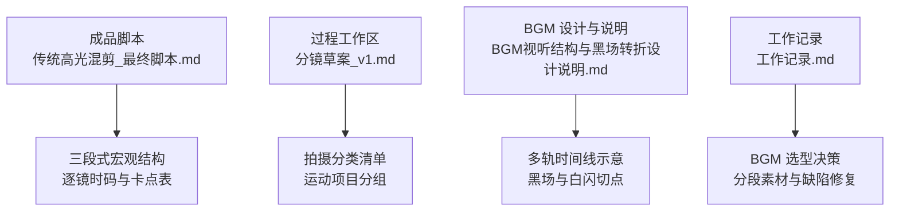
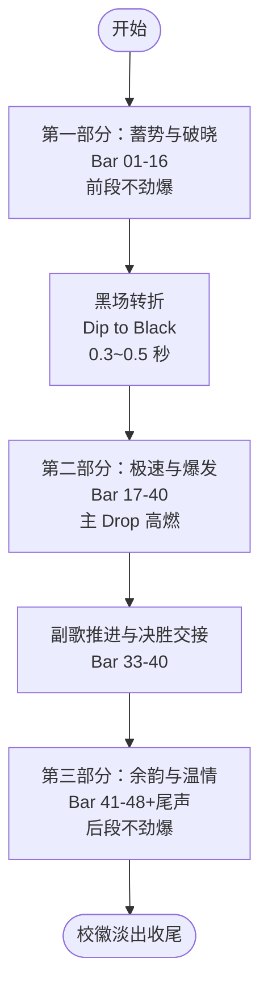
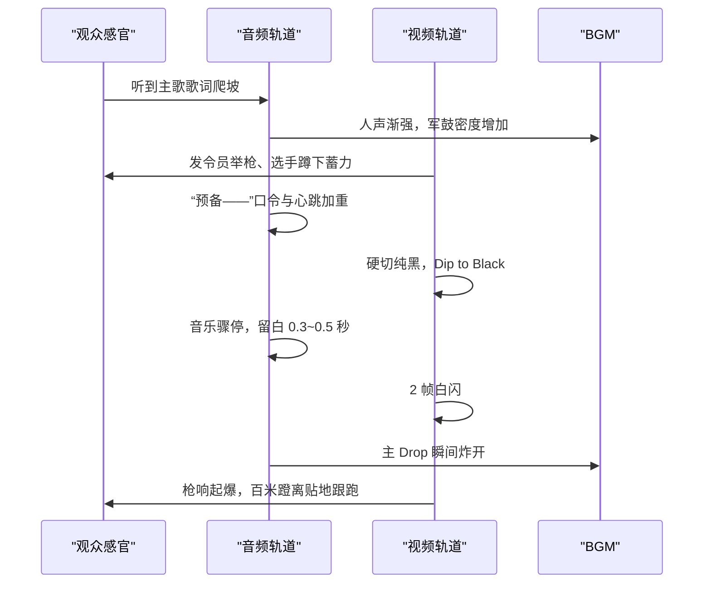
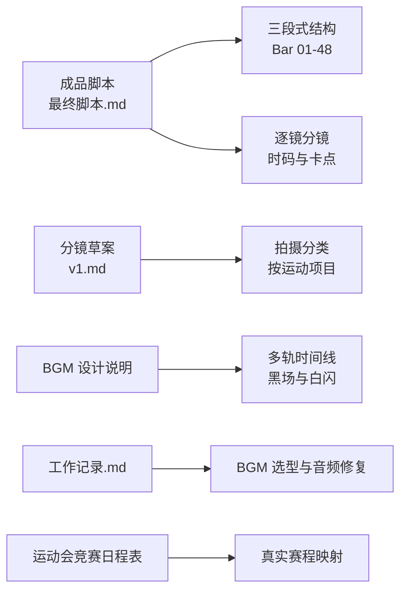
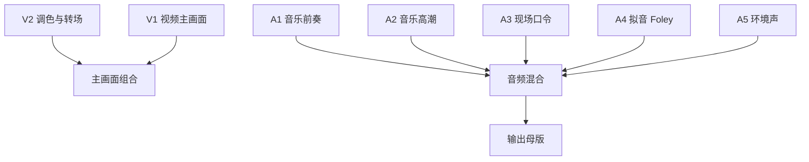
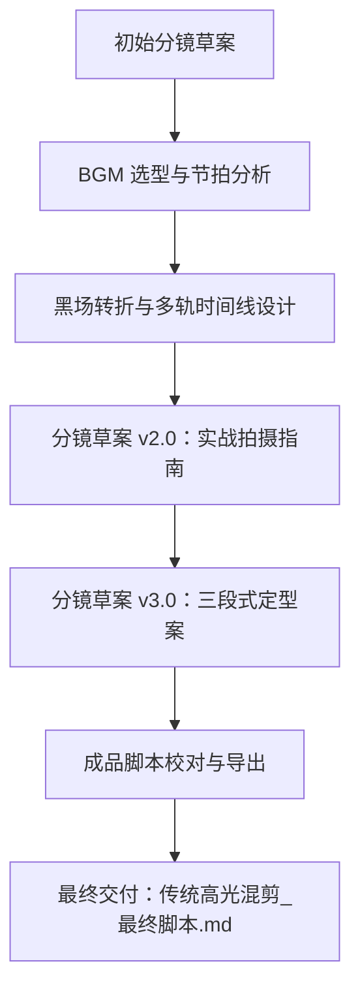

# 视频一：传统高光混剪

<cite>
**本文引用的文件**   
- [成品脚本/01_传统高光混剪_最终脚本.md](file://成品脚本/01_传统高光混剪_最终脚本.md)
- [视频01_传统高光混剪/BGM视听结构与黑场转折设计说明.md](file://视频01_传统高光混剪/BGM视听结构与黑场转折设计说明.md)
- [视频01_传统高光混剪/分镜草案_v1.md](file://视频01_传统高光混剪/分镜草案_v1.md)
- [视频01_传统高光混剪/工作记录.md](file://视频01_传统高光混剪/工作记录.md)
</cite>

## 目录
1. [引言](#引言)
2. [项目结构](#项目结构)
3. [核心组件](#核心组件)
4. [架构总览](#架构总览)
5. [详细组件分析](#详细组件分析)
6. [依赖关系分析](#依赖关系分析)
7. [性能与节奏特性](#性能与节奏特性)
8. [实操拍摄指南](#实操拍摄指南)
9. [后期剪辑建议](#后期剪辑建议)
10. [过程工作区与评审迭代流程](#过程工作区与评审迭代流程)
11. [故障排查与安全红线](#故障排查与安全红线)
12. [结论](#结论)

## 引言
本文件为《传统校运会高光混剪 MV》（视频一）的完整制作文档。该作品定位为浙江省春晖中学 2026 年校运会官方高燃混剪，成片时长约 95 秒，以 124 BPM 音乐为基础构建三段式情感曲线：前段不劲爆、中段绝对劲爆、后段回归温情。开篇采用双线交错平行蒙太奇，在“大本营场地准备线”与“赛道赛前准备线”之间切换；随后通过黑场转折制造强烈情绪停顿，再于 Drop 段落展开高燃表达。全片围绕田径短跑、接力、跳高、跳远、铅球以及团体特色项目等视觉元素组织节奏，并通过 BGM 的声学结构完成多幕叙事转换。

## 项目结构
视频一的资料主要分布在三个位置：成品脚本、过程工作区与音频设计说明。

**图示来源**
- [成品脚本/01_传统高光混剪_最终脚本.md:1-40](file://成品脚本/01_传统高光混剪_最终脚本.md#L1-L40)
- [视频01_传统高光混剪/分镜草案_v1.md:1-40](file://视频01_传统高光混剪/分镜草案_v1.md#L1-L40)
- [视频01_传统高光混剪/BGM视听结构与黑场转折设计说明.md:1-40](file://视频01_传统高光混剪/BGM视听结构与黑场转折设计说明.md#L1-L40)
- [视频01_传统高光混剪/工作记录.md:1-40](file://视频01_传统高光混剪/工作记录.md#L1-L40)

**章节来源**
- [成品脚本/01_传统高光混剪_最终脚本.md:1-40](file://成品脚本/01_传统高光混剪_最终脚本.md#L1-L40)
- [视频01_传统高光混剪/分镜草案_v1.md:1-40](file://视频01_传统高光混剪/分镜草案_v1.md#L1-L40)
- [视频01_传统高光混剪/BGM视听结构与黑场转折设计说明.md:1-40](file://视频01_传统高光混剪/BGM视听结构与黑场转折设计说明.md#L1-L40)
- [视频01_传统高光混剪/工作记录.md:1-40](file://视频01_传统高光混剪/工作记录.md#L1-L40)

## 核心组件
视频一的核心由四类组件构成：

| 组件 | 职责 | 关键产出 |
|---|---|---|
| 成品脚本 | 定义正式成片结构、三段式情感曲线、逐镜时码与卡点指引 | 可交付的最终分镜与执行依据 |
| 分镜草案 | 记录从初稿到 v3.0 的实战定型方案，包含拍摄分类与机动提示 | 拍摄与替换参考，允许现场自由替换画面 |
| BGM 设计说明 | 拆解《Vicetone - Nevada》的段落功能、黑场转折与多轨排布 | 剪辑软件时间线结构与转场策略 |
| 工作记录 | 记录选曲决策、音频切片修复、结构重构与下一步计划 | 版本演进证据与团队协作轨迹 |

**章节来源**
- [成品脚本/01_传统高光混剪_最终脚本.md:1-20](file://成品脚本/01_传统高光混剪_最终脚本.md#L1-L20)
- [视频01_传统高光混剪/分镜草案_v1.md:1-20](file://视频01_传统高光混剪/分镜草案_v1.md#L1-L20)
- [视频01_传统高光混剪/BGM视听结构与黑场转折设计说明.md:1-20](file://视频01_传统高光混剪/BGM视听结构与黑场转折设计说明.md#L1-L20)
- [视频01_传统高光混剪/工作记录.md:1-20](file://视频01_传统高光混剪/工作记录.md#L1-L20)

## 架构总览
视频一的视听架构遵循“蓄势破晓 → 全域狂飙 → 青春温情”的三段式模型，并以 124 BPM 作为节拍骨架。

**图示来源**
- [成品脚本/01_传统高光混剪_最终脚本.md:21-40](file://成品脚本/01_传统高光混剪_最终脚本.md#L21-L40)
- [视频01_传统高光混剪/BGM视听结构与黑场转折设计说明.md:20-45](file://视频01_传统高光混剪/BGM视听结构与黑场转折设计说明.md#L20-L45)

**章节来源**
- [成品脚本/01_传统高光混剪_最终脚本.md:21-40](file://成品脚本/01_传统高光混剪_最终脚本.md#L21-L40)
- [视频01_传统高光混剪/BGM视听结构与黑场转折设计说明.md:20-45](file://视频01_传统高光混剪/BGM视听结构与黑场转折设计说明.md#L20-L45)

## 详细组件分析

### 叙事主线与副线：双线交错平行蒙太奇
开篇通过两条线索交替推进：

| 线索 | 内容 | 作用 |
|---|---|---|
| 主线：赛道临战准备 | 钉鞋鞋带收紧、双手暴搓镁粉、起跑器咔哒扣死、发令员就位、选手撑地 | 建立竞技仪式感与紧张感 |
| 副线：大本营场地准备 | 搬椅入场、草坪摆椅围坐、物资帐篷布置、横幅展开 | 交代校园空间与班级氛围 |

两条线在裁判入位、跑者撑地与看台横幅展开处汇聚，形成第一段情绪峰值，并进入黑场转折。

**章节来源**
- [成品脚本/01_传统高光混剪_最终脚本.md:21-40](file://成品脚本/01_传统高光混剪_最终脚本.md#L21-L40)
- [成品脚本/01_传统高光混剪_最终脚本.md:41-80](file://成品脚本/01_传统高光混剪_最终脚本.md#L41-L80)
- [视频01_传统高光混剪/分镜草案_v1.md:41-80](file://视频01_传统高光混剪/分镜草案_v1.md#L41-L80)

### 95 秒三段式情感曲线
| 阶段 | 时长范围 | 小节 | 音乐形态 | 视觉情绪 |
|---|---|---:|---|---|
| 前段 | 约 00:00 - 00:30.9 | Bar 01-16 | 吉他律动与人声主歌爬坡 | 蓄势、专注、期待 |
| 中段 | 约 00:30.9 - 01:17.4 | Bar 17-40 | 主 Drop 与副歌合唱推进 | 极速、力量、决胜 |
| 后段 | 约 01:17.4 - 01:34.5 | Bar 41-48+尾声 | 重低音停止，转入温暖木吉他 | 余韵、温情、定格 |

**章节来源**
- [成品脚本/01_传统高光混剪_最终脚本.md:21-40](file://成品脚本/01_传统高光混剪_最终脚本.md#L21-L40)
- [视频01_传统高光混剪/分镜草案_v1.md:41-120](file://视频01_传统高光混剪/分镜草案_v1.md#L41-L120)

### 124 BPM MV 节奏设计
节奏设计以 124 BPM 为基准，将视觉动作与音乐节拍对齐：

| 节奏要素 | 实现方式 |
|---|---|
| 单拍时长 | 约 483.87 毫秒 |
| 小节时长 | 约 1935.48 毫秒 |
| 鼓点卡点 | 短跑步点、接力交接、撞线瞬间按重拍切镜 |
| 升格慢动作 | 跳高过杆、跳远沙坑、铅球出手等重拍处插入 120fps 或更慢帧率 |
| 变速曲线 | 蹬地降速、离位加速、落地或砸地恢复正常速度 |

**章节来源**
- [成品脚本/01_传统高光混剪_最终脚本.md:1-10](file://成品脚本/01_传统高光混剪_最终脚本.md#L1-L10)
- [视频01_传统高光混剪/BGM视听结构与黑场转折设计说明.md:1-20](file://视频01_传统高光混剪/BGM视听结构与黑场转折设计说明.md#L1-L20)
- [视频01_传统高光混剪/分镜草案_v1.md:1-20](file://视频01_传统高光混剪/分镜草案_v1.md#L1-L20)

### 黑场转折与 Drop 高燃表达
黑场转折是整片的节奏中枢：

**图示来源**
- [成品脚本/01_传统高光混剪_最终脚本.md:41-60](file://成品脚本/01_传统高光混剪_最终脚本.md#L41-L60)
- [视频01_传统高光混剪/BGM视听结构与黑场转折设计说明.md:20-45](file://视频01_传统高光混剪/BGM视听结构与黑场转折设计说明.md#L20-L45)

**章节来源**
- [成品脚本/01_传统高光混剪_最终脚本.md:41-60](file://成品脚本/01_传统高光混剪_最终脚本.md#L41-L60)
- [视频01_传统高光混剪/BGM视听结构与黑场转折设计说明.md:20-45](file://视频01_传统高光混剪/BGM视听结构与黑场转折设计说明.md#L20-L45)

### 不同运动项目的视觉节奏构建
| 项目类别 | 视觉焦点 | 节奏功能 |
|---|---|---|
| 田径短跑 | 直道蹬离、迎头狂奔、弯道内切 | 建立水平速度与地面爆发力 |
| 接力 | 盲交、外道超车、末棒冲刺 | 强化团队配合与决胜感 |
| 跳高 | 背越式反弓、横杆轻颤 | 制造滞空与高度张力 |
| 跳远 | 踏板踩实、沙坑飞沙扑面 | 用升格慢动作放大瞬间细节 |
| 铅球 | 旋转垫步、脱手抛物线、砸地泥土四溅 | 强调投掷力量与重低音质感 |
| 团体特色项目 | 50m 团体齐冲、引体向上青筋暴突 | 突出集体气势与力量感 |
| 啦啦操与方阵 | 横幅展开、旗帜飘动、看台欢呼 | 提供环境节奏与青春氛围 |

**章节来源**
- [成品脚本/01_传统高光混剪_最终脚本.md:61-120](file://成品脚本/01_传统高光混剪_最终脚本.md#L61-L120)
- [视频01_传统高光混剪/分镜草案_v1.md:80-160](file://视频01_传统高光混剪/分镜草案_v1.md#L80-L160)

## 依赖关系分析
视频一的创作依赖以下关系链：

**图示来源**
- [成品脚本/01_传统高光混剪_最终脚本.md:1-20](file://成品脚本/01_传统高光混剪_最终脚本.md#L1-L20)
- [视频01_传统高光混剪/分镜草案_v1.md:1-20](file://视频01_传统高光混剪/分镜草案_v1.md#L1-L20)
- [视频01_传统高光混剪/BGM视听结构与黑场转折设计说明.md:1-20](file://视频01_传统高光混剪/BGM视听结构与黑场转折设计说明.md#L1-L20)
- [视频01_传统高光混剪/工作记录.md:1-40](file://视频01_传统高光混剪/工作记录.md#L1-L40)

**章节来源**
- [成品脚本/01_传统高光混剪_最终脚本.md:1-20](file://成品脚本/01_传统高光混剪_最终脚本.md#L1-L20)
- [视频01_传统高光混剪/分镜草案_v1.md:1-20](file://视频01_传统高光混剪/分镜草案_v1.md#L1-L20)
- [视频01_传统高光混剪/BGM视听结构与黑场转折设计说明.md:1-20](file://视频01_传统高光混剪/BGM视听结构与黑场转折设计说明.md#L1-L20)
- [视频01_传统高光混剪/工作记录.md:1-40](file://视频01_传统高光混剪/工作记录.md#L1-L40)

## 性能与节奏特性
本节聚焦剪辑节奏与视听体验，而非具体工程参数。

| 维度 | 表现 | 建议 |
|---|---|---|
| 节奏稳定性 | 以 124 BPM 小节为单位划分镜头 | 避免随意拖长或缩短关键卡点镜头 |
| 视觉疲劳控制 | Drop 段落连续高速电音容易单调 | 使用项目分幕、升格慢动作与现场原声刺破 |
| 声画反差 | 黑场极静与 Drop 极动对比最强 | 黑场要干净利落，不要渐变过渡 |
| 景别拉扯 | 微距特写与全景航拍交替 | 防止同景别长时间重复 |
| 拟音层次 | 发令枪、接力棒、沙坑、铅球落地需独立拟音 | 在重音瞬间让出 BGM 频段空间 |

**章节来源**
- [视频01_传统高光混剪/BGM视听结构与黑场转折设计说明.md:40-69](file://视频01_传统高光混剪/BGM视听结构与黑场转折设计说明.md#L40-L69)
- [视频01_传统高光混剪/工作记录.md:40-94](file://视频01_传统高光混剪/工作记录.md#L40-L94)

## 实操拍摄指南

### 总体原则
- 所有画面内容为参考范例，实际剪辑时可自由替换，只要动势、景别反差与当前小节节奏时码吻合即可。
- 重点优先保证充满艺术感与光影美感的画面，例如逆光金光、镁粉白雾、空中反弓、沙粒飞散、向日葵抛飞等。
- 意外发生时不要停机：跌倒爬起、掉棒捞回、终点滑跪、横杆砸身等真实生命力值得保留。

**章节来源**
- [成品脚本/01_传统高光混剪_最终脚本.md:1-20](file://成品脚本/01_传统高光混剪_最终脚本.md#L1-L20)
- [视频01_传统高光混剪/分镜草案_v1.md:41-80](file://视频01_传统高光混剪/分镜草案_v1.md#L41-L80)
- [视频01_传统高光混剪/工作记录.md:60-94](file://视频01_传统高光混剪/工作记录.md#L60-L94)

### 按运动项目采集镜头
| 项目 | 应采集的镜头类型 | 拍摄要点 |
|---|---|---|
| 短跑径赛 | 全景、中景、特写、升格慢动作、观众反应 | 起点微距、直道贴地跟跑、弯道倾角、迎头奔跑、步点咬合鼓点 |
| 中长跑与耐力赛 | 中景、特写、面部表情、观众与教练反应 | 汗水、嘴唇泛白、咬牙坚持、呼吸节奏 |
| 接力 | 全景、中景、特写、升格慢动作 | 交接区盲交、外道超车、末棒冲刺、金属棒清脆碰撞声 |
| 跳高 | 中景、仰拍、特写、升格慢动作 | 助跑踩重音、背越式反弓、横杆轻颤、海绵垫落点 |
| 跳远沙坑 | 中景、低机位跟踪、沙坑边缘特写、升格慢动作 | 踏板踩实、腾空展腹、沙粒扑面、防眩玻璃保护 |
| 铅球投掷 | 全景、侧向长焦、投掷圈后方仰拍、特写 | 旋转垫步蓄力、脱手抛物线、砸地泥土四溅 |
| 团体特色项目 | 超广角全景、中景、特写、观众反应 | 50m 团体齐冲、引体向上群体计数、整体气势 |
| 啦啦操与方阵 | 全景、中景、横幅与旗帜特写、看台反应 | 横幅展开、旗帜飘动、看台起立摇旗、统一口号 |
| 赛场温情与幕后 | 中景、特写、抓拍互动 | 同学打闹、志愿者打勾、器材组搬运、老师递水拥抱、颁奖摸头 |

**章节来源**
- [成品脚本/01_传统高光混剪_最终脚本.md:61-120](file://成品脚本/01_传统高光混剪_最终脚本.md#L61-L120)
- [视频01_传统高光混剪/分镜草案_v1.md:80-160](file://视频01_传统高光混剪/分镜草案_v1.md#L80-L160)
- [视频01_传统高光混剪/工作记录.md:70-94](file://视频01_传统高光混剪/工作记录.md#L70-L94)

### 安全缓冲区与跑道外沿 1 米红线
- 严格遵守校方全面禁飞规定，全片严禁使用无人机拍摄。
- 高角度、大远景与俯瞰画面应采用“3~4 米延长杆加云台”或“看台顶层三脚架长焦”替代。
- 拍摄时必须保持安全缓冲区，尤其是跑道外沿 1 米红线区域不得越界，避免干扰比赛与运动员安全。
- 贴地机位、沙坑边缘、投掷圈附近属于高风险区域，应提前确认落地区域安全、设备固定稳妥，并由现场统筹协调。

**章节来源**
- [成品脚本/01_传统高光混剪_最终脚本.md:1-20](file://成品脚本/01_传统高光混剪_最终脚本.md#L1-L20)
- [视频01_传统高光混剪/工作记录.md:80-94](file://视频01_传统高光混剪/工作记录.md#L80-L94)

## 后期剪辑建议

### Final Cut Pro 时间线结构
建议采用多轨道分层管理：

| 轨道 | 用途 |
|---|---|
| V2 调色与转轨 | 黑场遮罩、白闪、转场与调色层 |
| V1 视频主画面 | 分镜主体镜头序列 |
| A1 音乐轨·前奏 | 前奏吉他与律动片段 |
| A2 音乐轨·高潮 | 歌词引子至高燃段片段 |
| A3 现场解说口令 | 发令员口令、广播扩音回声 |
| A4 拟音轨道 | 发令枪、接棒啪、沙坑沙粒、铅球落地等 |
| A5 现场环境声 | 白马湖风声、看台欢呼、呼吸与呐喊 |

**图示来源**
- [视频01_传统高光混剪/BGM视听结构与黑场转折设计说明.md:40-69](file://视频01_传统高光混剪/BGM视听结构与黑场转折设计说明.md#L40-L69)

**章节来源**
- [视频01_传统高光混剪/BGM视听结构与黑场转折设计说明.md:40-69](file://视频01_传统高光混剪/BGM视听结构与黑场转折设计说明.md#L40-L69)

### 波形对齐与卡点剪辑
- 先导入 124 BPM 节拍分析文件，确定每小节起始点。
- 将 BGM 前奏与高潮两段素材分别放入独立音频轨道，便于拉开间距。
- 在黑场处做音频硬切，确保静音区间纯净。
- 将发令枪声、接力棒碰撞声放在拟音轨道，并在重音瞬间下拉 BGM 音量，让现场原声透出。
- 短跑步点、接力交接、撞线瞬间与鼓点重拍对齐；跳高、跳远、铅球在重拍处切入升格慢动作。

**章节来源**
- [成品脚本/01_传统高光混剪_最终脚本.md:41-120](file://成品脚本/01_传统高光混剪_最终脚本.md#L41-L120)
- [视频01_传统高光混剪/BGM视听结构与黑场转折设计说明.md:40-69](file://视频01_传统高光混剪/BGM视听结构与黑场转折设计说明.md#L40-L69)
- [视频01_传统高光混剪/工作记录.md:40-70](file://视频01_传统高光混剪/工作记录.md#L40-L70)

### 转场与调色思路
- 转场以硬切为主，黑场转折必须干净利落，避免多余交叉淡化。
- Drop 起爆处可用 2 帧白闪增强冲击力，但频率不宜过高。
- 田赛段落使用升格慢动作制造“画面凝固、音乐狂奔”的反差。
- 调色建议：
  - 前段：偏冷清晨色调，突出晨曦与静谧。
  - 中段：提高对比度与饱和度，强化塑胶跑道红蓝、阳光高光与阴影层次。
  - 后段：转为温暖柔和色调，突出同学互动与老师温情。

**章节来源**
- [成品脚本/01_传统高光混剪_最终脚本.md:41-120](file://成品脚本/01_传统高光混剪_最终脚本.md#L41-L120)
- [视频01_传统高光混剪/BGM视听结构与黑场转折设计说明.md:40-69](file://视频01_传统高光混剪/BGM视听结构与黑场转折设计说明.md#L40-L69)

## 过程工作区与评审迭代流程

### 分镜草案的用途
分镜草案不是最终交付物，而是拍摄与剪辑的实战参考：
- 明确三段式情感曲线与项目分类。
- 提供“拍什么”和“怎么拍”的参考。
- 允许现场自由替换画面，避免生搬硬套。
- 记录重点拍摄内容与机动拍摄说明。

**章节来源**
- [视频01_传统高光混剪/分镜草案_v1.md:1-40](file://视频01_传统高光混剪/分镜草案_v1.md#L1-L40)
- [视频01_传统高光混剪/工作记录.md:60-94](file://视频01_传统高光混剪/工作记录.md#L60-L94)

### BGM 选型的用途
BGM 选型决定整片节奏骨架与情绪走向：
- 选定《Vicetone - Nevada》作为工程主 BGM。
- 提供紧凑无跳剪原版与分段素材，便于多轨对齐。
- 通过分段素材与节拍分析文件，支撑黑场转折与 Drop 高燃表达。

**章节来源**
- [视频01_传统高光混剪/BGM视听结构与黑场转折设计说明.md:1-40](file://视频01_传统高光混剪/BGM视听结构与黑场转折设计说明.md#L1-L40)
- [视频01_传统高光混剪/工作记录.md:40-70](file://视频01_传统高光混剪/工作记录.md#L40-L70)

### 工作记录的用途
工作记录是版本演进证据，用于：
- 记录主 BGM 定稿与备选清理。
- 记录音频静音缺陷排查与 PCM 纯净重组。
- 记录黑场转折设计、Drop 单调破解策略。
- 记录分镜草案从 v2.0 到 v3.0 的重构过程。
- 记录成品脚本校对与交付状态。

**章节来源**
- [视频01_传统高光混剪/工作记录.md:1-40](file://视频01_传统高光混剪/工作记录.md#L1-L40)
- [视频01_传统高光混剪/工作记录.md:40-94](file://video01_传统高光混剪/工作记录.md#L40-L94)

### 从草案到成品脚本的评审与迭代流程

**图示来源**
- [视频01_传统高光混剪/分镜草案_v1.md:1-40](file://视频01_传统高光混剪/分镜草案_v1.md#L1-L40)
- [视频01_传统高光混剪/工作记录.md:60-94](file://视频01_传统高光混剪/工作记录.md#L60-L94)
- [成品脚本/01_传统高光混剪_最终脚本.md:1-20](file://成品脚本/01_传统高光混剪_最终脚本.md#L1-L20)

**章节来源**
- [视频01_传统高光混剪/工作记录.md:60-94](file://视频01_传统高光混剪/工作记录.md#L60-L94)
- [成品脚本/01_传统高光混剪_最终脚本.md:1-20](file://成品脚本/01_传统高光混剪_最终脚本.md#L1-L20)

## 故障排查与安全红线

### 常见后期问题
| 问题 | 原因 | 解决方式 |
|---|---|---|
| 音频振幅归零或静音断层 | ffmpeg 滤镜时间戳计算错位或错误切片 | 改用底层 PCM 纯净重组，导出无跳剪原版与分段素材 |
| Drop 段落视觉疲劳 | 连续快切缺乏层次 | 使用项目分幕、升格慢动作、现场原声与景别拉扯 |
| 黑场转折力度不足 | 黑场过长或带有渐变 | 控制在 0.3~0.5 秒，保持纯黑与音乐骤停 |
| 卡点不准 | 未对齐 124 BPM 小节 | 使用节拍分析文件，以小节为单位排列镜头 |

**章节来源**
- [视频01_传统高光混剪/工作记录.md:40-70](file://视频01_传统高光混剪/工作记录.md#L40-L70)
- [视频01_传统高光混剪/BGM视听结构与黑场转折设计说明.md:40-69](file://视频01_传统高光混剪/BGM视听结构与黑场转折设计说明.md#L40-L69)

### 现场安全红线
- 全面禁飞，严禁无人机拍摄。
- 高角度画面使用延长杆与云台或看台长焦替代。
- 跑道外沿 1 米红线为安全边界，不得越界。
- 沙坑、投掷圈、接力交接区等危险区域需提前规划机位与安全缓冲。
- 拍摄与比赛并行时，以运动员与裁判安全为第一优先级。

**章节来源**
- [成品脚本/01_传统高光混剪_最终脚本.md:1-20](file://成品脚本/01_传统高光混剪_最终脚本.md#L1-L20)

## 结论
视频一的《传统高光混剪》以 95 秒三段式情感曲线为核心，通过 124 BPM 节奏、双线交错平行蒙太奇与黑场转折，完成了从赛前蓄势到 Drop 高燃再到青春温情的完整叙事闭环。其成功不仅来自分镜对短跑、接力、跳高、跳远、铅球等项目节奏的组织，也来自 BGM 声学结构的多轨设计与现场拟音的真实刺破。过程工作区中的分镜草案、BGM 选型与工作记录共同构成了从草案到成品脚本的可追溯路径。后续执行时，应严格遵循拍摄安全红线，以成品脚本为节奏骨架，同时保留现场素材的自由替换空间，使最终成片既具备电影级节奏，又保留真实校运会的生命力。