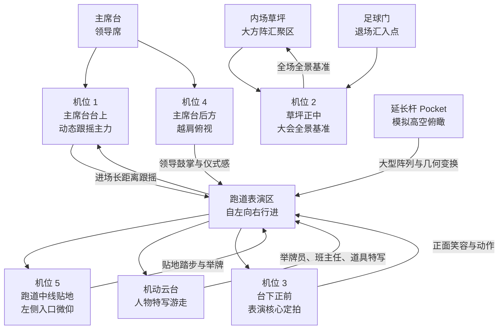
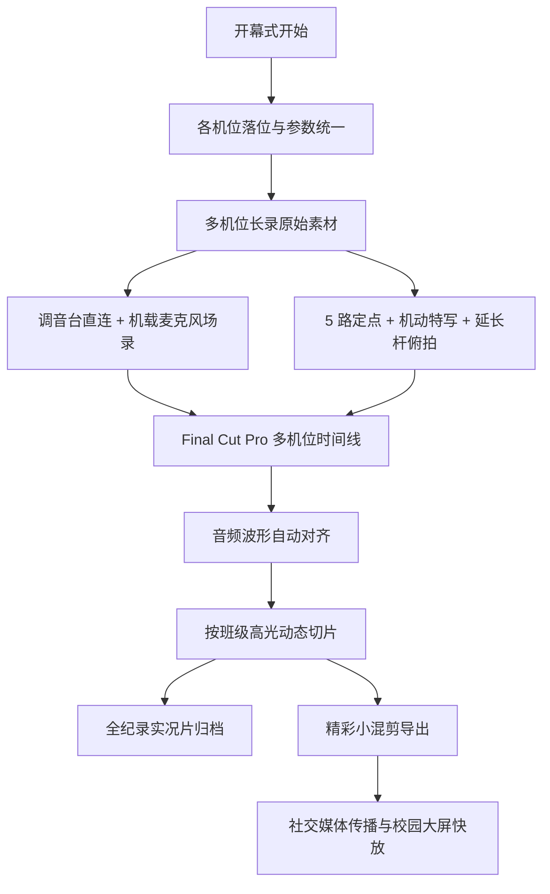
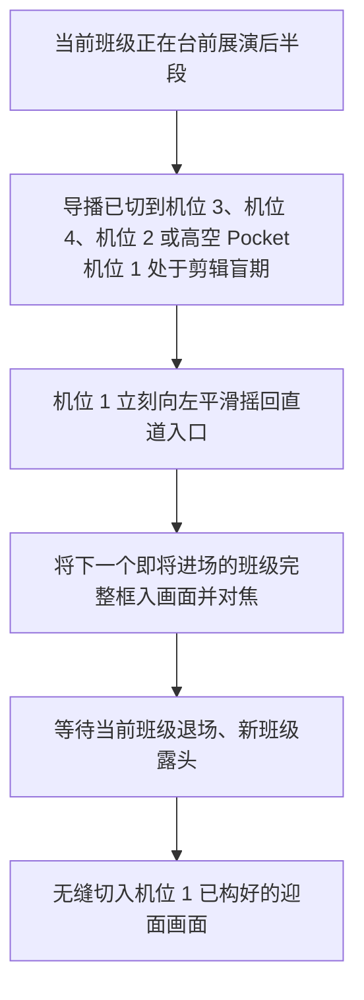
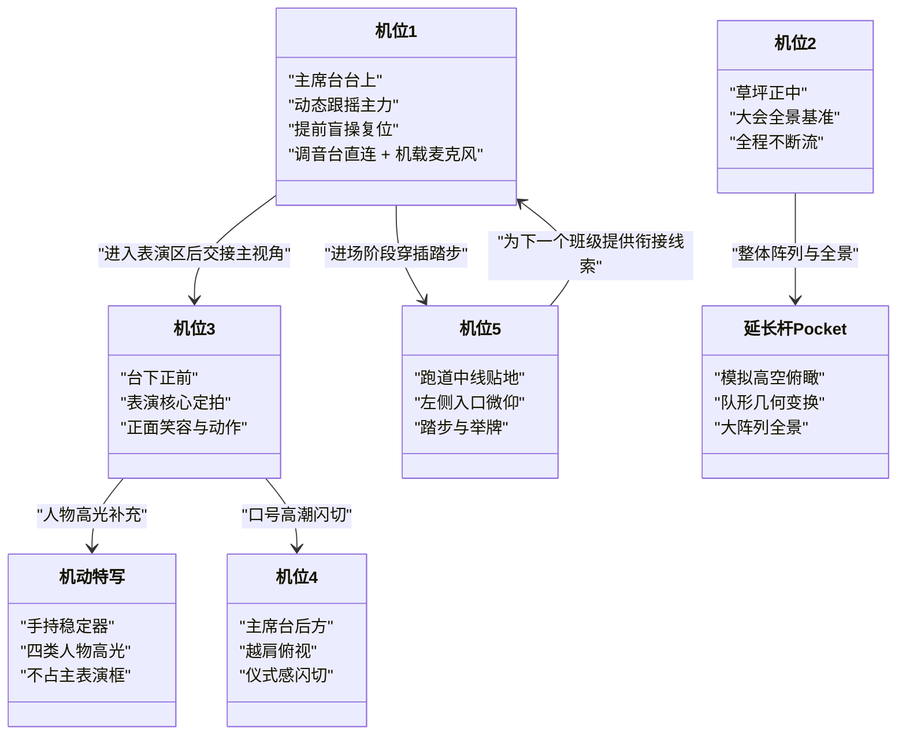

# 视频三：开幕式多机位实况

<cite>
**本文引用的文件**   
- [最终脚本](file://成品脚本/03_开幕式多机位实况_最终脚本.md)
- [精彩小混剪剪辑思路指南](file://成品脚本/03_开幕式精彩小混剪_剪辑思路指南.md)
- [开幕式多机位协同与实况方案](file://视频03_开幕式多机位实况/开幕式多机位协同与实况方案.md)
- [开幕式现场机位部署与拍摄执行手册](file://视频03_开幕式多机位实况/开幕式现场机位部署与拍摄执行手册.md)
- [工作记录](file://视频03_开幕式多机位实况/工作记录.md)
</cite>

## 目录
1. [项目定位与目标](#项目定位与目标)
2. [总体架构与机位体系](#总体架构与机位体系)
3. [核心组件与职责划分](#核心组件与职责划分)
4. [多机位协同与切换逻辑](#多机位协同与切换逻辑)
5. [Final Cut Pro 后期流程](#final-cut-pro-后期流程)
6. [开幕式精彩小混剪剪辑指南](#开幕式精彩小混剪剪辑指南)
7. [拍摄执行操作清单](#拍摄执行操作清单)
8. [常见问题排查](#常见问题排查)
9. [风险预案与收工备份](#风险预案与收工备份)
10. [结论与复用建议](#结论与复用建议)

## 项目定位与目标

本项目是运动会视频系列中的“视频三”，目标是制作一台**电视台转播级规格**的开幕式全流程多机位实况片。其核心诉求不是逐班流水账，而是用多机位同步录制覆盖全校班级方阵入场与主席台前展演，确保每个班级的完整画面都能被后期检索、对齐和拼接。

项目的关键约束如下：

| 维度 | 要求 | 说明 |
|---|---|---|
| 机位架构 | 纯地面 5 路定点 + 1 路机动特写 | 不依赖无人机航拍，聚焦主席台、跑道与草坪区域 |
| 录制策略 | 尽量长录、少分段 | 便于 Final Cut Pro 通过音频波形一次性全量对齐 |
| 帧率规范 | 优先统一 30fps | 适配手机、电脑、平板等电子屏幕播放 |
| 白平衡 | 手动固定 5000K | 避免自动白平衡导致多机位色彩漂移 |
| 音频采集 | 机载麦克风全部开启；机位 1 接入调音台 | 同时获得纯净广播原声与真实环境声 |
| 主基准机位 | 机位 2 全程不断流 | 作为时间线基准锚点 |
| 交付产物 | 全纪录实况片 + 精彩小混剪 | 前者面向完整存档，后者面向社交媒体与校园大屏 |

**章节来源**
- [工作记录:1-10](file://视频03_开幕式多机位实况/工作记录.md#L1-L10)
- [最终脚本:1-15](file://成品脚本/03_开幕式多机位实况_最终脚本.md#L1-L15)

## 总体架构与机位体系

本次开幕式采用“**5 路核心定点 + 1 路手持机动特写**”的地面机位体系，并辅以“延长杆搭载 Pocket”模拟摇臂与微型无人机俯拍视角。所有机位围绕“队伍自左向右行进 → 主席台定点展演 → 继续向右走入足球门 → 转入内场大方阵”的实际动线设计。

**图示来源**
- [最终脚本:16-70](file://成品脚本/03_开幕式多机位实况_最终脚本.md#L16-L70)
- [开幕式现场机位部署与拍摄执行手册:12-90](file://视频03_开幕式多机位实况/开幕式现场机位部署与拍摄执行手册.md#L12-L90)

### 各机位位置、设备、任务与视野范围总览

| 机位 | 位置 | 主要设备特征 | 核心任务 | 视野范围与构图要点 |
|---|---|---|---|---|
| 机位 1 | 主席台台上偏右侧 | 高位液压三脚架、大变焦镜头 | 直道远端全班迎面行进跟摇；唯一高频动态复合运镜定点机位 | 从远端把整个班级框入，平滑右摇跟随；进入表演区后立即交切给其他机位 |
| 机位 2 | 内场草坪前沿缓冲带 | 稳固三脚架、固定广角或标准变焦 | 大会全景基准机位 | 正对主席台中央，以领导席和大横幅为背景，全程固定不晃动 |
| 机位 3 | 主席台台下正前方地面 | 低机位三脚架 | 表演核心主力机位 | 距离方阵 5-8 米，正面捕捉笑脸、口号口型、道具与舞蹈动作 |
| 机位 4 | 主席台后方高位 | 高位支架 | 氛围辅助机位 | 越过前排领导肩头向前俯视，在口号高潮或鼓掌时闪切 |
| 机位 5 | 表演区左侧边缘跑道中线 | 贴地放置、锁死朝向与仰角 | 超低视角踏步与举牌 | 镜头朝左微仰，抓第一排齐步踏地震感与班旗掠过 |
| 机动特写 | 跑道外侧边缘游走 | 三轴稳定器 + 广角/中焦微单 | 四类人物高光特写 | 不占主表演框，拍完立即回撤，避开机位 2 与机位 3 视线 |
| 延长杆 Pocket | 表演区侧上方 | 3-4 米延长杆 + 小型云台手机 | 模拟摇臂/无人机俯拍 | 垂直升空、弧形扫视、俯冲跟入散场 |

**章节来源**
- [最终脚本:20-110](file://成品脚本/03_开幕式多机位实况_最终脚本.md#L20-L110)
- [开幕式现场机位部署与拍摄执行手册:20-110](file://视频03_开幕式多机位实况/开幕式现场机位部署与拍摄执行手册.md#L20-L110)

## 核心组件与职责划分

从系统角度看，这次多机位实况是一个由“现场机位层、音频采集层、后期剪辑层、宣发混剪层”组成的流水线。

**图示来源**
- [最终脚本:1-15](file://成品脚本/03_开幕式多机位实况_最终脚本.md#L1-L15)
- [开幕式多机位协同与实况方案:45-75](file://视频03_开幕式多机位实况/开幕式多机位协同与实况方案.md#L45-L75)

### 角色与职责

| 角色 | 职责 | 关键产出 |
|---|---|---|
| 总策划 / 主剪辑 | 统筹机位分工、切换原则、后期多机位时间线与成片结构 | 最终脚本、多机位剪辑工程、双版本成品 |
| 现场调度 | 协调各机位人员、器材排班、走位与避障 | 机位落位图、现场执行节奏 |
| 机位 1 摄影师 | 动态跟摇 + 提前盲操复位 | 进场长镜头、下一个班级预构图 |
| 机位 2 摄影师 | 保持大会全景基准 | 时间线锚点、全局空间关系 |
| 机位 3 摄影师 | 正面表演核心定拍 | 笑容、口号、动作细节 |
| 机位 4 摄影师 | 越肩氛围辅助 | 领导席互动与检阅感 |
| 机位 5 摄影师 | 贴地踏步与举牌 | 步伐震动、低角度震撼 |
| 机动云台操作员 | 四类人物特写游走 | 举牌员、领舞、班主任、特色道具 |
| 延长杆操作员 | 模拟高空俯瞰 | 队形几何变换、大阵列全景 |

**章节来源**
- [工作记录:1-10](file://视频03_开幕式多机位实况/工作记录.md#L1-L10)
- [最终脚本:16-110](file://成品脚本/03_开幕式多机位实况_最终脚本.md#L16-L110)

## 多机位协同与切换逻辑

多机位协同的核心不是固定秒数模板，而是围绕“进场阶段”和“定点展演阶段”两个过程，按班级节目的高光节点动态切换。

### 基础切换原则

| 阶段 | 主选机位 | 补充机位 | 切换目的 |
|---|---|---|---|
| 进场直道 | 机位 1 | 机位 5 | 展现全班纵深队列与齐步踏步 |
| 进入表演区站定 | 机位 3 | 机位 4、机位 2、机动特写 | 转为正面表演细节与氛围 |
| 队形变换或团体表演 | 机位 2 或延长杆 Pocket | 机位 3 | 展示整体阵列与几何变换 |
| 师生互动或人物高光 | 机动特写 | 机位 3、机位 4 | 突出举牌员、领操、班主任、道具 |
| 口号高潮或致敬 | 机位 4 | 机位 3 | 强化检阅仪式感 |

### 机位 1 的“提前盲操复位”铁律

这是保证后续班级衔接不断档的关键机制：

**图示来源**
- [最终脚本:70-110](file://成品脚本/03_开幕式多机位实况_最终脚本.md#L70-L110)
- [开幕式现场机位部署与拍摄执行手册:60-110](file://视频03_开幕式多机位实况/开幕式现场机位部署与拍摄执行手册.md#L60-L110)

### 各机位之间的协作关系

**图示来源**
- [最终脚本:20-110](file://成品脚本/03_开幕式多机位实况_最终脚本.md#L20-L110)
- [开幕式现场机位部署与拍摄执行手册:20-110](file://视频03_开幕式多机位实况/开幕式现场机位部署与拍摄执行手册.md#L20-L110)

**章节来源**
- [最终脚本:70-110](file://成品脚本/03_开幕式多机位实况_最终脚本.md#L70-L110)
- [开幕式现场机位部署与拍摄执行手册:60-110](file://视频03_开幕式多机位实况/开幕式现场机位部署与拍摄执行手册.md#L60-L110)

## Final Cut Pro 后期流程

### 多机位波形对齐与时间码管理

根据项目文档，后期主要依赖 Final Cut Pro 的“基于音频波形自动对齐”能力，而不是依赖外部打板或复杂时间码发生器。因此，前期录音质量与连续性比“打板标记”更重要。

| 步骤 | 操作 | 注意事项 |
|---|---|---|
| 导入素材 | 将所有机位原始视频与音频导入工程 | 保留机位标签，如“机位 1”“机位 2”等 |
| 创建多机位剪辑夹 | 选择同一时间段的多机位素材生成 Multicam Clip | 不要只选一个机位 |
| 音频对齐 | 使用“Sync by Audio”进行自动波形对齐 | 所有机位必须开启机载麦克风录音 |
| 设置基准机位 | 将机位 2 设为时间线基准锚点 | 因其全程不断流 |
| 检查对齐 | 放大波形比对关键声音事件 | 如领导讲话、口令、掌声、踏步声 |
| 手动修正 | 对齐失败时微调偏移 | 常见于机位间启动时间不一致 |
| 创建时间线 | 在多机位时间线上按高光节点动态切片 | 不按固定秒数模板 |
| 导出成品 | 输出全纪录版与精彩小混剪版 | 注意帧率与画幅一致 |

### 音轨对齐与双轨合成

机位 1 承担全场主音频源职责，需要同时保留两条信息：

1. **调音台直连轨道**：官方背景音乐、入场进行曲、广播播报、领导讲话，干净无杂音。
2. **机载麦克风轨道**：操场全场欢呼、口号、踏步声，提供真实临场感。

后期可在 Final Cut Pro 中叠加这两条音轨，形成“纯净广播原声 + 真实环境声”的合成效果。

### 多视角拼接与备用机位替换

由于每个班级展演形式不同，切换不能机械套用固定时长。推荐做法是：

- 先以机位 1 和机位 3 为主视角建立时间线骨架；
- 再插入机位 2、机位 4、机位 5 作为空间与氛围补充；
- 用机动特写与延长杆 Pocket 做高光点缀；
- 若某个机位出现漏拍、抖动、对焦失误或遮挡，可用其他机位同时间段素材替换；
- 若完全缺失，应退回上一机位或切至大会全景机位 2，避免硬切黑场。

### 错误帧处理

| 问题类型 | 处理方式 |
|---|---|
| 轻微抖动 | 使用 Stabilization 微调，但不可过度 |
| 对焦模糊 | 切换到同时间段更清晰机位 |
| 运动拖影 | 检查是否误开过高快门；必要时加速或降速过渡 |
| 音频爆音 | 降低音量或仅保留环境轨 |
| 断录片段 | 用前后机位接续，必要时加短黑场或转场缓冲 |
| 机位错位 | 重新执行音频波形对齐或手动偏移校正 |

**章节来源**
- [最终脚本:1-15](file://成品脚本/03_开幕式多机位实况_最终脚本.md#L1-L15)
- [开幕式多机位协同与实况方案:45-75](file://视频03_开幕式多机位实况/开幕式多机位协同与实况方案.md#L45-L75)
- [开幕式现场机位部署与拍摄执行手册:90-110](file://视频03_开幕式多机位实况/开幕式现场机位部署与拍摄执行手册.md#L90-L110)

## 开幕式精彩小混剪剪辑指南

“开幕式精彩小混剪”不是完整实录，而是从多机位原始素材中提炼出的**60-90 秒快节奏宣发短片**，适合微信视频号、B站、学校大屏循环展播。

### 叙事骨架：四段式结构

| 段落 | 建议时长 | 核心内容 | 主要调用机位 |
|---|---:|---|---|
| 序章·仪式感启幕 | 10-15 秒 | 环境空镜、国旗护卫队细节、开幕宣告原声透出 | 机位 5、机位 2 |
| 入场·百花齐放与密集快剪 | 20-30 秒 | 全班大纵深、贴地脚步、举牌员与班主任、个性道具闪切 | 机位 1、机位 5、机动特写 |
| 高潮·台前绝活与视觉爆发 | 25-35 秒 | 红伞展开、翻腾动作、领舞卡点、高空俯瞰队形 | 机位 3、延长杆 Pocket、机位 4 |
| 收官·全校合流与奔赴赛场 | 10-15 秒 | 奔向草坪背影、彩旗全景、慢动作笑脸、片名收尾 | 机位 2、延长杆 Pocket、机动特写 |

### 剪辑原则

1. **不做逐班流水账**：重点挑选最高燃、最亮眼、最具青春朝气的瞬间。
2. **音乐驱动节奏**：鼓点分明、结构清晰的前奏 - 推进 - 副歌爆发 - 尾声。
3. **动静变速**：行进可适度加速，核心动作释放瞬间慢放，形成呼吸感。
4. **保留真实原声**：在关键节点透出开幕宣告、脚步声、口号与掌声。
5. **统一调色与帧率**：中性色温、保留草坪翠绿与跑道砖红色，导出 30fps。

### 多机位素材调用速查

| 机位名称 | 混剪最佳用法 |
|---|---|
| 机位 1 | 远端完整框入全班的大纵深画面 |
| 机位 2 | 开场交代主席台与大横幅 |
| 机位 3 | 展演特写核心：领舞、动作爆发、口号口型 |
| 机位 4 | 表演高潮闪切领导席鼓掌视角 |
| 机位 5 | 皮靴正步踩重低音鼓点 |
| 机动特写 | 举牌手神态、班主任陪跑、个性道具 |
| 延长杆 Pocket | 大型道具展开与全场大阵列俯拍 |

**章节来源**
- [精彩小混剪剪辑思路指南:1-92](file://成品脚本/03_开幕式精彩小混剪_剪辑思路指南.md#L1-L92)

## 拍摄执行操作清单

### 开机前检查

- [ ] 确认所有机位位置与拓扑图一致，特别是机位 1、机位 3、机位 5 的对准方向。
- [ ] 检查三脚架、独脚架、延长杆是否稳固，云台阻尼是否顺滑。
- [ ] 确认存储卡有足够空间，电池满电或有外接供电。
- [ ] 所有机位分辨率与帧率尽量统一为 30fps。
- [ ] 所有机位白平衡手动固定 5000K，禁用自动白平衡。
- [ ] 所有机位开启机载麦克风录音。
- [ ] 机位 1 连接主席台调音台 Line Out，确认能收录官方音乐与广播。
- [ ] 检查相机对焦模式，建议锁定人脸或预设焦点区间，减少自动对焦拉扯。
- [ ] 清理镜头表面，避免汗渍、灰尘造成眩光。

### 同步测试

- [ ] 在所有机位同时录制一段 10-15 秒现场声音，例如拍手、哨音或口令。
- [ ] 导入剪辑软件查看波形，确认各机位声音起始点基本一致。
- [ ] 若存在明显偏移，记录大致偏移量，后期用于手动对齐。
- [ ] 验证机位 1 的调音台直连音轨是否正常，有无底噪、断音或削波。

### 现场沟通信号

- [ ] 明确总调度联系方式，以便突发状况快速通报。
- [ ] 各机位之间避免互相遮挡镜头，尤其是机动特写不得长期停留在机位 2 与机位 3 主框内。
- [ ] 机位 1 在班级展演后半段必须执行“提前盲操复位”。
- [ ] 机动特写拍完一个高光后立即回撤，不阻塞通道。
- [ ] 延长杆操作者注意周围人群与机位，避免碰撞。

### 拍摄中纪律

- [ ] 禁止每个班级频繁按停录制。
- [ ] 除电量告警或存储卡满外，不得随意中断长视频流。
- [ ] 机位 2 全程不关机，作为基准锚点。
- [ ] 机位 1 不得留恋上一个班级，错过下一个班级入场。
- [ ] 机位 3、机位 4、机位 5 保持构图稳定，避免无意义大幅移动。
- [ ] 发现某班级可能被遮挡时，立即通知总调度与其他机位补拍。

### 收工与素材备份流程

1. 停止录制后，先确认最后一个班级完整离场，避免尾部缺失。
2. 检查各机位最后几分钟波形是否正常，判断是否存在无声或断录。
3. 原地清点存储卡、电池、稳定器、延长杆、线缆与三脚架。
4. 将素材按机位分类命名，例如“机位 1 开幕式”“机位 2 开幕式”等。
5. 至少完成一次本地备份与一次异地备份。
6. 随机抽查关键班级段落，确认没有严重抖动、对焦失误或漏拍。
7. 将最终脚本、执行手册、拓扑图与剪辑指南一并归档。

**章节来源**
- [最终脚本:1-15](file://成品脚本/03_开幕式多机位实况_最终脚本.md#L1-L15)
- [开幕式现场机位部署与拍摄执行手册:12-110](file://视频03_开幕式多机位实况/开幕式现场机位部署与拍摄执行手册.md#L12-L110)
- [开幕式多机位协同与实况方案:1-20](file://视频03_开幕式多机位实况/开幕式多机位协同与实况方案.md#L1-L20)

## 常见问题排查

### 不同摄像机帧率不一致

| 现象 | 原因 | 处理方法 |
|---|---|---|
| 播放卡顿或速度异常 | 部分机位未统一 30fps | 前期尽量统一；后期由剪辑软件自动换算，但仍建议统一 |
| 动作忽快忽慢 | 混合 25/30/50/60fps 且未合理处理 | 工程基准统一为 30fps，避免频繁变速 |
| 运动拖影严重 | 快门速度过低或帧率设置不当 | 检查现场参数，必要时用稳定化或变速过渡 |

### 音频不同步

| 现象 | 可能原因 | 处理方法 |
|---|---|---|
| 波形无法自动对齐 | 各机位录音启动时间差异大 | 使用拍手、哨音或口令建立参考点 |
| 只有画面无声音 | 机载麦克风未开启或静音 | 检查录制设置与输入通道 |
| 机位 1 声音清晰但其他机位嘈杂 | 正常现象，因机位 1 直连调音台 | 保留机位 1 主音轨，其他机位作环境与备用 |
| 声音爆音或削波 | 现场音量过大 | 降低增益，后期做音量归一化 |

### 机位漏拍某个班级

| 情况 | 应对方式 |
|---|---|
| 仅有局部特写 | 用机位 2 全景或其他机位同时间段画面补充 |
| 完全漏拍 | 回溯相邻班级段落，避免硬切；必要时用环境音过渡 |
| 机位 1 错过新班级 | 启用机位 5 或机动特写临时补位，随后尽快切回稳定机位 |
| 多个机位都差一点 | 以机位 2 全景缓冲，再接入下一班级完整画面 |

### 画面抖动或对焦失败

| 问题 | 处理建议 |
|---|---|
| 三脚架不稳 | 加固脚架，避免踩踏跑道震动区 |
| 云台阻尼不足 | 调整阻尼，避免甩镜找焦 |
| 自动对焦拉风箱 | 改用手动对焦或锁定对焦区间 |
| 光线变化导致自动白平衡漂移 | 全程使用 5000K 手动白平衡 |

**章节来源**
- [最终脚本:90-110](file://成品脚本/03_开幕式多机位实况_最终脚本.md#L90-L110)
- [开幕式现场机位部署与拍摄执行手册:90-110](file://视频03_开幕式多机位实况/开幕式现场机位部署与拍摄执行手册.md#L90-L110)
- [开幕式多机位协同与实况方案:45-75](file://视频03_开幕式多机位实况/开幕式多机位协同与实况方案.md#L45-L75)

## 风险预案与收工备份

### 常见突发状况与预案

| 突发状况 | 预案 |
|---|---|
| 某机位存储卡满或电量告警 | 提前准备备用卡与电池；更换时尽量缩短中断时间 |
| 调音台断线或无信号 | 立即改靠机载麦克风与环境音，后期弱化该段广播原声 |
| 观众或工作人员遮挡 | 机动特写迅速换角度；固定机位暂切其他机位 |
| 天气突变 | 为设备加装防雨罩，必要时缩短高风险时段拍摄 |
| 某班级表演超长或极短 | 不依赖固定时长模板，按实际高光动态裁剪 |
| 后期无法自动对齐 | 人工选取同步点，手动对齐波形后再批量应用 |

### 素材归档与交付物

| 交付物 | 用途 |
|---|---|
| 开幕式全流程多机位实况片 | 全班级入场式完整存档，供学校、年级与社团长期使用 |
| 开幕式精彩小混剪 | 社交媒体传播、校园大屏快放、活动回顾短视频 |
| 最终脚本 | 指导后续届次复用多机位架构与切换原则 |
| 拍摄执行手册 | 指导现场机位落位、参数与录制铁律 |
| 拓扑图 | 指导现场机位布置与走位避让 |
| 精彩小混剪剪辑思路指南 | 指导剪辑同学从多机位原始素材中提取高光片段 |

**章节来源**
- [工作记录:10-113](file://视频03_开幕式多机位实况/工作记录.md#L10-L113)
- [最终脚本:1-15](file://成品脚本/03_开幕式多机位实况_最终脚本.md#L1-L15)

## 结论与复用建议

“视频三：开幕式多机位实况”的技术核心可以概括为一句话：**用稳定的地面机位网络与统一的录音规范，换取后期灵活、可靠、可扩展的多机位剪辑空间。**

这套方案的复用价值在于：

1. **机位架构可复制**：5 路定点 + 1 路机动特写的布局适用于大多数学校运动会、升旗仪式、文艺汇演等场景。
2. **录制铁律可传承**：长录、少分段、统一帧率、固定白平衡、全程录音，是后期自动对齐的基础。
3. **切换逻辑可简化**：不必死守固定秒数模板，应以“进场—表演—离场”三段结构与各班高光节点为准。
4. **后期流程可标准化**：以 Final Cut Pro 音频波形对齐为主、手动修正为辅，兼顾效率与容错。
5. **混剪产品可独立开发**：全纪录片负责存档，精彩小混剪负责传播，二者目标不同但共用同一套原始素材。

未来若条件允许，可在不破坏现有架构的前提下增加第二路机动特写、固定延时机位或裁判区机位，但不应盲目引入无人机航拍，除非场地、审批与安全评估均已就绪。