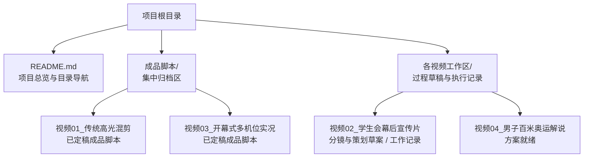
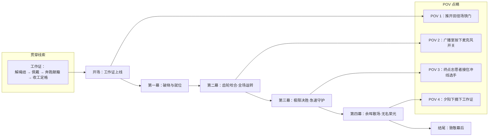
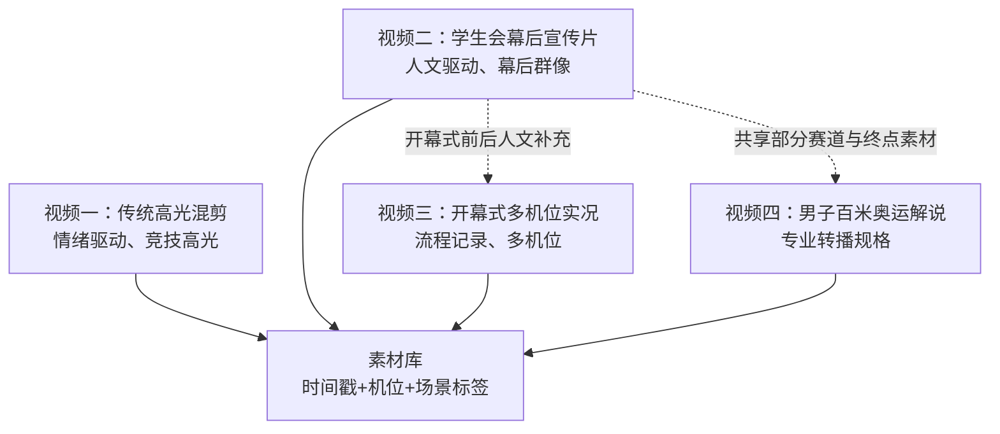
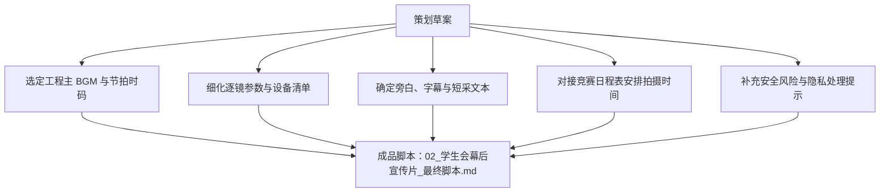

# 视频二：学生会幕后宣传片

<cite>
**本文引用的文件**   
- [README.md](file://README.md)
- [学生会幕后宣传片_分镜与策划草案.md](file://视频02_学生会幕后宣传片/学生会幕后宣传片_分镜与策划草案.md)
- [工作记录.md](file://视频02_学生会幕后宣传片/工作记录.md)
- [01_传统高光混剪_最终脚本.md](file://成品脚本/01_传统高光混剪_最终脚本.md)
</cite>

## 目录
1. [引言](#引言)
2. [项目结构定位](#项目结构定位)
3. [核心叙事与主题](#核心叙事与主题)
4. [架构总览](#架构总览)
5. [分镜与场景逐条整理](#分镜与场景逐条整理)
6. [拍摄执行与现场建议](#拍摄执行与现场建议)
7. [隐私、肖像权与合规处理](#隐私肖像权与合规处理)
8. [素材管理与多视频协同](#素材管理与多视频协同)
9. [交付状态与后续推进计划](#交付状态与后续推进计划)
10. [风险清单与待办项](#风险清单与待办项)
11. [结语](#结语)

## 引言
本策划聚焦“看不见的赛场与奉献”，以纪实 Vlog 叙事风格呈现校运会中学生会的幕后群像。与视频一面向观众情绪的高燃混剪不同，视频二的叙事视角更贴近幕后工作者的人文记录：它不追求极致卡点与竞技奇观，而是通过前台赛事与后台保障的对照剪辑，让观众看到成绩背后那些被忽略的动作、呼吸与汗水。

从工程层面看，视频二是整个校运会视听工程中的第二条主线：视频一负责情绪高潮与大众传播，视频三负责开幕式多机位实况，视频四负责专项赛事转播感短片；视频二则承担“人文纵深”的职责，把镜头从领奖台拉回检录处、终点计时台、广播站、医疗站、器材区与志愿者协调岗位。

**章节来源**
- [README.md:12-44](file://README.md#L12-L44)

## 项目结构定位
在仓库结构中，视频二位于过程工作区 `视频02_学生会幕后宣传片/`，当前包含策划草案与工作记录。该目录尚未进入 `成品脚本/` 归档区，说明正式定稿脚本尚未完成。

**图表来源**
- [README.md:45-85](file://README.md#L45-L85)

**章节来源**
- [README.md:45-85](file://README.md#L45-L85)

## 核心叙事与主题
### 主题表达
视频二的主题是“看不见的赛场与奉献”。它不是单纯记录学生会做了什么，而是强调这些动作如何支撑前台比赛：  
- 检录核对让选手有序上场；  
- 终点计时与成绩单传递让成绩及时公布；  
- 广播站把班级加油声转化为全场声音；  
- 医疗站承接冲刺后的脱力与肌肉痉挛；  
- 器材搬运维持跳高、跳远、铅球等项目的连续运转；  
- 志愿者协调让分散岗位形成统一节奏。

### 叙事差异对比
| 维度 | 视频一：传统高光混剪 | 视频二：学生会幕后宣传片 |
| :--- | :--- | :--- |
| 叙事视角 | 面向观众情绪，强调竞技张力、音乐卡点与视觉冲击 | 面向幕后工作者，强调真实劳动、协作与人文温度 |
| 结构方式 | 三段式情绪弧线：蓄势破晓 → 全域狂飙 → 青春温情 | 四幕结构：破晓就位 → 齿轮咬合 → 极限守护 → 余晖散场 |
| 主要手段 | 升格、快切、黑场转折、BGM 节拍驱动 | 双线对照、工作证线索、POV 沉浸、原声短采 |
| 情感落点 | 热血、荣耀、集体欢呼 | 疲惫、微笑、默默坚守与告别 |
| 设备倾向 | 长焦、稳定器、升格、航拍替代方案 | 手持、稳定器、领夹麦克风、短焦近景与特写 |

**章节来源**
- [01_传统高光混剪_最终脚本.md:1-92](file://成品脚本/01_传统高光混剪_最终脚本.md#L1-L92)
- [学生会幕后宣传片_分镜与策划草案.md:1-20](file://视频02_学生会幕后宣传片/学生会幕后宣传片_分镜与策划草案.md#L1-L20)

## 架构总览
视频二采用“双线对照 + 贯穿道具 + POV 点睛”的结构：  
- **双线对照**：前台赛事画面与幕后支撑画面成对出现，形成因果互文；  
- **贯穿道具**：工作证从清晨解绳结到傍晚放回长椅，串联全天时间线；  
- **POV 微镜头**：仅在四个关键节点切入第一视角，增强临场感但不喧宾夺主。

**图表来源**
- [学生会幕后宣传片_分镜与策划草案.md:10-20](file://视频02_学生会幕后宣传片/学生会幕后宣传片_分镜与策划草案.md#L10-L20)
- [学生会幕后宣传片_分镜与策划草案.md:21-108](file://视频02_学生会幕后宣传片/学生会幕后宣传片_分镜与策划草案.md#L21-L108)

## 分镜与场景逐条整理
以下表格基于现有策划草案，将每个场景拆分为：场景编号、时间码建议、镜头意图、拍摄对象、所需设备、旁白或采访提纲、待完善字段。未明确的字段标注为“待确认”或“待补充”。

### 第一幕：破晓与就位（约 00:00 — 00:30）
| 场景 | 时间码建议 | 镜头意图 | 拍摄对象 | 所需设备 | 旁白或采访提纲 | 待完善字段 |
| :--- | :--- | :--- | :--- | :--- | :--- | :--- |
| 01 | 00:00 — 00:05 | 建立清晨空镜，引入场地与安静氛围 | 田径场大门、晨雾、跑道 | 相机、稳定器、广角或标准镜头 | 无旁白；保留环境原声 | BGM 起音时码待确认 |
| 02 | 00:05 — 00:12 | 展现幕后准备的生活细节 | 大本营桌前缠结的工作证挂绳、两名高一同学 | 相机、中近景、便携补光 | 可采集一句自然对话，如谁把绳结弄乱 | 具体部门标签待确认 |
| 03 | 00:12 — 00:17 | 完成工作证佩戴，标志一天开始 | 工作证、挂绳、校服衣领、部门标签 | 相机、特写、POV 机位 | 无旁白 | 是否保留部门标签特写需确认 |
| 04 | 00:17 — 00:30 | 双线对照：前台热身与幕后清扫、搭帐篷 | 运动员系鞋带、搓镁粉；扫帚、遮阳帐篷、沙袋 | 相机、稳定器、长焦、大竹扫帚环境音 | 无旁白 | 是否需要加入旁白说明职责分工，待确认 |

**章节来源**
- [学生会幕后宣传片_分镜与策划草案.md:21-44](file://视频02_学生会幕后宣传片/学生会幕后宣传片_分镜与策划草案.md#L21-L44)

### 第二幕：齿轮咬合·全场运转（约 00:30 — 01:10）
| 场景 | 时间码建议 | 镜头意图 | 拍摄对象 | 所需设备 | 旁白或采访提纲 | 待完善字段 |
| :--- | :--- | :--- | :--- | :--- | :--- | :--- |
| 05 | 00:30 — 00:42 | 展现检录处的紧张与秩序 | 检录员、大喇叭、号码布、别针、胸前工作证 | 相机、中景、近景、无线领夹麦克风 | 可追问：“今天第几组？”“号码布够不够？” | 具体项目名称与组次待确认 |
| 06 | 00:42 — 00:54 | 发令瞬间的双线对照：选手专注 vs 裁判悬停秒表 | 起跑线选手、终点高台学生裁判、秒表、发令枪烟雾 | 相机、长焦、稳定器 | 无旁白；保留枪响与环境收敛声 | 是否使用实际发令枪画面需确认 |
| 07 | 00:54 — 01:02 | POV 带入广播室，建立校园之声 | 广播桌、红笔草稿纸条、立式麦克风开关 | 相机、POV 机位、桌面近景 | 无旁白；保留开关底噪与广播回声 | 广播内容是否需打码或替换，待确认 |
| 08 | 01:02 — 01:10 | 展现播音员的真实情绪波动 | 播音女生、水杯、面部表情 | 相机、浅景深、侧颜近景 | 无旁白；可采集关闭麦克风后的放松原声 | 是否需要字幕标注姓名与部门，待确认 |

**章节来源**
- [学生会幕后宣传片_分镜与策划草案.md:45-70](file://视频02_学生会幕后宣传片/学生会幕后宣传片_分镜与策划草案.md#L45-L70)

### 第三幕：极限决胜·急速守护（约 01:10 — 01:55）
| 场景 | 时间码建议 | 镜头意图 | 拍摄对象 | 所需设备 | 旁白或采访提纲 | 待完善字段 |
| :--- | :--- | :--- | :--- | :--- | :--- | :--- |
| 09 | 01:10 — 01:25 | 用“冲刺”同时表现前台选手与幕后送单者 | 短跑选手、持成绩单穿梭的志愿者、成绩张贴栏 | 相机、低角度跟拍、稳定器、长焦 | 无旁白；保留脚步声与纸张声 | 成绩单是否含敏感信息需确认 |
| 10 | 01:25 — 01:40 | 终点保护与人文高光：接扶、递水、冰敷 | 撞线脱力选手、终点志愿者、矿泉水、冰袋 | 双机位、近景、特写、稳定器 | 可采集志愿者安抚原声 | 是否出现受伤画面需谨慎评估 |
| 11 | 01:40 — 01:45 | POV 强化终点接人瞬间 | 志愿者胸前视角、冲入怀中的选手 | 胸前固定相机或 Pocket | 简短原声“慢慢喝，小口喝” | 是否保留第一人称画外音，待确认 |
| 12 | 01:45 — 01:55 | 田赛保障：横杆复位、沙坑平整 | 跳高横杆、海绵垫、沙坑、铁耙、裁判同学 | 相机、升格模式、中景 | 无旁白；保留撞击与沙沙声 | 是否加入旁白解释器材维护，待确认 |

**章节来源**
- [学生会幕后宣传片_分镜与策划草案.md:71-96](file://视频02_学生会幕后宣传片/学生会幕后宣传片_分镜与策划草案.md#L71-L96)

### 第四幕：余晖散场·无名荣光（约 01:55 — 02:30）
| 场景 | 时间码建议 | 镜头意图 | 拍摄对象 | 所需设备 | 旁白或采访提纲 | 待完善字段 |
| :--- | :--- | :--- | :--- | :--- | :--- | :--- |
| 13 | 01:55 — 02:08 | 对比喧嚣退场与幕后清场 | 领奖台、看台人群、清理标语水瓶的学生会成员、抬帐篷男生 | 相机、逆光、长镜头 | 无旁白；保留渐远欢呼与金属碰撞声 | 是否需要旁白总结一天，待确认 |
| 14 | 02:08 — 02:18 | 快问快答短采，呈现真实人物 | 检录处学姐、终点志愿者 | 手持麦克风或无线领夹麦克风、相机 | “今天步数多少了？”“站一天累不累？” | 受访者身份是否公开，待确认 |
| 15 | 02:18 — 02:24 | 工作证回归长椅，完成情感闭环 | 工作证、看台木椅、夕阳跑道、晚霞 | 相机、POV、缓慢后退拉镜头 | 无旁白；保留晚风与环境音 | 收尾文案是否调整，待确认 |
| 16 | 02:24 — 02:30 | 主题升华文字 | 纯黑背景、白色与金色文字 | 后期包装软件 | 无旁白；保留最后一个和弦余音 | 具体文案措辞需团队确认 |
| 17 | 02:30 — 02:35 | 演职员表与鸣谢 | 黑底滚动名单 | 后期包装软件 | 极低环境白噪声 | 名单范围与格式待确认 |

**章节来源**
- [学生会幕后宣传片_分镜与策划草案.md:97-108](file://视频02_学生会幕后宣传片/学生会幕后宣传片_分镜与策划草案.md#L97-L108)

## 拍摄执行与现场建议
### 在不干扰比赛的前提下捕捉真实瞬间
- **位置优先**：始终站在赛道安全区外，避免进入裁判视线与运动员助跑路线；终点保护区域应提前与终点裁判沟通站位。  
- **动线隐蔽**：使用手持或小型稳定器，避免大型三脚架长时间占用通道；必要时采用肩扛或胸前固定机位完成 POV。  
- **镜头克制**：避免近距离遮挡其他志愿者或观众；特写镜头尽量从侧面或斜后方接近，减少正面直视造成的表演感。  
- **声音策略**：比赛进行中优先依赖环境原声，采访与旁白建议在赛前准备阶段、赛后清场阶段或相对安静的广播室、医疗站角落录制。  
- **时间窗口**：重点覆盖检录前 10—15 分钟、发令前后、冲刺后 2—3 分钟、赛后 10—15 分钟清场期。

### 如何获取简短口述
- 选择任务间隙：例如检录员刚结束一组点名、广播员刚播完一段稿件、志愿者刚递完一瓶水。  
- 提问控制在 1—2 句，避免长篇回忆；问题要具体，例如“刚才那组最紧张的是什么？”“你站的位置能看到哪些变化？”  
- 先录 3—5 秒现场原声，再快速提问，最后再录 2—3 秒回答，便于剪辑时嵌入。  
- 若受访者害羞，可改为半背身或侧脸拍摄，降低镜头压力。

### 设备与人员分工建议
- 检录与发令组：负责大喇叭催场、号码布、发令枪与秒表对照画面。  
- 送单与田赛组：负责成绩单穿梭、成绩张贴栏、跳高横杆与沙坑。  
- 终点救护与短采组：负责终点缓冲、递水冰敷、片尾快问快答。  
- POV 与空镜组：负责 4 个关键 POV 以及清晨与傍晚空镜、清场抬帐篷。  
- 音频采集：至少配备 1—2 套无线领夹麦克风，用于短采与广播室、终点附近的环境音增强。

**章节来源**
- [学生会幕后宣传片_分镜与策划草案.md:100-108](file://视频02_学生会幕后宣传片/学生会幕后宣传片_分镜与策划草案.md#L100-L108)
- [工作记录.md:15-30](file://视频02_学生会幕后宣传片/工作记录.md#L15-L30)

## 隐私、肖像权与合规处理
- **学校与活动合规**：项目明确“严禁使用无人机”，并强调真实的人肉穿梭与长焦、稳定器抓拍，这与整体禁飞与安全拍摄红线一致。  
- **肖像权基础原则**：  
  - 学生志愿者与工作人员作为主要出镜对象，应尽量事先获得口头或书面同意；  
  - 普通参赛者若未被明确采访，可在远景、背影或局部特写中使用，但应避免将清晰正脸与敏感成绩直接关联；  
  - 涉及医疗站画面时，谨慎展示可能引发不适的伤情，优先聚焦“递水、搀扶、冰敷、安抚”等保障动作。  
- **个人信息保护**：  
  - 成绩单、报名表、广播草稿纸若出现姓名、班级、联系方式等敏感信息，应在后期打码或重新打印匿名版本；  
  - 工作证上的部门标签可保留，但若显示完整姓名或个人标识，应根据学校要求决定是否虚化。  
- **采访授权**：短采虽短，仍属于可识别的个人表达；建议在拍摄前用一句话说明用途，例如“这段会用在学生会幕后宣传片里，可以吗？”

**章节来源**
- [学生会幕后宣传片_分镜与策划草案.md:1-20](file://视频02_学生会幕后宣传片/学生会幕后宣传片_分镜与策划草案.md#L1-L20)
- [README.md:12-44](file://README.md#L12-L44)

## 素材管理与多视频协同
### 与视频一的差异
视频一是以 BGM 节拍和竞技高潮为中心的情绪产品，其脚本强调三段式结构、黑场转折、升格慢动作与按项目分类的实操拍摄指南；视频二则以人物与劳动为中心，强调双线对照、工作证线索、POV 与短采。两者不应互相复制：  
- 视频一适合复用冲刺、跳跃、投掷、交接棒等竞技高光；  
- 视频二适合复用检录、广播、终点保护、器材回收等幕后过程。

### 与视频三的协同
视频三是开幕式多机位实况，侧重电视台级全流程记录；视频二可作为开幕式前后的“人文补充”，例如开幕式前学生会布置主席台、引导方阵，开幕式后清场撤展。两片的素材管理应保持独立文件夹，但共享统一的命名规则与元数据标记，例如：  
- 时间戳：YYYYMMDD_HHMMSS；  
- 机位号：CAM01、CAM02、POV、MIC；  
- 场景标签：检录、终点、广播、医疗、器材、清场。

### 与视频四的协同
视频四是男子百米奥运解说短片，侧重专业 UI、发令前静音、高速直道跟拍与终点判定；视频二可从同一类项目中提取幕后视角，例如终点计时员、成绩单传递、医疗站等待区。两个视频可以共用部分原始素材，但叙事目的不同，不应简单重复。

**图表来源**
- [README.md:12-44](file://README.md#L12-L44)
- [README.md:45-85](file://README.md#L45-L85)

**章节来源**
- [01_传统高光混剪_最终脚本.md:1-92](file://成品脚本/01_传统高光混剪_最终脚本.md#L1-L92)
- [README.md:12-44](file://README.md#L12-L44)

## 交付状态与后续推进计划
### 当前交付状态
- 策划草案已完成，包含四幕结构、逐镜设计、声音设计与分组拍摄要点；  
- 工作记录明确了核心叙事法则、贯穿道具、POV 设计与分工责任；  
- 尚未完成工程主 BGM 选定与节拍卡点时码测定；  
- 尚未导出最终交付脚本至 `成品脚本/02_学生会幕后宣传片_最终脚本.md`。

### 从策划草案升级为正式分镜脚本的步骤
1. **锁定时长与结构**：将 2 分 15 秒至 2 分 35 秒进一步细化为精确时码，并与 BGM 小节对齐。  
2. **补齐设备与参数**：为每个镜头补充帧率、快门、光圈、焦距、运动方式、升格比例与存储卡分配。  
3. **明确旁白与字幕**：确定是否需要旁白，若有，应写出旁白文本；所有短采与广播内容需标注字幕与打码范围。  
4. **增加风险提示**：为终点救护、器材搬运、发令枪等高风险镜头添加安全备注。  
5. **制定拍摄日程**：对照运动会竞赛日程表，将检录、终点、广播、医疗、器材、清场等时段排进当天时间表。  
6. **输出正式版**：将最终脚本放入 `成品脚本/`，并在 README 与需求梳理文档中同步状态。

**图表来源**
- [工作记录.md:15-30](file://视频02_学生会幕后宣传片/工作记录.md#L15-L30)
- [README.md:45-85](file://README.md#L45-L85)

**章节来源**
- [工作记录.md:15-30](file://视频02_学生会幕后宣传片/工作记录.md#L15-L30)
- [README.md:45-85](file://README.md#L45-L85)

## 风险清单与待办项
### 高风险环节
- 终点线靠近冲刺轨迹，存在碰撞与绊倒风险；  
- 医疗站画面可能涉及伤病或不适表情；  
- 广播室与检录处可能采集到敏感文字信息；  
- 短采可能涉及学生隐私与肖像权。

### 待办项清单
- [ ] 选定工程主 BGM，并完成 2 分 15 秒至 2 分 35 秒的节拍卡点分析；  
- [ ] 将分镜草案升级为正式脚本，写入 `成品脚本/02_学生会幕后宣传片_最终脚本.md`；  
- [ ] 补充每个镜头的设备参数、帧率、快门、升格比例与存储分配；  
- [ ] 明确是否需要旁白，并编写旁白文本；  
- [ ] 设计成绩单、广播草稿、报名表等敏感信息的打码规范；  
- [ ] 制定志愿者与出镜学生的肖像权同意流程；  
- [ ] 结合运动会竞赛日程表，制定当天拍摄时间表与机位轮换；  
- [ ] 为终点救护、器材搬运、发令相关镜头增加安全操作提示；  
- [ ] 与视频一、视频三、视频四确认共享素材的使用边界与命名规范。

**章节来源**
- [学生会幕后宣传片_分镜与策划草案.md:1-20](file://视频02_学生会幕后宣传片/学生会幕后宣传片_分镜与策划草案.md#L1-L20)
- [工作记录.md:15-30](file://视频02_学生会幕后宣传片/工作记录.md#L15-L30)

## 结语
视频二的价值不在于拍出更多精彩动作，而在于把镜头对准那些让精彩得以发生的幕后力量。通过双线对照、工作证线索与 POV 点睛，它能够与视频一的情绪型叙事形成互补：一个让人热血沸腾，一个让人安静感动；一个记录赛场，一个记录守护。只要继续完善 BGM、参数、旁白、隐私合规与拍摄日程，这份策划草案就能升级为可直接执行的正式分镜脚本，并与整个校运会视频工程保持一致。