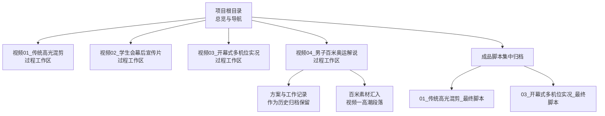
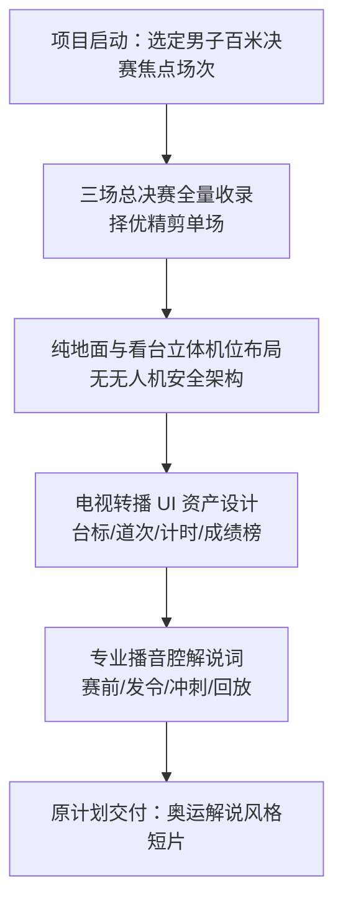
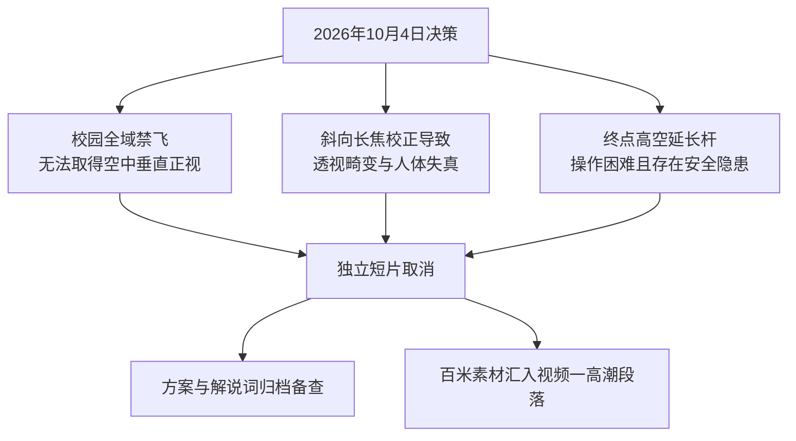
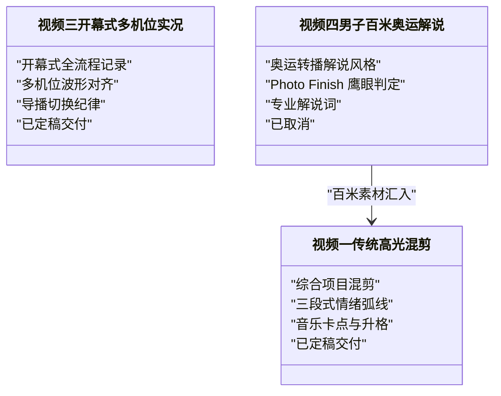
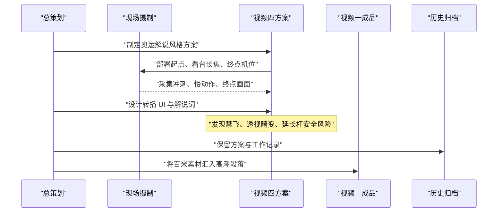
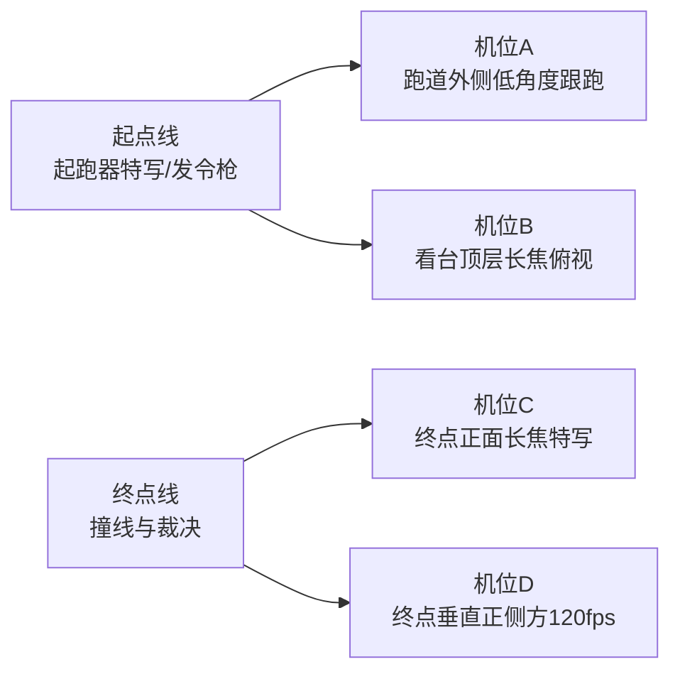
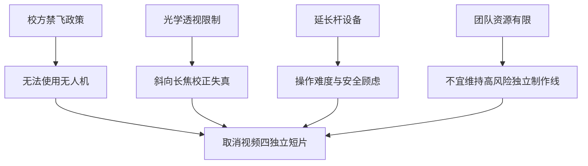

# 视频四：男子百米奥运解说短片（历史归档）

<cite>
**本文引用的文件**
- [README.md](file://README.md)
- [成品脚本/README.md](file://成品脚本/README.md)
- [成品脚本/01_传统高光混剪_最终脚本.md](file://成品脚本/01_传统高光混剪_最终脚本.md)
- [成品脚本/03_开幕式多机位实况_最终脚本.md](file://成品脚本/03_开幕式多机位实况_最终脚本.md)
- [参考视频脚本/README.md](file://参考视频脚本/README.md)
- [视频04_男子百米奥运解说/男子百米奥运解说短片_全流程方案.md](file://视频04_男子百米奥运解说/男子百米奥运解说短片_全流程方案.md)
- [视频04_男子百米奥运解说/工作记录.md](file://视频04_男子百米奥运解说/工作记录.md)
</cite>

## 目录
1. [引言](#引言)
2. [项目结构定位](#项目结构定位)
3. [原方案目标与奥运转播风格设想](#原方案目标与奥运转播风格设想)
4. [取消原因与决策留痕](#取消原因与决策留痕)
5. [素材去向与归档价值](#素材去向与归档价值)
6. [与视频一、视频三的方案对比](#与视频一视频三的方案对比)
7. [架构与流程总览](#架构与流程总览)
8. [关键组件分析](#关键组件分析)
9. [依赖关系与资源冲突分析](#依赖关系与资源冲突分析)
10. [性能与风险特征](#性能与风险特征)
11. [排错与复现建议](#排错与复现建议)
12. [结论](#结论)

## 引言
本归档文档面向“视频四：男子百米奥运解说短片”这一已取消但保留完整过程资产的项目，说明其最初的目标、奥运转播解说风格设想、Photo Finish 鹰眼判定镜头与长焦跟拍构思，并解释为何最终因校方禁飞限制、透视畸变风险与资源冲突而取消。同时阐明该方案为何被归档而非删除：它既是后续体育特长生短视频、竖屏爆款和赛事直播解说的可复用风格资产，也是团队决策过程的正式留痕。最后，通过对比视频一传统高光混剪与视频三开幕式多机位实况，说明为何将男子百米相关素材全量汇入视频一，而不是继续维持一个高风险独立制作线。

## 项目结构定位
在项目根级总览中，“视频04_男子百米奥运解说”被列为四大核心产出之一，定位为“CCTV-5 / 奥运电视转播规格”，对标郑铁百米决赛样片，包含专业转播 UI、发令前静音蓄势、高速直道跟拍、终点 Photo Finish 鹰眼慢动作判定与央视播音腔解说；在成品脚本总览中，该项目状态明确标注为“已取消”，并说明“相关百米竞速拍摄素材全量汇入视频 01 高光混剪”。

**图示来源**
- [README.md:15-44](file://README.md#L15-L44)
- [成品脚本/README.md:10-23](file://成品脚本/README.md#L10-L23)

**章节来源**
- [README.md:15-44](file://README.md#L15-L44)
- [成品脚本/README.md:10-23](file://成品脚本/README.md#L10-L23)

## 原方案目标与奥运转播风格设想
视频四的核心目标是打造一部对标 CCTV-5 奥运转播风格的男子百米决赛解说短片，重点覆盖高一、高二、高三年级组男子 100m 决赛，并从三场总决赛中挑选竞技水平最高、悬念最强、冲刺最激烈的一场进行全套电视转播精细化包装。

其风格设想包括：
- **制式规格**：横屏 16:9，4K 60fps 与 120fps 升格，配套专业电视转播 UI。
- **安全红线**：严格遵守校方禁飞规定，全程不使用无人机；俯瞰与大景采用看台高位与延长杆云台替代。
- **机位布局**：起点起跑器特写与发令枪、跑道外侧低角度跟跑、观众看台顶层长焦俯拍直道全景、终点正面长焦特写、终点正侧方垂直慢动作判定点。
- **转播包装**：电视台标与直播角标、选手道次信息条、实时计时钟、Photo Finish 鹰眼判定系统、官方成绩排行榜。
- **解说叙事**：赛前巡礼蓄势、发令前全场静音仅留心跳声、极速冲刺战况爆发、鹰眼回放与成绩结算的专业复盘解说。

**图示来源**
- [视频04_男子百米奥运解说/男子百米奥运解说短片_全流程方案.md:1-77](file://视频04_男子百米奥运解说/男子百米奥运解说短片_全流程方案.md#L1-L77)

**章节来源**
- [视频04_男子百米奥运解说/男子百米奥运解说短片_全流程方案.md:1-77](file://视频04_男子百米奥运解说/男子百米奥运解说短片_全流程方案.md#L1-L77)

## 取消原因与决策留痕
根据工作记录，该项目于 2026 年 10 月 4 日正式取消，主要原因为三点：
1. **校园全域禁飞无人机**：无法在安全合规前提下获取空中垂直正视与直道航拍机位，直接削弱了原方案中“高空天眼”类视角。
2. **透视畸变风险**：若用看台斜向下长焦俯拍终点线，后期强行拉直校正会产生严重几何透视畸变与人体失真，影响 Photo Finish 判定可信度。
3. **设备操作与安全顾虑**：终点高空延长杆在现场存在操作难度和安全风险。

因此，独立短片不再进入最终定稿交付流程；但本文件夹中的分镜、解说方案与转播 UI 规范仍保留为过程档案，现场拍摄的百米关键机位素材则全部汇入视频一，作为其高潮冲刺段落。

**图示来源**
- [视频04_男子百米奥运解说/工作记录.md:17-29](file://视频04_男子百米奥运解说/工作记录.md#L17-L29)

**章节来源**
- [视频04_男子百米奥运解说/工作记录.md:1-29](file://视频04_男子百米奥运解说/工作记录.md#L1-L29)

## 素材去向与归档价值
从交付清单可见，视频四的成品脚本未进入“成品脚本”集中归档，而是以“已取消”状态登记，并明确“相关百米竞速拍摄素材全量汇入视频 01 高光混剪”。这意味着：
- **成品层面**：不再单独交付“男子百米奥运解说短片”。
- **素材层面**：男子百米决赛的关键镜头仍被保留并用于视频一的冲刺高潮。
- **过程资产层面**：全流程方案、解说词草案、转播 UI 设计与工作记录仍留在“视频04_男子百米奥运解说”工作区，供后续类似项目复用。

归档价值主要体现在三个方面：
1. **风格参考资产**：可用于未来体育特长生短视频、竖屏爆款或赛事直播解说的风格借鉴。
2. **流程模板资产**：转播 UI、解说结构、机位布局与安全约束可作为同类单项转播方案的骨架。
3. **决策留痕资产**：记录校运会视听策划从高风险专业转播尝试回归稳妥主流产出的真实决策过程。

**章节来源**
- [成品脚本/README.md:10-23](file://成品脚本/README.md#L10-L23)
- [视频04_男子百米奥运解说/工作记录.md:17-29](file://视频04_男子百米奥运解说/工作记录.md#L17-L29)

## 与视频一、视频三的方案对比
### 与视频一：传统高光混剪
视频一是约 95 秒的高燃混剪 MV，采用三段式情感曲线“蓄势破晓 → 全域狂飙 → 青春温情”，强调节奏卡点、升格慢动作、项目分类与青春群像。其安全红线同样严格遵循校方全面禁飞规定，所有高角度画面由延长杆与看台长焦替代。视频一更偏向综合宣发大片，而非单一项目的专业转播解说。

| 维度 | 视频一：传统高光混剪 | 视频四：男子百米奥运解说（已取消） |
|---|---|---|
| 内容范围 | 多项运动综合混剪 | 聚焦男子百米决赛单场 |
| 风格定位 | 高燃混剪 MV、三段式情绪弧线 | CCTV-5 奥运转播解说风格 |
| 叙事方式 | 音乐卡点 + 项目分类 + 群像温情 | 专业解说 + 实时计时 + 成绩结算 |
| 关键风险 | 素材调度复杂、节奏控制要求高 | 禁飞、透视畸变、延长杆安全 |
| 最终结果 | 已定稿交付 | 已取消，素材汇入视频一 |

### 与视频三：开幕式多机位实况
视频三是开幕式全流程多机位实况，强调电视台转播级工业化协同录制、全班级入场式完整收录、Final Cut Pro 多机位波形自动对齐，以及五路定点机位加一路手持机动特写的导播切换逻辑。其核心是“完整记录 + 多机位同步 + 后期切片”，并不以单一短跑项目为核心。

| 维度 | 视频三：开幕式多机位实况 | 视频四：男子百米奥运解说（已取消） |
|---|---|---|
| 记录对象 | 开幕式方阵与表演 | 男子百米决赛 |
| 技术重点 | 多机位波形对齐、导播切换纪律 | 奥运转播 UI、Photo Finish 判定、解说词 |
| 机位形态 | 5 路定点 + 1 路机动 + 延长杆高空 | 起点、看台长焦、终点正面、终点侧向 |
| 可复用性 | 适合大型仪式、多班级活动 | 适合单项焦点决战与成绩结算 |

**图示来源**
- [成品脚本/README.md:10-23](file://成品脚本/README.md#L10-L23)
- [成品脚本/01_传统高光混剪_最终脚本.md:1-30](file://成品脚本/01_传统高光混剪_最终脚本.md#L1-L30)
- [成品脚本/03_开幕式多机位实况_最终脚本.md:1-20](file://成品脚本/03_开幕式多机位实况_最终脚本.md#L1-L20)
- [视频04_男子百米奥运解说/男子百米奥运解说短片_全流程方案.md:1-20](file://视频04_男子百米奥运解说/男子百米奥运解说短片_全流程方案.md#L1-L20)

**章节来源**
- [成品脚本/01_传统高光混剪_最终脚本.md:1-30](file://成品脚本/01_传统高光混剪_最终脚本.md#L1-L30)
- [成品脚本/03_开幕式多机位实况_最终脚本.md:1-20](file://成品脚本/03_开幕式多机位实况_最终脚本.md#L1-L20)
- [成品脚本/README.md:10-23](file://成品脚本/README.md#L10-L23)
- [视频04_男子百米奥运解说/男子百米奥运解说短片_全流程方案.md:1-20](file://视频04_男子百米奥运解说/男子百米奥运解说短片_全流程方案.md#L1-L20)

## 架构与流程总览
从项目总览到成品归档，视频四处于“过程工作区 → 已取消 → 素材并入视频一”的路径上。其原始流程包含赛事策略、机位配置、转播 UI、解说词与后期包装；取消后，流程终止于归档与素材分流。

**图示来源**
- [README.md:15-44](file://README.md#L15-L44)
- [视频04_男子百米奥运解说/男子百米奥运解说短片_全流程方案.md:1-77](file://视频04_男子百米奥运解说/男子百米奥运解说短片_全流程方案.md#L1-L77)
- [视频04_男子百米奥运解说/工作记录.md:17-29](file://视频04_男子百米奥运解说/工作记录.md#L17-L29)

## 关键组件分析
### 赛事拍摄策略与机位配置
原方案采用“三场总决赛全量收录”策略，从三个年级组男子百米决赛中择优精剪。机位体系围绕纯地面与看台立体布局展开：
- 起点区域：起跑器特写与发令枪。
- 直道跟拍：跑道外侧低角度稳定器跟跑。
- 全景追踪：观众看台顶层长焦俯视整条直道。
- 终点判定：终点正向长焦特写与终点线垂直正侧方 120fps 慢动作判定点。

**图示来源**
- [视频04_男子百米奥运解说/男子百米奥运解说短片_全流程方案.md:14-33](file://视频04_男子百米奥运解说/男子百米奥运解说短片_全流程方案.md#L14-L33)

**章节来源**
- [视频04_男子百米奥运解说/男子百米奥运解说短片_全流程方案.md:14-33](file://视频04_男子百米奥运解说/男子百米奥运解说短片_全流程方案.md#L14-L33)

### 电视转播 UI 资产
原方案设计了完整的电视转播 UI，包括：
- 电视台标与直播角标。
- 选手道次与个人信息条。
- 实时发令起跑计时钟。
- Photo Finish 鹰眼慢动作判定系统。
- 官方成绩排行榜大榜单。

这些资产构成“专业转播感”的视觉骨架，即使独立短片取消，仍可被未来单项转播、成绩结算短片或赛事直播包装复用。

**章节来源**
- [视频04_男子百米奥运解说/男子百米奥运解说短片_全流程方案.md:35-49](file://视频04_男子百米奥运解说/男子百米奥运解说短片_全流程方案.md#L35-L49)

### 专业播音腔解说词结构
原方案将解说词划分为四个阶段：
1. 赛前巡礼与蓄势。
2. 各就位与发令静音。
3. 极速冲刺与战况爆发。
4. 鹰眼回放与成绩结算。

这种结构非常适合未来体育特长生短视频或单项赛事直播解说复用，尤其是“静默蓄势 → 爆发解说 → 回放复盘”的节奏模型。

**章节来源**
- [视频04_男子百米奥运解说/男子百米奥运解说短片_全流程方案.md:51-77](file://视频04_男子百米奥运解说/男子百米奥运解说短片_全流程方案.md#L51-L77)

## 依赖关系与资源冲突分析
视频四与原项目其他部分存在以下依赖与冲突：
- **与学校空域政策冲突**：校方全域禁飞无人机，使“高空垂直正视”“直道航拍”等高风险机位不可实现。
- **与后期质量目标冲突**：看台斜向长焦俯拍终点线难以在不产生透视畸变的前提下校正，影响 Photo Finish 判定可信度。
- **与现场执行能力冲突**：终点高空延长杆需要较高操作技巧与安全保障，学生团队在现场条件下存在不确定风险。
- **与成品交付优先级冲突**：视频一与视频三已具备明确交付路径，维持视频四独立制作线会分散人员、设备与剪辑资源。

**图示来源**
- [视频04_男子百米奥运解说/工作记录.md:17-29](file://视频04_男子百米奥运解说/工作记录.md#L17-L29)
- [成品脚本/README.md:10-23](file://成品脚本/README.md#L10-L23)

**章节来源**
- [视频04_男子百米奥运解说/工作记录.md:17-29](file://视频04_男子百米奥运解说/工作记录.md#L17-L29)
- [成品脚本/README.md:10-23](file://成品脚本/README.md#L10-L23)

## 性能与风险特征
从制作性能角度看，视频四属于高复杂度、高风险单项转播方案：
- **时间复杂度**：需覆盖三场决赛、择优选剪一场，并在赛后完成转播 UI、解说配音与鹰眼回放包装。
- **空间复杂度**：涉及起点、直道、看台、终点多个物理机位，协调难度高于常规混剪。
- **容错成本**：一旦禁用无人机，关键视角缺失会导致解说与包装失去“顶级转播感”。
- **质量风险**：透视畸变可能让“鹰眼判定”显得不专业，反而损害项目可信度。

相较之下，视频一与视频三的风险更可控：视频一以混剪节奏与素材组合为主，视频三以多机位同步与导播切分为主，二者均能在禁飞环境下通过地面机位与延长杆完成。

**章节来源**
- [视频04_男子百米奥运解说/男子百米奥运解说短片_全流程方案.md:1-77](file://视频04_男子百米奥运解说/男子百米奥运解说短片_全流程方案.md#L1-L77)
- [成品脚本/01_传统高光混剪_最终脚本.md:1-30](file://成品脚本/01_传统高光混剪_最终脚本.md#L1-L30)
- [成品脚本/03_开幕式多机位实况_最终脚本.md:1-20](file://成品脚本/03_开幕式多机位实况_最终脚本.md#L1-L20)

## 排错与复现建议
如果未来团队希望基于视频四的历史方案复现类似项目，可参考以下建议：
1. **先评估空域政策**：若学校仍禁飞，应优先采用看台高位、延长杆与地面长焦替代，不要强行追求“高空垂直正视”。
2. **避免后期强制校正透视**：终点判定镜头应尽量保证接近垂直或接受非校正自然透视，否则 Photo Finish 效果会失真。
3. **拆分交付产品**：可将“奥运解说风格”拆解为竖屏短视频、单项战报、成绩结算短片，而不必强求完整长篇解说短片。
4. **复用 UI 与解说结构**：直接使用原方案的转播 UI 清单与四段式解说结构，适配新项目内容。
5. **优先保障视频一与视频三**：资源紧张时，优先完成已定稿交付的主片，再把视频四方案作为风格参考库。

**章节来源**
- [视频04_男子百米奥运解说/工作记录.md:17-29](file://视频04_男子百米奥运解说/工作记录.md#L17-L29)
- [视频04_男子百米奥运解说/男子百米奥运解说短片_全流程方案.md:1-77](file://视频04_男子百米奥运解说/男子百米奥运解说短片_全流程方案.md#L1-L77)

## 结论
视频四“男子百米奥运解说短片”是一次面向专业电视转播规格的创意尝试，其目标明确、风格清晰、资产完整。但由于校方禁飞限制、透视畸变风险与现场执行安全顾虑，团队最终决定取消独立短片，并将百米相关素材全量汇入视频一，从而降低制作风险、统一交付重心。该方案并未被删除，而是作为历史归档保留：它既能为未来体育特长生短视频、竖屏爆款与赛事直播解说提供风格模板，也能作为新媒体社从“高风险专业转播”走向“稳健高效交付”的决策证据。