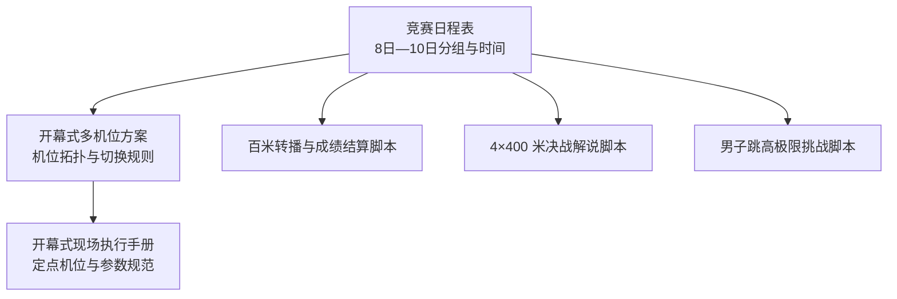
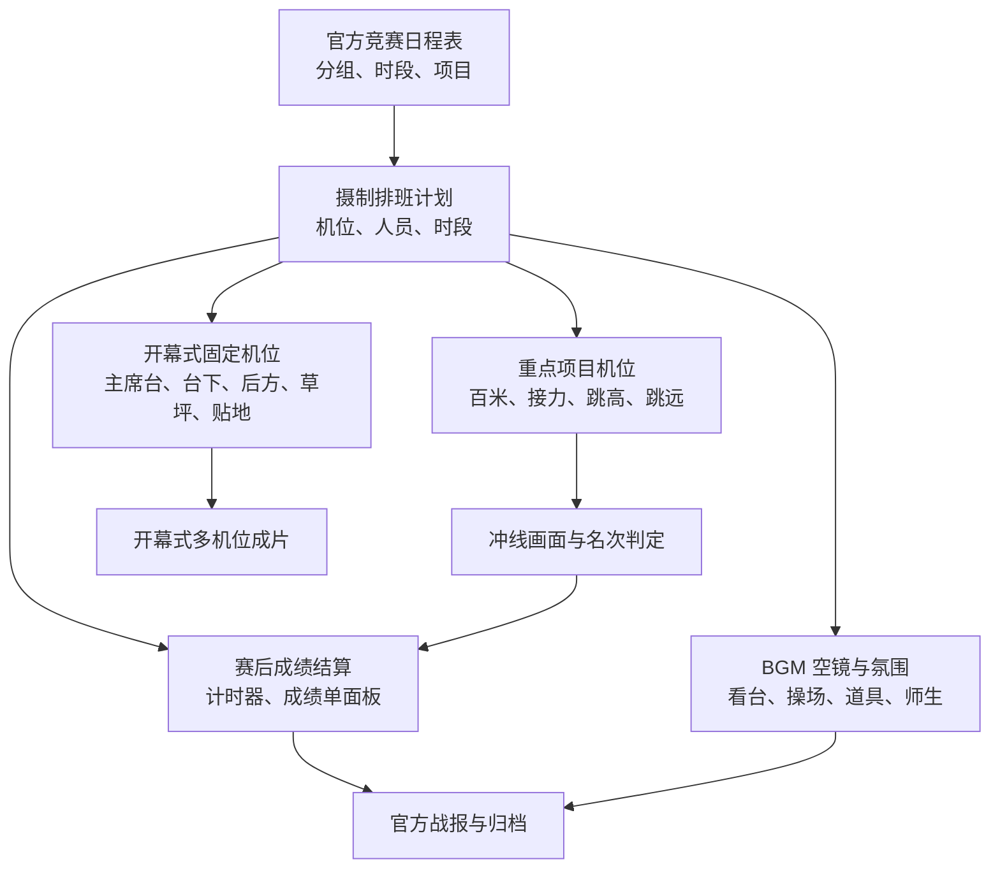
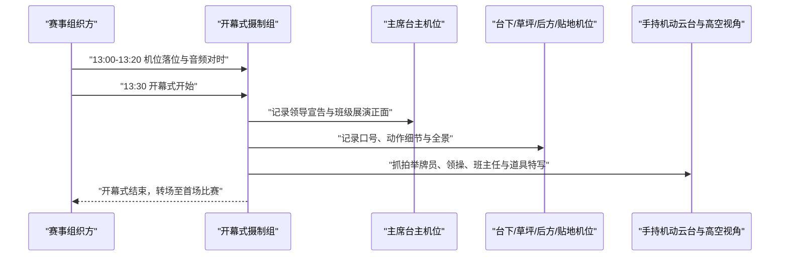
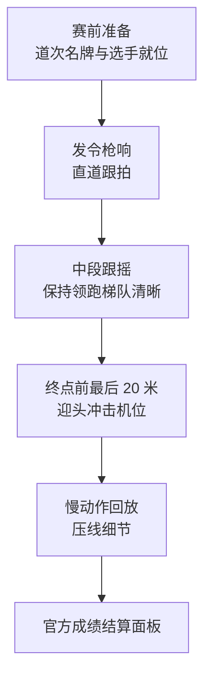
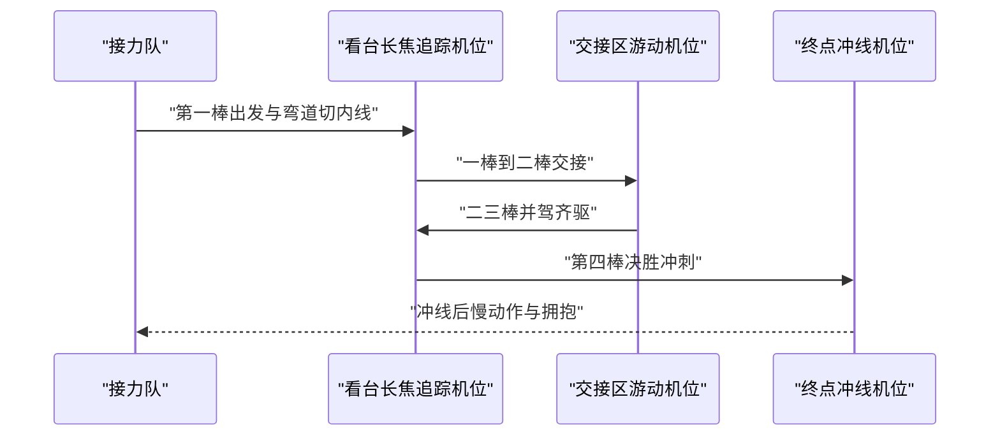
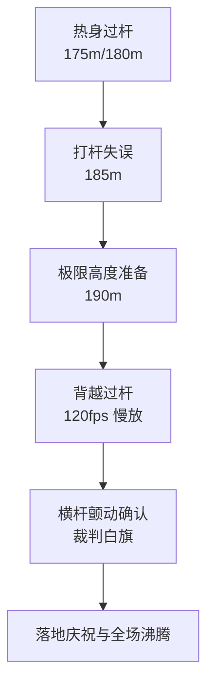
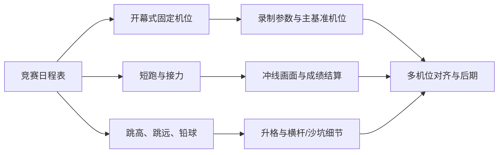

# 赛事日程与排班基础

<cite>
**本文引用的文件**   
- [运动会竞赛日程表.md](file://运动会时间/运动会竞赛日程表.md)
- [运动会时间/秩序册.md](file://运动会时间/秩序册.md)
- [人员/人员花名册.md](file://人员/人员花名册.md)
- [开幕式多机位协同与实况方案.md](file://视频03_开幕式多机位实况/开幕式多机位协同与实况方案.md)
- [开幕式现场机位部署与拍摄执行手册.md](file://视频03_开幕式多机位实况/开幕式现场机位部署与拍摄执行手册.md)
- [开幕式多机位实况_最终脚本.md](file://成品脚本/03_开幕式多机位实况_最终脚本.md)
- [疏附三中高三女子百米电视转播与成绩结算脚本.md](file://参考视频脚本/16_疏附三中高三女子百米电视转播与成绩结算脚本.md)
- [北京体育大学4x400米最强决战解说脚本.md](file://参考视频脚本/22_北京体育大学4x400米最强决战解说脚本.md)
- [男子跳高1米90背越式极限挑战高光脚本.md](file://参考视频脚本/30_男子跳高1米90背越式极限挑战高光脚本.md)
</cite>

## 目录
1. [引言](#引言)
2. [项目结构](#项目结构)
3. [核心组件](#核心组件)
4. [架构总览](#架构总览)
5. [详细组件分析](#详细组件分析)
6. [依赖关系分析](#依赖关系分析)
7. [性能与拍摄效率建议](#性能与拍摄效率建议)
8. [故障排查与排班注意事项](#故障排查与排班注意事项)
9. [结论](#结论)
10. [附录：赛程到摄制任务映射表](#附录赛程到摄制任务映射表)

## 引言
本文件以《浙江省春晖中学 2026 年校运会竞赛日程表》为唯一权威依据，将官方竞赛日程转化为摄制组可用的“赛事日程与排班基础”。重点说明：
- 开幕式方阵进场、径赛预赛与决赛、接力赛、跳高、跳远、短跑等关键时间节点如何影响多机位调度；
- 上午、下午时段的光线与人员轮班差异；
- 固定机位、重点项目跟拍、赛后成绩结算镜头与 BGM 空镜的采集策略；
- 赛程临时调整时的信息同步方式、重要决赛冗余机位建议，以及避免错过冲线画面的时间码管理建议。

## 项目结构
本项目围绕“竞赛日程—摄制方案—参考脚本”三层组织：
- 日程层：统一来自运动会官方秩序册整理的日程文档；
- 执行层：开幕式多机位部署、机位职责、参数规范；
- 参考层：单项转播范式（百米、4×400 米、跳高）提供分镜、机位与包装模板。

图表来源
- [运动会竞赛日程表.md:1-147](file://运动会时间/运动会竞赛日程表.md#L1-L147)
- [开幕式多机位协同与实况方案.md:1-75](file://视频03_开幕式多机位实况/开幕式多机位协同与实况方案.md#L1-L75)
- [开幕式现场机位部署与拍摄执行手册.md:1-156](file://视频03_开幕式多机位实况/开幕式现场机位部署与拍摄执行手册.md#L1-L156)
- [疏附三中高三女子百米电视转播与成绩结算脚本.md:1-89](file://参考视频脚本/16_疏附三中高三女子百米电视转播与成绩结算脚本.md#L1-L89)
- [北京体育大学4x400米最强决战解说脚本.md:1-79](file://参考视频脚本/22_北京体育大学4x400米最强决战解说脚本.md#L1-L79)
- [男子跳高1米90背越式极限挑战高光脚本.md:1-80](file://参考视频脚本/30_男子跳高1米90背越式极限挑战高光脚本.md#L1-L80)

章节来源
- [运动会竞赛日程表.md:1-147](file://运动会时间/运动会竞赛日程表.md#L1-L147)
- [开幕式多机位协同与实况方案.md:1-75](file://视频03_开幕式多机位实况/开幕式多机位协同与实况方案.md#L1-L75)

## 核心组件
### 1. 竞赛日程与摄制优先级
- 开幕式是全场最高优先级的固定机位采集任务；
- 短跑决赛（100 米、200 米）、接力赛（4×100 米、4×400 米混合接力）、跳高、跳远属于重点田径项目，需要独立机位或冗余机位；
- 团体类比赛（仰卧起坐、引体向上、50 米团体）适合用中远景和空镜补帧，不占用核心冲刺机位。

### 2. 固定机位体系
开幕式已形成较完整的固定机位体系，包括主席台主机位、台下主力机位、后方越肩机位、草坪全景机位、跑道中线贴地机位，以及手持机动云台与延长杆高空视角。该体系可直接迁移到部分田赛区域作为基准机位。

### 3. 单项转播范式
- 百米：起跑道次信息、直道跟拍、终点撞线判定、慢动作回放、官方成绩结算面板；
- 4×400 米：长距离追踪、交接区特写、弯道超车与最后一棒决胜；
- 跳高：阶梯高度递进、失败铺垫、120fps 过杆慢放、横杆颤动确认。

章节来源
- [开幕式多机位协同与实况方案.md:1-75](file://视频03_开幕式多机位实况/开幕式多机位协同与实况方案.md#L1-L75)
- [开幕式现场机位部署与拍摄执行手册.md:1-156](file://视频03_开幕式多机位实况/开幕式现场机位部署与拍摄执行手册.md#L1-L156)
- [开幕式多机位实况_最终脚本.md:1-157](file://成品脚本/03_开幕式多机位实况_最终脚本.md#L1-L157)
- [疏附三中高三女子百米电视转播与成绩结算脚本.md:1-89](file://参考视频脚本/16_疏附三中高三女子百米电视转播与成绩结算脚本.md#L1-L89)
- [北京体育大学4x400米最强决战解说脚本.md:1-79](file://参考视频脚本/22_北京体育大学4x400米最强决战解说脚本.md#L1-L79)
- [男子跳高1米90背越式极限挑战高光脚本.md:1-80](file://参考视频脚本/30_男子跳高1米90背越式极限挑战高光脚本.md#L1-L80)

## 架构总览
以下图展示“日程驱动摄制”的端到端流程：日程确定时间与分组，摄制组据此分配机位、人员和素材采集计划；后期根据多机位与参考脚本进行剪辑与成绩结算包装。

图表来源
- [运动会竞赛日程表.md:1-147](file://运动会时间/运动会竞赛日程表.md#L1-L147)
- [开幕式多机位协同与实况方案.md:1-75](file://视频03_开幕式多机位实况/开幕式多机位协同与实况方案.md#L1-L75)
- [开幕式现场机位部署与拍摄执行手册.md:1-156](file://视频03_开幕式多机位实况/开幕式现场机位部署与拍摄执行手册.md#L1-L156)
- [疏附三中高三女子百米电视转播与成绩结算脚本.md:1-89](file://参考视频脚本/16_疏附三中高三女子百米电视转播与成绩结算脚本.md#L1-L89)

## 详细组件分析

### 开幕式：固定机位与人员轮班
- 开幕式在 8 日下午 13:30 开始，随后进入径赛和田赛。开幕式必须提前完成音频对时、机位落位与主基准机位开机；
- 固定机位体系包含主席台主机位、台下主力机位、后方越肩机位、草坪全景机位、跑道中线贴地机位，并配合手持机动云台与延长杆高空视角；
- 录制纪律强调尽量长录、少分段，便于后期基于音轨波形自动对齐；主基准机位需全程不断流；
- 人员轮班建议：开幕式由开幕式专项小组负责，其他机位人员可在开幕式结束后快速转场至当天第一场重点项目。

图表来源
- [开幕式多机位协同与实况方案.md:1-75](file://视频03_开幕式多机位实况/开幕式多机位协同与实况方案.md#L1-L75)
- [开幕式现场机位部署与拍摄执行手册.md:1-156](file://视频03_开幕式多机位实况/开幕式现场机位部署与拍摄执行手册.md#L1-L156)
- [开幕式多机位实况_最终脚本.md:1-157](file://成品脚本/03_开幕式多机位实况_最终脚本.md#L1-L157)

章节来源
- [开幕式多机位协同与实况方案.md:1-75](file://视频03_开幕式多机位实况/开幕式多机位协同与实况方案.md#L1-L75)
- [开幕式现场机位部署与拍摄执行手册.md:1-156](file://视频03_开幕式多机位实况/开幕式现场机位部署与拍摄执行手册.md#L1-L156)
- [开幕式多机位实况_最终脚本.md:1-157](file://成品脚本/03_开幕式多机位实况_最终脚本.md#L1-L157)

### 短跑决赛：百米与 200 米的时间节点与冲线保护
- 8 日下午先进行 100 米预赛与 400 米决赛，9 日上午集中多个年级 100 米决赛，10 日上午集中 200 米决赛；
- 短跑决赛应配置至少两个机位：直道跟拍机位与终点撞线判定机位；
- 冲线前需预留缓冲空间，避免运动员惯性冲撞；终点机位应位于安全区域外侧；
- 参考脚本建议采用实时计时器、冲线定格慢放与官方成绩结算面板，形成标准化单项转播闭环。

图表来源
- [运动会竞赛日程表.md:1-147](file://运动会时间/运动会竞赛日程表.md#L1-L147)
- [疏附三中高三女子百米电视转播与成绩结算脚本.md:1-89](file://参考视频脚本/16_疏附三中高三女子百米电视转播与成绩结算脚本.md#L1-L89)

章节来源
- [运动会竞赛日程表.md:1-147](file://运动会时间/运动会竞赛日程表.md#L1-L147)
- [疏附三中高三女子百米电视转播与成绩结算脚本.md:1-89](file://参考视频脚本/16_疏附三中高三女子百米电视转播与成绩结算脚本.md#L1-L89)

### 接力赛：4×100 米与 4×400 米混合接力的交接区与压轴叙事
- 8 日下午出现多个年级 4×100 米决赛；10 日下午安排各年级 4×400 米混合接力；
- 接力赛的关键在于交接区衔接、弯道切内线与最后一棒决胜；
- 推荐机位：看台高位长焦追踪机位 + 交接区内圈游动机位；
- 叙事节奏应体现“第一棒抢道→二三棒胶着→第四棒锚定决战”的情绪曲线，并在冲线后保留运动员疲惫与队友搀扶的画面。

图表来源
- [运动会竞赛日程表.md:1-147](file://运动会时间/运动会竞赛日程表.md#L1-L147)
- [北京体育大学4x400米最强决战解说脚本.md:1-79](file://参考视频脚本/22_北京体育大学4x400米最强决战解说脚本.md#L1-L79)

章节来源
- [运动会竞赛日程表.md:1-147](file://运动会时间/运动会竞赛日程表.md#L1-L147)
- [北京体育大学4x400米最强决战解说脚本.md:1-79](file://参考视频脚本/22_北京体育大学4x400米最强决战解说脚本.md#L1-L79)

### 跳高：阶梯高度递进与横杆颤动确认
- 日程中包含多个年级跳高决赛，集中在上午与下午多个时段；
- 拍摄应采用双机高低角配合：海绵垫侧前方低角度主机与助跑起点侧方长焦机；
- 关键画面包括热身过杆、打杆失误、极限高度成功过杆、横杆颤动确认与裁判白旗示意；
- 建议使用 120fps 升格，确保空中姿态与横杆微小距离清晰无拖影。

图表来源
- [运动会竞赛日程表.md:1-147](file://运动会时间/运动会竞赛日程表.md#L1-L147)
- [男子跳高1米90背越式极限挑战高光脚本.md:1-80](file://参考视频脚本/30_男子跳高1米90背越式极限挑战高光脚本.md#L1-L80)

章节来源
- [运动会竞赛日程表.md:1-147](file://运动会时间/运动会竞赛日程表.md#L1-L147)
- [男子跳高1米90背越式极限挑战高光脚本.md:1-80](file://参考视频脚本/30_男子跳高1米90背越式极限挑战高光脚本.md#L1-L80)

### 跳远与铅球：中远景与空镜补充
- 跳远与铅球参赛人数较多，适合使用中长焦记录试跳/试投过程、落地沙坑与结果测量；
- 若短跑或接力冲突，可临时将其中一台非重点机位转为跳远/铅球中远景，同时保留操场、看台、道具、师生互动等 BGM 空镜。

章节来源
- [运动会竞赛日程表.md:1-147](file://运动会时间/运动会竞赛日程表.md#L1-L147)

### 赛后成绩结算与 BGM 空镜策略
- 单项完成后应尽快采集官方成绩结算数据，结合参考脚本中的道次信息、实时计时器与全屏成绩面板模板生成战报；
- BGM 空镜建议覆盖：开幕式退场、操场全景、看台人浪、班主任与同班同学欢呼、道具细节、选手休息与补水；
- 空镜可用于填补剪辑空隙、过渡不同项目段落，以及制作短视频平台的二次传播内容。

章节来源
- [疏附三中高三女子百米电视转播与成绩结算脚本.md:1-89](file://参考视频脚本/16_疏附三中高三女子百米电视转播与成绩结算脚本.md#L1-L89)

## 依赖关系分析
竞赛日程是摄制排班的上游输入；开幕式方案提供固定机位与参数规范；单项参考脚本提供分镜、机位与包装模板。三者共同决定人员轮班、素材采集计划与后期产出。

图表来源
- [运动会竞赛日程表.md:1-147](file://运动会时间/运动会竞赛日程表.md#L1-L147)
- [开幕式多机位协同与实况方案.md:1-75](file://视频03_开幕式多机位实况/开幕式多机位协同与实况方案.md#L1-L75)
- [开幕式现场机位部署与拍摄执行手册.md:1-156](file://视频03_开幕式多机位实况/开幕式现场机位部署与拍摄执行手册.md#L1-L156)
- [疏附三中高三女子百米电视转播与成绩结算脚本.md:1-89](file://参考视频脚本/16_疏附三中高三女子百米电视转播与成绩结算脚本.md#L1-L89)
- [男子跳高1米90背越式极限挑战高光脚本.md:1-80](file://参考视频脚本/30_男子跳高1米90背越式极限挑战高光脚本.md#L1-L80)

章节来源
- [运动会竞赛日程表.md:1-147](file://运动会时间/运动会竞赛日程表.md#L1-L147)
- [开幕式多机位协同与实况方案.md:1-75](file://视频03_开幕式多机位实况/开幕式多机位协同与实况方案.md#L1-L75)
- [开幕式现场机位部署与拍摄执行手册.md:1-156](file://视频03_开幕式多机位实况/开幕式现场机位部署与拍摄执行手册.md#L1-L156)

## 性能与拍摄效率建议
- 所有机型尽量长录、少分段，便于后期基于音轨波形自动对齐；
- 统一帧率与白平衡，减少后期色彩与时间轴对齐成本；
- 主基准机位全程不断流，作为时间线锚点；
- 重点项目使用升格慢放，但需注意存储与电量管理；
- 接力与短跑决赛期间，机位间应保持视线互不遮挡，避免频繁走位造成画面丢失。

[本节为通用指导，不直接分析具体文件]

## 故障排查与排班注意事项

### 摄制组全员参赛排查与避让排班机制
根据官方 [运动会时间/秩序册.md](file://运动会时间/秩序册.md) 64 页全册运动员名单核对，新媒体社共有 **5 名同学** 参加个人单项比赛。根据比赛“提前 30 分钟检录，三次不到自动弃权”的刚性要求，摄制组排班必须严格避开其受阻时段：

1. **10 月 8 日（第一天下午）**：
   - **14:40** | 高一男子 100米 预赛（第 4 组 第 3 道）：**陈怀恒**（高一 11 班 `0205`），离岗时段 `14:10~15:00`
   - **15:15** | 高三男子 100米 预赛（第 2 组 第 1 道）：**任煜成**（高三 11 班 `0827`），离岗时段 `14:45~15:35`
   - **16:00** | 高三女子 100米 预赛（第 4 组 第 2 道）：**张慈恩**（高三 14 班 `0893`），离岗时段 `15:30~16:20`
   - **16:10** | 高二女子 跳远 决赛（第 19 签位）：**沈栋亿**（高二 13 班 `0596`），离岗时段 `15:40~17:00`（田赛耗时较长）
2. **10 月 9 日（第二天）**：
   - **上午潜在 100米 决赛（10:10~10:40）**：若陈怀恒、任煜成、张慈恩晋级，需预留 `09:40~10:55` 离岗
   - **14:30** | 高一男生 200米 预赛（第 5 组 第 3 道）：**陈怀恒**（高一 11 班 `0205`），离岗时段 `14:00~14:55`
   - **15:05** | 高三男生 200米 预赛（第 5 组 第 4 道）：**任煜成**（高三 11 班 `0827`），离岗时段 `14:35~15:30`
   - **15:35** | 高二女生 200米 预赛（第 1 组 第 2 道）：**沈栋亿**（高二 13 班 `0596`），离岗时段 `15:05~16:00`
3. **10 月 10 日（第三天上午）**：
   - **09:25** | 高一女子 800米 决赛（第 1 组 第 6 位）：**丁子妍**（高一 9 班 `0177`），离岗时段 `08:55~09:50`
   - **上午潜在 200米 决赛（10:00~10:25）**：若陈怀恒、任煜成、沈栋亿晋级，需预留 `09:30~10:35` 离岗
4. **统筹与指导教师状态**：
   - **沈栋忆**（机位统筹搭档）：在 8 日下午（跳远）与 9 日下午（200米）自身需检录参赛，现场调度由总策划傅梓浩代为统筹。
   - **钟志华老师**（指导老师）：经秩序册裁判员名单核实，**无任何执裁任务**，全赛程可专注于摄制统筹与质量把关。

### 赛程临时调整时的信息同步方式
- 建立摄制组内部即时通讯群，指定一名调度负责人接收组委会变更通知；
- 每次调整后更新共享排班表，明确下一小时重点机位、备用机位与人员轮换；
- 对即将开始的决赛项目设置提前 10 分钟提醒，确保机位与电池、存储卡就绪；
- 若开幕式或重点项目时间推迟，立即暂停非紧急机位录制，回收人员支援关键赛道。

章节来源
- [开幕式多机位协同与实况方案.md:1-75](file://视频03_开幕式多机位实况/开幕式多机位协同与实况方案.md#L1-L75)

### 重要决赛项目的冗余机位建议
- 百米、200 米、4×100 米、4×400 米混合接力、跳高、跳远建议至少两个机位；
- 冲线机位应独立于直道跟拍机位，避免同一机位因跟拍延迟而错过压线；
- 接力赛应在交接区与终点分别布设机位，防止交接失误或掉棒画面遗漏；
- 若设备不足，可将开幕式固定机位中的一台非主视角机位临时改为重点项目备份机位。

章节来源
- [开幕式现场机位部署与拍摄执行手册.md:1-156](file://视频03_开幕式多机位实况/开幕式现场机位部署与拍摄执行手册.md#L1-L156)
- [北京体育大学4x400米最强决战解说脚本.md:1-79](file://参考视频脚本/22_北京体育大学4x400米最强决战解说脚本.md#L1-L79)

### 避免错过关键冲线画面的时间码管理建议
- 每个重点项目开始前，所有机位统一录音并开启时间码或同步声标记；
- 发令枪、广播口令、裁判哨声作为时间码对齐锚点；
- 冲线前后各多录 5-10 秒，确保不会因过早停机错过胜负瞬间；
- 成绩结算阶段继续录制裁判签字、成绩单公布与选手反应，便于后期选择最佳收尾镜头。

章节来源
- [疏附三中高三女子百米电视转播与成绩结算脚本.md:1-89](file://参考视频脚本/16_疏附三中高三女子百米电视转播与成绩结算脚本.md#L1-L89)
- [开幕式现场机位部署与拍摄执行手册.md:1-156](file://视频03_开幕式多机位实况/开幕式现场机位部署与拍摄执行手册.md#L1-L156)

## 结论
通过将官方竞赛日程转化为摄制排班依据，可以明确开幕式固定机位、重点田径项目跟拍、赛后成绩结算镜头与 BGM 空镜的职责分工。结合现有开幕式多机位方案与单项转播参考脚本，摄制组可在有限设备条件下获得稳定、专业且可复用的赛事影像产出。关键在于：以日程驱动机位与人员轮班，以冗余机位保障冲线画面，以时间码与音频对齐提升后期效率，并以灵活的信息同步应对赛程临时调整。

[本节为总结性内容，不直接分析具体文件]

## 附录：赛程到摄制任务映射表
以下为从日程表中提取的主要摄制任务映射，用于排班与机位分配参考。

| 日期 | 时段 | 主要项目 | 摄制任务 | 机位建议 | 注意事项 |
|---|---|---|---|---|---|
| 8 日下午 | 13:30 | 开幕式 | 固定机位全量采集、音频对时、主基准机位不断流 | 主席台主机位、台下主力、后方越肩、草坪全景、贴地机位、手持机动与高空视角 | 长录少分段，后期基于音轨对齐 |
| 8 日下午 | 14:40 起 | 100 米预赛、400 米决赛 | 预赛可用中远景，400 米决赛关注冲线与成绩结算 | 直道跟拍机位、终点机位 | 避免逆光，注意终点缓冲安全 |
| 8 日下午 | 15:10 起 | 跳远、跳高、铅球等多项田赛 | 记录试跳/试投、落地、成绩测量与空镜 | 中长焦机位、空镜头机位 | 与短跑/接力冲突时降级为中远景 |
| 9 日上午 | 07:50 起 | 团体赛、跳高、跳远、铅球、立定跳远 | 早场光线较弱，注意曝光与白平衡 | 定点机位、空镜机位 | 提前预热设备，注意低温与电池续航 |
| 9 日上午 | 10:10-10:40 | 多个年级 100 米决赛 | 重点短跑决赛，冲线与成绩结算 | 直道跟拍机位、终点机位、成绩结算机位 | 冗余机位保障冲线画面 |
| 9 日下午 | 14:30 起 | 跳高、铅球、跳远等 | 记录田赛决赛与团体赛 | 定点机位、空镜机位 | 避开跑道人群，注意器材安全 |
| 9 日下午 | 16:10 起 | 4×100 米决赛 | 接力交接区与终点冲线 | 看台长焦追踪机位、交接区游动机位、终点机位 | 交接失误与掉棒画面不可漏拍 |
| 10 日上午 | 08:40-10:25 | 800 米、1000 米、200 米决赛 | 中长跑关注最后直道冲刺，短跑关注冲线 | 终点机位、看台追踪机位 | 中长跑避免全程跟拍，聚焦冲刺段 |
| 10 日下午 | 12:50-14:10 | 4×400 米混合接力 | 压轴项目，长距离战术与最后一棒决胜 | 看台长焦追踪机位、交接区机位、终点机位 | 下午斜阳利于剪影与逆光画面 |

章节来源
- [运动会竞赛日程表.md:1-147](file://运动会时间/运动会竞赛日程表.md#L1-L147)