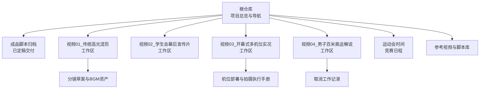
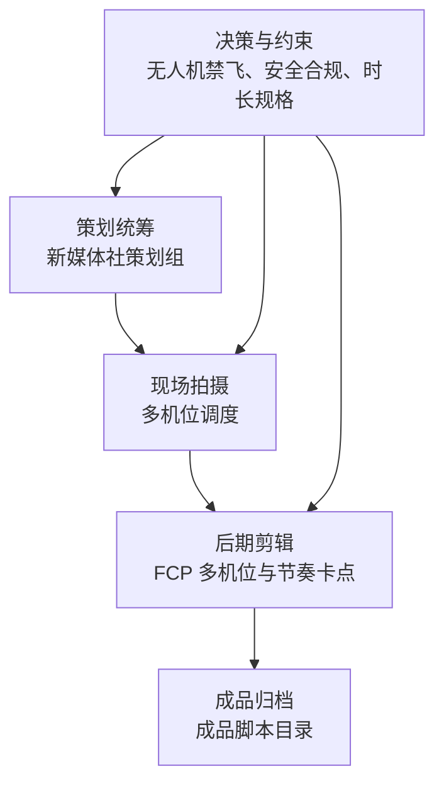
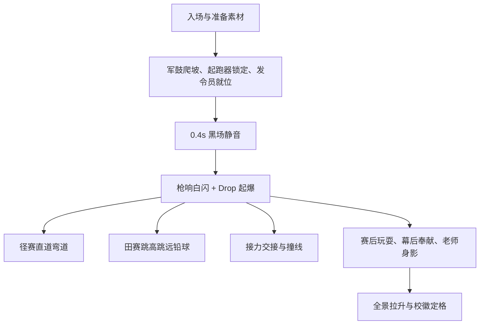
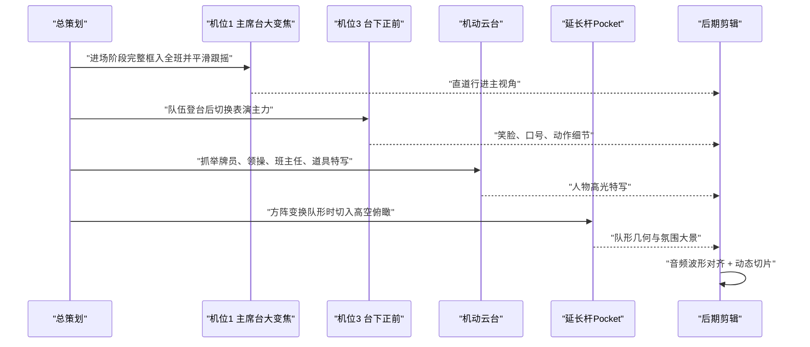
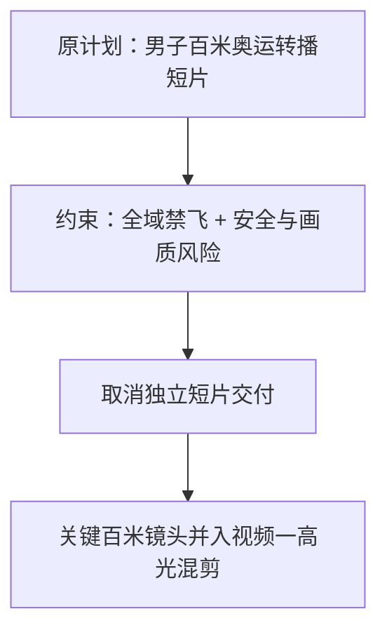
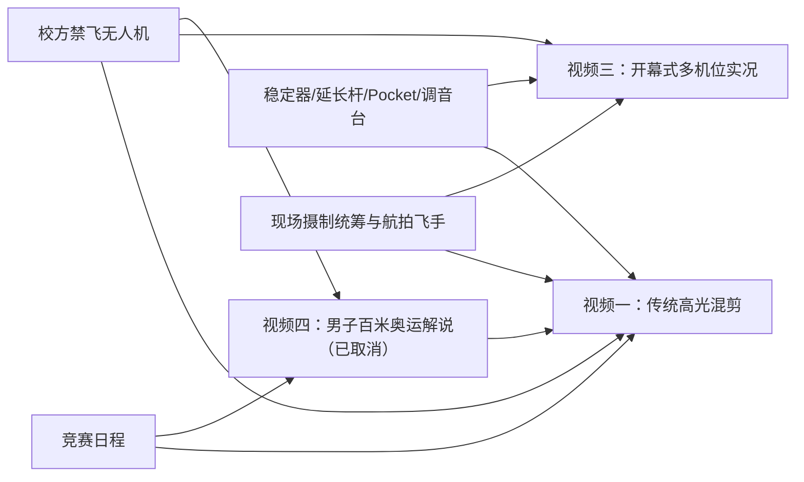
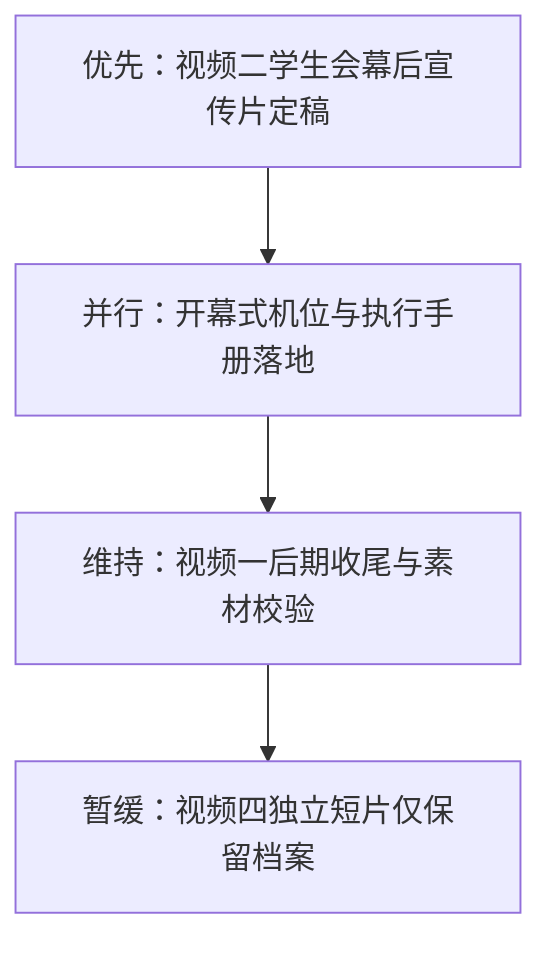

# 项目总控与决策追踪

<cite>
**本文引用的文件**   
- [README.md](file://README.md)
- [视频01_传统高光混剪/工作记录.md](file://视频01_传统高光混剪/工作记录.md)
- [视频02_学生会幕后宣传片/工作记录.md](file://视频02_学生会幕后宣传片/工作记录.md)
- [视频03_开幕式多机位实况/工作记录.md](file://视频03_开幕式多机位实况/工作记录.md)
- [视频04_男子百米奥运解说/工作记录.md](file://视频04_男子百米奥运解说/工作记录.md)
- [成品脚本/01_传统高光混剪_最终脚本.md](file://成品脚本/01_传统高光混剪_最终脚本.md)
- [成品脚本/03_开幕式多机位实况_最终脚本.md](file://成品脚本/03_开幕式多机位实况_最终脚本.md)
- [视频01_传统高光混剪/分镜草案_v1.md](file://视频01_传统高光混剪/分镜草案_v1.md)
- [视频03_开幕式多机位实况/开幕式现场机位部署与拍摄执行手册.md](file://视频03_开幕式多机位实况/开幕式现场机位部署与拍摄执行手册.md)
</cite>

## 目录
1. [引言](#引言)
2. [项目结构](#项目结构)
3. [核心组件](#核心组件)
4. [架构总览](#架构总览)
5. [详细组件分析](#详细组件分析)
6. [依赖关系分析](#依赖关系分析)
7. [性能与规格要求](#性能与规格要求)
8. [决策追踪记录](#决策追踪记录)
9. [近期优先推进事项](#近期优先推进事项)
10. [故障排查指南](#故障排查指南)
11. [结论](#结论)

## 引言
本文件是浙江省春晖中学 2026 年校运会视频制作工程的“单一事实来源摘要”。它把需求梳理、产出方向筛选、人员与器材现状、无人机禁飞后的替代方案、发布渠道与画面规格，以及关键决策如何影响后续分镜、机位部署和后期剪辑整合在一起。目标读者包括总策划、现场摄制统筹、后期剪辑同学以及后续届次复用团队。

## 项目结构
工程按“根总览 + 过程工作区 + 成品脚本归档 + 参考库”组织：
- 根目录 README 说明项目目标、团队分工、四大核心产出状态、目录结构与文档导航。
- `成品脚本/` 集中存放已定稿交付的完整脚本。
- `视频01/02/03/04/` 为各视频的过程工作区，存放分镜草案、BGM 选型、工作记录、机位手册等。
- `运动会时间/` 保存官方竞赛日程与秩序册图片。
- `参考视频/` 与 `参考视频脚本/` 提供标杆原片与逐镜拆解方案。

**图示来源**  
- [README.md:1-85](file://README.md#L1-L85)

**章节来源**  
- [README.md:1-85](file://README.md#L1-L85)

## 核心组件
本项目围绕四项备选产出展开，并最终聚焦三项主要产出：
1. **视频一：传统高光混剪**  
   - 风格：高燃 MV 三段式（蓄势破晓 → 全域狂飙 → 青春温情）。  
   - 状态：已定稿交付。  
   - 核心资产：工程主 BGM《Vicetone - Nevada》三段式音频、节拍时码分析、v3.0 分镜草案、最终成品脚本。
2. **视频二：学生会幕后宣传片**  
   - 风格：纪实叙事 / Vlog 双线对照。  
   - 状态：策划与分镜草案就绪，待选定 BGM 并导出最终脚本。  
   - 核心线索：工作证 + POV 沉浸镜头。
3. **视频三：开幕式多机位实况**  
   - 风格：电视台转播级全流程多机位录制。  
   - 状态：已定稿交付；配套开幕式精彩小混剪思路指南。  
   - 核心体系：5 路定点 + 1 路机动特写 + 延长杆 Pocket 模拟航拍。
4. **视频四：男子百米奥运解说短片**  
   - 风格：CCTV-5 奥运转播规格。  
   - 状态：已正式取消，不再进入最终交付流程。

**章节来源**  
- [README.md:18-44](file://README.md#L18-L44)
- [视频01_传统高光混剪/工作记录.md:1-94](file://视频01_传统高光混剪/工作记录.md#L1-L94)
- [视频02_学生会幕后宣传片/工作记录.md:1-30](file://视频02_学生会幕后宣传片/工作记录.md#L1-L30)
- [视频03_开幕式多机位实况/工作记录.md:1-113](file://视频03_开幕式多机位实况/工作记录.md#L1-L113)
- [视频04_男子百米奥运解说/工作记录.md:1-29](file://视频04_男子百米奥运解说/工作记录.md#L1-L29)

## 架构总览
从总控视角看，项目由“策划统筹 → 现场拍摄 → 后期剪辑 → 成品归档”构成闭环，并以“决策记录”贯穿全程。

该架构中：
- 策划层负责脚本框架、赛事研判、产出方向筛选与决策同步。
- 拍摄层依据最终脚本与机位手册执行定点、机动与地面高机位策略。
- 后期层依据三段式情感曲线、节拍时码、波形对齐规则完成剪辑。
- 决策层通过禁飞、安全、资源限制直接改变分镜与机位设计。

**图示来源**  
- [README.md:1-85](file://README.md#L1-L85)
- [视频03_开幕式多机位实况/开幕式现场机位部署与拍摄执行手册.md:1-168](file://视频03_开幕式多机位实况/开幕式现场机位部署与拍摄执行手册.md#L1-L168)
- [成品脚本/01_传统高光混剪_最终脚本.md:1-92](file://成品脚本/01_传统高光混剪_最终脚本.md#L1-L92)

## 详细组件分析

### 视频一：传统高光混剪
#### 定位与交付
- 成片时长约 95 秒，严格匹配 124 BPM 三段式音乐结构。
- 已定稿交付至 `成品脚本/01_传统高光混剪_最终脚本.md`。
- 强调“画面内容均为参考，实操可自由替换”，避免生搬硬套具体班级或人物。

#### 筛选与决策要点
- 放弃周杰伦《龙拳》等候选曲目，选择《Vicetone - Nevada》作为工程主 BGM。
- 引入“蓄力呼吸黑场转折”：在 Drop 前留白 0.3~0.5 秒纯黑，配合发令口令与心跳音效，制造动静反差。
- 采用运动形态分幕、升格慢动作急刹车、现场原声刺破、景别尺度拉扯等策略，解决 Drop 段落视觉疲劳问题。
- 分镜草案 v3.0 明确“前不劲爆 → 中劲爆 → 后不劲爆”三段式，并按短跑、中长跑、接力、跳高、跳远、铅球、团体赛、幕后与老师等分类给出拍摄重点。

#### 对分镜、机位与后期的影响
- 分镜：以 0.4 秒黑场为中枢，前半段准备期、中段竞技爆发、后半段温情收尾。
- 机位：贴地跟跑、长焦捕捉、终点冲刺、120fps 升格；同时明确严禁无人机，改用延长杆与看台高层长焦。
- 后期：基于 124 BPM 节拍表、多轨音频分轨、黑场切静、Drop 快剪与慢动作变速。

**图示来源**  
- [成品脚本/01_传统高光混剪_最终脚本.md:1-92](file://成品脚本/01_传统高光混剪_最终脚本.md#L1-L92)
- [视频01_传统高光混剪/工作记录.md:1-94](file://视频01_传统高光混剪/工作记录.md#L1-L94)

**章节来源**  
- [视频01_传统高光混剪/工作记录.md:1-94](file://视频01_传统高光混剪/工作记录.md#L1-L94)
- [成品脚本/01_传统高光混剪_最终脚本.md:1-92](file://成品脚本/01_传统高光混剪_最终脚本.md#L1-L92)
- [视频01_传统高光混剪/分镜草案_v1.md:1-100](file://视频01_传统高光混剪/分镜草案_v1.md#L1-L100)

### 视频二：学生会幕后宣传片
#### 定位与交付
- 主题：赛场前台热血竞速与幕后守护双线对照。
- 视觉主线：工作证 + POV 沉浸微镜头。
- 建议时长：2 分 15 秒 ~ 2 分 35 秒。
- 状态：策划与分镜草案就绪，尚未选定工程主 BGM，也未导出最终脚本。

#### 对后续工作的影响
- 拍摄需覆盖检录核对、终点记分、器材搬运、广播站念稿、医疗急救等真实幕后场景。
- 后期需要建立“前台 vs 幕后”交叉叙事骨架，并保留一定创作空间给高一剪辑同学。
- 当前优先级低于已定稿的视频一和视频三，但高于已取消的视频四。

**章节来源**  
- [视频02_学生会幕后宣传片/工作记录.md:1-30](file://视频02_学生会幕后宣传片/工作记录.md#L1-L30)

### 视频三：开幕式多机位实况
#### 定位与交付
- 目标：电视台转播级全流程多机位录制，完整收录全校班级入场式与台前展演。
- 已定稿交付至 `成品脚本/03_开幕式多机位实况_最终脚本.md`。
- 配套：开幕式精彩小混剪思路指南面向社团剪辑同学开放 BGM 选择与实战调用规则。

#### 机位体系与参数
- 5 路定点机位：主席台大变焦、草坪正中大会全景、台下正前主力、主席台后方越肩、跑道中线贴地。
- 1 路手持机动云台：专攻举牌员、领操、班主任、特色道具特写。
- 延长杆 Pocket 模拟航拍：Jib-Up、Crane-Pan、Dive-In 三类动态运镜。
- 统一参数：尽量 30fps，手动固定白平衡 5000K，调音台 Line Out 接入机位 1，同时开启机载环境音，利用 FCP 音频波形自动对齐。

#### 无人机禁飞后的替代方案
- 明确全片严禁无人机拍摄。
- 使用 3~4 米延长杆搭载 Pocket，下方手机无线图传远程遥控，实现高空俯拍队形几何点阵。
- 看台顶层三脚架长焦作为远景补充。
- 这些替代方案直接影响开幕式分镜中的“航拍感”镜头与机位部署。

**图示来源**  
- [视频03_开幕式多机位实况/开幕式现场机位部署与拍摄执行手册.md:1-168](file://视频03_开幕式多机位实况/开幕式现场机位部署与拍摄执行手册.md#L1-L168)
- [视频03_开幕式多机位实况/工作记录.md:1-113](file://视频03_开幕式多机位实况/工作记录.md#L1-L113)

**章节来源**  
- [视频03_开幕式多机位实况/工作记录.md:1-113](file://视频03_开幕式多机位实况/工作记录.md#L1-L113)
- [成品脚本/03_开幕式多机位实况_最终脚本.md:1-157](file://成品脚本/03_开幕式多机位实况_最终脚本.md#L1-L157)
- [视频03_开幕式多机位实况/开幕式现场机位部署与拍摄执行手册.md:1-168](file://视频03_开幕式多机位实况/开幕式现场机位部署与拍摄执行手册.md#L1-L168)

### 视频四：男子百米奥运解说短片
#### 取消背景
- 校园全域禁飞无人机，无法安全合规获取空中垂直正视与直道航拍机位。
- 看台斜向下长焦俯拍终点线若强行拉直校正，会产生严重透视畸变与人体失真。
- 终点高空延长杆在现场存在操作难度与安全顾虑。
- 因此该独立短片不再进入最终定稿交付流程。

#### 素材流向
- 男子百米决赛的关键机位仍保持拍摄：起跑特写、跑道外侧低角度跟摇、终点 120fps 慢动作、撞线正面长焦。
- 相关素材全部汇入视频一传统高光混剪的高潮冲刺段落，而不是形成独立奥运转播短片。

**图示来源**  
- [视频04_男子百米奥运解说/工作记录.md:1-29](file://视频04_男子百米奥运解说/工作记录.md#L1-L29)
- [成品脚本/01_传统高光混剪_最终脚本.md:1-92](file://成品脚本/01_传统高光混剪_最终脚本.md#L1-L92)

**章节来源**  
- [视频04_男子百米奥运解说/工作记录.md:1-29](file://视频04_男子百米奥运解说/工作记录.md#L1-L29)

## 依赖关系分析
四个视频并非完全独立，而是共享以下资源与约束：
- 赛程依赖：视频一与视频四都高度依赖男子百米决赛及相关径赛时段。
- 人员依赖：特约航拍机位冯翼原本承担百米直道跟飞与终点判定，取消视频四后其资源更倾向视频一冲刺段落与其他机位协同。
- 器材依赖：稳定器、延长杆、Pocket、调音台、相机与存储卡在各视频间存在共用关系。
- 安全约束：校方禁飞无人机影响视频一、视频三、视频四的高空镜头设计与机位部署。

**图示来源**  
- [README.md:1-85](file://README.md#L1-L85)
- [视频01_传统高光混剪/工作记录.md:1-94](file://视频01_传统高光混剪/工作记录.md#L1-L94)
- [视频03_开幕式多机位实况/工作记录.md:1-113](file://视频03_开幕式多机位实况/工作记录.md#L1-L113)
- [视频04_男子百米奥运解说/工作记录.md:1-29](file://视频04_男子百米奥运解说/工作记录.md#L1-L29)

**章节来源**  
- [README.md:1-85](file://README.md#L1-L85)
- [视频01_传统高光混剪/工作记录.md:1-94](file://视频01_传统高光混剪/工作记录.md#L1-L94)
- [视频03_开幕式多机位实况/工作记录.md:1-113](file://视频03_开幕式多机位实况/工作记录.md#L1-L113)
- [视频04_男子百米奥运解说/工作记录.md:1-29](file://视频04_男子百米奥运解说/工作记录.md#L1-L29)

## 性能与规格要求
### 画面与音频规格
- 视频一传统高光混剪：
  - 成片时长约 95 秒，匹配 124 BPM 三段式音乐。
  - 大量使用 120fps 升格慢动作，强调动静反差与节奏卡点。
  - 明确严禁无人机，所有高空与大远景采用延长杆 Pocket 或看台高层长焦替代。
- 视频三开幕式多机位实况：
  - 尽量统一 30fps，手动固定白平衡 5000K。
  - 调音台 Line Out 接入机位 1，同时保留机载环境音，后期使用音频波形自动对齐。
  - 多机位长录不断流，减少分段以提升后期对齐效率。

### 发布渠道与画面规格
- 根 README 未限定唯一发布平台，但工程参数偏向电子屏幕播放流畅度（30fps 适配 60Hz/120Hz 设备）。
- 开幕式多机位实况采用电视台转播级工业化协同录制，后期通过 FCP 多机位时间线进行实时切片。
- 视频一成品脚本强调画面内容为参考，实际剪辑可按现场高光自由替换，但需保持节奏与情绪弧线一致。

**章节来源**  
- [成品脚本/01_传统高光混剪_最终脚本.md:1-92](file://成品脚本/01_传统高光混剪_最终脚本.md#L1-L92)
- [成品脚本/03_开幕式多机位实况_最终脚本.md:1-157](file://成品脚本/03_开幕式多机位实况_最终脚本.md#L1-L157)
- [视频03_开幕式多机位实况/开幕式现场机位部署与拍摄执行手册.md:1-168](file://视频03_开幕式多机位实况/开幕式现场机位部署与拍摄执行手册.md#L1-L168)

## 决策追踪记录
以下决策条目用于追踪项目总控关键判断及其对分镜、机位与后期的影响。编号便于后续增补。

| 决策编号 | 描述 | 结果 | 关联文件 |
|---|---|---|---|
| D01 | 四项备选产出方向筛选：传统高光混剪、学生会幕后宣传片、开幕式多机位实况、男子百米奥运解说 | 确定前三项为主要产出；视频四因禁飞与安全风险取消 | [README.md:18-44](file://README.md#L18-L44), [视频04_男子百米奥运解说/工作记录.md:1-29](file://视频04_男子百米奥运解说/工作记录.md#L1-L29) |
| D02 | 视频一工程主 BGM 选曲 | 放弃《龙拳》，选定《Vicetone - Nevada》三段式版本 | [视频01_传统高光混剪/工作记录.md:1-94](file://视频01_传统高光混剪/工作记录.md#L1-L94) |
| D03 | 视频一黑场转折与三段式情感曲线 | 确立前不劲爆、中劲爆、后不劲爆，并以 0.4 秒黑场作为节奏中枢 | [视频01_传统高光混剪/工作记录.md:1-94](file://视频01_传统高光混剪/工作记录.md#L1-L94), [成品脚本/01_传统高光混剪_最终脚本.md:1-92](file://成品脚本/01_传统高光混剪_最终脚本.md#L1-L92) |
| D04 | 视频一分镜草案迭代 | 完成 v3.0 三段式实战定型案，按项目分类给出拍摄重点，剔除个人姓名 | [视频01_传统高光混剪/分镜草案_v1.md:1-100](file://视频01_传统高光混剪/分镜草案_v1.md#L1-L100) |
| D05 | 视频三开幕式机位体系定型 | 确立 5 路定点 + 1 路机动特写 + 延长杆 Pocket 模拟航拍 | [视频03_开幕式多机位实况/工作记录.md:1-113](file://视频03_开幕式多机位实况/工作记录.md#L1-L113), [成品脚本/03_开幕式多机位实况_最终脚本.md:1-157](file://成品脚本/03_开幕式多机位实况_最终脚本.md#L1-L157) |
| D06 | 视频三技术参数标准化 | 统一 30fps、手动 5000K 白平衡、调音台直连与环境音双轨、音频波形对齐 | [视频03_开幕式多机位实况/开幕式现场机位部署与拍摄执行手册.md:1-168](file://视频03_开幕式多机位实况/开幕式现场机位部署与拍摄执行手册.md#L1-L168) |
| D07 | 无人机禁飞替代方案 | 全片严禁无人机，改用 3~4 米延长杆加 Pocket 云台、看台高层长焦 | [成品脚本/01_传统高光混剪_最终脚本.md:1-92](file://成品脚本/01_传统高光混剪_最终脚本.md#L1-L92), [视频03_开幕式多机位实况/开幕式现场机位部署与拍摄执行手册.md:1-168](file://视频03_开幕式多机位实况/开幕式现场机位部署与拍摄执行手册.md#L1-L168) |
| D08 | 视频四男子百米奥运解说取消 | 因全域禁飞、透视畸变风险与高空延长杆安全问题，取消独立短片 | [视频04_男子百米奥运解说/工作记录.md:1-29](file://视频04_男子百米奥运解说/工作记录.md#L1-L29) |
| D09 | 视频四素材流向调整 | 关键百米镜头并入视频一高光混剪冲刺段落 | [视频04_男子百米奥运解说/工作记录.md:1-29](file://视频04_男子百米奥运解说/工作记录.md#L1-L29), [成品脚本/01_传统高光混剪_最终脚本.md:1-92](file://成品脚本/01_传统高光混剪_最终脚本.md#L1-L92) |

这些决策共同作用：
- D01 与 D08 决定资源向视频一、视频二、视频三倾斜。
- D02 与 D03 决定视频一的剪辑节奏、BGM 结构、黑场位置与情感曲线。
- D04 决定视频一分镜的项目分类与拍摄优先级。
- D05、D06、D07 决定开幕式机位部署、参数标准与地面高机位替代方案。
- D09 将百米关键素材重新导入视频一，使视频一成为百米高潮的主要承载者。

**章节来源**  
- [README.md:18-44](file://README.md#L18-L44)
- [视频01_传统高光混剪/工作记录.md:1-94](file://视频01_传统高光混剪/工作记录.md#L1-L94)
- [视频03_开幕式多机位实况/工作记录.md:1-113](file://视频03_开幕式多机位实况/工作记录.md#L1-L113)
- [视频04_男子百米奥运解说/工作记录.md:1-29](file://视频04_男子百米奥运解说/工作记录.md#L1-L29)
- [成品脚本/01_传统高光混剪_最终脚本.md:1-92](file://成品脚本/01_传统高光混剪_最终脚本.md#L1-L92)
- [成品脚本/03_开幕式多机位实况_最终脚本.md:1-157](file://成品脚本/03_开幕式多机位实况_最终脚本.md#L1-L157)

## 近期优先推进事项
根据当前进度，建议团队按以下优先级推进未完成工作：

1. **优先：视频二学生会幕后宣传片定稿**
   - 选定工程主 BGM 并测定节拍卡点时码。
   - 完成最终脚本导出至 `成品脚本/02_学生会幕后宣传片_最终脚本.md`。
   - 明确采访提纲、部门分工与现场跟拍排班。
   - 关联决策：D01、D02。

2. **并行：开幕式机位与执行手册落地**
   - 将定稿机位与执行手册同步给现场统筹。
   - 落实各机位社团同学与器材排班。
   - 收集各年级各班级方阵入场顺序清单与特色展演标记。
   - 输出剪辑软件多机位时间线音轨自动波形对齐与实时切片实操指南。
   - 关联决策：D05、D06。

3. **维持：视频一后期收尾与素材校验**
   - 校验 95 秒三段式剪辑是否严格匹配 124 BPM 节拍。
   - 确认黑场转折、Drop 起爆、升格慢动作、现场原声透出是否符合最终脚本。
   - 检查百米冲刺段落是否充分吸收视频四取消后流入的关键素材。
   - 关联决策：D02、D03、D04、D09。

4. **暂缓：视频四独立短片**
   - 仅保留过程档案备查，不再投入新资源。
   - 如未来恢复类似项目，需重新评估禁飞政策、机位安全与透视校正可行性。
   - 关联决策：D08。

**章节来源**  
- [视频02_学生会幕后宣传片/工作记录.md:1-30](file://视频02_学生会幕后宣传片/工作记录.md#L1-L30)
- [视频03_开幕式多机位实况/工作记录.md:100-113](file://视频03_开幕式多机位实况/工作记录.md#L100-L113)
- [视频01_传统高光混剪/工作记录.md:85-94](file://视频01_传统高光混剪/工作记录.md#L85-L94)
- [视频04_男子百米奥运解说/工作记录.md:20-29](file://视频04_男子百米奥运解说/工作记录.md#L20-L29)

## 故障排查指南
### 视频一：音频静音与节奏错位
- 现象：早期剪辑片段在后半程出现音频振幅归零或静音断层。
- 原因：滤镜时间戳计算错位导致提前切除。
- 处理：改用底层 PCM 纯净重组，导出无跳剪原版与前奏、高潮分轨，确保 50s~80s 振幅稳定。
- 预防：后续剪辑优先使用工程主 BGM 三段式版本与节拍时码分析手册。

**章节来源**  
- [视频01_传统高光混剪/工作记录.md:20-40](file://视频01_传统高光混剪/工作记录.md#L20-L40)

### 视频三：多机位不同步与色彩不一致
- 现象：后期多机位时间线无法自动对齐，或拼接时颜色差异明显。
- 原因：频繁分段录制、自动白平衡变化、未接入调音台。
- 处理：严格执行长录不断流、统一 30fps、手动固定 5000K 白平衡；机位 1 接入调音台 Line Out 并同时开启机载环境音；利用 FCP 音频波形自动对齐。
- 预防：开机前做三连大拍板或统一口令录音，确保波形对齐点可用。

**章节来源**  
- [视频03_开幕式多机位实况/开幕式现场机位部署与拍摄执行手册.md:120-168](file://视频03_开幕式多机位实况/开幕式现场机位部署与拍摄执行手册.md#L120-L168)

### 视频三：机位 1 衔接抖动与新班级找焦失败
- 现象：上一班级退场后，机位 1 甩镜头追拍下一个班级，造成晃动与构图失误。
- 原因：未在剪辑盲期提前复位。
- 处理：在当前班级展演后半段立即向左平滑摇回直道入口，提前将下一个班级完整框入并对焦。
- 预防：将“提前盲操复位”写入机位培训与现场口令。

**章节来源**  
- [视频03_开幕式多机位实况/开幕式现场机位部署与拍摄执行手册.md:40-110](file://视频03_开幕式多机位实况/开幕式现场机位部署与拍摄执行手册.md#L40-L110)

### 视频四：高空视角不可用
- 现象：无法获得安全的空中垂直正视与直道航拍。
- 原因：校园全域禁飞无人机；看台斜向下长焦校正会产生透视畸变；高空延长杆存在操作难度与安全顾虑。
- 处理：取消独立短片；将关键百米镜头并入视频一高光混剪。
- 预防：任何涉及高空拍摄的方案必须先评估校方禁飞政策与现场安全风险。

**章节来源**  
- [视频04_男子百米奥运解说/工作记录.md:15-29](file://视频04_男子百米奥运解说/工作记录.md#L15-L29)

## 结论
本项目以“需求梳理 + 决策追踪”为核心，将四项备选产出方向收敛为三项主要产出：传统高光混剪、学生会幕后宣传片、开幕式多机位实况。视频四男子百米奥运解说因禁飞与安全质量约束被取消，但其关键百米素材被重新导入视频一，强化了冲刺高潮段落的视听冲击力。

从执行角度看：
- 视频一已完成 BGM 与三段式分镜定稿，后期需继续校验节奏、升格与黑场转折。
- 视频二处于策划就绪阶段，下一步应尽快选定 BGM 并完成最终脚本。
- 视频三已具备完整的机位部署与拍摄执行手册，下一步重点是现场排班、方阵清单与多机位实操指南落地。
- 视频四仅保留过程档案，不作为新增交付目标。

这套总控与决策追踪文档可作为后续修改、交接与复用的基础；任何新的拍摄、剪辑或发布变更都应回到这里更新决策编号与关联文件，以保证整个工程始终围绕同一份事实来源运行。