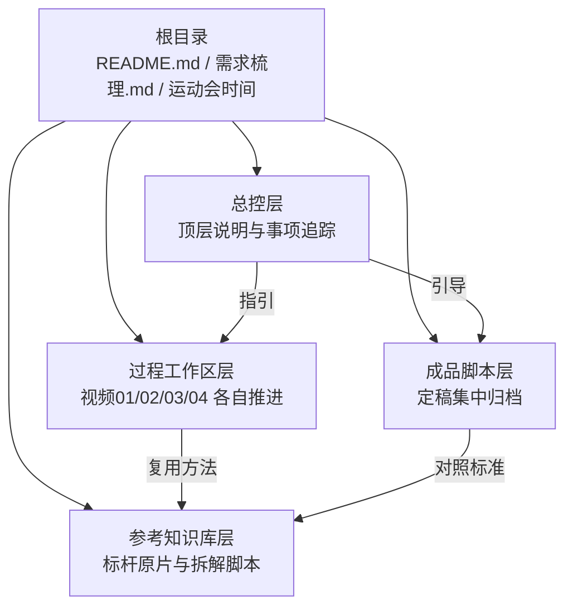
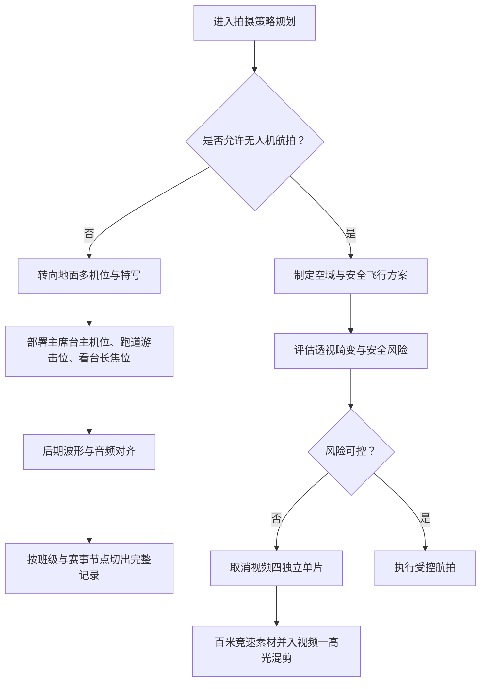
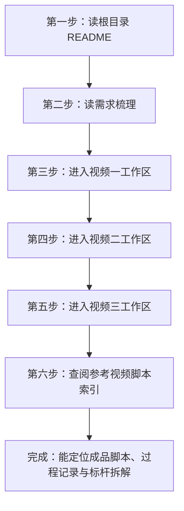
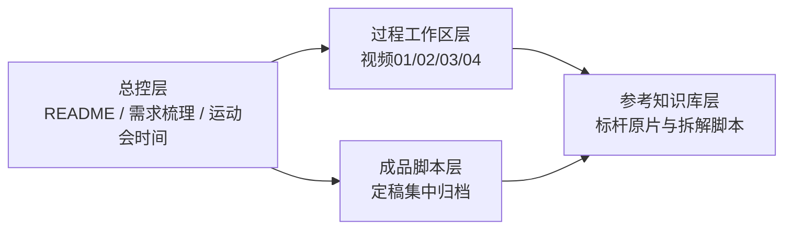

# 项目概述与快速开始

<cite>
**本文引用的文件**   
- [README.md](file://README.md)
- [成品脚本/README.md](file://成品脚本/README.md)
- [参考视频脚本/README.md](file://参考视频脚本/README.md)
- [视频01_传统高光混剪/BGM视听结构与黑场转折设计说明.md](file://视频01_传统高光混剪/BGM视听结构与黑场转折设计说明.md)
- [视频03_开幕式多机位实况/开幕式多机位协同与实况方案.md](file://视频03_开幕式多机位实况/开幕式多机位协同与实况方案.md)
</cite>

## 目录
1. [引言](#引言)
2. [项目结构](#项目结构)
3. [核心产出与最终选择](#核心产出与最终选择)
4. [目标受众与发布渠道](#目标受众与发布渠道)
5. [安全红线：禁飞无人机](#安全红线禁飞无人机)
6. [新手入门路径](#新手入门路径)
7. [仓库四段式结构速览](#仓库四段式结构速览)
8. [常见问题与排障建议](#常见问题与排障建议)
9. [结论](#结论)

## 引言
本文件面向首次接触“浙江省春晖中学 2026 年校运会（2026SportsMeet）”视听制作工程的新手，包括新媒体社成员、摄制组协作人员、指导老师以及后续社团传承者。它先解释项目背景与目标，再明确四项备选产出方向中最终落地的三部核心视频，并补充已取消的视频四历史归档情况；随后给出目标受众、发布渠道、新手阅读顺序和仓库导航方式，帮助你在 Markdown 文档资产库中快速定位所需内容。

该工程覆盖从赛程研判、现场多机位调度、分镜头脚本撰写，到后期剪辑包装与成品归档的全流程协同，是新媒体社面向学校师生与家长的一次系统性视听交付。

**章节来源**
- [README.md:1-12](file://README.md#L1-L12)

## 项目结构
整个仓库以“总控层 + 成品脚本层 + 过程工作区层 + 参考知识库层”的方式组织，既适合多人协作推进，也方便未来交接给下一届社团成员。

**图表来源**
- [README.md:31-68](file://README.md#L31-L68)

**章节来源**
- [README.md:31-68](file://README.md#L31-L68)

## 核心产出与最终选择
本项目最初规划了四项备选产出方向，但最终形成以下三份核心视频成果：

| 序号 | 视频名称 | 风格定位 | 最终状态 | 关键信息 |
|---:|---|---|---|---|
| 一 | 传统高光混剪 | 高燃混剪 MV 风格，三段式情感曲线 | 已定稿交付 | 约 95 秒，含蓄势破晓、全域狂飙、青春温情段落，配套 BGM 视听结构与黑场转折说明 |
| 二 | 学生会幕后宣传片 | 纪实叙事 / Vlog 风格 | 策划就绪 | 聚焦检录、终点记分、器材搬运、广播站念稿、医疗急救等“看不见的赛场” |
| 三 | 开幕式多机位实况片 | 电视台转播级全流程多机位实况 | 已定稿交付 | 地面多机位协同录制，配套 FCP 多机位波形对齐与精彩小混剪思路指南 |
| 四 | 男子百米奥运解说短片 | CCTV-5 / 奥运电视转播规格 | 已取消 | 因禁飞与高空透视畸变风险取消独立单片，相关百米竞速素材全量汇入视频一高光混剪 |

其中，视频一与视频三的成品脚本已进入“成品脚本”集中归档区；视频二仍处于策划草案阶段；视频四虽在过程工作区保留全流程方案与记录，但不再作为独立成片交付。

**章节来源**
- [README.md:14-30](file://README.md#L14-L30)
- [成品脚本/README.md:1-23](file://成品脚本/README.md#L1-L23)

## 目标受众与发布渠道
### 目标受众
- **学校师生**：观看校运会官方全景回顾、开幕式完整记录与班级风采。
- **家长群体**：了解孩子在校的竞技表现、集体活动氛围与校园文化生活。
- **新媒体社成员**：学习分镜结构、多机位协同、BGM 卡点、后期包装与归档规范。
- **后续社团传承者**：通过过程工作区与参考知识库，继承拍摄策略、脚本模板与复盘经验。

### 发布渠道
- **微信视频号**：适合短视频平台传播的高燃混剪、开幕式精彩片段、幕后花絮。
- **哔哩哔哩**：适合承载完整版开幕式多机位实录、长版本回放及深度拆解参考。
- **校园大屏**：用于校内展示、开学典礼或社团招新时播放官方主片与闭幕式收尾内容。

这些受众与渠道共同决定了项目需要同时兼顾“短平快宣发”与“完整典藏存档”两种形态。

[本节为概念性说明，不直接分析具体源码文件]

## 安全红线：禁飞无人机
无人机航拍在本项目中属于高风险环节，必须严格遵循校方禁飞规定。根据成品脚本归档说明，原计划中的视频四“男子百米奥运解说短片”因“禁飞与高空透视畸变风险”而取消独立单片，其百米竞速相关拍摄素材被整合进视频一的“传统高光混剪”。

这一决策对整体拍摄策略产生直接影响：

1. **航拍让位于地面机位**  
   开幕式与比赛日更强调地面固定机位、低角度跟拍、长焦特写与看台视角，而不是依赖高空航拍大景。

2. **多机位同步与后期对齐更重要**  
   由于缺少持续稳定的航拍视角，需要通过多个地面机位的波形对齐、音频同步与标准化切换逻辑来弥补空间层次。

3. **节奏与情绪替代部分航拍震撼感**  
   视频一通过 BGM 三段式、黑场呼吸、白闪起爆、升格慢动作与拟音设计，在不依赖高空镜头的前提下制造强烈视听冲击。

4. **过程工作区需保留风险评估与替代方案**  
   即使某类机位被取消，也应保留原始方案、讨论记录与调整原因，便于后续团队理解约束边界。

**图表来源**
- [成品脚本/README.md:10-23](file://成品脚本/README.md#L10-L23)

**章节来源**
- [成品脚本/README.md:10-23](file://成品脚本/README.md#L10-L23)

## 新手入门路径
请按照以下顺序逐步进入工程，避免一开始就陷入某个视频的剪辑细节：

1. **先读根目录 README**  
   了解项目背景、团队分工、四大产出规划、工程目录架构与核心文档导航。这是全局认知入口。

2. **再读需求梳理**  
   掌握项目总控需求、决策追踪与事项清单，明确哪些内容已定稿、哪些仍在推进。

3. **按视频一 → 视频二 → 视频三顺序学习**  
   - **视频一**：先进入 `视频01_传统高光混剪`，先看分镜草案与工作记录，再重点阅读 BGM 视听结构与黑场转折说明，理解三段式节奏、黑场蓄力与 Drop 爆发。  
   - **视频二**：进入 `视频02_学生会幕后宣传片`，先读策划草案，理解纪实叙事结构、采访提纲与幕后工作线索。  
   - **视频三**：进入 `视频03_开幕式多机位实况`，先读多机位协同与实况方案，再读现场机位部署手册与精彩小混剪思路。

4. **最后查阅参考视频脚本**  
   打开 `参考视频脚本/README.md`，浏览 30 部标杆参考视频的多模态拆解索引，找到与你当前任务最接近的风格模板，例如高燃混剪、电视转播、Vlog 群像、治愈风空镜等。

**章节来源**
- [README.md:31-85](file://README.md#L31-L85)
- [参考视频脚本/README.md:1-20](file://参考视频脚本/README.md#L1-L20)

## 仓库四段式结构速览
| 层级 | 对应目录或文件 | 作用 | 新手使用方式 |
|---|---|---|---|
| **总控层** | `README.md`、`需求梳理.md`、`运动会时间/` | 提供项目总览、团队职责、产出状态、日程与核心文档导航 | 先从这里建立全局认知 |
| **成品脚本层** | `成品脚本/` | 集中存放已定稿交付的最终脚本，严禁放草稿 | 对接最终交付、验收与对外发布 |
| **过程工作区层** | `视频01_...`、`视频02_...`、`视频03_...`、`视频04_...` | 保存分镜草案、策划案、工作记录、机位方案、BGM 选型等过程资产 | 跟随当前负责视频推进工作 |
| **参考知识库层** | `参考视频/`、`参考视频脚本/` | 收录 30 部标杆原片及其逐帧拆解脚本，提供拍摄、旁白、分镜与实操建议 | 模仿风格、学习结构、寻找可复用模板 |

**图表来源**
- [README.md:31-85](file://README.md#L31-L85)

**章节来源**
- [README.md:31-85](file://README.md#L31-L85)

## 常见问题与排障建议
- **找不到成品脚本在哪里？**  
  直接查看 `成品脚本/README.md`，里面列出各视频最终脚本路径与状态；若某视频尚未定稿，则仍应回到对应过程工作区继续推进。
- **为什么视频四没有最终脚本？**  
  因为该项目已将视频四取消为独立单片，相关百米竞速素材合并进视频一。如需了解原方案，可查看 `视频04_男子百米奥运解说` 过程工作区中的全流程方案与工作记录。
- **开幕式多机位怎么同步？**  
  参考 `视频03_开幕式多机位实况/开幕式多机位协同与实况方案.md`，重点查看多机位拓扑、各班“保全黄金 15 秒”切换模板与后期波形对齐建议。
- **想学习视频一的节奏设计怎么做？**  
  重点阅读 `视频01_传统高光混剪/BGM视听结构与黑场转折设计说明.md`，理解黑场极静休整、发令枪起爆、三段式段落划分与拟音设计。
- **不知道选哪个参考视频做对标？**  
  打开 `参考视频脚本/README.md`，按“专业赛事直播解说”“高燃快节奏混剪 MV”“青春微记录 Vlog”“治愈风空镜”等标签挑选最贴近任务的方案。

**章节来源**
- [成品脚本/README.md:1-23](file://成品脚本/README.md#L1-L23)
- [视频03_开幕式多机位实况/开幕式多机位协同与实况方案.md:1-75](file://视频03_开幕式多机位实况/开幕式多机位协同与实况方案.md#L1-L75)
- [视频01_传统高光混剪/BGM视听结构与黑场转折设计说明.md:1-69](file://视频01_传统高光混剪/BGM视听结构与黑场转折设计说明.md#L1-L69)
- [参考视频脚本/README.md:1-20](file://参考视频脚本/README.md#L1-L20)

## 结论
2026SportsMeet 工程的核心不是堆砌更多机位或更大场面，而是在明确的安全约束与团队能力边界内，把“传统高光混剪主片、学生会幕后宣传片、开幕式多机位实况片”这三件事做好。无人机禁飞并不意味着放弃视觉张力，而是推动团队用更严谨的分镜、更稳定的多机位协同、更精确的 BGM 卡点与更清晰的叙事结构来达成目标。

对于新手而言，最重要的能力是：**知道先看什么、再看什么、遇到问题该去哪个目录找答案**。当你能够熟练地在总控层、成品脚本层、过程工作区层与参考知识库层之间跳转时，这个项目就不再只是“一堆视频文件”，而是一个可持续传承的视听制作体系。

[本节为总结性内容，不直接分析具体源码文件]