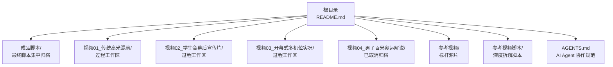
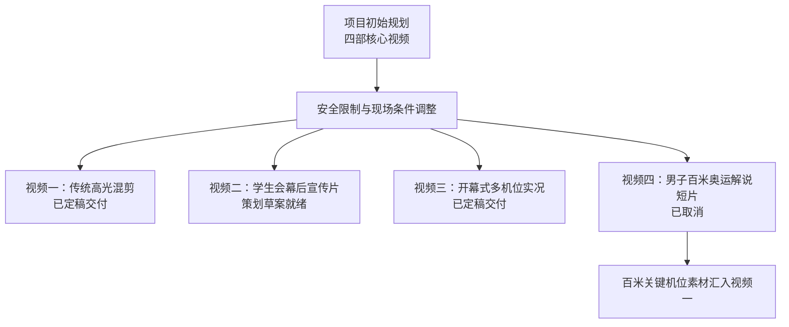
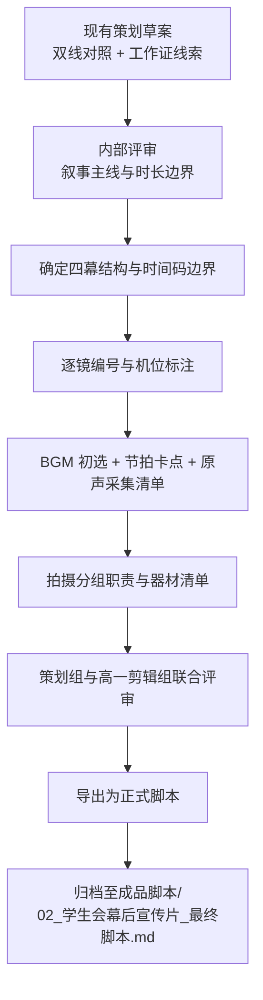
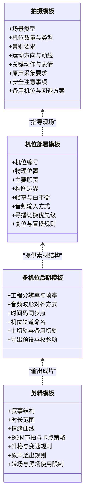
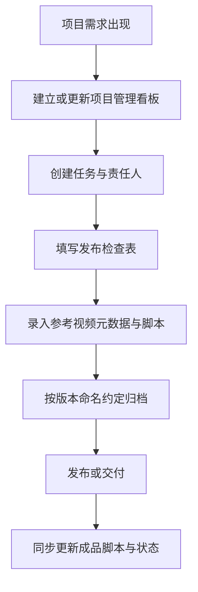
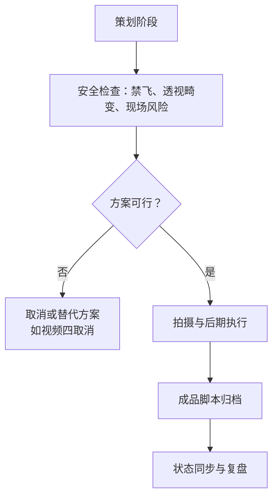

# 项目演进与后续建议

<cite>
**本文引用的文件**   
- [README.md](file://README.md)
- [AGENTS.md](file://AGENTS.md)
- [成品脚本/README.md](file://成品脚本/README.md)
- [视频01_传统高光混剪/工作记录.md](file://视频01_传统高光混剪/工作记录.md)
- [视频02_学生会幕后宣传片/工作记录.md](file://视频02_学生会幕后宣传片/工作记录.md)
- [视频02_学生会幕后宣传片/学生会幕后宣传片_分镜与策划草案.md](file://视频02_学生会幕后宣传片/学生会幕后宣传片_分镜与策划草案.md)
- [视频03_开幕式多机位实况/工作记录.md](file://视频03_开幕式多机位实况/工作记录.md)
- [视频04_男子百米奥运解说/工作记录.md](file://视频04_男子百米奥运解说/工作记录.md)
</cite>

## 目录
1. [引言](#引言)
2. [项目结构与当前状态](#项目结构与当前状态)
3. [已完成规划与交付现状](#已完成规划与交付现状)
4. [视频二从策划草案到正式脚本的升级计划](#视频二从策划草案到正式脚本的升级计划)
5. [各视频工作区工作记录的归档建议](#各视频工作区工作记录的归档建议)
6. [可复用的模板化改进方案](#可复用的模板化改进方案)
7. [下一届《校运会视频制作 SOP》框架建议](#下一届校运会视频制作-sop框架建议)
8. [项目管理、发布检查与参考视频流程建议](#项目管理发布检查与参考视频流程建议)
9. [安全红线、成品归档与 AI Agent 协作经验回顾](#安全红线成品归档与-ai-agent-协作经验回顾)
10. [结论](#结论)

## 引言
本文件面向浙江省春晖中学 2026 年校运会视频项目的后续维护者、下一届新媒体社团队以及参与协作的 AI Agent，系统总结目前已完成的策划与执行经验，并明确下一步重点：把视频二《学生会幕后宣传片》从策划草案升级为可拍摄、可剪辑、可归档的正式脚本；同时沉淀可复用的拍摄模板、剪辑模板、机位部署模板和多机位后期模板。文档还提出轻量项目管理看板、发布检查表、参考视频入库流程与版本命名约定，帮助团队在“安全合规、流程清晰、资产可复用”的前提下持续迭代。

## 项目结构与当前状态
当前仓库采用“过程工作区隔离 + 成品集中归档”的结构：根目录 README 说明项目背景、团队分工、四大视频产出与工程目录；`成品脚本/` 存放经团队确认的最终脚本；每个 `视频0X_.../` 工作区保存分镜草案、BGM 选型、现场机位方案和阶段工作记录；`参考视频/` 与 `参考视频脚本/` 构成标杆素材与分析库；`AGENTS.md` 统一 AI Agent 的工作流、目录规范和交互语言要求。

**图示来源**
- [README.md:28-70](file://README.md#L28-L70)
- [成品脚本/README.md:1-23](file://成品脚本/README.md#L1-L23)
- [AGENTS.md:26-63](file://AGENTS.md#L26-L63)

**章节来源**
- [README.md:1-85](file://README.md#L1-L85)
- [成品脚本/README.md:1-23](file://成品脚本/README.md#L1-L23)
- [AGENTS.md:1-70](file://AGENTS.md#L1-L70)

## 已完成规划与交付现状
根据根目录 README、成品脚本总览与各视频工作记录，2026SportsMeet 的核心产出经历了从四部规划到三部实际交付的调整：

| 视频 | 原始定位 | 当前状态 | 主要依据 |
|---|---|---|---|
| 视频一：传统高光混剪 | 高燃 MV 风格三段式混剪 | 已定稿交付 | 工作记录中完成 BGM 定型、黑场蓄势设计、三段式分镜重构，并导出至成品脚本 |
| 视频二：学生会幕后宣传片 | 纪实叙事 / Vlog 风格双线对照 | 策划草案就绪，待选定主 BGM 并导出正式脚本 | 工作记录列出核心叙事、工作证线索、POV 设计与逐镜分镜草案 |
| 视频三：开幕式多机位实况 | 电视台转播级全流程多机位录制 | 已定稿交付，含小混剪思路指南 | 工作记录完成机位拓扑、执行手册、参数标准与小混剪归档 |
| 视频四：男子百米奥运解说短片 | CCTV-5 规格奥运转播风格 | 已取消，相关素材并入视频一 | AGENTS.md 与视频四工作记录均明确禁飞与透视畸变风险导致取消 |

**图示来源**
- [README.md:14-33](file://README.md#L14-L33)
- [成品脚本/README.md:6-21](file://成品脚本/README.md#L6-L21)
- [视频04_男子百米奥运解说/工作记录.md:17-29](file://视频04_男子百米奥运解说/工作记录.md#L17-L29)

**章节来源**
- [README.md:14-33](file://README.md#L14-L33)
- [成品脚本/README.md:6-21](file://成品脚本/README.md#L6-L21)
- [视频01_传统高光混剪/工作记录.md:1-94](file://视频01_传统高光混剪/工作记录.md#L1-L94)
- [视频03_开幕式多机位实况/工作记录.md:1-113](file://视频03_开幕式多机位实况/工作记录.md#L1-L113)
- [视频04_男子百米奥运解说/工作记录.md:1-29](file://视频04_男子百米奥运解说/工作记录.md#L1-L29)

## 视频二从策划草案到正式脚本的升级计划
视频二目前仍处于“策划草案 + 工作记录”阶段，但草案质量较高，已经形成清晰的叙事结构、视觉符号、逐镜分镜和分组拍摄职责。下一步应把它升级为“可执行的正式脚本”，并与成品脚本归档机制对齐。

### 1. 升级目标
- 将《学生会幕后宣传片_分镜与策划草案.md》转化为正式脚本，包含：项目名称、负责人、时长、画面规格、设备与红线、叙事主线、四幕结构、逐镜编号、时间码、景别机位、画面内容、声音设计、拍摄与剪辑要点。
- 明确是否保留或精简现有 4 个 POV 微镜头，避免 POV 过多导致节奏失控。
- 补齐 BGM 选择逻辑、节拍卡点时码、原声采集清单和结尾演职员表规范。
- 将高一小组分工、无线领夹麦克风使用、终点原声采集等实操要点固化为“拍摄与剪辑执行附录”。

### 2. 升级流程

**图示来源**
- [视频02_学生会幕后宣传片/学生会幕后宣传片_分镜与策划草案.md:1-108](file://视频02_学生会幕后宣传片/学生会幕后宣传片_分镜与策划草案.md#L1-L108)
- [视频02_学生会幕后宣传片/工作记录.md:1-30](file://视频02_学生会幕后宣传片/工作记录.md#L1-L30)
- [成品脚本/README.md:6-14](file://成品脚本/README.md#L6-L14)

### 3. 需要补充的关键字段
- **版本信息**：草案 v1 → 正式版 v1.0 → 拍摄版 v1.1 → 定稿版 v2.0。
- **状态标记**：草稿、评审中、待拍摄、已拍摄、待剪辑、已归档。
- **责任字段**：策划负责人、拍摄统筹、摄影组、录音组、后期剪辑负责人。
- **资产字段**：BGM 名称与时长、参考视频链接、采访对象名单、授权与隐私处理说明。
- **验收字段**：时长范围、画幅比例、帧率、安全红线、平台适配要求。

### 4. 与现有工作记录的衔接
- 工作记录中已完成的“双线交叉对照”“工作证贯穿线索”“POV 点睛穿插”“四个最具临场感节点”应直接迁移到正式脚本的叙事与分镜段落。
- 工作记录中尚未完成的“选定工程主 BGM 并测定节拍卡点时码”“最终确认并导出交付至成品脚本”应作为升级流程中的强制任务。
- 高一同学分组拍摄职责可作为正式脚本的执行附录，避免正文过长。

**章节来源**
- [视频02_学生会幕后宣传片/工作记录.md:1-30](file://视频02_学生会幕后宣传片/工作记录.md#L1-L30)
- [视频02_学生会幕后宣传片/学生会幕后宣传片_分镜与策划草案.md:1-108](file://视频02_学生会幕后宣传片/学生会幕后宣传片_分镜与策划草案.md#L1-L108)
- [成品脚本/README.md:6-14](file://成品脚本/README.md#L6-L14)

## 各视频工作区工作记录的归档建议
当前各视频工作区都保留了阶段性推进日志，这对复盘很有价值，但也存在重复描述、状态不一致、未来复用成本偏高的问题。建议按“过程记录 + 可复用模板 + 决策轨迹”三类进行归档。

### 1. 工作记录分类
| 类别 | 用途 | 建议位置 |
|---|---|---|
| 过程推进日志 | 记录日期、决策、变更、问题与修复 | 各视频工作区根工作记录文件 |
| 可复用模板 | 拍摄模板、剪辑模板、机位部署模板、多机位后期模板 | 独立模板目录或各视频工作区的 `模板/` 子目录 |
| 决策与风险记录 | 安全限制、取消原因、替代方案、素材流向 | 项目级 `需求梳理.md` 或 `决策记录.md` |

### 2. 工作记录统一字段
建议所有工作记录开头包含：
- 视频编号与名称
- 当前阶段（策划、拍摄、后期、归档）
- 负责人与协作组
- 日期
- 本次更新摘要
- 关联文件
- 下一步待办

### 3. 视频一归档经验
视频一工作记录体现了较好的资产沉淀：主 BGM 选型、纯净音频切片、三段式情感曲线、黑场蓄势设计、分镜草案迭代、个人姓名清理、成品脚本导出。这些经验可直接抽象为“高燃混剪拍摄与剪辑模板”。

### 4. 视频二归档经验
视频二工作记录明确了创新主题、双线对照、工作证线索、POV 设计与高一剪辑组分工。未来归档时应突出“叙事主线优先于流水账”的经验，并保留“禁止无人机、禁止折叠自行车”的安全红线。

### 5. 视频三归档经验
视频三工作记录完成了机位拓扑、执行手册、参数标准、延长杆模拟航拍、导播切换去模板化、多机位波形对齐、小混剪思路指南。这些是“多机位拍摄与后期模板”的重要来源。

### 6. 视频四归档经验
视频四工作记录完整记录了取消原因、安全风险、透视畸变问题和素材流向，适合作为“风险决策与替代方案”的典型案例，供后续项目参考。

**章节来源**
- [视频01_传统高光混剪/工作记录.md:1-94](file://视频01_传统高光混剪/工作记录.md#L1-L94)
- [视频02_学生会幕后宣传片/工作记录.md:1-30](file://视频02_学生会幕后宣传片/工作记录.md#L1-L30)
- [视频03_开幕式多机位实况/工作记录.md:1-113](file://视频03_开幕式多机位实况/工作记录.md#L1-L113)
- [视频04_男子百米奥运解说/工作记录.md:1-29](file://视频04_男子百米奥运解说/工作记录.md#L1-L29)

## 可复用的模板化改进方案
为降低未来校运会视频制作的沟通成本和出错概率，建议抽象出四类模板。每类模板都应包含目的、适用场景、必填字段、示例占位符、审核要求和归档路径。

### 1. 拍摄模板
适用于校运会常见场景：开幕式方阵、径赛短跑、接力、跳高、跳远、铅球、终点冲刺、赛后互动、幕后保障、观众与教师反应。

建议字段：
- 场景类型
- 机位数量与类型
- 景别要求
- 运动方向与动线
- 关键动作与表情
- 原声采集要求
- 安全注意事项
- 备用机位与失败回退方案
- 对应参考视频编号

### 2. 剪辑模板
适用于混剪类视频：高燃混剪、幕后纪实、开幕式精彩片段、赛事高光汇总。

建议字段：
- 叙事结构（序章、发展、高潮、收尾）
- 时长范围
- 情绪曲线
- BGM 节拍与卡点策略
- 升格与变速规则
- 原声透出规则
- 转场与黑场使用限制
- 平台适配（竖屏、横屏、短视频、大屏）

### 3. 机位部署模板
适用于多机位实况：开幕式、闭幕式、大型展演、团体项目。

建议字段：
- 机位编号
- 物理位置
- 朝向与覆盖区域
- 主要职责
- 次要职责
- 构图边界
- 快门、白平衡、帧率
- 音频输入方式
- 导播切换优先级
- 复位与盲操规则
- 安全距离与障碍物

### 4. 多机位后期模板
适用于 FCP、Premiere、DaVinci 等多机位工程。

建议字段：
- 工程分辨率与帧率
- 音频波形对齐方式
- 时间码同步点
- 机位轨道命名
- 主切轨与备用切轨
- 原声轨与环境音轨分离
- 字幕与包装轨分层
- 导出预设与校验项
- 版本命名与归档路径

**图示来源**
- [视频03_开幕式多机位实况/工作记录.md:28-113](file://视频03_开幕式多机位实况/工作记录.md#L28-L113)
- [视频01_传统高光混剪/工作记录.md:16-94](file://视频01_传统高光混剪/工作记录.md#L16-L94)

**章节来源**
- [视频01_传统高光混剪/工作记录.md:16-94](file://视频01_传统高光混剪/工作记录.md#L16-L94)
- [视频03_开幕式多机位实况/工作记录.md:28-113](file://视频03_开幕式多机位实况/工作记录.md#L28-L113)

## 下一届《校运会视频制作 SOP》框架建议
SOP 不是创意文件，而是“可被新成员快速执行”的流程规范。建议以“角色 + 阶段 + 交付物 + 检查项”为主线。

### 1. 角色分工
- 总策划与脚本统筹
- 现场拍摄统筹
- 各机位摄影师
- 录音与原声采集
- 后期剪辑与包装
- 成品归档与发布对接

### 2. 阶段划分
- 前期调研：赛程研判、参考视频筛选、风险排查
- 策划阶段：叙事主线、分镜草案、机位方案
- 拍摄阶段：机位部署、同步录制、原声采集、安全巡检
- 后期阶段：多机位对齐、粗剪、精剪、包装、校对
- 归档阶段：脚本归档、素材索引、发布版本管理

### 3. 交付物清单
- 最终脚本
- 机位部署图
- 拍摄执行手册
- 多机位后期工程说明
- 发布检查表
- 参考视频索引
- 决策记录与安全记录

### 4. 检查项示例
- 是否明确禁用无人机及替代方案
- 是否完成多机位时间码或音频同步点
- 是否完成时长、画幅、帧率校验
- 是否完成人物肖像、隐私与版权核对
- 是否完成导出前回放与关键帧检查
- 是否完成成品脚本归档与状态同步

**章节来源**
- [README.md:1-85](file://README.md#L1-L85)
- [成品脚本/README.md:1-23](file://成品脚本/README.md#L1-L23)
- [AGENTS.md:26-63](file://AGENTS.md#L26-L63)

## 项目管理、发布检查与参考视频流程建议
当前仓库已有较强的文档化基础，但仍缺少轻量项目管理看板、统一发布检查表和参考视频入库流程。建议引入最小可用流程，不追求工具复杂，而追求可执行、可追溯。

### 1. 轻量项目管理看板
建议使用简单表格或看板，包含以下列：
- 任务编号
- 所属视频
- 任务名称
- 负责人
- 依赖关系
- 状态（未开始、进行中、评审中、已完成、已归档）
- 截止时间
- 备注与链接

看板应与工作记录联动：重要任务完成后，在工作记录中登记，并在看板上更新状态。

### 2. 发布检查表
建议每条视频在发布前至少完成一次检查，包括：
- 内容与叙事是否一致
- 时长是否符合要求
- 画幅、分辨率、帧率是否达标
- BGM 版权与音质是否合格
- 原声与旁白是否清晰
- 字幕与包装是否无错字
- 人物肖像与隐私是否合规
- 安全红线是否未被违反
- 成品脚本是否归档
- 工作记录是否更新

### 3. 参考视频入库流程
建议新增“入库申请 + 元数据 + 分析脚本”三步：
- 入库申请：说明视频来源、用途、风格标签、对标视频编号
- 元数据：标题、作者、时长、分辨率、链接、截图、关键词
- 分析脚本：叙事结构、镜头语言、节奏策略、可复用技巧

参考视频不应只存源片，还应保持“源片 + 脚本 + 索引”三位一体，方便未来生成模板和教学材料。

### 4. 版本命名约定
建议统一格式：
- 视频编号 + 名称 + 阶段 + 版本号
- 示例：`02_学生会幕后宣传片_分镜与策划草案_v1.0.md`
- 示例：`02_学生会幕后宣传片_最终脚本_v2.0.md`
- 示例：`03_开幕式多机位实况_执行手册_v1.2.md`

规则：
- 数字编号固定，便于排序
- 阶段区分草案、执行、最终
- 版本号采用语义化版本：主版本重大结构调整，次版本内容扩展，修订版细节修正
- 废弃版本保留但不进入成品脚本

**图示来源**
- [成品脚本/README.md:1-23](file://成品脚本/README.md#L1-L23)
- [README.md:28-70](file://README.md#L28-L70)
- [AGENTS.md:26-63](file://AGENTS.md#L26-L63)

**章节来源**
- [成品脚本/README.md:1-23](file://成品脚本/README.md#L1-L23)
- [README.md:28-70](file://README.md#L28-L70)
- [AGENTS.md:26-63](file://AGENTS.md#L26-L63)

## 安全红线、成品归档与 AI Agent 协作经验回顾
### 1. 安全红线
项目多次强调全面禁止无人机：AGENTS.md 将其列为安全与限制条件红线，视频二策划草案也明确严禁使用无人机，并以延长杆加 Pocket 云台相机或看台长焦俯拍作为替代。视频四取消的直接原因正是禁飞与高空透视畸变风险。这说明安全红线不是建议，而是前置约束，必须在策划阶段就否决不可行方案。

### 2. 成品归档规范
成品脚本目录仅存放经各方确认定稿的交付版脚本，过程草稿不得混入。这一规则在根目录 README、成品脚本 README 和 AGENTS.md 中反复强调，保证了交付物的唯一性与可追溯性。视频一和视频三都已按此规范完成归档，视频二仍需补齐最终脚本。

### 3. AI Agent 协作规范
AGENTS.md 规定所有沟通必须使用中文，禁止空洞承诺与未经核实的夸大陈述；同时明确工作区隔离与成品集中归档的铁律。这降低了跨角色协作时的歧义风险，也为后续引入更多 AI 辅助任务提供了统一入口。

**图示来源**
- [AGENTS.md:1-24](file://AGENTS.md#L1-L24)
- [视频02_学生会幕后宣传片/学生会幕后宣传片_分镜与策划草案.md:1-10](file://视频02_学生会幕后宣传片/学生会幕后宣传片_分镜与策划草案.md#L1-L10)
- [视频04_男子百米奥运解说/工作记录.md:17-29](file://视频04_男子百米奥运解说/工作记录.md#L17-L29)
- [成品脚本/README.md:15-23](file://成品脚本/README.md#L15-L23)

**章节来源**
- [AGENTS.md:1-70](file://AGENTS.md#L1-L70)
- [视频02_学生会幕后宣传片/学生会幕后宣传片_分镜与策划草案.md:1-10](file://视频02_学生会幕后宣传片/学生会幕后宣传片_分镜与策划草案.md#L1-L10)
- [视频04_男子百米奥运解说/工作记录.md:17-29](file://视频04_男子百米奥运解说/工作记录.md#L17-L29)
- [成品脚本/README.md:15-23](file://成品脚本/README.md#L15-L23)

## 结论
2026SportsMeet 已经在“多机位实况、高燃混剪、策划草案、风险规避、成品归档”等方面积累了扎实基础。下一阶段的重点不是继续堆砌新视频，而是把既有经验沉淀为可复用的模板与流程：  
- 先把视频二从高质量策划草案升级为正式脚本并完成归档；  
- 把视频一的视频混剪经验、视频三的多机位经验提炼成拍摄模板、剪辑模板、机位部署模板和多机位后期模板；  
- 用轻量看板、发布检查表、参考视频入库流程和版本命名约定，把零散工作记录变成可迁移的项目资产；  
- 坚持安全红线、成品归档规范与 AI Agent 协作规范，让下一届团队能在相同流程下快速上手，减少试错成本。