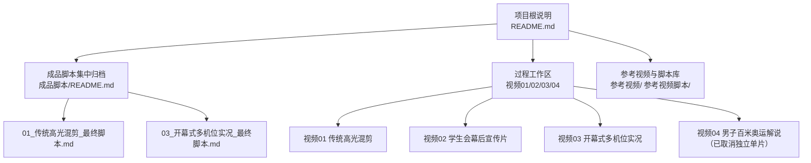
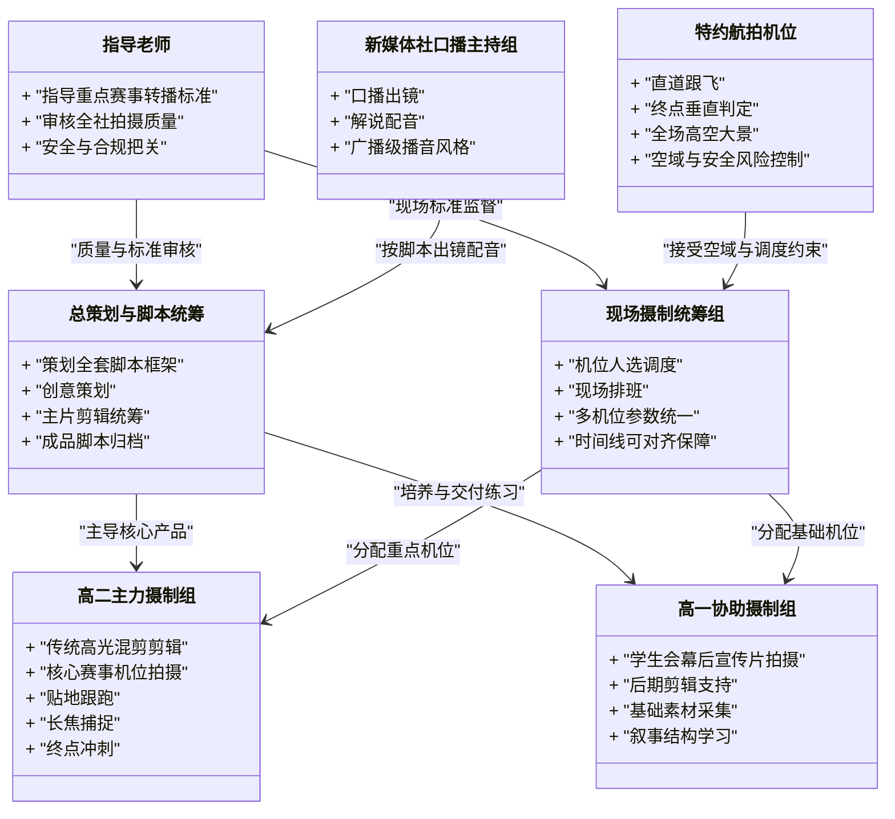
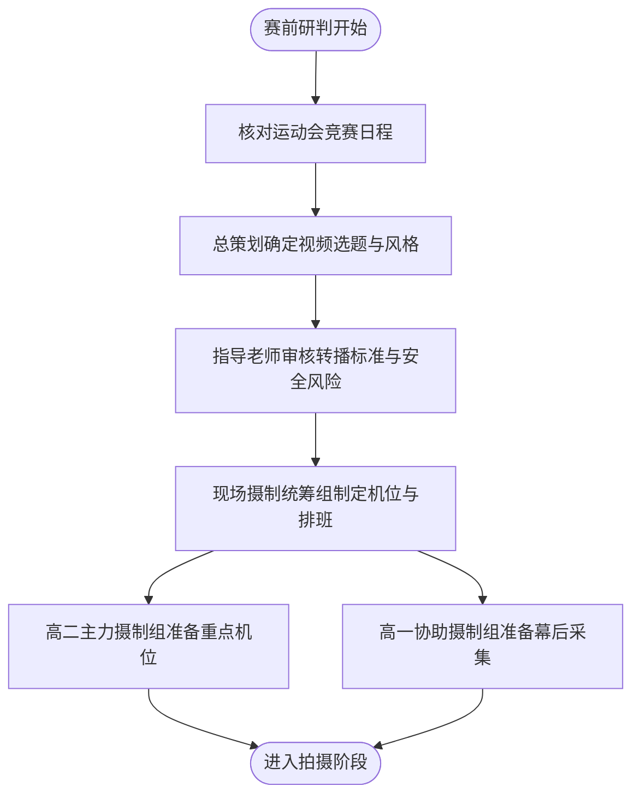
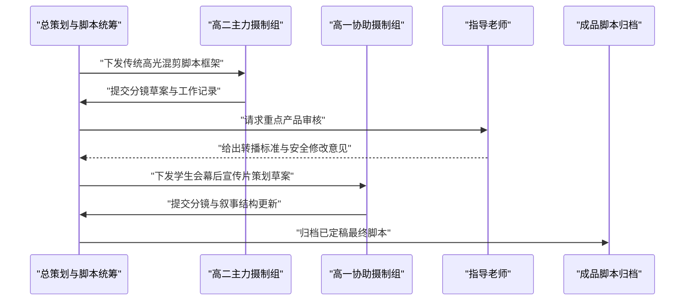
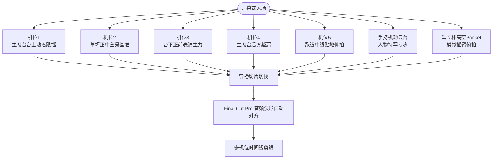
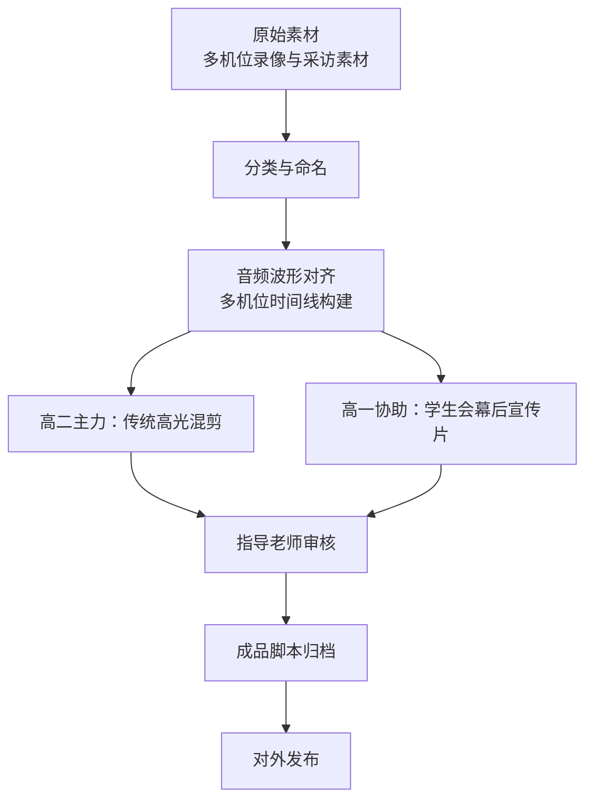
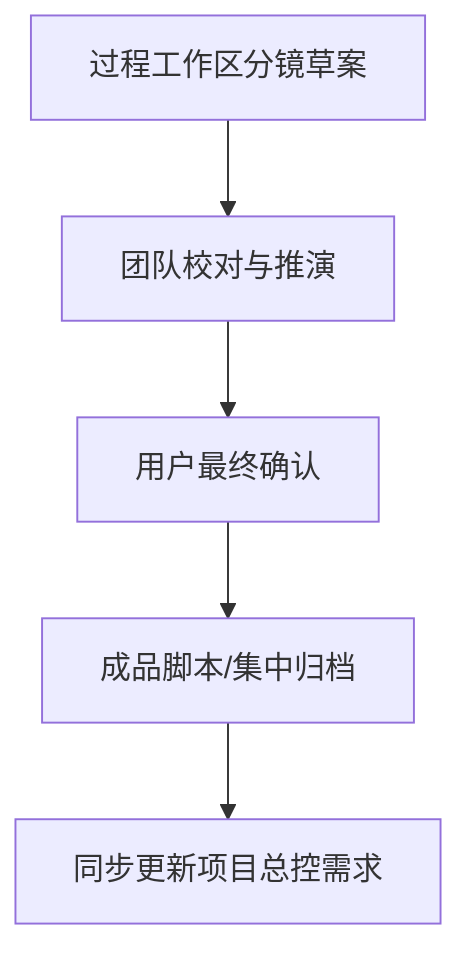
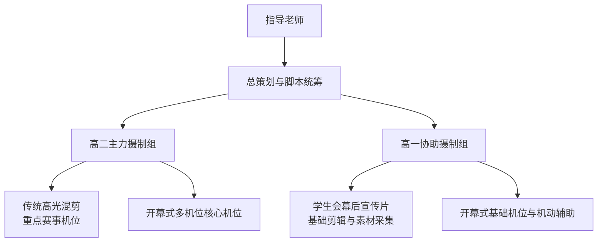
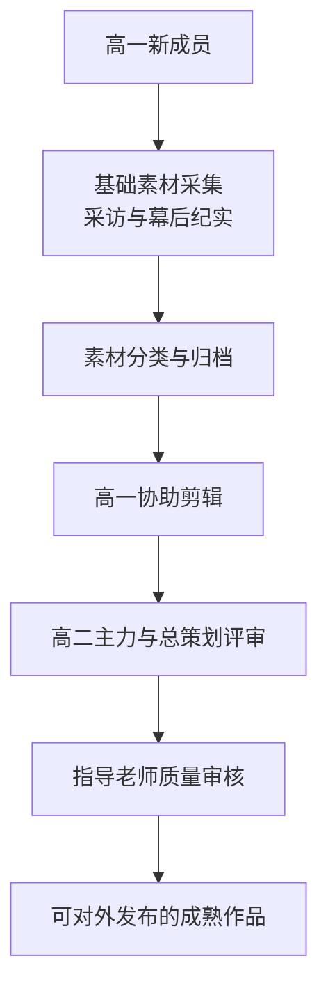

# 团队组织与职责分工

<cite>
**本文引用的文件**   
- [README.md](file://README.md)
- [成品脚本/README.md](file://成品脚本/README.md)
- [成品脚本/01_传统高光混剪_最终脚本.md](file://成品脚本/01_传统高光混剪_最终脚本.md)
- [成品脚本/03_开幕式多机位实况_最终脚本.md](file://成品脚本/03_开幕式多机位实况_最终脚本.md)
- [视频02_学生会幕后宣传片/工作记录.md](file://视频02_学生会幕后宣传片/工作记录.md)
- [视频03_开幕式多机位实况/开幕式现场机位部署与拍摄执行手册.md](file://视频03_开幕式多机位实况/开幕式现场机位部署与拍摄执行手册.md)
</cite>

## 目录
1. [引言](#引言)
2. [项目结构与工程边界](#项目结构与工程边界)
3. [团队角色与职责边界](#团队角色与职责边界)
4. [全周期任务参与方式](#全周期任务参与方式)
5. [人员梯队协作关系](#人员梯队协作关系)
6. [新人入队建议](#新人入队建议)
7. [隐私与对外发布注意事项](#隐私与对外发布注意事项)
8. [结论](#结论)

## 引言
本文件基于浙江省春晖中学 2026 年校运会视频制作工程的总说明、核心产出规划与过程工作区文档，梳理新媒体社在该项目中的组织架构、角色边界与协作流程。目标不是罗列个人姓名，而是明确“谁负责什么、在哪个阶段介入、如何交接”，并据此给出高一、高二与指导老师三类人员的成长路径与审核标准。

## 项目结构与工程边界
该工程以“策划—拍摄—剪辑—归档”为主线，将过程素材、参考方案与定稿产物分层管理：根级 README 承担全局定位、团队分工与目录导航；成品脚本集中存放已确认交付的完整脚本；各 `视频0X_...` 工作区保留分镜草案、BGM、工作记录等过程材料；参考视频与参考脚本库提供风格、转播包装与逐镜还原范式。

**图示来源**
- [README.md:29-85](file://README.md#L29-L85)
- [成品脚本/README.md:1-23](file://成品脚本/README.md#L1-L23)

**章节来源**
- [README.md:1-28](file://README.md#L1-L28)
- [README.md:29-85](file://README.md#L29-L85)
- [成品脚本/README.md:1-23](file://成品脚本/README.md#L1-L23)

## 团队角色与职责边界
根据项目总说明，团队由以下角色组成，各自承担不同阶段的职责：

| 角色 | 主要职责边界 | 关键交付或决策点 |
|---|---|---|
| **总策划与脚本统筹** | 设计全套脚本框架、创意策划、主片剪辑统筹；维护成品脚本集中归档与状态同步。 | 确定四部核心视频的风格、结构、交付状态；把最终脚本统一归入 `成品脚本/`。 |
| **指导老师** | 指导重点赛事转播标准与全社拍摄质量；审核高规格项目是否符合学校与媒体规范。 | 对 CCTV 级别转播风格、禁飞安全红线、多机位录制一致性提出审核意见。 |
| **现场摄制统筹组** | 根据策划脚本调度各年级机位人选与现场排班；保证多机位参数一致、时间线可对齐。 | 开幕式 5 路定点机位 + 机动特写 + 延长杆高空 Pocket 的部署与执行。 |
| **特约航拍机位** | 负责直道跟飞、终点垂直判定及全场高空大景航拍；受校方禁飞与安全规则约束。 | 航拍方案需满足空域与畸变风险要求；当前百米奥运解说单片已因禁飞取消。 |
| **新媒体社口播主持组** | 承担口播内容出镜与声音输出，配合解说、导播与后期包装。 | 重点赛事解说、官方宣发声轨与广播级播音风格。 |
| **高二主力摄制组（2028 届）** | 承接传统高光大片剪辑与核心赛事机位拍摄；包括贴地跟跑、长焦捕捉、终点冲刺等高难度画面。 | 视频 01 传统高光混剪的主力剪辑与重点赛事实况采集。 |
| **高一协助摄制组（2029 届）** | 承担《学生会幕后工作宣传片》拍摄与后期剪辑支持；从基础采集逐步过渡到叙事剪辑。 | 视频 02 幕后纪实的双线对照叙事、采访提纲与素材整理。 |

**图示来源**
- [README.md:10-28](file://README.md#L10-L28)
- [成品脚本/README.md:6-23](file://成品脚本/README.md#L6-L23)
- [视频02_学生会幕后宣传片/工作记录.md:1-30](file://视频02_学生会幕后宣传片/工作记录.md#L1-L30)

**章节来源**
- [README.md:10-28](file://README.md#L10-L28)
- [成品脚本/README.md:6-23](file://成品脚本/README.md#L6-L23)
- [视频02_学生会幕后宣传片/工作记录.md:1-30](file://视频02_学生会幕后宣传片/工作记录.md#L1-L30)

## 全周期任务参与方式
围绕赛前研判、分镜编写、现场多机位录制、后期剪辑、成品归档与对外发布六个环节，各角色的参与方式如下：

### 1. 赛前研判
- **总策划与脚本统筹**：结合运动会竞赛日程、往届参考视频与团队能力，确定四部核心视频的选题、风格与交付优先级。
- **指导老师**：审核重点赛事是否具备 CCTV 级别转播条件，评估航拍空域、设备能力与安全风险。
- **现场摄制统筹组**：根据赛程表预判热点项目，制定机位布局、人员排班与备用方案。
- **高二主力摄制组**：提前熟悉重点单项（如短跑、接力、跳高、跳远）的高光镜头需求。
- **高一协助摄制组**：准备幕后纪实采访提纲、基础设备检查与素材命名规范。

**图示来源**
- [README.md:29-85](file://README.md#L29-L85)
- [成品脚本/README.md:6-23](file://成品脚本/README.md#L6-L23)
- [视频02_学生会幕后宣传片/工作记录.md:1-30](file://视频02_学生会幕后宣传片/工作记录.md#L1-L30)

### 2. 分镜编写
- **总策划与脚本统筹**：维护成品脚本目录，确保最终脚本不混入草稿，并在重大变更时同步总控需求。
- **高二主力摄制组**：完成传统高光混剪的分镜节奏、卡点结构与实操拍摄指南。
- **高一协助摄制组**：完成学生会幕后宣传片的叙事结构、双线对照线索与分镜草案。
- **指导老师**：对央视级转播包装、成绩结算 UI、解说风格与人文厚度进行审阅。

**图示来源**
- [成品脚本/01_传统高光混剪_最终脚本.md:1-92](file://成品脚本/01_传统高光混剪_最终脚本.md#L1-L92)
- [成品脚本/README.md:1-23](file://成品脚本/README.md#L1-L23)
- [视频02_学生会幕后宣传片/工作记录.md:1-30](file://视频02_学生会幕后宣传片/工作记录.md#L1-L30)

### 3. 现场多机位录制
开幕式多机位实况是本次工程中现场调度最复杂的部分，其核心是“5 路定点 + 1 路机动特写 + 延长杆高空 Pocket”。

- **现场摄制统筹组**：负责机位拓扑、参数统一、波形对齐策略与导播切换原则。
- **高二主力摄制组**：通常承担机位 1（主席台台上动态运镜）、长焦特写、重点班级主视角等高难度机位。
- **高一协助摄制组**：可从机位 2（草坪正中全景）、机位 3（台下正前主力）、机位 4（越肩氛围）、机位 5（跑道中线贴地）以及手持机动云台的基础岗位练起。
- **指导老师**：审核调音台直连、白平衡固定、全程不断录、音频波形对齐等关键录制纪律。

**图示来源**
- [成品脚本/03_开幕式多机位实况_最终脚本.md:1-157](file://成品脚本/03_开幕式多机位实况_最终脚本.md#L1-L157)
- [视频03_开幕式多机位实况/开幕式现场机位部署与拍摄执行手册.md:1-156](file://视频03_开幕式多机位实况/开幕式现场机位部署与拍摄执行手册.md#L1-L156)

**章节来源**
- [成品脚本/03_开幕式多机位实况_最终脚本.md:1-157](file://成品脚本/03_开幕式多机位实况_最终脚本.md#L1-L157)
- [视频03_开幕式多机位实况/开幕式现场机位部署与拍摄执行手册.md:1-156](file://视频03_开幕式多机位实况/开幕式现场机位部署与拍摄执行手册.md#L1-L156)

### 4. 后期剪辑
- **总策划与脚本统筹**：作为主剪辑统筹，决定最终叙事节奏、卡点结构、包装风格与导出格式。
- **高二主力摄制组**：主导传统高光混剪的三段式情绪弧线、124 BPM 节拍卡点、升格与变速曲线，以及重点赛事高光取舍。
- **高一协助摄制组**：在学生会的幕后宣传片中承担剪辑支持，学习双线交叉对照、POV 微镜头、采访素材筛选与 BGM 卡点。
- **指导老师**：审核成品是否达到预期传播效果与媒体规范，特别是央视级转播包装、成绩结算信息准确性与人文表达。

**图示来源**
- [成品脚本/01_传统高光混剪_最终脚本.md:1-92](file://成品脚本/01_传统高光混剪_最终脚本.md#L1-L92)
- [成品脚本/README.md:1-23](file://成品脚本/README.md#L1-L23)
- [视频02_学生会幕后宣传片/工作记录.md:1-30](file://视频02_学生会幕后宣传片/工作记录.md#L1-L30)

### 5. 成品归档
- 所有经团队确认定稿的完整交付版脚本应集中放入 `成品脚本/`，不得存放过程草稿。
- 每次新增定稿后，需同步更新项目总控需求，保持状态双向一致。
- 视频 01 与视频 03 已有明确定稿归档位置；视频 02 仍处于策划与草案推进阶段；视频 04 已取消独立单片，相关百米竞速素材汇入视频 01 高光混剪。

**图示来源**
- [成品脚本/README.md:1-23](file://成品脚本/README.md#L1-L23)
- [README.md:72-85](file://README.md#L72-L85)

**章节来源**
- [成品脚本/README.md:1-23](file://成品脚本/README.md#L1-L23)
- [README.md:72-85](file://README.md#L72-L85)

### 6. 对外发布
- 对外发布前应由总策划与指导老师共同确认成品风格、文案、包装信息与隐私边界。
- 若涉及央视级转播包装、成绩结算、选手姓名与班级编号，必须优先核对准确性与授权范围。
- 对外公开渠道应避免直接展示含敏感个人数据的人员名单、联系方式或内部排班表。

[本节为通用发布建议，不直接分析具体代码文件]

## 人员梯队协作关系
项目采用“老师指导—高二主力—高一协助”的梯队结构，既保证重点项目质量，也为学生社团留出成长空间。

**图示来源**
- [README.md:10-28](file://README.md#L10-L28)
- [视频02_学生会幕后宣传片/工作记录.md:1-30](file://视频02_学生会幕后宣传片/工作记录.md#L1-L30)

**章节来源**
- [README.md:10-28](file://README.md#L10-L28)
- [人员/人员花名册.md:1-49](file://人员/人员花名册.md#L1-L49)
- [视频02_学生会幕后宣传片/工作记录.md:1-30](file://视频02_学生会幕后宣传片/工作记录.md#L1-L30)

### 完整摄制人员花名册汇总
根据微信群成员排摸与 [人员/人员花名册.md](file://人员/人员花名册.md)，各年段团队名单如下：
1. **高二团队（2028 届，共 11 人）**：
   - 傅梓浩（总策划 / 统筹剪辑）、沈栋忆（现场拍摄统筹）、冯翼（高位长焦与调度）
   - 鲍奕帆、董欣瑜、徐清来、陈佳炜、连辰毅、茅熠奇
   - 池雨曦（高二 12 班）、傅佳雪（高二 13 班）
2. **高一团队（2029 届，共 10 人）**：
   - 朱烨恒、丁子妍、张嘉炜、陈玥潼、陈怀恒、王艳、石虞涵、金煜豪、莫佩祥、汪清晏
   - 主要负责《学生会幕后工作宣传片》纪实采集与剪辑，并协助开幕式地面机位
3. **高三团队（2027 届，共 8 人）**：
   - 陈锐、黎栩源、任煜成、徐思艺、张珒皓、何易恩、张慈恩、刘易轩

## 参赛成员离岗与工作避让机制
通过全校运动会秩序册交叉排查，新媒体社有 **5 位成员** 报名了个人单项比赛。根据比赛提前 30 分钟检录的要求，现场排班必须避开以下时段：

| 成员 | 班级与参赛号 | 比赛项目 | 日期与发枪时间 | 离岗受阻时段（含提前30分检录） | 调度与替班预案 |
|---|---|---|---|---|---|
| **沈栋忆** | 高二(13)班 `0596` | 高二女子跳远决赛 高二女生200米预赛 | 8日 16:10（跳远） 9日 15:35（200米） | 8日 15:40~17:00 9日 15:05~16:00 | **统筹角色交接**：由于沈栋忆为拍摄统筹搭档，其参赛期间的机位协调与设备看管由总策划傅梓浩代为调度。 |
| **陈怀恒** | 高一(11)班 `0205` | 高一男子100米预赛 高一男生200米预赛 | 8日 14:40（100米） 9日 14:30（200米） | 8日 14:10~15:00 9日 14:00~14:55 | 幕后宣传片采集由王艳、张嘉炜补位，避开该时段拍摄任务。 |
| **丁子妍** | 高一(9)班 `0177` | 高一女子800米决赛 | 10日 09:25（800米） | 10日 08:55~09:50 | 赛前需充分热身，10日上午前半段不安排任何重体力机位。 |
| **任煜成** | 高三(11)班 `0827` | 高三男子100米预赛 高三男生200米预赛 | 8日 15:15（100米） 9日 15:05（200米） | 8日 14:45~15:35 9日 14:35~15:30 | 高三顾问机动成员，不安排连续常驻机位。 |
| **张慈恩** | 高三(14)班 `0893` | 高三女子100米预赛 | 8日 16:00（100米） | 8日 15:30~16:20 | 高三顾问机动成员，预赛时段完全离岗。 |

*(注：若陈怀恒、任煜成、张慈恩晋级 100米 决赛，9日 10:10~10:50 需预留离岗时间；若陈怀恒、任煜成、沈栋忆晋级 200米 决赛，10日 10:00~10:35 需预留离岗时间。)*

## 新人入队建议
### 高一新成员：从幕后宣传与基础素材入手
1. **先做基础采集**：参与学生会幕后宣传片的采访提纲、工作证主线线索、POV 微镜头和现场基础机位拍摄。
2. **熟悉命名与归档**：按项目工作区存放分镜草案、BGM、工作记录，避免根目录堆积临时文件。
3. **学习双线对照叙事**：通过“前台热血竞速”与“幕后争分夺秒守护”的对照结构，理解纪实类视频的叙事逻辑。
4. **逐步接触剪辑**：在高一协助剪辑负责人指导下，尝试粗剪、BGM 卡点、字幕与简单转场，再向完整短片靠拢。

### 高二中坚力量：承接传统高光与开幕式核心机位
1. **掌握高光混剪结构**：理解三段式情绪弧线、节拍卡点、升格与变速曲线的配合方式。
2. **承担重点机位**：在开幕式中担任机位 1 或其他高难度定点机位，或在重点单项中负责贴地跟跑、长焦捕捉与终点冲刺。
3. **形成可复用模板**：把优秀镜头语言、机位走位与切换时机沉淀为团队可复用的拍摄指南。

### 指导老师：审核标准与质量把关
1. **重点赛事转播标准**：对 CCTV 级别包装、成绩结算 UI、解说词与播音腔进行审核。
2. **全社拍摄质量**：对白平衡、帧率、音频采集、多机位对齐、航拍空域与安全红线提出规范要求。
3. **人文与传播价值**：判断成片是否既能体现竞技高光，也能呈现幕后奉献与校园温度。

**图示来源**
- [视频02_学生会幕后宣传片/工作记录.md:1-30](file://视频02_学生会幕后宣传片/工作记录.md#L1-L30)
- [成品脚本/01_传统高光混剪_最终脚本.md:1-92](file://成品脚本/01_传统高光混剪_最终脚本.md#L1-L92)

**章节来源**
- [视频02_学生会幕后宣传片/工作记录.md:1-30](file://视频02_学生会幕后宣传片/工作记录.md#L1-L30)
- [成品脚本/01_传统高光混剪_最终脚本.md:1-92](file://成品脚本/01_传统高光混剪_最终脚本.md#L1-L92)

## 隐私与对外发布注意事项
项目文档中存在部分示例性个人信息与本地路径，外部公开文档应避免直接复制粘贴以下内容：
- 人员文件夹下的具体名单、联系方式、身份证号、家庭住址等敏感个人数据。
- 本地绝对路径（例如桌面路径、用户名路径），以免暴露作者设备环境。
- 未脱敏的学生姓名、班级编号、成绩明细、医疗信息或内部排班表。

建议对外发布前执行以下操作：
1. **人名脱敏**：用“高一同学甲”“高二摄影骨干”“指导老师”等角色描述替代真实姓名。
2. **路径匿名化**：将所有本地绝对路径替换为仓库相对路径或公开链接。
3. **最小可用信息原则**：只公开对外传播必要的作品简介、团队角色与发布时间，不公开内部工作细节。
4. **二次审核**：任何含学生肖像、成绩榜单、班主任互动画面的对外版本，都应经过指导老师与总策划双重确认。

[本节为通用隐私建议，不直接分析具体代码文件]

## 结论
本项目以总策划与脚本统筹为核心枢纽，以指导老师为质量标准与合规把关人，以现场摄制统筹组为执行中枢，以高二主力摄制组和高一协助摄制组为梯队主力。传统高光混剪与开幕式多机位实况代表当前工程的核心交付能力；学生会幕后宣传片则承担培养新人的实践载体。未来团队应在保持成品质量的同时，持续沉淀机位部署、分镜脚本、剪辑结构与归档规范，使每一次校运会都成为新媒体社能力升级的阶梯。