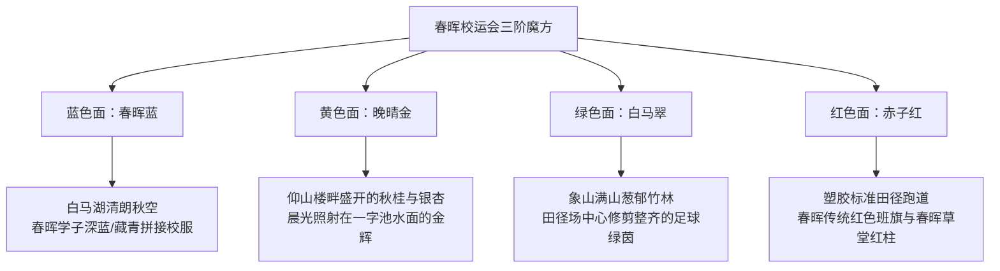

# 春晖中学2026校运会「魔方抽色与青春微记录」Vlog拍摄制作脚本

> **参考视频来源**：`参考视频/5.mp4`  
> **视频体裁定位**：第一人称第一视角（POV）创意转场 + 班级生活微纪录 + 青春群像高燃卡点 Vlog  
> **参考原片时长**：27 秒  
> **核心视觉符号**：魔方逐色唤醒世界（局部抽色 Color Splash）、仰角圆环手叠手（天空之眼）、看台日常切片（广播稿、饮品、拍立得）、全员向天抛洒欢呼  
> **建议配乐（BGM）**：ITZY《BET ON ME》伴奏卡点版 / 欢快律动感欧美流行女声舞曲  
> **适用平台**：抖音、快手、微信视频号、B站竖屏短视频、班级运动会纪念片开头引子  

---

## 一、视频拍摄与制作脚本（逐镜头深度还原）

| 镜头编号 | 时间码 | 景别与机位 | 画面视觉内容（运镜 / 人物动作细节） | 声音设计（原片音效 / BGM） | 画面包装与花字设计 | 旁白设计（解说版可选） |
| :--- | :--- | :--- | :--- | :--- | :--- | :--- |
| **镜头 01** | 00:00 - 00:03 | **全景转主观中景** 手持 POV 机位 | 画面整体为**全灰度黑白**。主角右手单手托举一枚三阶魔方置于画面中央偏右，白色面朝向镜头。背景是开阔的运动会主操场与看台，人流穿梭，但世界毫无色彩。 | BGM 极简电钢琴与低音节奏起势，带轻微环境白噪音 | 画面左上角保持极简干净，无花字 | “如果青春是一场漫长的黑白默片……” |
| **镜头 02** | 00:03 - 00:05 | **特写中景** 魔方主体聚焦 | 主角大拇指轻推魔方顶层，魔方转出**蓝色面**。瞬间，画面中所有蓝色元素（看台蓝色座椅区、远处学生所穿的深蓝与天蓝色校服）被全部点亮，其余区域依然黑白。 | 伴随魔方机械转动的清脆声：**咔哒！** BGM 加入第一声重拍低音 | 蓝色区域微光闪烁动效 | “直到指尖触碰到了第一抹蔚蓝，” |
| **镜头 03** | 00:05 - 00:07 | **特写中景** 魔方主体聚焦 | 主角手指再次拨动魔方，转出**黄色面**。看台上的黄色台阶、横幅标语及阳光照射的反光区域瞬间被赋予鲜艳明黄色。 | 再次伴随魔方转动音效：**咔哒！** 鼓点节奏渐进推进 | 无 | “是看台上炙热的欢呼，” |
| **镜头 04** | 00:07 - 00:08 | **特写中景** 魔方主体聚焦 | 主角快速翻转魔方，呈现**绿色面**。整个操场中央的整片足球场绿茵草坪瞬间被全部点亮，呈现鲜翠欲滴的草绿色。 | 魔方转动脆响，合成器音色上扬升调 | 无 | “是绿茵场蔓延的生机，” |
| **镜头 05** | 00:08 - 00:09 | **特写中景** 魔方主体聚焦 | 再次转动魔方，转出**红色面**。400米塑胶跑道、看台红旗与红色遮阳帐篷瞬间染透烈焰般的中国红。 | 重低音底鼓重击一次：**咚！** | 无 | “是跑道上滚烫的红色轨迹。” |
| **镜头 06** | 00:09 - 00:12 | **全景横移** 视线展开 | 主角手腕轻轻一翻收起魔方，全景画面瞬间**100%恢复全彩自然世界**！远处遮阳伞下并肩行走的同学、红绿相间的田径场、湛蓝澄澈的天空与白云融为一体，操场喧闹声扑面而来。 | BGM 人声演唱正式进入（“...smiling cuz it's contagious...”），现场欢呼声混音渐起 | 底部淡入水印或记录时间戳标记 | “当所有色彩汇聚，我们的赛场全面苏醒！” |
| **镜头 07** | 00:12 - 00:13 | **特殊视角·垂直仰拍** 超广角/鱼眼机位 | 机位贴近地面朝天仰视。全班同学在草坪围成一个规整的圆圈，身体俯向前，全员右手叠放在圆心上方，紧紧相扣。 | BGM 在切分音处短暂静音，现场全班齐声高呼短口号：“Let's go！” | 画面中央浮现白色花体英文：*Let's go* | “并肩站在一起，” |
| **镜头 08** | 00:13 - 00:14 | **仰角特写** 跟风晃动 | 班旗在碧空下猎猎招展。大红色旗面上印着烫金大字“高二十六班”（或春晖班级名），金光耀眼，阳光穿透绸布。 | 伴随呼啸而过的旗帜破风声与 BGM 密集鼓点 | 无 | “扬起属于我们的旗号。” |
| **镜头 09** | 00:14 - 00:15 | **主观视角 POV** 看台微距俯拍 | 坐在看台阶梯上，主角双手分别展示一盒蓝色包装的冰牛乳茶和一瓶茉莉花茶，身后是同窗挤挤挨挨的蓝白色校服后背与零食袋。 | 饮料冰块晃动音效与看台微噪 | 无 | “是藏在看台里的冰镇甜味，” |
| **镜头 10** | 00:15 - 00:16 | **中仰角抓拍** 人物高光 | 看台阶梯上方，一位戴黑框眼镜的女同学迎光站立，双手高举校运会荣誉奖状，另一只手指指向前方赛场，笑容灿烂自信，同伴在旁撑伞喝彩。 | 现场同学欢呼声：“好样儿的！” | 奖状周边微光定格特效 | “是捧在掌心沉甸甸的荣光，” |
| **镜头 11** | 00:16 - 00:17 | **侧仰角半身** 动态跟拍（60fps） | 女子跳高赛场。身穿短袖运动服的女运动员助跑、发力单腿起跳、后仰腾空越过横杆，身旁裁判员与围观同学全神贯注。 | 横杆轻微晃动声与清脆落地声 | 无 | “是越过横杆时的轻盈一跃，” |
| **镜头 12** | 00:17 - 00:18 | **主观俯拍特写** 静物互动 | 第一人称视线，浅蓝色口袋相纸打印机正在桌面上缓缓吐出一张纯白相纸，对面的同学正低头整理明信片与彩笔。 | 机械相纸吐出微小的齿轮传动声：**滋——** | 画面边缘模拟轻微拍立得白框渐显 | “是慢慢显影的实体记忆，” |
| **镜头 13** | 00:18 - 00:19 | **微距特写俯拍** 自然光斜射 | 金色阳光斜射在看台折叠板上，一只握着水笔的手正在粉红色“运动会加油稿”专用信纸上疾书，旁边放置的手机屏幕亮起，显示正在参考的文案。 | 签字笔在纸面上快速划过的沙沙摩擦声 | 稿纸文字局部高亮流光 | “是广播台里念不完的少年心事。” |
| **镜头 14** | 00:19 - 00:20 | **侧后跟拍半身** 行进动态 | 阳光明媚的跑道边缘，戴棒球帽和黑框眼镜的女同学脚步轻快地蹦跳向前，手中握着运动相机自拍杆，忽然转过身面对镜头，神采奕奕地抬手比耶。 | BGM 鼓点持续攀升，歌词来到副歌预备段 | 无 | “每一步奔跑，都踏在阳光里，” |
| **镜头 15** | 00:20 - 00:21 | **仰角特写空镜** 静谧定格 | 镜头对准校园角落盛开的花枝，粉嫩的花瓣在湛蓝天空与白云映衬下摇曳，光线透亮，给高节奏的剪辑留出一次呼吸。 | 舒缓的风铃微音，环境风声 | 无 | “白马湖畔的微风如期而至。” |
| **镜头 16** | 00:21 - 00:23 | **垂直仰角全景** 超广角（圆心机位） | 机位重新置于草坪中央地面仰视。全班同学整齐围成同心圆，面带灿烂笑容俯视镜头，双手重叠紧扣在圆心中央，上方是澄澈蓝天与棉花云。 | BGM 进入副歌最强节拍（“Bet on me, bet bet on me...”） | 画面正中优雅浮现英文手写艺术字：*Bet on me* | “押注这群热烈的少年吧，” |
| **镜头 17** | 00:23 - 00:25 | **垂直仰角全景** 超广角（升格动作） | 伴随副歌高潮，全班所有人同时高喊欢呼，紧扣的手掌猛然向蓝天四方尽情抛洒开来！全员放声大笑，阳光洒在每个人的眼角眉梢，定格最纯粹的青春大合照。 | 现场几十人同声的破晓欢呼爆发，混响悠长 | 花字渐隐，画面边缘带有淡淡胶片暖光晕 | “我们在天地之间，全力盛开！” |
| **镜头 18** | 00:26 - 00:27 | **静态平面设计** 尾页展示 | 抖音/社交平台标志性搜索框引导卡片，展示班级账号名称与发布者信息。 | BGM 旋律余音弱化淡出 | 搜索框：“春晖中学 高二（X）班”与互动关注组件 | 无 |

---

## 二、拍摄思路分析

### 1. 机位布置与视角策略
- **POV 主观视角（第一人称代入感）**：
  - 视频前段魔方抽色、看台饮品、相纸打印、写加油稿四个核心场景均采用主角的第一人称主观视角。
  - **机位要领**：摄像机（或运动相机）贴近胸口或下巴高度，俯角保持在 30° 至 45° 之间，将主角的手部操作作为绝对前景，运动场或同桌作为背景。这种视点能让观众瞬间代入“坐在看台上的一员”，打破旁观者的疏离感。
- **天地对望极低视角（地面仰视超广角圆环）**：
  - 镜头 07 与镜头 16-17 是全片视觉标志性高光。
  - **机位要领**：相机必须完全贴平草坪（镜头朝天 90° 垂直向上），采用等效 14mm 以下的超广角或鱼眼镜头。让全班 20-30 名同学脚尖围成一个直径约 1.5 米的小同心圆，全员上身向前探入镜头视场，形成将蓝天白云围抱在圆心之内的“环形青春之穹”。

### 2. 器材选型与参数调配
- **拍摄设备推荐**：
  - 主力机位：Insta360 Ace Pro / DJI Action 4 / GoPro HERO 12 等超广角运动相机（原片正片由 Insta360 Ace Pro 拍摄，Leica 联合调校色彩在高反差运动场下表现扎实）。
  - 辅助机位：配备超广角防抖镜头的旗舰手机（如 iPhone 15/16 Pro 开启运动模式）或微单相机（搭配 16-35mm f/2.8 镜头）。
- **关键曝光与画质参数**：
  - **分辨率与帧率**：全片统一采用 `4K 60fps` 规格录制。60fps 既能保证正常速度下的流畅度，又能在剪辑到起跳、抛洒双手、转动魔方等瞬间时提供平滑的 2 倍慢动作放慢（降至 30fps/24fps 播放）。
  - **快门速度**：户外强光环境下固定为帧率的两倍（1/120s）。若光线过强，必须加装 ND4 或 ND8 减光镜，避免强光导致的高速电子快门产生画面机械顿挫感，保留自然的运动模糊。
  - **色彩配置文件**：选择相机自带的标准色彩（Standard）或扁平色彩模式（Log/D-Log M），保留高光云层细节与暗部草坪层次。

### 3. 现场人员调度与抓拍技巧
- **去摆拍化现场捕捉**：
  - 看台微记录拒绝生硬背台词。摄影师应手持便携相机穿梭在同学之间，捕捉正在咬吸管喝饮料的侧脸、低头赶写广播稿时紧蹙的眉头、以及同伴冷不防回头笑场的瞬间。
- **圆环合拢与散手指令协同**：
  - 拍摄压轴的圆环手叠手与抛手时，由副班长或体委在圆圈外数节拍：“三、二、一，压紧——嗨起来！放！”
  - 第一次提示全员低头看镜头用力叠手，第二次提示全员视线看向天空、双手同时向上空用力抛散，引导同学自然爆发出欢呼，捕捉最真实的发自内心的松弛笑容。

### 4. 光线与色彩规划
- **时段选择**：
  - 避开正午 12:00-13:30 的顶烈日硬光。首选上午 8:30-10:30（晨光透亮、运动场草地带露水反光）或下午 15:00-16:45（斜射暖金光线，能为人物发丝勾勒出金色轮廓光）。
- **色彩策略**：
  - 前段先以低饱和黑白展现未被点燃的日常，再通过魔方纯色（蓝、黄、绿、红）层层唤醒高饱和色块，后半段进入阳光暖调的自然通透胶片色调，强化色彩层次与情绪释放的递进关系。

---

## 三、旁白思路分析

### 1. 语气语调与声线定位
- **声线要求**：少年感、真诚、轻快、温润且带有生活呼吸感。
- **语调处理**：避免使用官方汇报式的播音腔与亢奋喊麦风格，采用同班同学在耳畔轻声分享日记的平实质感。在微记录部分字句清脆，在尾声全员散手处情绪随音乐副歌自然高亢。

### 2. 情绪节奏曲线

- **00:00 - 00:03 初始段**：声音放轻，语速舒缓，带出一丝悬念与探寻感；
- **00:03 - 00:09 递进段**：语调节奏跟随魔方转动精准踩点，字句短促利落，每转出一色，情绪拔高半度；
- **00:09 - 00:20 展开段**：转入日常生活的惬意与温情，语调充满笑意，声线松弛；
- **00:21 - 00:25 爆发段**：重音落在“押注”、“少年”、“盛开”，声量完全释放，与全班真实的呼喊声浪紧密融合。

### 3. 重音停顿与声画呼应逻辑
- **机械音效与色彩唤醒严格重合**：魔方每次“咔哒”转动，配音字句中的颜色词（蔚蓝、金黄、翠绿、火红）与画面对应区域的色彩爆发完全同步。
- **生活环境拟音强化代入感**：
  - 画面出现纸笔时，配音留下半秒空白，突出笔尖在纸上的“沙沙”声；
  - 画面拍立得吐纸时，保留相纸传动的机械轻响；
  - 画面看台饮料时，保留吸管与冰块碰撞的脆响。
- **多轨混音层级平衡**：
  - BGM 作为节奏骨架，在人声独白时下潜 4dB；
  - 在“Let's go”与“Bet on me”人声歌词爆发处，旁白主动避让，让流行歌曲与现场原声成为主导。

---

## 四、分镜思路与剪辑包装

### 1. 动势匹配与剪辑转换逻辑
- **色彩层级遮罩过渡（00:00 - 00:12）**：
  - 核心逻辑：从单色遮罩到多图层叠加。
  - 第一层保留前景手部与魔方，背景整体去色（Saturation=0）；
  - 随着魔方不同颜色转动，利用色彩限定（Qualifier）分批放行 Blue、Yellow、Green、Red 的色彩通道；
  - 镜头 06 晃动收手的一瞬间，全画面叠加 0.1 秒的白色微闪（Flash），顺畅切回 100% 自然饱和度全景。
- **圆心透视转场（00:12 - 00:13）**：
  - 前一镜头为操场全彩横移，通过快速向前推进推入圆心，紧接仰角手叠手的同心圆画面，利用视觉中心向内聚焦的动势形成视觉平滑过渡。
- **快慢节拍反差**：
  - 生活记录片段（00:13 - 00:20）平均每个镜头时长仅为 0.8 - 1.1 秒，快速剪接营造丰富多样的日常信息量；
  - 压轴镜头（00:21 - 00:25）放缓时间流速，双手抛向天空的过程降速至 50% 播放（慢动作 60fps->30fps），延长青春绽放的视觉停留时间。

### 2. 视听包装设计要素
- **动态手写体艺术花字**：
  - 关键词 *Let's go* 与 *Bet on me* 选用轻盈纤细的手写英文字体（如 *Brittany Signature* 或 *Amsterdam*），配以白色描边与轻微羽化阴影，置于画面视觉留白处，避免遮挡面部。
- **胶片噪点与漏光滤镜**：
  - 在全彩段落（00:13起）全片叠加 5% - 8% 的 35mm 细微胶片颗粒感（Film Grain），高光边缘加入极轻微的橙色太阳漏光（Light Leak），增强高中校运会的复古青春纪念册质感。

---

## 五、针对浙江省春晖中学 2026 校运会的实操落地拍摄建议

### 1. 春晖特色地标与校园色彩在地化映射
春晖中学坐落于绍兴上虞风景秀丽的白马湖畔，拥有极为深厚的人文底蕴与独特的自然景观。在实操落地时，可将原片通用的四色魔方与春晖标志性校园场景深度融合：

- **蓝色面（春晖蓝）**：
  - 映射春晖学子常穿的经典藏蓝/浅蓝校服外套，以及白马湖上空秋高气爽的湛蓝天色。
- **黄色面（晚晴金）**：
  - 映射仰山楼前盛开的金桂、晚晴山房周边的秋日银杏落叶，以及运动会清晨照向看台阶梯的金色斜阳。
- **绿色面（白马翠）**：
  - 映射白马湖的碧波、象山青翠的竹林倒影，以及田径场中央整齐的足球场草坪。
- **红色面（赤子红）**：
  - 映射春晖田径场的红色塑胶跑道、各班挥舞的红色战旗，以及传承夏丏尊、经亨颐、丰子恺等先贤赤子之心的红色文化符号。

### 2. 校园微记录生活细节春晖化捕捉清单
- **广播站通讯稿信纸**：
  - 放弃普通白纸，选用印有“浙江省春晖中学”红色抬头或水印的官方稿纸；
  - 镜头抓拍稿纸上的真挚文段，文末署名落款：“高二（12）班 晨跑健将”或“白马湖畔为你助威的少年”。
- **看台补给与特色物件**：
  - 摆放带有春晖文创标志的水杯、食堂特供的冰镇绿豆汤或上虞当地特色小柑橘；
  - 同学桌边摆放着备战选考与期中复习的笔记本，旁边夹着校运会号码布，体现春晖学子“能文能武、笃行不怠”的真实风貌。
- **拍立得实体定格**：
  - 打印机吐出的相纸画面，可以安排为班主任与运动健儿在春晖草堂前、或看台大本营合力竖大拇指的温馨特写。

### 3. “白马湖畔天空之眼”全班圆环仰拍实操规范
- **拍摄场地推荐**：
  - 首选春晖田径场草坪正中央。此处视线无高大树木遮挡，正上方为完整的开阔天空，四周背景边缘能隐约带出象山的山脊剪影。
- **机位架设与安全防护**：
  - 使用 Insta360 Ace Pro 或带有硅胶保护套的超广角手机，镜头朝天平放在草坪垫上。
  - 拍摄时需注意：同学手部相扣切忌遮挡正下方的镜头正中位置，留出直径约 20 厘米的视觉通道，确保阳光与圆心天空清晰可见。
- **口号协同建议**：
  - 口号可结合春晖精神定制。例如班长领喊：“白马湖畔，谁与争锋？”全班齐声回答：“春晖少年，一往无前！”随后双手向上猛然抛洒。

### 4. 剪辑与后期抽色（Color Splash）具体操作指南

#### 方案 A：剪映（移动端 / PC端）轻量化操作
1. **基础去色轨**：导入原素材至主轨道，在调节面板中将【饱和度】降至 `-50`（全黑白），【对比度】增加 `+15`；
2. **局部抽色轨（画中画）**：
   - 将同一段素材复制一份，作为【画中画】对齐叠加在第二轨，保持全彩色（饱和度不变）；
   - 在魔方转出蓝色瞬间（00:03），在画中画轨道添加关键帧，使用【色度抠图】，吸管吸取看台或校服的蓝色，反向保留蓝色通道，其余区域抠透显示底层的黑白轨；
   - 随魔方转动到黄色、绿色、红色，逐段调整色度抠图的目标色相；
3. **全彩复原转场**：在 00:09 魔方收手时，画中画轨道直接切换为普通无抠图全彩播放，叠加转场特效【闪白】（时长 0.1 秒）。

#### 方案 B：达芬奇（DaVinci Resolve）专业调色节点操作
1. **第一节点（去色）**：建立串行节点，设置 Saturation = 0 作为全黑白基底；
2. **第二至第五节点（并行限定器）**：
   - 建立 Parallel 节点组，分别使用 `Qualifier`（吸管限定器）吸取画面中魔方蓝色、黄色、绿色、红色色块，精细羽化边缘并选定对应环境色彩；
   - 使用关键帧动画（Keyframing），在对应时间码依次将各节点透明度从 0 渐变为 100；
3. **输出胶片质感**：在最终合流节点加入 Kodak 2383 风格 LUT，叠加适量 Film Grain（颗粒度 15%，大小 0.8），提升湖畔少年的电影画质质感。

### 5. 备选配乐方案推荐
若不选用原片韩语流行曲伴奏，推荐以下符合春晖中学 2026 校运会气质的备用曲目：
- **方案 1（清亮欧美律动）**：NewJeans - 《Super Shy》（纯伴奏 Instrumental 版），律动感强，转场卡点清晰，洋溢着高中生自在灵动的青春气息；
- **方案 2（高燃国风电子）**：国风电音重低音纯音乐（如重鼓点唢呐/古筝与现代 Trap 节奏融合），配合春晖厚重的历史底蕴与运动健儿的豪迈冲劲；
- **方案 3（热血少年摇滚）**：回春丹 / 痛仰风格的欢快吉他扫弦纯器乐片段，适合突出白马湖畔自由奔放、无拘无束的少年心气。
