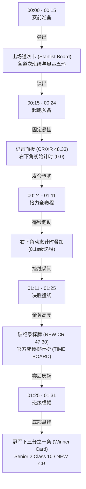

# 浙江省春晖中学 2026 校运会男子 4×100 米接力决赛电视转播级视频分析与实操制作脚本

> **参考视频来源**：`参考视频/12.mp4`  
> **核心定位**：全套复刻奥运会/世界田联（OBS 风格）专业电视转播标准的焦点单项决赛视听呈现与赛事包装系统  
> **参考片长**：1 分 31 秒（91 秒整片）  
> **适用场景**：校运会男子/女子 4×100 米接力决胜局单项全景报道、体育节打破校纪录专题快讯、校电视台赛事转播包装模版、大屏幕高光回放  

---

## 一、视频拍摄与制作脚本（逐镜头精细还原）

参考视频 12 是一部极为罕见的、以“单机位与双机位长焦连续跟拍 + 深度复刻奥运会专业田径转播包装（OBS UI）”为特色的校园短跑接力决赛实况视频。视频从赛前道次卡展示、各就各位起跑口令、实时毫秒跑秒计时、四棒接力全程追踪、终点撞线破纪录高亮定格、官方实时排名成绩单生成，到赛后班级横幅庆祝，形成了一套完整规范的专业体育电视直播视听语法。

| 镜头编号 | 时间码 | 景别与运镜方式 | 画面视觉细节（主体动作/构图透视/动势走向） | 声音设计（现场同期声与解说） | 包装设计与画面剪辑技巧 |
| :--- | :--- | :--- | :--- | :--- | :--- |
| **镜头 01** | 00:00 - 00:15 | **全景 / 看台高机位斜俯拍**（镜头平稳固定，微向右平摇） | 视角设于看台高处俯瞰 400 米跑道起点弯道。起跑线上各班第一棒选手身着不同颜色运动服在各自道次做最后调试；起跑裁判员身穿白衣，高举红色旗帜示意就位；草坪与跑道外围站满举着遮阳伞观战的师生群体。 | 现场开阔声场：看台杂音、微风声、操场广播喇叭隐约回音。 | **核心转播包装弹出**：<br>屏幕中央下半部展开深蓝色半透明赛事名单卡（Startlist Board）：<br>· 顶部图标：白色跨栏奔跑小人 + `ATHLETICS`<br>· 次级标头：`WINNER - MEN'S 4X100M RELAY`<br>· 右侧标识：标准白底彩色奥运五环 LOGO<br>· 中间道次清单：逐行显示 Run way 2-1 Class 2 至 Run way 2-7 Class 10<br>· 左下角：视频作者水印 `爱丽丝萌新ArisMenguki bilibili` |
| **镜头 02** | 00:15 - 00:24 | **全景 / 高机位俯瞰固定机位**（凝视起点起跑区） | 赛前道次板淡出，画面视线完全集中在弯道起跑线。所有选手下蹲就位，双手撑在白线后方。发令员口令响彻全场，红旗举起，全场气氛瞬间凝结。 | **现场发令原声**：<br>“各就各位——”（拖长音，全场静止）<br>“预备——”<br>起跑前短暂的 1.5 秒寂静。 | **专业转播记录与计时 UI 展开**：<br>· **左上角**：浮现深蓝透明信息框，标注现有记录：`CR 48.33`（赛会纪录）、`XR 48.33`（校纪录）<br>· **右下角**：计时底板展开，显示初始时间 `0.0`，右侧镶嵌奥运五环标志 |
| **镜头 03** | 00:24 - 00:34 | **全景至中景 / 高位平滑向右摇镜跟拍（Pan）** | 发令枪击发！枪口冒起白色烟雾。第一棒选手瞬间蹬离起跑线，沿大弯道向画面右侧全力加速飞奔。外道与内道由于阶梯起点展开激烈追逐，镜头平稳向右摇动追踪第一梯队。 | **发令枪鸣响（Bang!）**<br>紧接着全场爆发出震耳欲聋的尖叫与呐喊：“加油！加油！”现场风噪与脚步声交融。 | **实时跑秒系统启动**：<br>右下角计时器以 0.1 秒为单位飞速跑动：`0.5` -> `1.6` -> `2.5` -> `3.5`... 伴随白色五环背景，左上角 `CR/XR 48.33` 常驻对比。 |
| **镜头 04** | 00:34 - 00:46 | **远景至中远景 / 超长焦沿对面直道平摇跟焦** | 镜头跨越整个足球场草坪，使用超长焦镜头拉近至对面直道。第一棒与第二棒顺利交棒，第二棒选手接棒后沿外场直道从画面右向左高速狂奔。跑道内侧整齐排列着各班帐篷、塑料凳与观赛学生。 | 现场广播喇叭播报运动员检录通知；对面直道观战人群的助威声清晰可辨。 | 右下角计时器持续递增：`12.6` -> `14.5` -> `17.5`... 画面保持纯净赛事转播感，无多余花哨滤镜。 |
| **镜头 05** | 00:46 - 00:56 | **中远景 / 长焦摇镜头追踪第三棒入弯** | 镜头继续向左跟摇，第二棒与第三棒进入第三赛段弯道交接区。各道次第三棒队员提前后撤步摆臂起跑，高二10班与8班在交接区域展现出默契配合，第三棒选手顺畅接过接力棒，利用内道切线与弯道离心力全力加速，逐渐形成领先优势。 | 观众席呐喊声浪进一步提高，现场哨声不时响起。 | 右下角计时器跳动至 `23.6` -> `28.5` -> `32.5`... 比赛时间已过半，进入决胜阶段。 |
| **镜头 06** | 00:56 - 01:11 | **中景至特写 / 终点直道正面迎面超长焦推拉跟拍** | **全片最关键视觉核心**！机位切至终点直道正前方高点长焦端。第四棒交接区，身穿黑色短袖运动服、号码布为 `51005` 的高二10班最后一棒选手稳健接棒，转入最后 100 米直道！长焦镜头正面对准该选手，景深大幅压缩，领跑选手眼神专注如炬，步幅巨大、步频飞快，向镜头狂飙而来。后方第二梯队（白色衣服选手）在 10 米外拼命追赶。 | 终点裁判员与终点两侧观众的喝彩达到狂热状态：“冲啊！稳住！”“十班！十班！”呼吸声与风声呼啸。 | · 右下角计时器走过 `34.6` -> `41.5` -> `45.6`<br>· 画面底部中央浮现动态小字签：`O2Y COFK / TIME SET`<br>· 长焦镜头展现强烈的空间压迫感。 |
| **镜头 07** | 01:11 - 01:25 | **中景至全景 / 终点线侧上方垂直锁定撞线与回身** | 高二10班黑色战袍选手张开双臂冲破终点线！撞线瞬间右下角计时猛烈定格在 `47.30`，随后后方第 8 班、第 2 班、第 6 班、第 4 班、第 14 班、第 12 班选手相继通过终点。终点裁判员高声宣读到达顺序。 | **现场裁判员洪亮原声报录**：<br>“七道第一！三道第二！一道第三！六道第四！五道第五！二道第六！四道第七！”<br>看台师生爆发出雷鸣般的喝彩与掌声。 | **破纪录与官方成绩单系统震撼触发**：<br>1. **右下角定格高亮**：右下角计时器瞬间被鲜艳金黄色覆盖，闪现字样：`NEW CR 47.30`<br>2. **左上角成绩榜展开**：左侧从上至下平滑滑出深蓝渐变色官方成绩排行榜（TIME BOARD）：<br>· 1 Run way 2-7 Class 10 (47.30 NEW CR)<br>· 2 Run way 2-3 Class 8 (51.53)<br>· 3 Run way 2-1 Class 2 (51.59)<br>· 4 Run way 2-6 Class 6 (52.91)<br>· 5 Run way 2-5 Class 4 (54.00)<br>· 6 Run way 2-2 Class 14 (54.20)<br>· 7 Run way 2-4 Class 12 (59.57) |
| **镜头 08** | 01:25 - 01:31 | **中景 / 跑道侧平视长焦跟拍庆祝** | 冲过终点后，高二10班夺冠健儿与班级后援团在跑道旁相拥庆祝。同班同学迅速展开一条大红色长条横幅，上面印着极具青春个性与气魄的白字：“这个横幅告诉你 高二10班拉爆你”。参赛队员与同学们手拉横幅、笑容灿烂向看台致意。 | 现场欢呼声与笑声沸腾，全片在热烈而骄傲的气氛中定格落幕。 | **冠军下三分之一荣耀长条卡（Winner Card）**：<br>底部升起深蓝底透亮字幕板：<br>`ATHLETICS / WINNER - MEN'S 4X100M RELAY`<br>主标题高亮：`Senior 2 Class 10`<br>右侧同步挂载：金黄色底块 `NEW CR 47.30` |

---

## 二、拍摄思路分析

参考视频 12 之所以能够仅用约 90 秒的时长制造出媲美世界大赛的沉浸观赛感，其核心在于将**“大场面机位调度”**与**“极其严谨的广播电视赛事包装逻辑”**结合。

### 1. 机位布置与视角设计

- **主转播机位（看台顶层中轴高机位）**：
  - **位置选址**：架设于主看台最高层或主席台侧上方看台（高度约 8-12 米），使用重型液压云台保持绝对水平。
  - **覆盖范围**：该机位具备全场无遮挡俯视视野，负责完成镜头 01（赛前全景与道次宣布）、镜头 02（起跑预备）、镜头 03（第一棒发令弯道起跑）以及镜头 04、05 的平滑跟摇。
  - **运镜特性**：以极慢、极匀速的水平摇动（Pan）为主，禁止剧烈抖动与突兀推拉，保证画面呈现国家级体育转播的从容感与稳定感。

- **终点正面长焦决胜机位（直道延长线正面视角）**：
  - **位置选址**：架设于 100 米直道终点线后方约 15-25 米处的延长线上，镜头高度约 1.5 米（平视偏微俯）。
  - **镜头焦段**：采用 70-200mm f/2.8 或 100-400mm 超长焦端，在镜头 06（第四棒冲刺）时迅速切入。
  - **透视效果**：超长焦端将百米跑道深度压缩，第一名健儿迎面飞奔而来时，背景的追赶者与看台被压缩成平面的竞速图卷，极具扑面而来的视觉压迫感。

- **终点线裁判记录机位（撞线侧斜角视角）**：
  - **位置选址**：架设在终点白线侧上方 45 度角（镜头 07），既能清晰捕捉撞线瞬间的躯干压线动作，又能将终点记录裁判、计时定格与跑道终点缓冲区尽收眼底。

### 2. 器材参数与技术指标

- **录制分辨率与帧率**：
  - **基础帧率**：严格设定为 **4K 60fps**。体育竞速视频切忌采用 24fps，60fps 能够提供极度丝滑流畅的运动连贯性，消除运动员肢体快速挥动时的断裂卡顿，同时为撞线刹那预留后期 2-2.5 倍升格慢放空间。
- **快门速度（Shutter Speed）**：
  - 固定在 **1/120s**（遵循 180° 快门角原则）。在阳光充足的田径场上，必须为长焦镜头配备 **ND8 / ND16 可调减光镜**，防止因缩小光圈至 f/16 以上带来画质衍射下降，保持大光圈浅景深与柔和纯正的动态模糊。
- **追焦模式（AF Focus Tracking）**：
  - 采用相机的高性能“运动主体识别对焦”与“人体姿态检测”（如 Sony 实时眼部/身体跟踪或 Canon 车辆/人物优先识别）。对焦灵敏度调至“锁定/平滑”，避免接力区多名运动员重叠穿插时焦点发生抽搐跳变。

### 3. 调度与现场配合技巧

- **避开地面遮挡的人群视线**：4×100 米接力赛时，内场与跑道两侧往往聚集了大量备赛选手与拉拉队。机位若设置在地面，极易在第三棒与第四棒交接时被围观人群的头部、遮阳伞彻底挡死。参考片选择**站上看台高位俯视**，彻底越过了地面人群的视线阻挡。
- **长焦跟摇的预判性运镜**：摄影师必须预先熟记接力赛的四个交接区（起跑弯道 -> 对面直道 -> 第三棒弯道 -> 终点直道），在上一棒即将触及交接线前 2 秒，平滑将取景框重心微移至接棒选手的起跑引导区，完成视觉重心的自然转移。

### 4. 光线与色彩控制策略

- **高光比控制**：操场通常受日光直射，红跑道、白分道线与运动员面部反差极大。采用 Log 模式（如 S-Log3 或 C-Log2）或专业 HLG 录制，确保高光处的白色终点线不溢出过曝，背光面部阴影依然保留细节。
- **色彩基调**：调色风格保持专业广播电视的纯净中性色调，适度强化蓝色与红色的饱和度（红道、绿草、蓝天），肤色校准至标准象限，凸显阳光健美的青春气色。

---

## 三、旁白思路分析

参考视频 12 原片完全依托真实的现场发令口令、裁判员高亢的排名报单以及观众席助威声，构建了极其生动的纯现场纪实氛围。若春晖中学融媒体中心将其制作成具备**专业体育解说旁白**的焦点报道片，旁白需要严格模仿专业赛事评论员（如央视体育田径解说风格），并深度融入春晖校园历史与班级精神。

### 1. 旁白核心定位与语气语调

- **风格定位**：专业国家级体育赛事解说标准。用词严谨规范、语调沉稳威严、情绪爆发迅猛、吐字铿锵有力。
- **情绪节奏曲线**：
  - `00:00 - 00:15`（道次宣布）：**沉稳宏大、专业肃穆**。交代决赛背景与参赛阵容，营造大赛降临的压迫感。
  - `00:15 - 00:24`（各就各位）：**全场屏息、完全静音**。解说员停止说话，把听觉完全留给发令员口令，制造暴风雨前的窒息等待。
  - `00:24 - 00:34`（第一棒起跑）：**瞬间点火、语速提振**。枪响刹那音调拔高，解说紧跟起步局势。
  - `00:34 - 00:56`（二三棒拉锯）：**咬紧节奏、客观敏锐**。快速捕捉弯道交接细节与位置反超。
  - `00:56 - 01:11`（第四棒决胜冲刺）：**热血沸腾、情绪顶峰**。语速攀升至 280-300 字/分钟，声如洪钟，将观众情绪推向极致！
  - `01:11 - 01:25`（撞线破纪录）：**高亢狂喜、豪迈宣布**。大声报出破纪录成绩，随后情绪平稳过渡至成绩复盘。
  - `01:25 - 01:31`（赛后横幅）：**温情自豪、青春赞歌**。为班级凝聚力与春晖体育精神点题升华。

### 2. 春晖中学 90 秒专业电视解说词脚本逐字稿

```text
【00:00 - 00:15 序幕·决战道次】
画面：看台俯瞰起点弯道，全屏道次名单展开
环境音：现场开阔杂音，看台人群期待的人声
解说：（沉着稳健，字正腔圆，播音级共鸣）
“观众朋友们，这里是浙江省春晖中学2026年秋季田径运动会的决胜现场！
马上要进行的是整个田径赛场最具悬念、也最令人血脉偾张的项目——高二年级男子4×100米接力决赛！
我们可以看到，第七道是预赛第一的高二10班，第三道是实力强劲的高二8班，两旁各班健儿已经各就各位，大战一触即发！”

【00:15 - 00:24 蓄势·窒息等待】
画面：道次卡淡出，左上角 CR 48.33 记录框浮现，右下角计时 0.0 待命，全员下蹲
解说：（解说员完全闭麦，保留现场清澈原声）
现场广播：“各——就——位——”
（运动员撑地伏身，全场寂静）
现场广播：“预——备——”

【00:24 - 00:34 第一棒·疾风起步】
画面：发令枪冒烟，全体选手如离弦之箭冲入第一弯道
音效：发令枪响（砰！），右下角毫秒跑秒计时疯狂递增
解说：（瞬间爆发，语速跃升，紧咬节拍）
“比赛开始！各道起步都非常稳健！
第七道的高二10班凭借出色的起跑爆发力迅速向前压制，内道的高二8班和2班也在奋力追赶！
弯道进直道，选手们身体向内倾斜，拼尽全力逼近第一交接区！”

【00:34 - 00:46 第二棒·直道竞逐】
画面：超长焦平摇锁定第二棒，对面直道高速飞奔
解说：（语速平稳有力，清晰捕捉交棒细节）
“一二棒交接！非常流畅！
高二10班第二棒选手接棒后瞬间加速，在对面直道一马当先！
各班选手在这一赛段差距非常微小，几乎并驾齐驱！现场呐喊声已经彻底沸腾！”

【00:46 - 00:56 第三棒·弯道乾坤】
画面：长焦追踪进入第三棒，弯道反超与交接准备
解说：（音调持续推高，语调极具张力）
“进入第三棒弯道决战！这是决定走势的关键一环！
高二10班第三棒选手步幅极大，依靠出色的弯道离心技术稳稳守住了领先身位！
身后8班正在步步紧逼！最后一棒已经开始起步启动！”

【00:56 - 01:11 第四棒·百米决胜】
画面：切入终点正面超长焦，高二10班最后一棒 51005 号迎面大步狂飙
解说：（情绪推至最巅峰，声浪炸裂，激情澎湃）
“三四棒完成交接！高二10班第四棒接棒了！
最后的冲刺！迎面狂飙！
这是意志与速度的极致对决！
10班选手步伐坚定如铁，甩开身后第二集团超过十米距离！
没有人能阻挡他的步伐！他在向着终点线全力狂奔！”

【01:11 - 01:25 撞线·破纪录狂澜】
画面：10班撞线，右下角计时瞬间变黄定格 NEW CR 47.30，左侧官方排位大榜滑出
解说：（高亢长啸，充满振奋与敬意）
“冲线——！
47 秒 30！打破校纪录！
高二10班打破了尘封多年的48秒33赛会纪录！
他们创造了新的春晖历史！高二10班夺得了男子4×100米接力冠军！”
（微顿，融入裁判员现场报单原声：“七道第一！三道第二！一道第三！”）
解说：“裁判员正在宣读各班名次，第二名高二8班51秒53，第三名高二2班51秒59！”

【01:25 - 01:31 尾声·横幅荣光】
画面：10班拉起霸气红横幅庆祝，底部浮现冠军包装标牌
解说：（语调转为温暖自豪，余音绕梁）
“从白马湖畔的每一次苦练，到红道之上的荣光加冕。
一根接力棒，传递的是信任与无畏，写下的是属于春晖少年的热血篇章！”
```

---

## 四、分镜思路与剪辑包装（OBS 专业电视转播系统还原）

参考视频 12 的核心灵魂在于其完备的“田径世锦赛 / 奥运会 OBS（Olympic Broadcasting Services）风格电视包装”。掌握这一套视觉符号并在剪辑软件中精准复刻，是本片从普通校园录像跃升为专业转播大片的关键。



### 1. 核心转播视觉包装要素拆解

1. **赛前出场道次卡（Startlist Board，00:00 - 00:15）**：
   - **配色体系**：深海蓝底（`#0D2C54`），搭配白色半透明渐变横条，字体采用标准粗体无衬线英文（如 Helvetica Neue Bold 或 DIN Alternate Bold）。
   - **版面布局**：
     - 左侧顶部：白色动态跑动剪影小人 + `ATHLETICS` 运动大项标识；
     - 居中副标：`WINNER - MEN'S 4X100M RELAY`；
     - 右侧徽标：全彩奥运五环或春晖中学校徽圆形矢量标；
     - 主体道次列表：7 条并列分行，左侧注明 `Run way 2-1` 到 `Run way 2-7`，右侧粗体标注对应参赛班级名称 `Class 2`, `Class 14`, `Class 8`...，两端由细蓝色线框包裹。

2. **常驻纪录标牌（Record Banner，00:15 - 01:11）**：
   - **位置**：左上角安全区内。
   - **构成**：左侧黄色/青色小色块，黑字标明 `CR`（Championship Record）与 `XR`（School Record）；右侧深蓝半透明底，白字显示历史纪录数字 `48.33`。在整场奔跑过程中保持悬挂，时刻提醒观众当前的破纪录基准。

3. **动态跑秒计时系统（Real-time Timing Overlay，00:24 - 01:11）**：
   - **位置**：右下角安全区。
   - **构成**：左侧为蓝白半透明底条，以等宽数字字体显示从 `0.0` 递增至 `47.3` 的计时；右侧常驻微缩五环徽标。
   - **触发逻辑**：剪辑时必须将计时器启动的第一帧（`0.0 -> 0.1`）精确对齐发令枪冒烟起爆的当帧（0 延迟对齐）。

4. **撞线破纪录高亮特效（NEW CR Flash Graphic，01:11）**：
   - **变色动效**：当运动员胸口压过终点线当帧，右下角计时底板由深蓝色瞬间变为明亮金黄色（`#F5B700`），文字跳变为黑字 `NEW CR 47.30`，并带有 2 次轻微的明暗高光闪烁（Flash），瞬间引爆视觉兴奋点。

5. **官方终点排名成绩单（Results Board / Time Board，01:11 - 01:25）**：
   - **展开逻辑**：左上角由点及面滑出 `TIME BOARD` 标题卡，下方依次由上至下阶梯式滑入 1-7 名的成绩列表。
   - **第一名高光**：第一行（高二10班）特别标注黄色方块 `NEW CR 47.30`，其余道次右侧精准显示毫秒成绩（如 `51.53`, `51.59`, `52.91` 等）。

6. **冠军荣耀下三分之一标牌（Winner Lower-Third Card，01:25 - 01:31）**：
   - 随镜头转向跑道边拉横幅庆祝的获胜班级，底部展开大尺寸冠军荣誉卡，左侧为项目图标，中央粗体排印 `Senior 2 Class 10`，右侧延续黄色角标 `NEW CR 47.30`，为全片画上官方定论的圆满句号。

### 2. 剪辑节奏与动势匹配

- **超长镜头与剪辑取舍**：参考片并没有采用常见的碎片化快速卡点抽帧，而是采用了**“4 大连续长镜头组合”**：起点出发（10秒）-> 对面直道（12秒）-> 弯道交接（10秒）-> 终点迎面直道冲刺（15秒）。这种剪辑逻辑最大化保留了百米接力赛中位置拉锯、起伏反超的真实竞技连贯感，严禁在交接棒的关键瞬间切碎画面。
- **声音层叠设计**：
  - 终点段落（01:11）将现场裁判拿着大喇叭宣读各道次名次的广播原声推至音轨最上层，未经滤镜修饰的真实人声带来了无可替代的纪实厚重感；
  - 随后在横幅庆祝镜头中，淡入激昂大气的胜利弦乐管弦乐底色，声画双重推向高潮。

---

## 五、针对浙江省春晖中学 2026 校运会的实操落地拍摄建议

为在 2026 年浙江省春晖中学秋季校运会男子/女子 4×100 米接力赛中完美复刻并超越该参考视频的效果，特制订本套低成本、高画质、可实操的现场执行手册。

### 1. 场地环境与春晖地标借景

- **白马湖畔田径场环境特色**：
  - 春晖中学田径场背靠葱郁象山，西侧紧邻平屋与曲院风荷，南侧开阔通透。
  - **开场道次卡背景**：建议将开场镜头设在田径场主席台上方看台，取景框内将 400 米红色塑胶跑道、绿茵场与后方的象山田园山色一同入镜，既有现代体育赛事的规整，又带有一抹春晖独有的江南名校书香底蕴。
- **横幅与口号文化**：
  - 参考片中高二10班的横幅“这个横幅告诉你 高二10班拉爆你”极具青春朝气与感染力。在春晖校运会现场，摄影团队应提前与高一、高二各班宣传委员沟通，在终点冲刺区后方安排班级后援团携带班旗、红底白字加油横幅（如“春晖少年 锋芒必现”、“高二（12）班 独占鳌头”）。当冠军产生时，镜头第一时间推向横幅与热烈拥抱的同学。

### 2. 人员与机位双兵实操配置方案

针对校内融媒体中心或学生记者团有限的人手与设备，推荐采用**“双机位极简高效配置”**：

| 机位编号 | 责任人员 | 设备配置与参数 | 物理架设位置 | 核心拍摄任务与分工 |
| :--- | :--- | :--- | :--- | :--- |
| **机位 A（主俯瞰转播机）** | 摄影师 1（主控手） | 相机搭载 24-105mm 或 24-70mm 镜头，专业重型液压三脚架，设置 4K 60fps | 主看台最高层中央（俯瞰全场） | 负责赛前全场全景、起跑线俯瞰各就各位、第一棒鸣枪弯道跟摇、对面直道中景过渡。保持极其沉稳的摇镜动作。 |
| **机位 B（终点决胜长焦机）** | 摄影师 2（机动追焦手） | 相机搭载 70-200mm f/2.8 或 100-400mm 镜头，独脚架，设置 4K 60fps（或 120fps） | 终点直道正前方延伸区（离终点线 20 米外） | 前 30 秒待命；在第三棒入弯前迅速开机锁定第四棒交接；迎面抓拍第四棒选手狂奔的面部微表情与肌肉线条；抓拍冲线刹那的欢呼；随后立即调转镜头跟拍班级横幅庆祝合影。 |
| **音轨录音员（可由助理兼任）** | 现场助理 | 无线领夹麦 / 指向性枪麦，连接便携录音机 | 终点裁判长与终点记录处 | 核心任务是**录清终点主裁判口述名次原声**以及现场鸣枪声，为后期电视包装提供清晰震撼的同期声音轨。 |

### 3. 剪辑软件中 OBS 专业转播包装制作指南

要在剪映（CapCut）、Adobe Premiere Pro 或 After Effects 中精准还原参考片的转播 UI，请遵循以下流程：

1. **模板工程准备**：
   - 赛前在 Adobe Illustrator 或 Photoshop 中预先设计好 1920×1080 / 3840×2160 的透明 PNG 素材层：
     - `Startlist_BG.png`（深蓝渐变道次底板，预留班级文字占位符）；
     - `Record_Banner.png`（左上角 CR/XR 48.33 标牌）；
     - `Timer_Box_Blue.png` 与 `Timer_Box_Yellow.png`（右下角计时底框，蓝底正常版与黄底破纪录版）；
     - `Results_Board.png`（终点官方成绩榜大底板）。
2. **实时跑秒计时器实现方案**：
   - **Premiere Pro / After Effects**：使用内置特效 `时间码 (Timecode)`，格式选择 `Frames` 或利用表达式 `time.toFixed(1)` 生成纯数字，对齐发令枪响第一帧，右侧附上春晖校徽或五环图标。
   - **剪映专业版**：在素材库中搜索“秒表计时器 / 毫秒跑秒透明通道”，导入后将其剪切起点对齐枪响瞬间，通过画中画混合模式（滤色）置于右下角底框内。
3. **破纪录定格切变技巧**：
   - 在冲线瞬间（胸口切入终点垂直面的那一帧）：
     - 将计时器切片冻结（Freeze Frame）；
     - 计时底框瞬间替换为金黄色 `Timer_Box_Yellow.png`；
     - 叠加一声清脆的“钉！”金属提示音效（Ding FX）或低频重音，烘托纪录诞生的荣耀感。
4. **终点排名文字自动套用**：
   - 比赛结束后 5-10 分钟，前往田径场总裁判组索取官方打印的成绩单，或依据终点裁判录音直接敲入各班道次、班级与毫秒成绩，填入预设好的 `Results_Board` 文字图层中，按序添加入场位移滑行动画。

### 4. 关键实操防错与注意事项

1. **防视线遮挡预案**：终点线冲刺时，往往有大量观赛学生和被淘汰选手拥堵在缓冲区。摄影师 2（机位 B）必须提前与现场体育组执勤老师沟通，站在警戒线内正对直道的安全高台或裁判站台上，确保从第四棒接棒直至撞线后的 20 米滑行全程无任何遮挡。
2. **长焦防抖与对焦锁定**：面对 200mm 以上的长焦迎面拍摄，严禁纯手持。必须使用带阻尼液压的独脚架，并开启相机防抖模式（Standard IS）。对焦区域选择“中央扩展点对焦”或“人物主体跟踪锁定”，一旦第四棒选手出弯，立即半按快门将绿色对焦框牢牢锁死在其胸口号码布上，直至冲过镜头。
3. **音画毫秒同步校准**：由于声音在空气中的传播速度约为 340m/s，主看台机位距离起点可能有 50-80 米，麦克风录到的枪声会比实际画面延迟 0.15-0.25 秒。剪辑时切记：**以发令枪口冒烟的画面帧为基准点，手动将枪声音频波形前移对齐冒烟帧，计时器同步归零启动**，方能呈现毫秒不差的专业转播水准。
