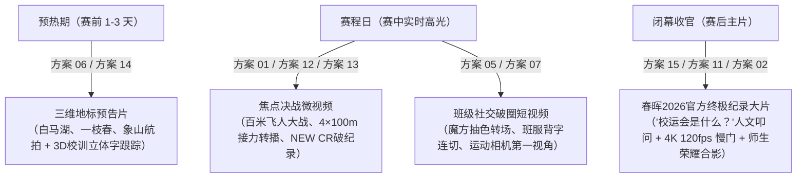

# 2026 校运会参考视频脚本与制作方案全景总览

本目录汇总了对 `参考视频/` 目录下全部 15 部标杆参考视频的多模态深度审片、画面逐帧拆解与脚本提取，涵盖**视频拍摄脚本**、**拍摄思路**、**旁白思路**、**分镜思路**与**浙江省春晖中学实操拍摄建议**五个核心维度。

---

## 一、15 部参考视频方案全览

| 编号 | 方案文档 | 对应视频 | 风格定位 | 核心特点与适用场景 |
| :--- | :--- | :--- | :--- | :--- |
| **01** | [`01_男子100米决赛_奥运转播解说风格脚本.md`](./01_男子100米决赛_奥运转播解说风格脚本.md) | `1.mp4` | **专业赛事直播解说**（CCTV-5 奥运包装） | **重点单项高光决战**。 • 电视转播全套 UI（台标、道次条、成绩榜） • 终点 Photo Finish 鹰眼判定（1st/2nd/3rd） • 专业播音腔战况实时解说 |
| **02** | [`02_校运会高燃快剪混剪MV风格脚本.md`](./02_校运会高燃快剪混剪MV风格脚本.md) | `2.mov` | **高燃快节奏混剪 MV**（Highlight 宣发大片） | **全景回顾与官方宣发**。 • 强节奏鼓点卡点与电影级升格（60-120fps） • 短跑、拔河、跳远、汉服展演、合影全景覆盖 • 纯音乐燃向与抒情热血旁白双版本 |
| **03** | [`03_肇庆学院校运会高燃卡点快剪脚本.md`](./03_肇庆学院校运会高燃卡点快剪脚本.md) | `3.mp4` | **高燃卡点快剪与竞技特写**（Beat Drop & Action Cam） | **短视频平台爆款卡点与力量美学**。 • 极低贴地机位（起跑器/沙坑/跨栏） • FPV 穿梭机俯冲掠顶与 120fps 超慢动作飞沙连剪 • 操场巨幅红字拼字大航拍升华 |
| **04** | [`04_长江大学国旗与田径交错快剪脚本.md`](./04_长江大学国旗与田径交错快剪脚本.md) | `4.mp4` | **双线交错对位蒙太奇大片**（Cross-cutting Parallel） | **仪式感与高燃竞技巅峰对决**。 • 国旗护卫队威武正步与赛道极限竞速交错剪辑 • 4 帧抽帧闪切（Flash Cutting）与变速曲线 • 舞龙舞狮传统方阵与千人方队大航拍 |
| **05** | [`05_魔方抽色与青春微记录Vlog脚本.md`](./05_魔方抽色与青春微记录Vlog脚本.md) | `5.mp4` | **魔方抽色与第一人称青春微记录 Vlog**（POV & Color Splash） | **班级群像与沉浸式现场记录爆款**。 • 手持魔方旋转唤醒黑白世界（局部抽色转场） • 地面超广角仰拍同心圆手叠手与向天散手（天空之眼） • 看台广播稿、冰饮、拍立得显影生活微切片 |
| **06** | [`06_湖南第一师范学院三维地标与高燃卡点脚本.md`](./06_湖南第一师范学院三维地标与高燃卡点脚本.md) | `6.mp4` | **三维地标跟踪与极速卡点预告片**（3D Tracking & Phonk） | **开幕倒计时与短视频引流爆款**。 • 航拍校园地标三维立方体翻转折叠（3D Voxel Transition） • 3D Camera Tracking（悬浮立体大字、校训、校徽） • 爆裂 808 底鼓与毫秒级动势卡点 |
| **07** | [`07_参考视频7_分析与制作脚本.md`](./07_参考视频7_分析与制作脚本.md) | `7.mp4` | **运动相机穿梭与班级魔性卡点**（Action Cam & Meme Style） | **年轻态班级纪实与高活跃社交传播**。 • 运动相机穿屏转场、哪吒大头套魔性打卡 • 班服背字爱心贴纸 7 连切与九宫格矩阵拳击 • 彩色烟雾跑道飞奔与夜景巨幅班旗挥舞 |
| **08** | [`08_参考视频8_分析与制作脚本.md`](./08_参考视频8_分析与制作脚本.md) | `8.mov` | **全景纪实官方高光集锦**（Official Highlight Recap） | **闭幕大合影与全流程宣发标杆**。 • 航拍 90° 垂直俯瞰拔河与跳远赛区（对称几何美学） • 拔河主力青筋暴起特写与万人助威声浪 • 旱地毛毛龙趣味竞速与颁奖四分屏包装 |
| **09** | [`09_杭州高级中学体育场高燃集锦脚本.md`](./09_杭州高级中学体育场高燃集锦脚本.md) | `9.mp4` | **万人体育场高燃竞技集锦**（FOCUS 视界·摄影社出品） | **百年名校宏大场馆与极致爆发**。 • 万人场馆 360° 环绕航拍与索塔大拉升 • 钉鞋起跑微距、接力绝地超车、跳高背越三机位快切 • 红底白字圆形校徽落幕与学生摄影社规范 |
| **10** | [`10_惠东综合实验学校接力赛转播与全流程包装脚本.md`](./10_惠东综合实验学校接力赛转播与全流程包装脚本.md) | `10.mp4` | **接力赛电视转播与全流程包装长片**（4×100m 完整赛事） | **焦点团体单项完整转播录像**。 • 赛前纪录板、道次四人名单、实时毫秒秒表 • 航拍椭圆跑道全程伴飞追踪四棒交接 • 官方计分榜、违规 DQ 标示与演职人员大滚屏 |
| **11** | [`11_杭州师范大学融媒体精剪MV脚本.md`](./11_杭州师范大学融媒体精剪MV脚本.md) | `11.mp4` | **融媒体中心标杆级精剪 MV**（以物见人 + 静默蓄势） | **官方高规格赛事回顾大片**。 • 前 16 秒微距静物铺垫（起跑器/刻度架/沙坑/鞋带） • 枪响前 1.5 秒全黑屏视听剥夺与爆发反差 • 战鼓擂响、大把防滑镁粉搓揉如飞雪、礼仪颁奖 |
| **12** | [`12_参考视频12_分析与制作脚本.md`](./12_参考视频12_分析与制作脚本.md) | `12.mp4` | **OBS 转播风格 4×100m 接力决赛实录**（破纪录 NEW CR） | **破纪录焦点战役现场转播**。 • 标准世界田联 OBS 转播包装卡片 • 终点 400mm 超长焦迎头冲刺、47.30 撞线金黄 NEW CR 特效 • 跑道分色高亮与官方 Time Board 动态滑出 |
| **13** | [`13_参考视频13_分析与制作脚本.md`](./13_参考视频13_分析与制作脚本.md) | `13.mp4` | **国家级体育赛事直播解说与 VAR 裁决**（高空天眼 + Photo Finish） | **顶级专业转播范式**。 • 高空天眼鸟瞰 + 低空动态跟飞 + 地面超低升格 • 终点垂直 VAR 毫米级裁决与分色跑道高光 • 严谨专业体育解说与全员成绩榜联动 |
| **14** | [`14_大疆无人机航拍与赛场空镜调度脚本.md`](./14_大疆无人机航拍与赛场空镜调度脚本.md) | `14.mp4` | **无人机航拍实战与空域调度教学**（Air 3S / Mavic 3 / Inspire 2） | **摄制团队航拍操作与空域协同**。 • 夜间千人跑操大方阵、火炬接力跟飞 • 悟2专业影视云台开箱安装主观视角（POV） • 画中画飞手推杆实操界面与高空画面严密对齐 |
| **15** | [`15_天河中学设问排比式深情纪录片脚本.md`](./15_天河中学设问排比式深情纪录片脚本.md) | `15.mp4` | **设问排比式人文纪录大片**（“校运会是什么？”核心叩问） | **闭幕收官与校史典藏最顶级文案**。 • 设问排比句（仪式/坚持/竞争/瞩目/飞跃/尝试/面对失败/竭尽全力/超越/成功/认可） • 4K 120fps 慢门治愈与不唯金牌论的人文厚度 • 温暖女中音配音与极简左下角字幕美学 |

---

## 二、浙江省春晖中学 2026 校运会（2026SportsMeet）落地实施指南

### 1. 全周期“四大宣发矩阵”排期规划

### 2. 春晖摄制组现场四路机位协同标准

- **机位 A（高空航拍组 · 1-2人）**：
  - **设备**：DJI Mavic 3 Pro / Air 3S；
  - **核心任务**：开幕方阵大平移、白马湖与象山大景环绕、直道俯冲伴飞追焦、终点线 20 米上空 90° 垂直 Photo Finish 判定。
- **机位 B（长焦微单组 · 2人）**：
  - **设备**：微单机身 + 70-200mm f/2.8 或 100-400mm 镜头；
  - **核心任务**：百米起跑钉鞋特写、交接棒指缝交接、跳远沙粒飞溅、运动员大口喘气与赛后相拥温情神态。
- **机位 C（贴地广角组 · 1人）**：
  - **设备**：微单机身 + 16-35mm 广角 + 三轴稳定器；
  - **核心任务**：贴地 5-10cm 跟跑起跑、直道极低仰拍飞人冲刺、沙坑前沿边缘埋伏扑脸飞沙。
- **机位 D（运动相机穿梭组 · 1-2人）**：
  - **设备**：Insta360 Ace Pro / X4 / GoPro；
  - **核心任务**：深入各班级大本营、拔河人潮中心、起跑前圆环手叠手仰拍（天空之眼）、魔方色彩转场道具拍摄。
