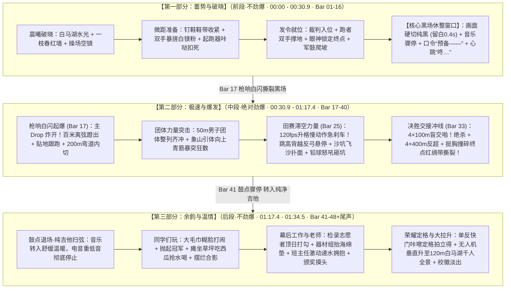

# 视频一：传统校运会高光混剪 MV · 最终成品脚本

> **制作定位**：浙江省春晖中学 2026 年校运会官方高燃混剪 MV  
> **成片时长**：**1 分 34.5 秒（约 95 秒，严密契合 124 BPM 全曲 48 小节乐理与三段式情感曲线）**  
> **工程主 BGM**：[Vicetone - Nevada (1分35秒_完整三段式温情收官版).mp3](file:///Users/fuzihao/Desktop/2026SportsMeet/视频01_传统高光混剪/BGM/Vicetone%20-%20Nevada%20(1分35秒_完整三段式温情收官版).mp3)  
> **备选无跳剪版**：[Vicetone - Nevada (原版前1分22秒_纯净无跳剪版).mp3](file:///Users/fuzihao/Desktop/2026SportsMeet/视频01_传统高光混剪/BGM/Vicetone%20-%20Nevada%20(原版前1分22秒_纯净无跳剪版).mp3)  
> **节拍卡点依据**：[Nevada_全曲韵律节拍与卡点时码分析.md](file:///Users/fuzihao/Desktop/2026SportsMeet/视频01_传统高光混剪/BGM/Nevada_全曲韵律节拍与卡点时码分析.md)（124.00 BPM，单拍 483.87ms，小节 1935.48ms）  
> **真实赛程映射**：[运动会竞赛日程表.md](file:///Users/fuzihao/Desktop/2026SportsMeet/运动会时间/运动会竞赛日程表.md)（涵盖 100m、200m、50m团体赛、引体向上团体赛、4×100m、4×400m男女混合接力、跳高背越式、跳远沙坑、铅球）  
> **制作执行**：春晖中学新媒体社团队  

> [!IMPORTANT]
> **【特别使用说明：画面内容均为参考，实操可自由替换】**  
> 本分镜表中所列出的所有运动赛项、具体动作细节、班级编号及人物均属于**视觉参考范例与音乐节奏卡点骨架**。实际后期剪辑时，所有镜头内容**完全由剪辑同学根据现场实际抓拍到的高光画面自由挑选和替换**。只要镜头的动势、景别反差与当前小节的节奏时码吻合即可，切忌生搬硬套。

---

## 一、全片宏观结构：三段式情绪弧线（前段不劲爆 $\rightarrow$ 中段劲爆 $\rightarrow$ 后段不劲爆）

全片采用经典的**“蓄势破晓 $\rightarrow$ 全域狂飙 $\rightarrow$ 青春温情”**三段式情绪弧线：

---

## 二、逐镜详细分镜脚本详案（时码与卡点指引）

### 【第一部分：蓄势与破晓】（前段·不劲爆 · Bar 01 - 16 · 00:00:00 ~ 00:30:15）
*注：本段音乐为清脆吉他律动与人声主歌爬坡，画面内容为参考方案，剪辑时可自由替换为检录处抓拍、大本营热身、互别号码布等赛前场景。*

| 镜头编号 | 对应小节 | 30fps时码 | 景别与运镜 | 画面参考视觉内容（运镜 / 动作 / 春晖环境要素） | 剪辑变速曲线 (Speed Ramp) | 拟音与人声设计 (Foley & Voice) |
| :---: | :---: | :---: | :---: | :--- | :--- | :--- |
| **01** | Bar 01 | `00:00:00` | 航拍大远景 (慢速微推) | 晨曦微露，无人机掠过白马湖碧波微澜，远处象山青翠若黛，晨雾中隐约可见春晖校园与红色田径场。 | 正常 100% 极缓流动 | 白马湖清晨微风徐徐掠过、远处水鸟清脆啼鸣声 |
| **02** | Bar 02 | `00:01:28` | 中远景平移 | 晨光透过古樟树枝桠倾泻在“一枝春”红墙青瓦上，阳光在白马湖水面上泛起粼粼金光。 | 正常 100% 顺滑平移 | 树叶沙沙轻响，环境空灵纯净 |
| **03** | Bar 03 | `00:03:26` | 操场全景仰拍 | 仰视春晖红蓝塑胶田径场全景，晨风拂过，看台上的红旗与校旗猎猎作响，晨光勾勒出静穆的赛场跑道。 | 正常 100% | 旗帜在风中翻卷的扑啦呼啸声 |
| **04** | Bar 04 | `00:05:24` | 贴地微距特写 | 运动员脚步踏在红色塑胶跑道颗粒上，钉鞋底部的金属钢钉清晰可见，橡胶与金属摩擦落地。 | 正常 100% | 钉鞋踏在塑胶颗粒上的清脆刮擦声 |
| **05** | Bar 05 | `00:07:22` | 特写 / 慢门 | 运动员单膝跪地，双手利落收紧荧光色鞋带，用力拉扯打结勒紧，随后起身顿足，脚尖点地试弹。 | 正常 100% -> 勒紧瞬间降至 60% | 鞋带纤维强力摩擦勒紧声、鞋跟顿地清脆声 |
| **06** | Bar 06 | `00:09:20` | 特写 / 120fps升格 | 双手在胸前剧烈搓揉白色防滑镁粉，刹那间白雾如雪尘漫天炸散，选手坚毅的眼神穿透白雾凝视前方。 | 触碰瞬间极速放慢至 25% 慢动作 | 镁粉在空气中扑散的空灵气流声，隐隐的心跳声起 |
| **07** | Bar 07-08 | `00:11:18` | 极低微距仰拍 | 金属起跑器调节插销“咔哒”一声紧扣在刻度孔内，粗壮脚跟稳稳抵牢倾斜踏板，小腿跟腱拉成满弓。 | 正常 100% | 清脆金属插扣咬合声：**咔哒！**（卡在第7小节重音） |
| **08** | Bar 09-10 | `00:15:14` | 中景平视跟踪 | **【人声主歌入】** 发令裁判员身着深色运动服缓步就位，手持红色发令枪走上发令台，神情沉着威严。 | 正常 100% 稳重推移 | 裁判员清脆哨音短促一鸣，全场嘈杂声瞬间收敛 |
| **09** | Bar 11 | `00:19:10` | 仰视长焦超低视线 | 8条道次各班百米种子选手深吸一口气，双手撑上跑道白线边缘的红胶，肩背线条在晨光中绷紧。 | 正常 100% | 运动员沉重悠长的深呼吸吐气声 |
| **10** | Bar 12 | `00:21:08` | 超长焦面部特写 | 长焦死死压紧高一（12）班百米健儿面部，汗珠正顺着太阳穴滑下，瞳孔内映出百米之外终点的红色缎带。 | 正常 100% 极度聚焦 | 环境音彻底弱化，低音心跳声加重（咚…咚…） |
| **11** | Bar 13 | `00:23:06` | 中景摇向看台 | **【核心歌词引子】** *“'Cause before you go and walk away...”* 看台高处班级助威团猛然展开红白横幅，全班同学齐刷刷站起前倾。 | 快速向右横摇（Whip Pan） | 看台座椅翻折响动、师生低沉的屏息期待感 |
| **12** | Bar 14 | `00:25:04` | 侧面全景推入 | **【军鼓八分音符爬坡】** 节奏密度骤然翻倍！发令裁判员在风中缓缓举臂，发令枪黑色枪管笔直指向晴空。 | 随军鼓节奏平滑推近 | 军鼓密集敲击声与心跳声加速咬合 |
| **13** | Bar 15 | `00:27:02` | 极近特写微距 | 发令员食指已扣紧扳机，微风拂动发丝。空气仿佛在此刻凝结成冰。 | 100% 绝对静止定格 | 发令口令通过扩音喇叭沉闷扩散：“预——备——” |
| **14** | Bar 16 (前) | `00:29:00` | 极低微距 | 所有选手翘起臀部形成起跑姿态，全身重心前移压在十指指尖，全身肌肉如拉满之弦，静候雷霆。 | 绝对静止定格 | 最后一记极度沉闷的重低音心跳：**咚……！** |
| **15** | Bar 16 (后) | `00:30:15` | **【核心黑场】** (留白 0.4 秒) | **【画面完全纯黑 Dip to Black】** 屏幕彻底一黑，没有任何画面动态，所有背景音乐瞬间一刀切断（Audio Cut to Silence）。 | **极静真空** | **黑暗中的唯一声响**：发令枪击铁待发的轻微机械游隙声，空气死寂（全片节奏调节中枢） |

---

### 【第二部分：极速与爆发】（中段·绝对劲爆 · Bar 17 - 40 · 00:30:29 ~ 01:17:10）
*注：本段音乐为高能 Drop 电音狂飙与副歌大合唱，画面内容为参考方案，剪辑时可自由替换为各类高燃竞技、惊险失误与逆转冲刺。*

| 镜头编号 | 对应小节 | 30fps时码 | 景别与运镜 | 画面参考视觉内容（运镜 / 动作 / 春晖环境要素） | 剪辑变速曲线 (Speed Ramp) | 拟音与人声设计 (Foley & Voice) |
| :---: | :---: | :---: | :---: | :--- | :--- | :--- |
| **16** | Bar 17 | `00:30:29` | 微距枪口 -> 贴地起跑器 | 🔴 **【主 DROP 起爆点】黑场被瞬间撕裂！画面抽帧白闪 2 帧！** 枪口橙红火光与滚滚白烟喷薄而出，硬切起跑器蹬离瞬间微距！ | **4帧抽帧白闪 -> 蹬地降至 30% -> 瞬拔 160%** | **发令枪鸣响：砰——！** 伴随重低音 Sub Boom 轰鸣，雷霆电音炸开！ |
| **17** | Bar 18 | `00:32:27` | 贴地超低角度跟跑 | 百米飞人如离弦之箭破空蹬出，稳定器紧贴跑道向前狂飙，后方看台观众席瞬间拉成动态流光虚影！ | 变速曲线：160% -> 蹬地落脚卡点 40% -> 100% | 强劲 4-on-the-floor 电音底鼓，钉鞋撕裂空气的风啸声 |
| **18** | Bar 19 | `00:34:25` | 正面长焦迎头扑来 | 【男子 100 米决赛】直道三位选手迎头狂奔扑向镜头，肌肉剧烈震颤，大臂强力摆动，每一步都踏在重拍鼓点上！ | 步点咬合（踩一步切一次鼓点） | 密集的地面踩踏声、看台声浪微起 |
| **19** | Bar 20 | `00:36:23` | 弯道大倾角侧逆光 | 【男子 200 米决赛】弯道切线处，选手身体向内侧大倾角贴线强突，外道选手开启外弯强切超车，泥屑翻滚！ | 离心倾斜瞬间做 40% 升格慢动作 | 跑鞋外侧死死碾压塑胶白线的摩擦声 |
| **20** | Bar 21-22 | `00:38:21` | 超广角仰拍全景 | 硬切至春晖标志性特色项目【高一男子 50 米团体赛】！一字排开的整列班级主力同时蹬地暴冲，手臂整齐狂摆，尘土飞扬！ | 升格 40% 慢动作呈现整列齐驱的千军万马之势 | 密集的数十只脚踏地巨响，全场整齐呐喊：“一！二！冲！” |
| **21** | Bar 23 | `00:42:17` | 仰拍长焦特写 | 象山树林边缘单杠区【高三男子引体向上（团体）】！选手双手死死扣住铁杠，引体过杠瞬间颈部青筋暴突、咬紧牙关，汗水甩落！ | 慢动作 30% 定格过杠一瞬 | **现场原声透出**：全班同学围拢在一起扯开嗓子狂数：“28！29！拉！” |
| **22** | Bar 24 | `00:44:15` | 弯道外侧伴飞俯拍 | 【女子 400 米决赛】高二女生在最后一个弯道开启极限冲刺，大步流星甩开身旁对手，发梢在风中飞扬！ | 100% 极速推移 | 粗重急促的呼哧喘息声，副歌前夕鼓点收紧 |
| **23** | Bar 25 | `00:46:13` | 侧面中景大步助跑 | 🟡 **【Drop 第二幕：田赛全开】高频金属镲片引入！** 【男子跳高决赛】选手启动，弧线助跑脚踏节奏重音，蹬地拔地而起！ | 助跑 100% 步步踩重音 | 助跑踏地沉闷有力的步伐声 |
| **24** | Bar 26-27 | `00:48:11` | 仰视长焦定格 | **【120fps 极度升格急刹车】** 背越式过杆最高点！身体在空中弯成反弓，悬停在横杆上方定格！横杆轻颤未落，落入蓝色海绵垫弹起挥拳！ | **背越过杆全程放慢至 20%**，画面凝固，音乐狂奔！ | 音乐高频空灵微弱，过杆瞬间伴随全场“哇——！好球！”惊呼爆鸣 |
| **25** | Bar 28 | `00:52:07` | 侧向低机位跟踪 | 【女子跳远决赛】运动员助跑如猎豹掠过跑道，右脚精准死死压在白色踏跳板边缘，瞬间腾空展腹如大鹏展翅！ | 踩板瞬间做 1 帧闪快，腾空放慢至 30% | 白色踏板震颤巨响：**咚！** |
| **26** | Bar 29 | `00:54:05` | 沙坑边缘极低仰拍 | **【升格沙坑扑脸飞沙】** 双脚重重扎入沙坑，金黄沙粒在金色阳光下漫天炸裂飞溅！无数沙粒直扑镜头防眩玻璃！ | **120fps 极度升格**，看清每一颗晶莹沙粒在半空悬停 | 沙粒扑向镜头麦克风的密集撞击拟音（沙——！） |
| **27** | Bar 30 | `00:56:03` | 投掷圈后方仰拍 | 【男子铅球决赛】粗壮手臂托住黑铁重球抵在颈窝，滑步旋转垫步，腰腹扭转蓄力至巅峰极限！ | 垫步 100% 快速蓄力 | 旋转鞋底与投掷圈水泥面的剧烈摩擦声 |
| **28** | Bar 31-32 | `00:58:01` | 侧向长焦大仰角 | 单臂如崩满之弹簧怒吼推出！黑色铅球划出高抛物线破空坠地，沉重砸进草地泥土四溅！选手仰天长啸！ | 重球脱手放慢至 40% -> 砸地恢复 100% | 选手发力瞬间震撼怒吼：“哈！” + 铅球砸地闷响：**咚——！** |
| **29** | Bar 33-34 | `01:01:28` | 直道交接区贴身伴跑 | 🔴 **【副歌大合唱爆发】人声大合唱与吉他强扫弦齐轰！** 【高三男子 4×100m 决赛】三棒全速压进，四棒右手后展，接力棒精准下压死死拍入掌心！ | 交棒刹那降速至 25% 慢镜，离位瞬间加速至 150% 绝杀！ | 金属接力棒脆响清脆彻骨：**啪——！** 欢呼雷动 |
| **30** | Bar 35 | `01:05:25` | 直道大长焦压缩感 | 【4×400米男女混合接力压轴大戏】末棒女生接棒后开启外道暴力超车，连续超越前方两名男生，两旁看台全班起立摇旗狂呼！ | 强节奏快剪卡点 | 喇叭破音呐喊：“反超了！反超了！拼了啊！”尖叫声浪达到顶点 |
| **31** | Bar 36 | `01:07:22` | 超长焦跟跑特写 | 【男子 1000 米长跑决赛】汗水从额头成串甩下，发丝黏在被阳光晒红的脸颊，嘴唇泛白但下颌紧咬死死顶住！ | 升格慢动作 40% | 沉重急促、近在咫尺的粗重喘息声 |
| **32** | Bar 37 | `01:09:19` | 终点线正侧微距 | **【决胜撞线瞬间】** 领跑健儿如雄鹰展翅，挺起胸膛猛烈撞碎红色终点缎带！缎带瞬间撕裂飘飞！ | **撞线瞬间 120fps 超慢动作**，看清红缎带撕裂飘飞的每一个纤维细节 | 红色缎带撕裂声、全场冲线哨鸣、看台雷鸣欢呼 |
| **33** | Bar 38-40 | `01:11:15` | 看台全景仰拍俯冲 | 班级看台前，全班同学齐声欢呼，将手中的向日葵、班旗与校服高高抛向碧蓝晴空！向日葵在金黄阳光下漫天盘旋落下。大合唱推向最高峰！ | 120fps 升格慢动作呈现向日葵飞落美感 | 大合唱最后一声恢弘长音与全场掌声共鸣 |

---

### 【第三部分：余韵与温情】（后段·不劲爆 · Bar 41 - 48+尾声 · 01:17:10 ~ 01:34:15）
*注：本段电音重低音与轰鸣鼓点彻底停止，转入纯净温暖的木吉他分解和弦与轻声人声。画面集中展现**同学们的打闹与玩耍、幕后工作人员的默默付出、以及老师们的温暖瞬间**。*

| 镜头编号 | 对应小节 | 30fps时码 | 景别与运镜 | 画面参考视觉内容（运镜 / 动作 / 春晖环境要素） | 剪辑变速曲线 (Speed Ramp) | 拟音与人声设计 (Foley & Voice) |
| :---: | :---: | :---: | :---: | :--- | :--- | :--- |
| **34** | Bar 41 | `01:17:10` | 中景平视抓拍 | 🟡 **【鼓点骤停！转入纯木吉他】同学们玩与打闹**：刚跑完的同学力竭倒地，两名同伴冲上去一把将大毛巾整块糊在他脸上用力揉搓；另一边几个男生把夺冠的同学合力高高抛向半空接住！ | 正常 100% 极具生活气息 | 同学们开怀大笑声、毛巾揉搓嬉闹声 |
| **35** | Bar 42 | `01:19:08` | 中景顺光跟踪 | **同学们玩与打闹**：几个女生脱下钉鞋，光着脚丫拎着跑鞋踩在红胶跑道上笑盈盈漫步；草坪大本营前，几个男生瘫成大字型大口啃西瓜，互相抢水喝并抓起草屑扔向对方打闹。 | 正常 100% 惬意舒缓 | 欢快的谈笑声、跑鞋提在手里的轻微晃动碰撞声 |
| **36** | Bar 43 | `01:21:05` | 侧面中近景推入 | **幕后工作人员镜头（致敬默默奉献）**：检录处遮阳棚下，学生会志愿者顶着烈日一丝不苟地在名单上划勾核对；终点记分处，记分员正趴在小课桌上飞快抄写成绩条递送给裁判老师。 | 平缓 100% 微推 | 纸张翻动声、圆珠笔沙沙书写声 |
| **37** | Bar 44 | `01:23:03` | 中景平移抓拍 | **幕后工作人员镜头**：器材组两个男生满头大汗却脚步不停，合力抬着厚重的蓝色海绵垫在跑道内圈小跑；红十字医疗志愿者蹲在草坪上，正细心地为扭伤脚踝的同学敷上冰袋、贴上创口贴。 | 正常 100% 平缓平移 | 冰袋按压的细微沙沙声、关切的询问轻语 |
| **38** | Bar 45 | `01:25:01` | 长焦中景特写 | **老师们的动人瞬间**：班主任老师在终点线旁激动得满脸通红，张开双臂一把迎面抱住冲过终点力竭的学生，用力拍着学生的后背，递上已经剥好皮的香蕉和温水。 | 60% 微慢温情定格 | 老师激动的夸赞：“太棒了！好样的！”同伴欢呼声 |
| **39** | Bar 46 | `01:27:00` | 长焦仰拍特写 | **老师与裁判温情**：看台前，老教师和年级组长扶着栏杆微笑着鼓掌，目光慈祥注视着欢呼的学生群；颁奖台上，体育老师郑重地为领奖台上的健儿挂上金牌，宠溺地揉了揉选手的头发。 | 正常 100% 温暖抓拍 | 现场广播台深情播读：“春晖的赛场，致敬每一位拼搏的你……” |
| **40** | Bar 47 | `01:28:28` | 广角中景仰拍 | **师生合影与快门定格**：全班同学簇拥着班主任聚在班旗前，全员比出剪刀手、扮鬼脸做搞笑表情，在倒数声中将班旗与校服高高抛向空中！ | **最后一声快门定格为拍立得白边相纸** | **单反机械快门清脆声响：咔嚓——！** |
| **41** | Bar 48 | `01:30:26` | 航拍垂直急速大拉升 | **【终章大拉升】** 冯翼操作无人机从草坪中央欢呼的千人方阵头顶 5 米处，**开足马力垂直急速拉升至 120 米高空！** 白马湖烟波浩渺、象山葱郁青翠，整个春晖中学运动场化为天地间一幅壮阔画卷。 | 垂直高速后拉拉升至高空静止 | 音乐吉他余音与微风声自然渐隐淡出 |
| **42** | 尾声 | `01:34:15` | 片尾包装淡出 | 画面渐隐为纯黑。中央缓缓浮现经典的春晖中学红金圆形校徽（1908），下方金色字样： `2026 浙江省春晖中学校运会 · 青春不散场` `浙江省春晖中学新媒体社 制作`。 | 自然淡黑 | 绝对静音，全片圆满收尾 |

---

## 三、现场实操拍摄指南：拍什么与怎么拍（各机位必读）

本板块供沈栋忆、冯翼及社团全体拍摄人员在现场执机时对照查阅。

> [!IMPORTANT]
> **【现场拍摄核心原则与特别说明】**  
> 1. **【核心观念】拍项目的时候，拍照是重要的，拍视频也是需要的，而且更加重要！**  
>    拍照记录静态定格，但高燃混剪主片完全依赖高质量的动态视频素材。各机位切记不可因为拍了单反照片而遗漏了视频录制，录制视频必须贯穿全场。  
> 2. **【分镜内容还原：尽量想办法拍到，特别是充满艺术感的画面】**  
>    本文档第二部分逐镜分镜脚本中所列的画面，现场拍摄人员**要尽量去想办法拍到**！特别是那些**充满艺术感与光影视觉张力的画面**（如：晨曦逆光穿透树梢金光、双手暴搓镁粉漫天白雾升格、跳高背越空中反弓悬停、沙坑金黄沙粒在阳光下炸裂扑面、向日葵向天空漫天抛飞、奔跑中汗水甩落成金色水珠、脱鞋光脚拎着跑鞋踩在跑道上漫步等）。这些充满美感与艺术张力的镜头是整部大片质感的核心。  
> 3. **【重点抓拍保底与机动自由发挥】**  
>    下方按运动项目整理的清单属于本次校运会的**核心必抓重点内容**，各机位在对应岗位时需优先保底拍齐；除清单列出的重点外，**赛场上任何突发的有趣画面、搞笑表情、好玩花絮、意外打闹，只要觉得有意思、想拍的都可以拍、尽情发挥自由记录！** 素材库越丰富、意外捕捉越多，后期剪辑可挑选的精彩瞬间就越多。

### 1. 现场拍摄三大核心铁律
- **升格录制是生命线**：除开场大景与静态花絮外，所有奔跑、腾空、冲刺、摔倒、欢呼动作镜头，**必须固定为 1080p 120fps 或 4K 60fps/120fps**，为后期提供充足的放慢与变速空间；
- **快门速度锁死**：快门速度必须设定为帧率的 2 倍（120fps 设为 1/250s，60fps 设为 1/125s），杜绝运动模糊，确保每一帧切出来都是锐利的静止大片；
- **【核心铁律】意外发生时绝对不要停机！**  
  赛场上遇到选手跌倒、掉棒、滑跪或失误时，很多新手会下意识挪开镜头或关闭录制，**这是巨大损失**！意外跌倒后的狼狈爬起、同伴冲上去搀扶拉起、拍掉身上泥土的一连串真实反应，往往是整部片子最能打动观众、最具生命力的黄金镜头。

---

### 2. 按运动项目分类拍摄指南（拍什么与怎么拍 · 仅供参考）

#### 项目一：短跑径赛（100米 / 200米 直道与弯道）
- **重点拍什么**：
  - **意外与逆转**：起跑打滑扑地但手掌撑地立刻弹起狂追的瞬间；冲线前由于脱力失去平衡向前鱼跃滑跪过线的抓拍；
  - **细节与神态**：起跑器微距调节插销咬合；发令前蹲在道次上互相斜眼瞄对手憋笑；发令举枪后选手屏息、瞳孔收缩凝视终点；冲刺时大臂摆动与面部肌肉震颤；
  - **弯道切线**：200米弯道处身体向内侧大倾角贴线强突，外道暴力内切超车。
- **怎么拍（机位与运镜）**：
  - 贴地平移：手持三轴稳定器离地面仅 5~10 公分，踩滑板车或小轮车沿跑道内圈跟随选手同步滑行，捕捉飞人蹬地贴地视角；
  - 终点迎面：站在终点线延长线外侧，用长焦镜头正面对准冲刺选手，压缩景深捕捉三足鼎立冲刺的视觉冲击力。

#### 项目二：中长跑与耐力赛（800米 / 1000米 / 1500米）
- **重点拍什么**：
  - **拼搏意志**：最后一圈面色通红、嘴唇发白但咬紧牙关死死顶住；汗水从额头甩成水珠的特写；
  - **同窗温情陪跑**：内圈草坪上同班同学扯开嗓子狂奔陪跑递口令；
  - **终点力竭搀扶**：冲过终点后双腿发软向前栽倒，早已等候在旁的同伴如离弦之箭冲上前一把架住抱住、拍背安慰。
- **怎么拍（机位与运镜）**：
  - 超长焦镜头锁死面部痛苦与坚毅微表情；
  - 弯道处低角度仰拍，以逆光捕捉发丝黏在脸颊与汗珠滴落的质感。

#### 项目三：接力赛（4×100米 / 4×400米男女混合接力）
- **重点拍什么**：
  - **交接惊险与绝杀**：三棒全速压进、四棒盲跑右手后展，接力棒精准下压死死拍入掌心脆响的一瞬；接力棒脱手在半空翻滚、末棒选手惊险回头反手捞回继续狂奔的瞬间；
  - **压轴超车**：4×400米男女混合接力最后一棒女生在外道暴力反超男生；
  - **撞线与狂欢**：第一名挺胸撞碎红色终点缎带撕裂飘飞；四位小伙合力高举接力棒相拥蹦跳。
- **怎么拍（机位与运镜）**：
  - 提前埋伏在交接区外侧 45° 仰拍交接棒动作；
  - 终点线正侧面极低微距对焦在红色终点带上，静候选手撞断红绸带的慢动作。

#### 项目四：跳高（背越式 / 跨越式）
- **重点拍什么**：
  - **滞空美感**：大步弧线助跑、单脚蹬地拔地而起；身体在空中弯成反弓在横杆上方悬停；横杆轻颤未落；
  - **戏剧性反差**：背越过杆后人落海绵垫，横杆随后掉下正好砸在肚皮或脸上，选手不怒反笑抱着横杆打滚爆笑；裁判举白旗确认破纪录瞬间全场沸腾。
- **怎么拍（机位与运镜）**：
  - 120fps 极度升格录制；机位设在跳高横杆正下方偏侧大仰角，以纯净蓝天或树影为背景，避开杂乱人群。

#### 项目五：跳远与三级跳远（沙坑区）
- **重点拍什么**：
  - **冲击力爆发**：高速助跑、起跳脚狠狠踏在白色起跳板边缘；空中大鹏展翅展腹腾空；双脚砸入沙坑金黄沙粒在阳光下漫天炸散扑向镜头；
  - **赛后趣事**：从沙坑爬起来全身是泥沙、互相拍打后背沙子的生动互动。
- **怎么拍（机位与运镜）**：
  - 沙坑尽头超低角度（贴近沙坑边缘，机身套好保鲜膜防护），广角仰拍飞沙扑面；侧面中景跟踪助跑至腾空全过程。

#### 项目六：铅球 / 实心球（投掷区）
- **重点拍什么**：
  - **力量与爆发**：抵在颈窝、滑步旋转蓄力；推出瞬间面部狰狞、脖颈青筋暴突怒吼；黑铁重球砸进草地泥浆飞溅；投出好成绩后仰天长啸或不好意思地摸头傻笑。
- **怎么拍（机位与运镜）**：
  - 投掷圈后方 45° 仰拍突出腰背旋转肌肉群；落地点侧前方长焦仰拍沉重砸坑泥土四溅瞬间。

#### 项目七：春晖特色团体赛（50米男子团体齐跑 / 象山引体向上团体赛）
- **重点拍什么**：
  - **团体气势**：50米男子团体整列主力同时蹬地暴冲，手臂整齐狂摆千军万马扬尘；
  - **象山单杠呐喊**：选手双手死扣铁杠引体过杠、下巴拼命向上顶；全班同学围成一圈扯开嗓子狂数数“28！29！拉上去！”。
- **怎么拍（机位与运镜）**：
  - 广角平视拍 50 米整列冲锋的横向排面；单杠正下方垂直大仰角拍摄汗水滴落与手臂青筋。

#### 项目八：赛场温情、幕后工作与师生互动（同学们玩 / 工作人员 / 老师）
- **重点拍什么**：
  - **同学们玩与打闹**：大毛巾糊脸揉头、抢水喝被扔草屑、把冠军合力抛向空中、披着班旗打闹追逐、对着长焦做鬼脸比“耶”、脱下跑鞋光脚走在跑道上；
  - **幕后工作人员奉献**：检录处烈日下认真核对名单划勾、终点记分员趴在小课桌上飞快手写成绩条、器材组男生抬着海绵垫小跑、广播台同学低头认真念加油稿、红十字医疗志愿者冰敷脚踝贴创口贴；
  - **老师们的动人瞬间**：班主任在草坪内圈激动挥旗陪跑、冲过终点后递水剥香蕉紧紧拥抱拍背、看台老教师欣慰鼓掌微笑、体育老师颁奖摸头、全班大合影簇拥班主任抛班旗。
- **怎么拍（机位与运镜）**：
  - 长焦镜头远距离自然抓拍，不打扰被摄对象，记录最生动、不刻意的真实校园烟火气。
