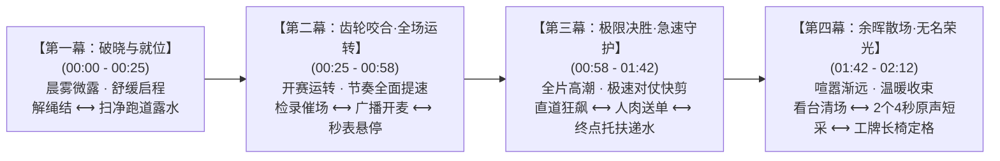

# 视频二：学生会幕后工作宣传片 · 最终成品脚本（紧凑快节奏定稿版）

> **制作定位**：浙江省春晖中学 2026 年校运会《学生会幕后工作宣传片》（双线对照青春微纪录）  
> **总策划与框架**：新媒体社策划组  
> **拍摄与后期执行**：
> - **后期剪辑与现场拍摄主力**：高一同学（2029 届：朱烨恒、丁子妍、张嘉炜、陈玥潼、陈怀恒、王艳、石虞涵、金煜豪等）
> - **赛场全域幕后机动跟拍组**：高二同学（2028 届：池雨曦、傅佳雪，赛程间隙穿梭跟拍全场核心镜头）  
> **成片建议时长**：**2 分 10 秒（2 分 05 秒 ～ 2 分 15 秒，剪辑节奏高度紧凑，步点明快，严禁拖沓）**  
> **核心叙事理念**：“赛场前台热血竞速”与“幕后争分夺秒守护”双线交叉成对剪辑（Match Cut）  
> **核心贯穿道具**：带有汗渍与折痕的“工作证” + 4 处沉浸第一视角（POV）微镜头点睛穿插  
> **画面规格**：16:9 横屏，4K 60fps 拍摄（剪辑序列 1080p 30fps/24fps，保留 2.5 倍平滑慢动作空间），兼顾视频号、B站与校园大屏展播  
> **安全与限制条件**：**全赛程全面禁止使用无人机**；剔除折叠自行车，采用跑道外沿真实手攥成绩单疾步小跑穿梭。

> [!IMPORTANT]
> **【特别使用说明：画面内容均为参考，实操可自由替换】**  
> 本脚本中所列出的具体人物动作、对仗赛项及取景位置属于**视觉参考范例与剪辑节奏骨架**。实际后期剪辑时，负责剪辑的同学**完全由现场实际抓拍到的生动画面自由挑选和替换**。核心剪辑原则是严格保持“赛场前台”与“幕后保障”在动作节奏与动势上的相互对仗，卡准重音与动势切点，切忌生搬硬套。

---

## 一、全片宏观叙事结构与紧凑节奏曲线

全片时长严格压缩至 **2 分 10 秒左右**，全片四幕时间节点与节奏推进逻辑如下：



---

## 二、核心视听法则与道具轨迹

### 1. 双线成对交叉剪辑（Match Cut）核心对仗原则

全片将“赛场前台的高光竞技动作”作为发动机，让幕后保障动作产生明确的因果关系与紧迫感。通过画面动势的方向一致性与形态互文成对拼扣：

- **准备动作对仗**：运动员向下系紧鞋带 $\longleftrightarrow$ 工作人员向上合力撑开蓝色帐篷；
- **临战张力对仗**：运动员起跑器双手下撑前倾 $\longleftrightarrow$ 终点裁判高台身体前倾、拇指悬停秒表上方；
- **竞速动能对仗**：直道运动员向右破风狂奔 $\longleftrightarrow$ 送成绩单同学手攥铁夹在跑道外沿同向疾步穿梭小跑；
- **冲击与托举对仗**：冲刺选手撞线脱力向前倒下（下沉势） $\longleftrightarrow$ 终点志愿者双臂迎前托起架人（托举势）；
- **喧嚣与宁静对仗**：领奖台全班抛起冠军欢呼雀跃 $\longleftrightarrow$ 夕阳看台学生会全员逐排弯腰清理水瓶标语。

---

### 2. 核心道具【工作证】的四阶段轨迹

以挂在胸前的工作证作为贯穿全片的视觉与情感主线：

```
[清晨大本营] 缠成死结的挂绳，两人低头打趣解开 
    ↓
[上午奔忙中] 奔跑时拍打锁骨，低头别号码布时工牌垂落碰撞 
    ↓
[午后各岗位] 镜头扫过工牌上的部门标签（检录组/广播站/裁判助理/救护组/新媒体）
    ↓
[暮色看台前] 摘下微热、满是汗渍与折痕的工牌平放在长椅上，与白马湖晚霞同框
```

---

### 3. 4 处沉浸第一视角（POV）微镜头的点睛设计

全片不搞全篇第一视角，仅在 4 个最能调动临场体验的关键节点切入 2~3 秒主观镜头：

1. **POV 1（破晓入门）**：第一视角推开田径场铁门，把工作证套过头顶戴上；
2. **POV 2（广播之声）**：广播台视角低头看满桌红笔画圈的小纸条，伸手按开立式麦克风“啪嗒”一声；
3. **POV 3（极速救援）**：终点线志愿者视角，直面冲刺脱力扑来的选手，双手前伸迎上架扶；
4. **POV 4（暮色长椅）**：双手取下胸前工作证平放在看台长椅上，镜头平稳微升展现田径场全景。

---

## 三、逐镜分镜与视听设计详案（四幕 17 镜 · 紧凑卡点）

### 【第一幕：破晓与就位】（时间码：00:00 - 00:25 · 共 25 秒）
*剪辑节奏：从清晨的舒缓自然过渡到开赛前的紧绷就位，动作干净利落*

| 编号 | 时间码 | 景别运镜 | 对仗属性 | 画面内容（动势与环境要素） | 动势匹配逻辑 | 现场声音设计 (Foley & Voice) | 剪辑变速与节奏 |
| :---: | :---: | :---: | :---: | :--- | :--- | :--- | :---: |
| **01** | `00:00 - 00:04` | POV 平视<br>微距前推 | **【POV 1】** | 白马湖晨雾未散，田径场生锈铁门。单手伸入推开门栓，嘎吱轻推，晨光洒进空旷的红蓝跑道。 | 静态向动态开启 | 铁门转动摩擦声、晨鸟清脆啼鸣 | 4秒，100% 匀速 |
| **02** | `00:04 - 00:09` | 俯拍特写<br>顺光微移 | 幕后生活化 | 大本营长桌前，一捆红蓝挂绳的工作证缠成死结。两名同学低头一边叹气一边笑着细细解开绳结。 | 指尖微动作互动 | 两人轻声打趣：“这谁缠的死结啊！”轻笑声 | 5秒，生活化快切 |
| **03** | `00:09 - 00:12` | POV 第一视角<br>自上而下 | **【主线建立】** | 解开绳结，双手捧起蓝色工作证套入脖子，低头看了一眼工牌上的部门标签（“检录组”）。 | 挂绳落入垂直动势 | 挂绳摩擦校服衣领声、深呼吸吐气声 | 3秒，利落戴上 |
| **04** | `00:12 - 00:25` | 快速交叉切<br>中景+特写 | **【双线对照 1】**<br>赛前准备 | • **前台**：大本营前，运动员单膝跪地两手拉紧荧光鞋带，双手在胸前剧烈搓揉防滑镁粉，白粉漫天升格炸开；<br>• **幕后**：两名男生手握大竹扫帚，弯腰将跑道露水与碎石沙沙扫出场外；四人合力撑开蓝色遮阳帐篷支架，四角压上沉重沙袋。 | 向下系紧与向上撑开动势对仗 | 镁粉拍打声、大竹扫帚擦地沙沙声、金属帐篷咔哒撑开声 | 镁粉 40% 升格<br>扫帚 100% 快切<br>卡重拍切换 |

---

### 【第二幕：齿轮咬合·全场运转】（时间码：00:25 - 00:58 · 共 33 秒）
*剪辑节奏：节奏明显加速，步点密集，多线快速交织*

| 编号 | 时间码 | 景别运镜 | 对仗属性 | 画面内容（动势与环境要素） | 动势匹配逻辑 | 现场声音设计 (Foley & Voice) | 剪辑变速与节奏 |
| :---: | :---: | :---: | :---: | :--- | :--- | :--- | :---: |
| **05** | `00:25 - 00:33` | 中景顺滑跟随<br>转手部特写 | 幕后高频动作 | 检录处人群拥挤。检录员举着大喇叭喊话器点名催场；桌后同伴快速撕下对应道次号码布，俯身用别针帮紧张手抖的选手别正号牌，胸前工牌碰撞。 | 手部精细操作卡点 | 大喇叭回声：“高一男子百米第二组检录！”、别针刺穿布料脆响 | 8秒，紧凑连贯 |
| **06** | `00:33 - 00:41` | 对称构图<br>快速双机切 | **【双线对照 2】**<br>临战张力 | • **前台**：起跑线后，短跑选手原地高抬腿踏步，双手下撑在起跑器上，眼神死死锁定直道前方；<br>• **幕后**：终点裁判高台上，戴红帽子的学生裁判身体前倾，双手紧握黑色秒表，拇指悬停在按键上方，视线紧盯发令枪烟雾。 | 身体前倾与张力静止对仗 | 粗重急促的呼吸喘息声、秒表外壳摩擦声；发令枪响白闪（砰！） | 8秒，枪响前静止<br>枪响白闪2帧即切 |
| **07** | `00:41 - 00:47` | POV 第一视角<br>微距俯视 | **【POV 2】** | 俯视主席台广播桌：满桌都是从各班送来的草稿纸、作业纸条，红笔圈满了重点。一只手伸向立式麦克风，食指按下开关按钮“啪嗒”一声，红灯瞬亮。 | 手指前伸按下开关动势 | 麦克风机械开关清脆“啪嗒”声，广播底噪瞬开穿透全场 | 6秒，干脆开麦 |
| **08** | `00:47 - 00:58` | 45° 侧颜长焦<br>浅景深捕捉 | 幕后人物情绪 | 播音台女生深情朗读加油稿，读到自己班级时嘴角憋不住笑、偷偷加重语气；读完关掉麦克风长舒一口气，抓起保温杯大口灌水，神态如释重负。 | 庄重与生活化反差 | 广播声：“……飞驰吧，春晖健儿！”、关麦大口咽水声与轻笑 | 11秒，生活气息拉满 |

---

### 【第三幕：极限决胜·急速守护】（时间码：00:58 - 01:42 · 共 44 秒）
*剪辑节奏：全片最燃段落！1.5~2秒快速对仗剪辑，动势同向狂飙，高潮顶点瞬间慢镜急刹*

| 编号 | 时间码 | 景别运镜 | 对仗属性 | 画面内容（动势与环境要素） | 动势匹配逻辑 | 现场声音设计 (Foley & Voice) | 剪辑变速与节奏 |
| :---: | :---: | :---: | :---: | :--- | :--- | :--- | :---: |
| **09** | `00:58 - 01:10` | 低角度跟跑<br>平行极速跟移 | **【双线对照 3】**<br>速度与极速送单 | • **前台**：百米直道上运动员像离弦之箭狂奔，跑鞋在红色塑胶跑道上急促踏地；<br>• **幕后**：跑道外侧安全区，学生会同学手里拿铁夹子死死夹住刚打印出炉的初赛成绩单，在人群夹缝中疾步小跑穿梭，胸前工牌拍打胸膛，干脆反手把工牌塞进校服兜，小跑“啪”的一声把单子拍在成绩张贴栏桌上！ | 两条线同向疾速向前突进 | 急促踏地声、纸张被风吹动的哗啦声、铁夹拍桌重响 | 12秒，1.5~2秒交替快剪<br>动势强烈咬合 |
| **10** | `01:10 - 01:22` | 双机位多角度<br>抓拍结合 | **【双线对照 4】**<br>撞线与救援 | • **前台**：终点线选手胸部撞碎红绸带，脱力前倾倒地；<br>• **幕后**：终点线两侧 4 名志愿者迅速大步上前，张开双臂稳稳架住选手腋下往前带步：“深呼吸，慢慢走，别坐下！”；同伴立刻递上提前拧松盖子的矿泉水，掏出冰袋轻敷在痉挛小腿上。 | 选手下沉与志愿者托举对仗 | 粗重急促心跳声、志愿者温柔安抚声、拧开水瓶轻微塑料声 | 12秒，撞线 40% 升格<br>托扶架人恢复原速 |
| **11** | `01:22 - 01:26` | POV 第一视角<br>平视接人 | **【POV 3】** | 终点志愿者胸前视角：短跑选手踉跄冲入画面正前方，两只手迅速从画面两侧伸出迎上接住缓冲，递出矿泉水。 | 迎面扑来与双手合抱缓冲 | 志愿者原声透出：“慢慢喝，小口喝，别坐下。” | 4秒，极具视觉冲击力 |
| **12** | `01:26 - 01:42` | 慢动作升格<br>(60fps 拍摄) | **【双线对照 5】**<br>田赛力量保障 | • **前台**：跳高选手背越式腾空过杆，身体重重砸入深蓝色海绵垫，全场欢呼；<br>• **幕后**：两名裁判同学迅速跃起扶平震颤的横杆；沙坑旁同学手持铁耙利落平整沙坑，扬起金色细沙。 | 滞空下落与平整沙坑对仗 | 砸入海绵垫沉闷撞击声、铁耙划过沙坑的清脆沙沙声 | 16秒，40% 平滑慢动作<br>展现力量与细致 |

---

### 【第四幕：余晖散场·无名荣光】（时间码：01:42 - 02:12 · 共 30 秒）
*剪辑节奏：鼓点渐隐，转为温情叙事，采访干脆连珠炮，长椅定格情感升华*

| 编号 | 时间码 | 景别运镜 | 对仗属性 | 画面内容（动势与环境要素） | 动势匹配逻辑 | 现场声音设计 (Foley & Voice) | 剪辑变速与节奏 |
| :---: | :---: | :---: | :---: | :--- | :--- | :--- | :---: |
| **13** | `01:42 - 01:54` | 逆光大景深<br>慢速横摇 | **【双线对照 6】**<br>散场对比 | • **前台**：领奖台前全班把挂满奖牌的冠军抛向空中欢呼，随后看台人潮渐次退场散去；<br>• **幕后**：夕阳斜洒在空旷看台阶梯上，学生会成员弯腰逐排清理遗落的加油标语和水瓶；四名男生合力抬起收拢的蓝色帐篷骨架走向器材室。 | 人潮喧嚣与空旷静穆对仗 | 渐行渐远的欢呼声、金属架搬运轻微撞击声 | 12秒，慢速抒情 |
| **14** | `01:54 - 02:02` | 快问快答微采访<br>无线麦手持入镜 | 鲜活原声透出 | 快节奏连切 2 名幕后成员的 4 秒真实抓问（连珠炮不拖沓）：<br>• **采访 1（检录处擦汗笑）**：“今天步数多少了？”——“两万八，朋友圈第一名！”<br>• **采访 2（终点志愿者比剪刀手）**：“站一天累不累？”——“累瘫了，但看到同班破纪录就值了！” | 快问快答干脆利落 | 真实开朗的笑声与现场环境收音 | 8秒（每人各4秒）<br>节奏极快 |
| **15** | `02:02 - 02:08` | POV 第一视角<br>缓慢拉升 | **【POV 4·终极定格】** | 看台木长椅上，一只手轻轻摘下胸前微热、带有折痕与汗渍的工作证平放在木椅上。镜头慢慢向后退拉升起，前景是工作证，远景是夕阳余晖下静穆的红色跑道与白马湖晚霞。 | 静止凝固升华 | 晚风拂过树叶的沙沙声、环境底噪减弱 | 6秒，深情定格 |
| **16** | `02:08 - 02:12` | 纯黑底金白字 | 精神升华 | 画面缓缓淡出，浮现金色与白色文字：<br>“赛场有终点，守护无止境。”<br>“致敬每一位在幕后奔跑的春晖人。” | 情感落定 | 极低微风环境音 | 4秒，静止淡出 |
| **17** | `02:12 - 02:15` | 极简字幕滚动 | 规范归档 | 黑色背景快速滚动高一高二摄制组名单、学生会致谢、春晖中学新媒体社出品。 | 结束 | 极低微风环境底噪 | 3秒，收束 |

---

## 四、4 处沉浸第一视角（POV）实操拍摄指引

```
┌────────────────────────────────────────────────────────────────────────┐
│                   4 处沉浸 POV 镜头拍摄配置与手法                      │
├────────────────────────────────────────────────────────────────────────┤
│ 【POV 1 · 推铁门套工牌】                                               │
│ • 设备：DJI Pocket 3（或手机+轻便挂绳/胸带固定在领口正下方）。          │
│ • 手法：镜头平视前方。右手单手拔出铁门插销推开铁门，阳光照入；左手自下 │
│         而上将工作证挂绳穿过镜头视线上方，自然滑落至胸前。             │
├────────────────────────────────────────────────────────────────────────┤
│ 【POV 2 · 广播室开麦】                                                 │
│ • 设备：摄像师站立低头俯拍（或放置于胸前高度）。                       │
│ • 手法：俯视桌面散落的红笔圈点稿纸。右手伸出食指精准按下立式麦克风开   │
│         关，指示灯亮红光，保持 1 秒后开讲。画面需拍到食指按压瞬间。    │
├────────────────────────────────────────────────────────────────────────┤
│ 【POV 3 · 终点线接人递水】                                             │
│ • 设备：终点志愿者佩戴胸带，或第二机位摄影师紧贴在志愿者肩膀后侧过肩。 │
│ • 手法：直面选手狂奔撞线后扑过来的第一视角，双手从镜头两侧迅速向前伸出 │
│         托住对方肩膀/腋下，左手从画面外递入一瓶已拧松瓶盖的矿泉水。    │
├────────────────────────────────────────────────────────────────────────┤
│ 【POV 4 · 暮色长椅放置工牌】                                           │
│ • 设备：微单/相机置于三脚架低角度平视长椅，或 Pocket 极慢后拉。         │
│ • 手法：双手将摘下的工作证轻轻抚平放在木质长椅上，随后双手抽离画面。镜 │
│         头缓慢平滑后退拉升，工作证在前景，后景白马湖与操场晚霞自然通透。│
└────────────────────────────────────────────────────────────────────────┘
```

---

## 五、现场声音与 2 个短采实操规范

### 1. 现场分轨拟音（Foley）与环境原声清单

全片保留并放大以下核心现场声音：
1. **环境音轨**：白马湖清晨微风啼鸣、发令枪回声、终点线呼啸风声、空旷看台晚风；
2. **动作音轨**：
   - 大竹扫帚摩擦红色塑胶跑道的清脆沙沙声；
   - 蓝色折叠帐篷撑开时金属弹扣的“咔哒”咬合声；
   - 铁夹夹着 A4 成绩单在风中飞舞的扑簌声与拍桌声；
   - 拧开矿泉水瓶盖的清脆塑料断裂声；
   - 广播站立式麦克风机械按键脆响与瞬开底噪。
3. **同伴原声音轨**：
   - 清晨解绳结轻笑声：“这谁缠的死结啊！”；
   - 终点线志愿者的温柔耳语：“深呼吸，慢慢走，别坐下！”；
   - 大喇叭微哑催场声：“高一男子百米第二组，抓紧检录！”。

---

### 2. 2 个 4 秒快问快答短采话术库

必须使用手持无线麦或领夹麦（小蜜蜂），配戴**防风毛衣**。摄像师手持稳定器保持 1.5 米半身景别，提问 1.5 秒、回答 2.5 秒，严格限制在 4 秒内：
- **题型 A（数字具象型）**：“亮一下你现在的微信步数！”（受访者掏手机对准镜头笑：“两万八，朋友圈第一名！”）；
- **题型 B（真实心声型）**：“站了一整天终点线，现在最想干嘛？”（受访者擦汗大笑：“想把这双鞋扔了，回寝室瘫着！”）；
- **题型 C（幕后趣闻型）**：“今天收到的加油稿里有啥好玩的吗？”（播音员捂嘴乐：“有人给自己班写情书被我们当场截胡扣下了！”）。

---

## 六、摄制团队分工与学生会跟拍协作机制（高一主力 + 高二机动）

### 1. 高一剪辑与定点拍摄组（2029 届）

| 小组编号 | 负责人员 | 核心包干拍摄任务 |
| :---: | :--- | :--- |
| **小组 1** | **朱烨恒、丁子妍** | 晨间大本营解工牌死结、检录处大喇叭点名催场、别号码布手部特写、发令枪与秒表悬停对照 |
| **小组 2** | **张嘉炜、陈玥潼** | 跑道外沿送单同学疾步小跑抓拍（铁夹拍桌）、跳高横杆扶正、沙坑铁耙平整飞沙、大竹扫帚扫地 |
| **小组 3** | **陈怀恒、王艳** | 终点线张臂托扶架人、递水冰敷特写、片尾 2 个趣味短采（无线麦收音） |
| **小组 4** | **石虞涵、金煜豪** | 4 处沉浸 POV 镜头录制、广播室开麦与神态抓拍、傍晚看台清场捡水瓶、工牌长椅定格 |

---

### 2. 高二赛场全域幕后机动跟拍组（池雨曦、傅佳雪 协作包干）

作为高二经验队员，**池雨曦与傅佳雪**利用赛程间隙穿梭全场，重点机动跟拍全片最高难度与突发性的幕后纪实镜头，具体拍摄任务清单见专属任务单：
- **核心包干任务**：
  1. 检录处手部精细动作特写（撕号牌、别针刺穿校服、工牌碰撞）；
  2. 跑道外沿人肉送成绩单抓拍（铁夹夹紧 A4 纸迎风狂奔、拍桌脆响）；
  3. 主席台广播室花絮（红笔圈点稿纸、开麦红灯、念到本班偷笑）；
  4. 终点线力竭救护与安抚（架扶 400m/800m 瘫软选手、“深呼吸别坐下”近距离原声、拧松盖子的矿泉水）；
  5. 傍晚看台清场捡拾水瓶与四人抬蓝色帐篷骨架走回器材室；
  6. 配合采集 4 处 POV 点睛镜头与片尾快问快答短采。

---

### 3. 相机拍摄参数设定统一标准

1. **分辨率与帧率**：统一设定为 **4K (3840×2160) 60fps**，保留后期平滑慢动作空间；
2. **快门速度**：锁定为 **1/120 秒**；
3. **白平衡设定**：户外操场统一手动锁定为 **5600K（日光模式）**，严禁使用自动白平衡 (AWB)；广播室室内锁定为 **4000K - 4500K**；
4. **安全红线**：全赛程全面禁止无人机；跑道外沿严格保持 **1 米以外** 安全缓冲区；**突发意外绝不关机**（掉单、打翻水、笑场必须多录 5 秒）。
