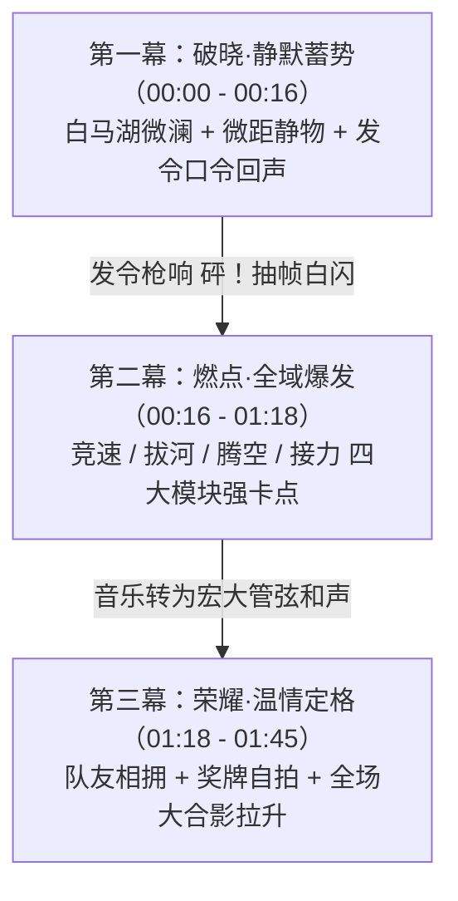

# 视频一：传统校运会高光混剪 MV · 分镜草案 (v1.0)

> **制作定位**：浙江省春晖中学 2026 年校运会官方高燃混剪 MV  
> **成片时长**：约 1 分 45 秒  
> **剪辑统筹**：傅梓浩同学  
> **拍摄协同**：沈栋忆（现场统筹）、冯翼（航拍）、高二主力拍摄组（鲍奕帆、董欣瑜、徐清来等）  
> **核心风格**：强节奏重低音卡点 + 电影级变速升格（60-120fps） + 以静衬动三段式递进  

---

## 一、三段式视听情绪结构

---

## 二、逐镜分镜设计详案

| 镜头编号 | 时间码 | 景别与运镜 | 画面视觉内容（运镜 / 动作细节） | 剪辑变速曲线 | 拟音与声音设计（Foley） | 负责机位与人员建议 |
| :--- | :--- | :--- | :--- | :--- | :--- | :--- |
| **01** | 00:00 - 00:03 | **航拍大景**（极缓微推） | 晨光破晓，俯瞰白马湖碧波微澜、象山青翠，镜头掠过一枝春，远处春晖红蓝塑胶田径场静立在晨光中。 | 正常 100% | 极简环境风声、白马湖清脆水鸟鸣叫声 | **机位 A（航拍）** 冯翼 |
| **02** | 00:03 - 00:06 | **特写 / 慢门 120fps** | 逆光侧面特写。少年紧握旗杆，春晖红白校旗在晨风中猎猎翻卷，金色发丝光勾勒出刚毅侧脸。 | 升格 40% 慢动作 | 极简低沉钢琴单音（Do... Mi...），旗帜风声呼啦响动 | **机位 B（长焦）** 高二长焦组 |
| **03** | 00:06 - 00:09 | **低角度仰拍微距** | 跑道地面微距。跑鞋踏在红色塑胶跑道颗粒上，运动员单膝着地，手指利落收紧鞋带，起身顿足。 | 正常 100% | 鞋带拉紧摩擦声、鞋底蹭地清脆声 | **机位 C（贴地广角）** 高二地面组 |
| **04** | 00:09 - 00:12 | **特写 / 升格 120fps** | 两只手掌在胸前猛烈搓揉防滑白色镁粉，刹那间白粉如漫天飞雪散开，眼神穿透白雾凝视赛道。 | 变速曲线（快速触碰瞬间放慢至 25%） | 低音心跳声（咚…咚…），镁粉飞溅空灵气流声 | **机位 B（长焦）** 高二长焦组 |
| **05** | 00:12 - 00:14 | **贴地微距** | 金属起跑器调节插销“咔哒”一声卡进刻度孔，粗壮脚跟稳稳抵牢踏板。 | 正常 100% | 清脆金属扣合声：**咔哒！** | **机位 C（贴地广角）** 高二地面组 |
| **06** | 00:14 - 00:16 | **中景平视摇至天空** | 发令裁判员侧影，沉着举起发令枪指向晴空。全场屏息。 | 正常 100% | 发令员口令回声： “各——就——位——” “预——备——” | **机位 B（长焦）** 高二长焦组 |
| **07** | 00:16 - 00:17 | **微距枪口（白闪过渡）** | 发令枪口火光与白烟喷薄而出，画面**白闪 2 帧**！ | 4 帧抽帧白闪 | **发令枪鸣响：砰——！** （BGM 重低音底鼓瞬间炸裂 Drop 起拍） | 核心动势点 |
| **08** | 00:17 - 00:20 | **超低角度侧方跟跑** | 百米飞人如离弦之箭蹬离起跑器，低重心向前猛冲，后方看台化为动态流光。 | 快速进入 -> 蹬地瞬间降至 40% -> 恢复原速 | 强劲电音底鼓，疾风撕裂呼啸声 | **机位 C（手持稳定器）** 傅梓浩 / 沈栋忆 |
| **09** | 00:20 - 00:23 | **弯道侧逆光长焦追焦** | 200米弯道切线，选手身体向内侧大倾角贴线过弯，肌肉线条紧绷，每一步都踏在节拍重音上。 | 变速卡点，每踩一步卡一个鼓点 | 密集的 808 鼓点与地面蹬踏摩擦声 | **机位 B（长焦）** 高二长焦组 |
| **10** | 00:23 - 00:26 | **直道正面超长焦压缩感** | 直道迎头扑来，三位选手并驾齐驱全力冲刺，面部肌肉震颤，背景观众席红旗招展被长焦虚化。 | 120fps 慢门推进 | 鼓点层级叠加，看台声浪微起 | **机位 B（长焦）** 高二长焦组 |
| **11** | 00:26 - 00:29 | **拔河极近特写（升格）** | 瞬间硬切至拔河赛场！粗麻绳深深嵌入手掌，主力同学咬牙切齿，额头青筋暴凸，汗珠顺着下巴甩落。 | 升格 25% 慢动作 | **音效反差**：重低音突降，混入全场撕心裂肺呐喊：“一二！拉！” | **机位 C（特写）** 高二地面组 |
| **12** | 00:29 - 00:32 | **拔河全景侧向大仰拍** | 整排选手身体与地面呈 30° 仰角死守，全员齐心后仰，鞋底在草坪犁出深痕，尘土飞溅。 | 正常 100% 快节奏 | 鼓点重重砸下，现场齐声呼吼声达到顶峰 | **机位 C（广角）** 沈栋忆统筹 |
| **13** | 00:32 - 00:34 | **助威团狂吼中景** | 看台高处，戴眼镜的男生挥舞校服扯开嗓子狂吼助威，脸色通红，极具感染力。 | 正常 100% | 现场环境声人声最大化混音 | **机位 B（看台长焦）** 高二长焦组 |
| **14** | 00:34 - 00:36 | **裁判哨响与狂欢** | 裁判红旗猛力下劈！哨声尖锐响起，全队脱手扔绳狂跳狂抱，全场沸腾！ | 快速切出 | 清脆穿透性哨音：**哔——！** | **机位 C（广角特写）** |
| **15** | 00:36 - 00:40 | **跳远助跑与踏板踏跳** | 运动员助跑如猎豹，脚掌精准踩在踏跳白板上，瞬间拔地腾空，身体反弓如飞鸟。 | 踏板瞬间放慢至 20%，空中滑行慢动作 | 踏板闷响（咚！）与风声掠过 | **机位 C（沙坑边缘）** 高二贴地组 |
| **16** | 00:40 - 00:43 | **沙坑扑脸飞沙（升格）** | 双脚重重扎入沙坑，金黄沙粒在阳光下漫天炸裂飞溅，直扑镜头前方！ | 120fps 极度升格 | 沙粒撞击拟音强化（沙——！） | **机位 C（低角度机位）** |
| **17** | 00:43 - 00:47 | **男子跳高背越式空中反弓** | 助跑划弧线，单腿蹬地腾空，背部弓起优雅滑过横杆，横杆在阳光下微微颤动未落。 | 腾空过杆全程放慢至 30% | 音乐短暂空灵停顿，唯美空灵音效 | **机位 B（长焦仰拍）** 高二长焦组 |
| **18** | 00:47 - 00:50 | **跳高落地海绵垫长啸** | 摔入蓝色海绵垫后瞬间弹起，高举双拳仰天狂吼，全场观众鼓掌起立。 | 正常 100% 爆发 | 落地闷响 + 怒吼声 + 掌声 | **机位 B（平视）** |
| **19** | 00:50 - 00:54 | **4×100m 接力压棒特写** | 第三棒全速递进，第四棒右手后伸展开，接力棒精准下压撞击掌心，严丝合缝完成交接。 | 交棒刹那降速至 25% | 木质接力棒撞击脆响：**啪！** | **机位 C（交接区平移）** 沈栋忆定点机位 |
| **20** | 00:54 - 00:58 | **直道弯道绝杀反超** | 第四棒接棒后开启外线超车，大跨步连续超越两道选手，两边看台人潮全体起立欢呼！ | 正常速度强节奏推进 | 密集快节奏鼓点推进至第二高潮 | **机位 A（航拍伴飞）** 冯翼直道追跟 |
| **21** | 00:58 - 01:02 | **终点撞线冲刺特写** | 选手胸膛率先撞碎红色终点缎带，双手张开如大鹏展翅，神情狂喜呐喊！ | 撞线瞬间 120fps 超慢动作 | 丝带撕裂声 + 撞线呐喊声 | **机位 B（终点正对长焦）** 傅梓浩亲自把控 |
| **22** | 01:02 - 01:06 | **教工趣味赛抓拍** | 老师们身穿运动装手提接力棒奋力竞走狂奔，脸带灿烂笑容，两侧学生挥舞巨型向日葵欢脱加油。 | 欢快轻巧节奏 | 欢笑声、喇叭加油声、轻松节拍 | **机位 C（内场抓拍）** |
| **23** | 01:06 - 01:10 | **长跑 1500m 极度坚毅特写** | 汗水从额头成串滴落，发丝黏在脸颊，嘴唇微白但眼神坚定锁定终点，每一步都在死磕极限。 | 升格慢动作 | 沉重的粗重喘息声与鼓点共振 | **机位 B（长焦跟随）** |
| **24** | 01:10 - 01:14 | **终点瘫倒与搀扶相拥** | 冲过终点长跑同学险些倒地，两位等候多时的同学立刻从两侧飞奔上前稳稳架住手臂，送上温水。 | 变速平缓，动作舒展 | 呼吸声转弱，音乐开始平滑过渡 | **机位 C（中景）** |
| **25** | 01:14 - 01:18 | **四道快速闪切（动势匹配）** | 击掌！挥拳！跳跃！拥抱！四个不同赛项的胜利庆祝镜头以 0.5 秒极速顺切连击。 | 极速切点，每半拍切换一次 | 掌声、击掌声（啪！啪！啪！） | 全机位素材混切 |
| **26** | 01:18 - 01:23 | **赛后温情背影（慢镜头）** | **音乐在此转入温暖宏大的管弦/合唱和声**。阳光斜照，两名并肩作战的队友互相搂着汗湿的肩膀，一步步慢慢走下草坪。 | 慢动作 40% | 宏大抒情弦乐升起，环境人声渐远 | **机位 B（长焦逆光）** |
| **27** | 01:23 - 01:27 | **四人奖牌自拍定格** | 接力四位小伙脖挂金色奖牌，簇拥在镜头前比出招牌胜利手势，露出最灿烂的笑容。 | 快门咔嚓一声（定格一帧） | 单反快门声：**咔嚓！** | **机位 C（广角仰拍）** |
| **28** | 01:27 - 01:32 | **看台班级集体抛洒向日葵** | 班级看台前，全班同学齐声高呼，将手中的向日葵、气球和班旗同时高高抛向空中。 | 120fps 升格向日葵飘落 | 漫天欢呼与掌声 | **机位 B（仰拍全景）** |
| **29** | 01:32 - 01:38 | **草坪千人大合影与航拍大拉升** | 绿茵场中央，各班级簇拥在巨幅校训横幅与班旗后挥手欢呼。无人机从头顶 5 米急速垂直拉升至 80 米高空，白马湖全景与田径场尽收眼底。 | 匀速大拉升 | 宏大交响乐进入最辉煌终章音符 | **机位 A（航拍垂直拉升）** 冯翼 |
| **30** | 01:38 - 01:45 | **春晖校徽与片尾定格** | 画面自然淡黑。中央浮现春晖中学校徽与红白字样： `2026 春晖中学校运会 · 青春不散场` `春晖中学新媒体社 联合出品`。 | 静止淡出 | 音乐余音袅袅，渐隐结束 | 后期包装特效 |

---

## 三、剪辑实操工程建议（供傅梓浩剪辑参考）

1. **时间线轨道分层规范**：
   - **V1 视频主轨**：按动势切点排布主镜头，统一色彩管理（Rec.709 或同一色彩 LUT）。
   - **V2 调色与遮罩轨**：电影级 2.35:1 黑边遮罩（CinemaScope）与胶片颗粒叠加（Film Grain 3-5%）。
   - **V3 动态转场轨**：闪白抽帧（Flash Cut）、镜头快速推拉（Zoom Whip Transition）。
   - **A1/A2 音乐轨**：高燃 BGM，精准对位 00:16 发令枪响处的 Drop 点。
   - **A3/A4 拟音轨（Foley）**：重点铺设发令枪声、钉鞋蹭地、交接棒清脆声、沙坑扬沙声与裁判哨声。
   - **A5/A6 现场环境声**：看台欢呼呐喊混音，避免音乐过度压盖现场气氛。

2. **升格与变速曲线（Speed Ramp）参数**：
   - 拍摄必须统一设定为 **1080p 120fps 或 4K 60fps/120fps**。
   - 动作启动前为 100% 速度，关键爆发点（踩板、压棒、起跳、撞线）平滑贝塞尔曲线拉至 25%-30%，离位时迅速拉回 100% 或加速至 200% 转场。

---

## 四、下一步确认事项

本草案已写入 [视频01_传统高光混剪/分镜草案_v1.md](file:///Users/fuzihao/Desktop/2026SportsMeet/视频01_传统高光混剪/分镜草案_v1.md)。
- 检查分镜中的赛项覆盖是否满足你的剪辑预期。
- 确认后可将此方案同步给沈栋忆同学，作为各机位拍摄的执行依据。
