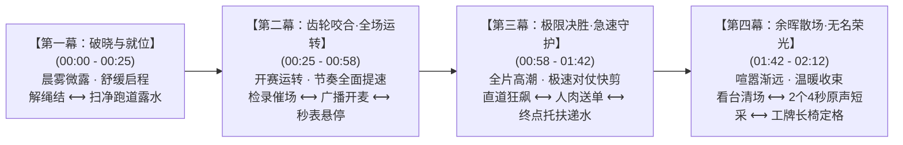

# 2026 春晖中学校运会《学生会幕后宣传片》全新双线对照与工作证线索策划方案（紧凑定稿版）

> **项目定位**：视频二·学生会幕后工作宣传片（双线对照青春微纪录）  
> **策划统筹**：新媒体社策划组  
> **拍摄与后期团队**：
> - **后期剪辑与定点拍摄**：高一同学（2029 届：朱烨恒、丁子妍、张嘉炜、陈玥潼、陈怀恒、王艳、石虞涵、金煜豪等）
> - **赛场全域幕后机动跟拍**：高二同学（2028 届：池雨曦、傅佳雪）  
> **核心叙事理念**：“赛场前台热血竞速”与“幕后争分夺秒守护”双线交叉成对剪辑（Match Cut）  
> **核心贯穿道具**：带有汗渍与折痕的“工作证” + 4 处沉浸第一视角（POV）微镜头点睛穿插  
> **成片建议时长**：**2 分 10 秒（2 分 05 秒 ～ 2 分 15 秒，剪辑节奏高度紧凑，步点明快，严禁拖沓）**  
> **画面规格**：16:9 横屏，4K 60fps 拍摄（保留 2.5 倍平滑慢动作空间），兼顾视频号、B站与校园大屏展播  
> **安全与限制条件**：**全赛程全面禁止使用无人机**；剔除折叠自行车，采用跑道外沿真实手攥成绩单疾步小跑穿梭。

---

## 一、全片宏观视听结构与紧凑节奏曲线

---

## 二、逐镜分镜与紧凑卡点表（四幕 17 镜）

### 【第一幕：破晓与就位】（00:00 - 00:25 · 25秒）
- **01 (00:00-00:04, 4s)**：POV 1 推铁门微距前推，门轴嘎吱轻响，晨光洒入空旷跑道；
- **02 (00:04-00:09, 5s)**：俯拍特写顺光微移，大本营长桌解工牌死结，两人轻声打趣：“这谁缠的死结啊！”；
- **03 (00:09-00:12, 3s)**：POV 1 自上而下套入蓝色工作证，挂绳摩擦衣领声；
- **04 (00:12-00:25, 13s) · 双线对照 1**：【前台】拉紧鞋带搓防滑镁粉白雾升格（40%） $\longleftrightarrow$ 【幕后】大竹扫帚扫净跑道露水、四人合力撑开蓝色遮阳帐篷（100% 快切）。

### 【第二幕：齿轮咬合·全场运转】（00:25 - 00:58 · 33秒）
- **05 (00:25-00:33, 8s)**：检录处大喇叭喊话催场，快速撕号码布、别针别号牌手部微特写，工牌碰撞；
- **06 (00:33-00:41, 8s) · 双线对照 2**：【前台】起跑器双手下撑眼神死锁直道 $\longleftrightarrow$ 【幕后】终点高台裁判前倾拇指悬停秒表按键，枪响白闪（砰！）；
- **07 (00:41-00:47, 6s) · POV 2**：广播室俯视红笔圈点稿纸，食指按下麦克风开关“啪嗒”一声，红灯瞬亮；
- **08 (00:47-00:58, 11s)**：播音员认真朗读、读到本班嘴角偷笑，关麦大口灌水。

### 【第三幕：极限决胜·急速守护】（00:58 - 01:42 · 44秒·全片高潮）
- **09 (00:58-01:10, 12s) · 双线对照 3**：【前台】百米直道离弦狂奔 $\longleftrightarrow$ 【幕后】跑道外沿手攥铁夹夹着 A4 成绩单在人群夹缝中疾步小跑穿梭、啪的一声把成绩单拍在张贴栏桌上（1.5~2秒快速对仗切换）；
- **10 (01:10-01:22, 12s) · 双线对照 4**：【前台】冲刺撞碎终点线红绸带脱力倒地（40% 升格） $\longleftrightarrow$ 【幕后】终点 4 名志愿者迅速上前双臂架住腋下往前带步：“深呼吸别坐下”，递上拧松瓶盖的矿泉水；
- **11 (01:22-01:26, 4s) · POV 3**：终点志愿者胸前主观视点，选手扑入怀中，双手伸出托住缓冲；
- **12 (01:26-01:42, 16s) · 双线对照 5**：【前台】跳高背越腾空过杆砸入海绵垫 $\longleftrightarrow$ 【幕后】裁判跃起扶平横杆、沙坑铁耙平整金沙（40% 平滑慢镜头）。

### 【第四幕：余晖散场·无名荣光】（01:42 - 02:12 · 30秒）
- **13 (01:42-01:54, 12s) · 双线对照 6**：【前台】领奖台抛起冠军合影散场 $\longleftrightarrow$ 【幕后】夕阳看台逐排弯腰捡水瓶标语、四人抬收拢帐篷骨架走回器材室；
- **14 (01:54-02:02, 8s)**：快节奏连切 2 名幕后成员的 4 秒原声短采（亮微信步数、站一天最想干嘛）；
- **15 (02:02-02:08, 6s) · POV 4**：看台长椅摘下工作证平放，镜头平稳后退升起，工牌与白马湖晚霞同框；
- **16 (02:08-02:12, 4s)**：纯黑底金白字淡入：“赛场有终点，守护无止境。致敬每一位在幕后奔跑的春晖人。”；
- **17 (02:12-02:15, 3s)**：演职员表滚动收束。

---

## 三、现场摄制团队分工与学生会跟拍协作机制

1. **高一剪辑与定点拍摄主力（2029 届：朱烨恒、丁子妍、张嘉炜、陈玥潼、陈怀恒、王艳、石虞涵、金煜豪）**：
   - 分别负责检录、送单、终点救护与 POV 镜头的定点守侯与素材汇总后期剪辑。
2. **高二全域幕后机动跟拍组（池雨曦、傅佳雪 协作包干）**：
   - 专属任务已同步印制入 [排班/池雨曦_排班表.md](file:///Users/fuzihao/Desktop/2026SportsMeet/排班/池雨曦_排班表.md) 与 [排班/傅佳雪_排班表.md](file:///Users/fuzihao/Desktop/2026SportsMeet/排班/傅佳雪_排班表.md)；
   - 利用赛程间隙穿梭抓拍全场最高动态幕后瞬间（解绳结、撕号牌、人肉送单拍桌、广播开麦偷笑、终点架扶递水、“深呼吸别坐下”近距离原声与傍晚清场）。
