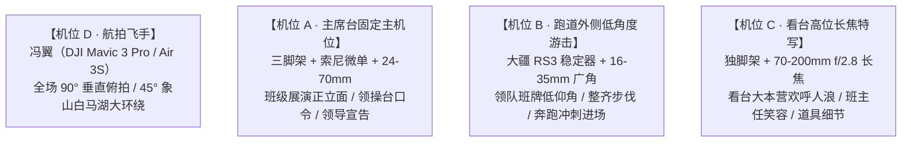

# 2026 春晖中学校运会《开幕式全流程多机位实况片》拍摄部署与协同方案

> **项目定位**：视频三·开幕式全流程多机位实况片  
> **拍摄团队**：春晖新媒体社多机位协同拍摄组  
> **后期团队**：社团多机位剪辑小组（利用 FCPX / Premiere 多机位时间线制作）  
> **历史标杆对标**：春戊 2021《我们都是追梦人》（7.5万播放）、2023 高三红伞方阵《等你来》  
> **视频规格**：16:9 4K 60fps 横屏，提供“10-15分钟全纪录版”与“3分钟开幕式高光精简版”双版本

---

## 一、现场机位拓扑分布与设备指派



### 1. 各机位人员与技术指标

| 机位编号 | 设备与配件 | 架设位置 | 核心拍摄任务 | 帧率与参数设定 |
| :--- | :--- | :--- | :--- | :--- |
| **机位 A（主机位）** | 索尼 A7 系列 + 24-70mm f/2.8 + 重型液压三脚架 | 主席台正前下方 15 米处（面向跑道表演定点区） | 锁定每个班级正对主席台的 **15-20 秒表演定点区**，不晃动、不漏班。 | 4K 50/60fps，快门 1/100s，光圈 f/4-5.6 |
| **机位 B（动态游击）** | 微单 + 16-35mm 广角 + 三轴手持稳定器 | 跑道与草坪交界处（伴随方阵移动） | 贴地低仰角拍摄班牌举牌员神态、第一排整齐摆臂脚步、奔跑冲刺进场动势。 | 4K 60fps，高动态范围，快门 1/120s |
| **机位 C（长焦特写）** | 微单 + 70-200mm f/2.8 + 独脚架 | 观众看台高层或草坪对角线高位 | 抓拍班级方阵路过时，看台同班同学起立击掌欢呼、班主任在队伍旁鼓励的笑脸。 | 4K 60fps，快门 1/120s，大光圈虚化背景 |
| **机位 D（高空航拍）** | DJI 无人机（冯翼负责） | 操场上空 40～80 米空域安全悬停 | 进场行进长蛇队列俯瞰、广播操千人矩阵 90° 垂直几何变换、白马湖与象山大景拉升。 | 4K 60fps，关闭避障冗余提示，开启网格线 |

---

## 二、全流程方阵走位表与各班机位切换规则

### 1. 开幕式流程时间轴（10月8日 下午）

- `13:00 - 13:20`：各班级于操场外环道集结完毕，摄影组完成多机位音频对时与机位落位。
- `13:20 - 13:30`：国旗护卫队、校旗队、彩旗方阵率先进场（机位 A 居中，机位 D 俯冲伴飞）。
- `13:30 - 14:15`：**开幕式正式开始 · 全校班级方阵进场展演**（高三 -> 高二 -> 高一各班依次进场）。
- `14:15 - 14:30`：升国旗仪式、奏唱国歌、校领导致辞、裁判员与运动员代表宣誓。
- `14:30 - 14:40`：开幕式结束，各班退场至大本营看台，各赛区裁判与首场运动员就位准备。
- `14:40`：田径正赛正式开赛（高一男百米预赛、高一男跳远决赛等打响首枪）。

### 2. 单个班级“保全黄金 15 秒”切换模板（多机位剪辑规则）

为了彻底杜绝历届视频中“有些班级镜头一闪而过”的遗憾，制定如下标准化多机位时间线切换逻辑：

```
[方阵拐弯入场] -> 机位 B（广角低角度，3秒）：班牌举牌员英姿 + 整齐迈步脚步特写
      ↓
[行进至主席台] -> 机位 A（主机位全景，6-8秒）：班级整体队形变换、道具展开与口号呐喊完整记录
      ↓
[表演高光爆发] -> 机位 C（长焦特写，3秒）：拉近特写核心表演同学、班主任挥手致意
      ↓
[齐步小跑离场] -> 机位 D（航拍大景，2-3秒）：高空展现队伍顺畅融入绿茵场大方阵
```

---

## 三、广播操与大型团体操拍摄要点（对标 2021/2023 爆款）

1. **垂直 90° 上帝视角是制胜核心**：
   - 参考 2021 届 7.5 万播放爆款与 2023 届红伞点阵，地面机位拍广播操容易被前排遮挡；
   - 冯翼的无人机必须在全校广播操音乐响起前，升至 **60-80 米正上方垂直向下（Gimbal 90°）**，保持绝对平稳悬停，记录千人散乱跑动聚集成精密矩阵与开合律动的震撼视觉。
2. **地面侧翼纵深长镜头**：
   - 机位 B/C 沿队伍侧翼中轴线平移，利用长焦镜头压缩空间感，展现成百上千条手臂同时抬起、摆动的惊人一致性。

---

## 四、后期剪辑与音频同步实施建议

1. **多机位时间线对齐（Sync by Audio）**：
   - 现场各机位均开启机载麦克风录音，后期导入剪辑软件（FCPX / Premiere / DaVinci）直接利用音轨波形自动对齐，形成一条多机位剪辑夹（Multicam Clip）。
2. **现场声与进行曲双轨混音**：
   - 主声道：清晰的官方开幕式进行曲与广播站主持人口播同期声；
   - 辅声道：保留适量现场真实的班级口号吼声、皮鞋踏地声与全场热烈掌声，增强现场临场感。
